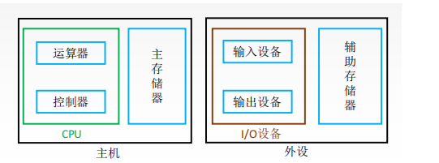
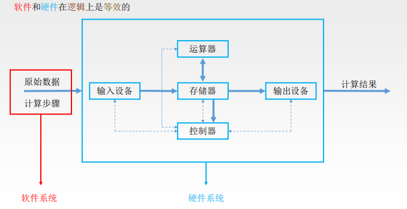
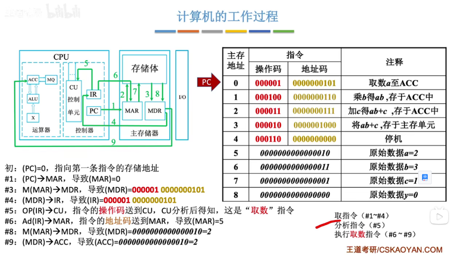
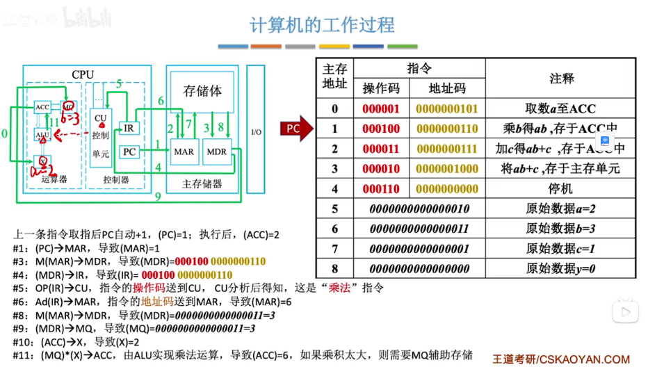
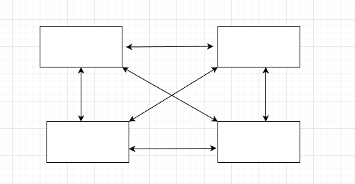
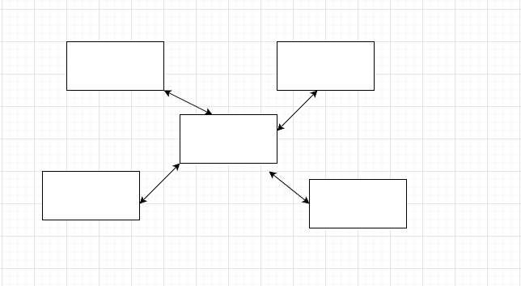
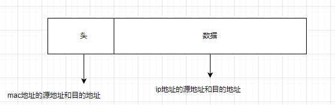

# 重学前端

## 模块一

### JavaScript类型

 JavaScript 的代码 undefined 是一个变量，而并非是一个关键字，建议使用 void 0 来获取 undefined 值。

null 表示的是：“定义了但是为空”。

 **3 与 new Number(3) 是完全不同的值，它们一个是 Number 类型， 一个是对象类型。当跟 new 搭配时，它们产生对象，当直接调用时，它们表示强制类型转换。**

### JavaScript对象：面向对象还是基于对象

各种语言的对象唯一标识性都是用内存地址来体现的， 对象具有唯一标识的内存地址，所以具有唯一的标识。


## 浏览器

### 一个浏览器时如何工作的（阶段二）

- <p“标签开始”的开始；
- class=“a” 属性；
- \> “标签开始”的结束；
- text text text 文本；
- 标签结束。

## JavaScript执行

### Promise里的代码为什么比setTimeout先执行

宏观任务的队列就相当于事件循环。

宏观任务中包含微观任务队列

Promise永远在队列尾部添加微观任务

```` javascript
// setTimeout先输入，微任务始终优先于宏任务    

setTimeout(()=>console.log("d"), 0)
    var r = new Promise(function(resolve, reject){
        resolve()
    });
    r.then(() => { 
        var begin = Date.now();
        while(Date.now() - begin < 1000);
        console.log("c1") 
        new Promise(function(resolve, reject){
            resolve()
        }).then(() => console.log("c2"))
    });
// 输出  c1 c2 d
````

### 闭包和执行上下文

```` javascript

void function(){
    var a;
    //code
}();
````


# 浏览器工作原理与实践 [参考](https://time.geekbang.org/column/article/117637)

## 宏观视角上的浏览器

### Chrome架构：仅仅打开一个页面，为什么有四个进程

Chrome、微软的 Edge 以及国内的大部分主流浏览器，都是基于 Chromium 二次开发而来。

线程是不能单独存在的，它是由进程来启动和管理的

启动一个程序的时候，操作系统会为该程序创建一块内存，用来存放代码、运行中的数据和执行任务的主线程，我们把这样的一个运行环境叫进程。

##### 进程和线程间的关系

1. 进程中的任意一线程执行出错，都会导致整个进程的崩溃。

```javascript
A = 1+2
B = 20/0
C = 7*8
```

当线程执行到b的时候，会导致整个进程的崩溃，当然另外两个线程的执行的结果也没有了 

2. 线程之间共享进程中的数据。
3. 当一个进程关闭之后，操作系统会回收进程所占用的内存。

当一个进程退出时，操作系统会回收该进程所申请的所有资源；即使其中任意线程因为操作不当导致内存泄漏，当进程退出时，这些内存也会被正确回收。比如之前的 IE 浏览器，支持很多插件，而这些插件很容易导致内存泄漏，这意味着只要浏览器开着，内存占用就有可能会越来越多，但是当关闭浏览器进程时，这些内存就都会被系统回收掉。

4. 进程之间的内容相互隔离。

进程隔离是为保护操作系统中进程互不干扰的技术，每一个进程只能访问自己占有的数据，也就避免出现进程 A 写入数据到进程 B 的情况。正是因为进程之间的数据是严格隔离的，所以一个进程如果崩溃了，或者挂起了，是不会影响到其他进程的。如果进程之间需要进行数据的通信，这时候，就需要使用用于进程间通信（IPC）的机制了。

**做个简单的比喻：进程=火车，线程=车厢**

- 线程在进程下行进（单纯的车厢无法运行）
- 一个进程可以包含多个线程（一辆火车可以有多个车厢）
- 不同进程间数据**很难**共享（一辆火车上的乘客很难换到另外一辆火车，比如站点换乘）
- 同一进程下不同线程间数据很易共享（A车厢换到B车厢很容易）
- 进程要比线程消耗更多的计算机资源（采用多列火车相比多个车厢更耗资源）
- 进程间不会相互影响，一个线程挂掉将导致整个进程挂掉（一列火车不会影响到另外一列火车，但是如果一列火车上中间的一节车厢着火了，将影响到所有车厢）
- 进程可以拓展到多机，进程最多适合多核（不同火车可以开在多个轨道上，同一火车的车厢不能在行进的不同的轨道上）
- 进程使用的内存地址可以上锁，即一个线程使用某些[共享内存](https://www.zhihu.com/search?q=共享内存&search_source=Entity&hybrid_search_source=Entity&hybrid_search_extra={"sourceType"%3A"answer"%2C"sourceId"%3A"411179772"})时，其他线程必须等它结束，才能使用这一块内存。（比如火车上的洗手间）－"互斥锁"
- 进程使用的内存地址可以限定使用量（比如火车上的餐厅，最多只允许多少人进入，如果满了需要在门口等，等有人出来了才能进去）－“信号量”

##### 早期多进程架构


Chrome 的页面是运行在单独的渲染进程中的，同时页面里的插件也是运行在单独的插件进程之中，而进程之间是通过 IPC 机制进行通信

###### 多进程架构优点

- 进程是相互隔离的，所以当一个页面或者插件崩溃时，影响的仅仅是当前页面进程或者插件进程，并不会影响浏览器和其他页面。这就完美的解决了页面或插件崩溃就会导致整个浏览器崩溃也就是不稳定的问题
- Javascript运行在渲染进程中，所以即使Javascript阻塞了渲染进程，影响的也只是当前的渲染页面。而并不会影响浏览器和其他页面，因为其他页面的脚本是运行在它们自己的渲染进程中的。所以当我们再在 Chrome 中运行上面那个死循环的脚本时，没有响应的仅仅是当前的页面。
- 对于内存泄漏的解决方法那就更简单了，因为当关闭一个页面时，整个渲染进程也会被关闭，之后该进程所占用的内存都会被系统回收，这样就轻松解决了浏览器页面的内存泄漏问题。
- 采用多进程架构的额外好处是可以使用**安全沙箱（按照安全策略限制程序行为的执行环境，保护互联网安全的一种手段）**，你可以把沙箱看成是操作系统给进程上了一把锁，沙箱里面的程序可以运行，但是不能在你的硬盘上写入任何数据，也不能在敏感位置读取任何数据，例如你的文档和桌面。Chrome 把插件进程和渲染进程锁在沙箱里面，这样即使在渲染进程或者插件进程里面执行了恶意程序，恶意程序也无法突破沙箱去获取系统权限。

打开浏览器至少需要四个进程（1 个网络进程、1 个浏览器进程、1 个 GPU 进程以及 1 个渲染进程，共 4 个）

###### 多进程架构缺点：

- 更高的资源占用。因为每个进程都会包含公共基础结构的副本（如 JavaScript 运行环境），这就意味着浏览器会消耗更多的内存资源。
- 更复杂的体系架构。浏览器各模块之间耦合性高、扩展性差等问题，会导致现在的架构已经很难适应新的需求了

### TCP协议：如何保证页面文件能被完整送达浏览器

一个文件通常会被拆分为很多数据包来进行传输，而数据包在传输过程中又有很大概率丢失或者出错。那么如何保证页面文件能被完整地送达浏览器呢？

#### IP/UDP

IP是非常底层的协议，只负责把数据包传送到对方电脑，但是对方电脑并不知道把数据包交给哪个程序，需要基于IP之上开发能和应用打交道的协议，最常见的是“用户数据包协议（User Datagram Protocol）”，简称UDP。

每个想访问网络的程序都需要绑定一个端口号。通过端口号就能将指定的数据包发送给程序了。

**IP通过IP地址信息把数据包发送给指定的电脑，而UDP通过端口号把数据包分发给正确的程序。和IP头一样，端口号会被装进UDP头里面，UDP头再和原始数据包合并组成新的UDP数据包。UDP头中除了目的端口，还有源端口号等信息，对于错误的数据包，UDP并不提供重发机制，只是丢弃当前的包，而且在UDP发送之后也无法知道是否能到达目的地**

一个数据包从主机A发送给主机B，在传输之前，数据包上会被附加上主机B的IP地址信息，这样在传输过程中才能正确寻址。额外地，数据包上还会附加上主机A本身的IP地址，有了这些信息主机B才可以回复信息给主机A。这些附加的信息会被装进一个叫IP头的数据结构里。IP头是IP数据包开头的信息，包含IP版本、源IP地址、目标IP地址、生存时间等信息

#### TCP

使用UDP传输会存在两个问题

- 数据包在传输过程中容易丢失；
- 大文件会被拆分成很多小的数据包来传输，这些小的数据包会经过不同的路由，并在不同的时间到达接收端，而UDP协议并不知道如何组装这些数据包，从而把这些数据包还原成完整的文件

TCP（Transmission Control Protocol，传输控制协议）是一种面向连接的、可靠的、基于字节流的传输层通信协议，相对于UDP，TCP有下面两个特点:

- 对于数据包丢失的情况，TCP提供重传机制；
- TCP引入了数据包排序机制，用来保证把乱序的数据包组合成一个完整的文件

和UDP头一样，TCP头除了包含了目标端口和本机端口号外，还提供了用于排序的序列号，以便接收端通过序号来重排数据包。

一个完整的TCP连接的生命周期包括了“建立连接”“传输数据”和“断开连接”三个阶段。

- 连接阶段：三次握手建立连接
- 传输数据阶段：接收端在接收到数据包后，需要发送确认数据包给发送端。所以当发送端发送了一个数据包之后，在规定时间内没有接收到接收端反馈的确认消息，则判断为**数据包丢失**，并触发发送端的重发机制。同样，一个大的文件在传输过程中会被拆分成很多小的数据包，这些数据包到达接收端后，接收端会按照TCP头中的**序号**为其排序，从而保证组成完整的数据。
- 断开连接：四次挥手

TCP为了保证数据传输的可靠性，牺牲了数据包的传输速度，因为“三次握手”和“数据包校验机制”等把传输过程中的数据包的数量提高了一倍。

- 互联网中的数据是通过数据包来传输的，数据包在传输过程中容易丢失或出错。
- IP负责把数据包送达目的主机。
- UDP负责把数据包送达具体应用。
- 而TCP保证了数据完整地传输，它的连接可分为三个阶段：建立连接、传输数据和断开连接。
- 其实了解TCP协议，是为了全方位了解HTTP，包括其实际功能和局限性，之后才会更加深刻地理解为什么要推出HTTP/2，以及为什么要推出QUIC协议，也就是未来的HTTP/3。这是一个由浅入深、循序渐进的过程，我希望你能稳扎稳打，学好这每一步、每一个协议，后面“水到自然渠成”

### HTTP请求流程：为什么很多站点第二次打开速度会很快

#### 浏览器发起HTTP请求流程

1. 浏览器构建请求行信息

```` javascript
GET /index.html HTTP1.1
````

2. 查找缓存

在真正发起网络请求之前，浏览器会先在浏览器缓存中查询是否有要请求的文件。其中，浏览器缓存是一种在本地保存资源副本，以供下次请求时直接使用的技术。当浏览器发现请求的资源已经在浏览器缓存中存有副本，它会拦截请求，返回该资源的副本，并直接结束请求，而不会再去源服务器重新下载。

- 缓解服务器端压力，提升性能（获取资源的耗时更短了）；
- 对于网站来说，缓存是实现快速资源加载的重要组成部分。

当然，如果缓存查找失败，就会进入网络请求过程了。

3. 准备IP地址和端口

在HTTP工作开始之前，浏览器需要通过TCP与服务器建立连接。也就是说HTTP的内容是通过TCP的传输数据阶段来实现的，

浏览器还提供了DNS数据缓存服务，如果某个域名已经解析过了，那么浏览器会缓存解析的结果

4. 等待TCP队列

Chrome有个机制，同一个域名同时最多只能建立6个TCP连接，如果在同一个域名下同时有10个请求发生，那么其中4个请求会进入排队等待状态，直至进行中的请求完成。

当然，如果当前请求数量少于6，会直接进入下一步，建立TCP连接。

5. 建立TCP连接
6. 发送HTTP请求

#### 服务端处理HTTP请求

1. 返回请求

浏览器会随同请求发送请求头一样，服务器也会随同响应向浏览器发送响应头

2. 断开连接

通常情况下，一旦服务器向客户端返回了请求数据，它就要关闭 TCP 连接。不过如果浏览器或者服务器在其头信息中加入了：

```` javascript
Connection:Keep-Alive 
````

TCP连接在发送后将仍然保持打开状态，这样浏览器就可以继续通过同一个TCP连接发送请求

3. 重定向


**为什么很多站点第二次打开速度会很快？**

如果第二次页面打开很快，主要原因是第一次加载页面过程中，缓存了一些耗时的数据。DNS缓存和页面资源缓存这两块数据是会被浏览器缓存的。DNS缓存比较简单，它主要就是在浏览器本地把对应的IP和域名关联起来。

浏览器是通过响应头中的Cache-Control字段来设置是否缓存该资源。

**登录状态是如何保持的？**

- 服务器接收到浏览器提交的信息之后，查询后台，验证用户登录信息是否正确，如果正确的话，会生成一段表示用户身份的字符串，并把该字符串写到响应头的`Set-Cookie`字段里，如下所示，然后把响应头发送给浏览器

````javascript
Set-Cookie: UID=3431uad;
````

- 浏览器在接收到服务器的响应头后，开始解析响应头，如果遇到响应头里含有Set-Cookie字段的情况，浏览器就会把这个字段信息保存到本地。比如把UID=3431uad保持到本地。

```javascript
Cookie: UID=3431uad;
```

- 当用户再次访问时，浏览器会发起HTTP请求，但在发起请求之前，浏览器会读取之前保存的Cookie数据，并把数据写进请求头里的Cookie字段里（如下所示），然后浏览器再将请求头发送给服务器。


### 在浏览器里，从输入 URL 到页面展示，这中间发生了什么

#### 从输入 URL 到页面展示完整流程示意图：


#### 浏览器进程、渲染进程和网络进程的主要职责。

- 浏览器进程主要负责用户交互、子进程管理和文件储存等功能。
- 网络进程是面向渲染进程和浏览器进程等提供网络下载功能。
- 渲染进程的主要职责是把从网络下载的 HTML、JavaScript、CSS、图片等资源解析为可以显示和交互的页面。因为渲染进程所有的内容都是通过网络获取的，会存在一些恶意代码利用浏览器漏洞对系统进行攻击，所以运行在渲染进程里面的代码是不被信任的。这也是为什么 Chrome 会让渲染进程运行在安全沙箱里，就是为了保证系统的安全。

#### 主要流程的核心节点

- 首先，浏览器进程接收到用户输入的 URL 请求，浏览器进程便将该 URL 转发给网络进程。
- 然后，在网络进程中发起真正的 URL 请求。
- 接着网络进程接收到了响应头数据，便解析响应头数据，并将数据转发给浏览器进程。
- 浏览器进程接收到网络进程的响应头数据之后，发送“提交导航 (CommitNavigation)”消息到渲染进程；
- 渲染进程接收到“提交导航”的消息之后，便开始准备接收 HTML 数据，接收数据的方式是直接和网络进程建立数据管道

- 最后渲染进程会向浏览器进程“确认提交”，这是告诉浏览器进程：“已经准备好接受和解析页面数据了”
- 浏览器进程接收到渲染进程“提交文档”的消息之后，便开始移除之前旧的文档，然后更新浏览器进程中的页面状态。

这其中，用户发出 URL 请求到页面开始解析的这个过程，就叫做导航

#### 从输入 URL **到页面展示**

##### 1.用户输入

当用户在地址栏中输入一个查询关键字时，地址栏会判断输入的关键字是搜索内容，还是请求的 URL。

- 如果是搜索内容，地址栏会使用浏览器默认的搜索引擎，来合成新的带搜索关键字的 URL。
- 如果判断输入内容符合 URL 规则，比如输入的是 time.geekbang.org，那么地址栏会根据规则，把这段内容加上协议，合成为完整的 URL。

当用户输入关键字并键入回车之后，这意味着当前页面即将要被替换成新的页面，不过在这个流程继续之前，浏览器还给了当前页面一次执行 beforeunload 事件的机会，beforeunload 事件允许页面在退出之前执行一些数据清理操作，还可以询问用户是否要离开当前页面，比如当前页面可能有未提交完成的表单等情况，因此用户可以通过 beforeunload 事件来取消导航，让浏览器不再执行任何后续工作。

当浏览器刚开始加载一个地址之后，标签页上的图标便进入了加载状态（loading）。但此时图中页面显示的依然是之前打开的页面内容，并没立即替换为极客时间的页面。因为需要等待提交文档阶段，页面内容才会被替换。

##### 2.URL请求过程

接下来，便进入了页面资源请求过程。这时，浏览器进程会通过进程间通信（IPC）把 URL 请求发送至网络进程，网络进程接收到 URL 请求后，会在这里发起真正的 URL 请求流程。那具体流程是怎样的呢？

首先，网络进程会查找本地缓存是否缓存了该资源。如果有缓存资源，那么直接返回资源给浏览器进程；如果在缓存中没有查找到资源，那么直接进入网络请求流程。这请求前的第一步是要进行 DNS 解析，以获取请求域名的服务器 IP 地址。如果请求协议是 HTTPS，那么还需要建立 TLS 连接。

接下来就是利用 IP 地址和服务器建立 TCP 连接。连接建立之后，浏览器端会构建请求行、请求头等信息，并把和该域名相关的 Cookie 等数据附加到请求头中，然后向服务器发送构建的请求信息。

服务器接收到请求信息后，会根据请求信息生成响应数据（包括响应行、响应头和响应体等信息），并发给网络进程。等网络进程接收了响应行和响应头之后，就开始解析响应头的内容了。（为了方便讲述，下面我将服务器返回的响应头和响应行统称为响应头。）

###### 重定向

在接收到服务器返回的响应头后，网络进程开始解析响应头，如果发现返回的状态码是 301 或者 302，那么说明服务器需要浏览器重定向到其他 URL。这时网络进程会从响应头的 Location 字段里面读取重定向的地址，然后再发起新的 HTTP 或者 HTTPS 请求，一切又重头开始了。

**在导航过程中，如果服务器响应行的状态码包含了 301、302 一类的跳转信息，浏览器会跳转到新的地址继续导航；如果响应行是 200，那么表示浏览器可以继续处理该请求。**

###### 响应数据处理

在处理了跳转信息之后，我们继续导航流程的分析。URL 请求的数据类型，有时候是一个下载类型，有时候是正常的 HTML 页面，那么浏览器是如何区分它们呢？

答案是 Content-Type。**Content-Type 是 HTTP 头中一个非常重要的字段， 它告诉浏览器服务器返回的响应体数据是什么类型**，然后浏览器会根据 Content-Type 的值来决定如何显示响应体的内容。

不同 Content-Type 的后续处理流程也截然不同。如果 Content-Type 字段的值被浏览器判断为下载类型，那么该请求会被提交给浏览器的下载管理器，同时该 URL 请求的导航流程就此结束。但如果是 HTML，那么浏览器则会继续进行导航流程。由于 Chrome 的页面渲染是运行在渲染进程中的，所以接下来就需要准备渲染进程了。

###### 准备渲染进程

默认情况下，Chrome 会为每个页面分配一个渲染进程，也就是说，每打开一个新页面就会配套创建一个新的渲染进程。但是，也有一些例外，在某些情况下，浏览器会让多个页面直接运行在同一个渲染进程中。

**那什么情况下多个页面会同时运行在一个渲染进程中呢？**

要解决这个问题，我们就需要先了解下什么是同一站点（same-site）。具体地讲，我们将“同一站点”定义为根域名（例如，geekbang.org）加上协议（例如，https:// 或者 http://），还包含了该根域名下的所有子域名和不同的端口，比如下面这三个：

```javascript
https://time.geekbang.org
https://www.geekbang.org
https://www.geekbang.org:8080
```

Chrome 的默认策略是，每个标签对应一个渲染进程。但如果从一个页面打开了另一个新页面，而新页面和当前页面属于同一站点的话，那么新页面会复用父页面的渲染进程。官方把这个默认策略叫 process-per-site-instance。

总结来说，打开一个新页面采用的渲染进程策略就是：

- 通常情况下，打开新的页面都会使用单独的渲染进程；
- 如果从 A 页面打开 B 页面，且 A 和 B 都属于同一站点的话，那么 B 页面复用 A 页面的渲染进程；如果是其他情况，浏览器进程则会为 B 创建一个新的渲染进程。

渲染进程准备好之后，还不能立即进入文档解析状态，因为此时的文档数据还在网络进程中，并没有提交给渲染进程，所以下一步就进入了提交文档阶段。

###### 提交文档

所谓提交文档，就是指浏览器进程将网络进程接收到的 HTML 数据提交给渲染进程，具体流程是这样的：

- 首先当浏览器进程接收到网络进程的响应头数据之后，便向渲染进程发起“提交文档”的消息；
- 渲染进程接收到“提交文档”的消息后，会和网络进程建立传输数据的“管道”；
- 等文档数据传输完成之后，渲染进程会返回“确认提交”的消息给浏览器进程；
- 浏览器进程在收到“确认提交”的消息后，会更新浏览器界面状态，包括了安全状态、地址栏的 URL、前进后退的历史状态，并更新 Web 页面。

其中，当渲染进程确认提交之后，更新内容如下图所示：


这也就解释了为什么在浏览器的地址栏里面输入了一个地址后，之前的页面没有立马消失，而是要加载一会儿才会更新页面。

###### 渲染阶段

一旦页面生成完成，渲染进程会发送一个消息给浏览器进程，浏览器接收到消息后，会停止标签图标上的加载动画

##### 总结

- 服务器可以根据响应头来控制浏览器的行为，如跳转、网络数据类型判断。
- Chrome 默认采用每个标签对应一个渲染进程，但是如果两个页面属于同一站点，那这两个标签会使用同一个渲染进程。
- 浏览器的导航过程涵盖了从用户发起请求到提交文档给渲染进程的中间所有阶段。

导航流程很重要，它是网络加载流程和渲染流程之间的一座桥梁，如果你理解了导航流程，那么你就能完整串起来整个页面显示流程，这对于你理解浏览器的工作原理起到了点睛的作用。

```shell
1. 用户输入URL，浏览器会根据用户输入的信息判断是搜索还是网址，如果是搜索内容，就将搜索内容+默认搜索引擎合成新的URL；如果用户输入的内容符合URL规则，浏览器就会根据URL协议，在这段内容上加上协议合成合法的URL

2. 用户输入完内容，按下回车键，浏览器导航栏显示loading状态，但是页面还是呈现前一个页面，这是因为新页面的响应数据还没有获得

3. 浏览器进程浏览器构建请求行信息，会通过进程间通信（IPC）将URL请求发送给网络进程
   GET /index.html HTTP1.1
   
4. 网络进程获取到URL，先去本地缓存中查找是否有缓存文件，如果有，拦截请求，直接200返回；否则，进入网络请求过程

5. 网络进程请求DNS返回域名对应的IP和端口号，如果之前DNS数据缓存服务缓存过当前域名信息，就会直接返回缓存信息；否则，发起请求获取根据域名解析出来的IP和端口号，如果没有端口号，http默认80，https默认443。如果是https请求，还需要建立TLS连接。

6. Chrome 有个机制，同一个域名同时最多只能建立 6 个TCP 连接，如果在同一个域名下同时有 10 个请求发生，那么其中 4 个请求会进入排队等待状态，直至进行中的请求完成。如果当前请求数量少于6个，会直接建立TCP连接。

7. TCP三次握手建立连接，http请求加上TCP头部——包括源端口号、目的程序端口号和用于校验数据完整性的序号，向下传输

8. 网络层在数据包上加上IP头部——包括源IP地址和目的IP地址，继续向下传输到底层

9. 底层通过物理网络传输给目的服务器主机

10. 目的服务器主机网络层接收到数据包，解析出IP头部，识别出数据部分，将解开的数据包向上传输到传输层

11. 目的服务器主机传输层获取到数据包，解析出TCP头部，识别端口，将解开的数据包向上传输到应用层

12. 应用层HTTP解析请求头和请求体，如果需要重定向，HTTP直接返回HTTP响应数据的状态code301或者302，同时在请求头的Location字段中附上重定向地址，浏览器会根据code和Location进行重定向操作；如果不是重定向，首先服务器会根据 请求头中的If-None-Match 的值来判断请求的资源是否被更新，如果没有更新，就返回304状态码，相当于告诉浏览器之前的缓存还可以使用，就不返回新数据了；否则，返回新数据，200的状态码，并且如果想要浏览器缓存数据的话，就在相应头中加入字段：
    Cache-Control:Max-age=2000
    响应数据又顺着应用层——传输层——网络层——网络层——传输层——应用层的顺序返回到网络进程
    
13. 数据传输完成，TCP四次挥手断开连接。如果，浏览器或者服务器在HTTP头部加上如下信息，TCP就一直保持连接。保持TCP连接可以省下下次需要建立连接的时间，提示资源加载速度
    Connection:Keep-Alive 
    
14. 网络进程将获取到的数据包进行解析，根据响应头中的Content-type来判断响应数据的类型，如果是字节流类型，就将该请求交给下载管理器，该导航流程结束，不再进行；如果是text/html类型，就通知浏览器进程获取到文档准备渲染

15. 浏览器进程获取到通知，根据当前页面B是否是从页面A打开的并且和页面A是否是同一个站点（根域名和协议一样就被认为是同一个站点），如果满足上述条件，就复用之前网页的进程，否则，新创建一个单独的渲染进程

16. 浏览器会发出“提交文档”的消息给渲染进程，渲染进程收到消息后，会和网络进程建立传输数据的“管道”，文档数据传输完成后，渲染进程会返回“确认提交”的消息给浏览器进程

17. 浏览器收到“确认提交”的消息后，会更新浏览器的页面状态，包括了安全状态、地址栏的 URL、前进后退的历史状态，并更新web页面，此时的web页面是空白页

18. 渲染进程对文档进行页面解析和子资源加载，HTML 通过HTM 解析器转成DOM Tree（二叉树类似结构的东西），CSS按照CSS 规则和CSS解释器转成CSSOM TREE，两个tree结合，形成render tree（不包含HTML的具体元素和元素要画的具体位置），通过Layout可以计算出每个元素具体的宽高颜色位置，结合起来，开始绘制，最后显示在屏幕中新页面显示出来
```

### 渲染流程（上）：HTML、CSS和JavaScript是如何变成页面的

按照渲染的时间顺序，流水线可分为如下几个子阶段：构建DOM树、样式计算、布局阶段、分层、绘制、分块、光栅化和合成

#### 构建DOM树

构建DOM树的输入内容是一个非常简单的HTML文件，然后经由HTML解析器解析，最终输出树状结构的DOM。，DOM是保存在内存中树状结构，可以通过JavaScript来查询或修改其内容。

#### 样式计算

document.styleSheets

转换样式表中的属性值，使其标准化

计算出Dom树中每个节点的具体样式

- css继承

#### 布局阶段

创建布局树

### 渲染流程（下）：HTML、CSS和JavaScript是如何变成页面的

#### 分层

**第一点，拥有层叠上下文属性的元素会被提升为单独的一层。**

**第二点，需要剪裁（clip）的地方也会被创建为图层。**

#### 栅格化

合成线程会将图层划分为图块（tile），这些图块的大小通常是256x256或者512x512，然后合成线程会按照视口附近的图块来优先生成位图，实际生成位图的操作是由栅格化来执行的。所谓栅格化，是指将图块转换为位图。而图块是栅格化执行的最小单位。

栅格化过程都会使用GPU来加速生成，使用GPU生成位图的过程叫快速栅格化，或者GPU栅格化，GPU操作是运行在GPU进程中，如果栅格化操作使用了GPU，那么最终生成位图的操作是在GPU中完成的，这就涉及到了跨进程操作。


**一个完整的渲染流程大致可总结为如下**

- 渲染进程将HTML内容转换为能够读懂的DOM树结构。
- 渲染引擎将CSS样式表转化为浏览器可以理解的styleSheets，计算出DOM节点的样式。
- 创建布局树，并计算元素的布局信息。
- 对布局树进行分层，并生成分层树。
- 为每个图层生成绘制列表，并将其提交到合成线程。
- 合成线程将图层分成图块，并在光栅化线程池中将图块转换成位图。
- 合成线程发送绘制图块命令DrawQuad给浏览器进程。
- 浏览器进程根据DrawQuad消息生成页面，并显示到显示器上


## 浏览器中的JavaScript执行机制

### 变量提升：JavaScript代码是按顺序执行的吗

### 调用栈：为什么JavaScript代码会出现栈溢出

函数执行结束之后，创建的函数执行上下文会被销毁。

在执行JavaScript时，可能会存在多个执行上下文，通过一种叫**栈的数据结构来管理执行上下文**

### 块级作用域：var缺陷以及为什么要引入let和const

```` javascript
var myname = "极客时间"
function showName(){
  console.log(myname);
  if(0){
   var myname = "极客邦" // myname会声明提升
  }
  console.log(myname);
}
showName()
// 输出 undefined
````

- 函数内部通过var声明的变量，在编译阶段全都被存放到变量环境里面了。
- 通过let声明的变量，在编译阶段会被存放到词法环境（Lexical Environment）中。

- 在函数的作用域内部，通过let声明的变量并没有被存放到词法环境中。

在词法环境内部，维护了一个小型栈结构，栈底是函数最外层的变量，进入一个作用域块后，就会把该作用域块内部的变量压到栈顶；当作用域执行完成之后，该作用域的信息就会从栈顶弹出，这就是词法环境的结构。变量是指通过let或者const声明的变量。

### 作用域链和闭包：代码出现相同的变量，JavaScript引擎如何选择

```` javascript
function bar() {
    console.log(myName)
}
function foo() {
    var myName = " 极客邦 "
    bar()
}
var myName = " 极客时间 "
foo()
// 输出 '极客时间'
// 查看调用栈
````

#### 作用域链

每个执行上下文的变量环境中，都包含了一个外部引用，用来指向外部的执行上下文，我们把这个外部引用称为outer。

#### 词法作用域

词法作用域是代码阶段就决定好的，和函数是怎么调用的没有关系

#### 块级作用域中的变量查找

当执行到代码块时，如果代码块中有 let 或者 const 声明的变量，那么变量就会存放到该函数的词法环境中

#### 闭包

#### 闭包是怎么回收的

如果引用闭包的函数是一个全局变量，那么闭包会一直存在直到页面关闭；但如果这个闭包以后不再使用的话，就会造成内存泄漏。

如果引用闭包的函数是个局部变量，等函数销毁后，在下次 JavaScript 引擎执行垃圾回收时，判断闭包这块内容如果已经不再被使用了，那么 JavaScript 引擎的垃圾回收器就会回收这块内存。

### this：从JavaScript执行上下文视角讲this

````javascript
var myObj = {
  name : " 极客时间 ", 
  showThis: function(){
    console.log(this)
  }
}
myObj.showThis()
// 使用对象来调用其内部的一个方法，该方法的 this 是指向对象本身的。
````

```` javascript
var myObj = {
  name : " 极客时间 ", 
  showThis: function(){
    console.log(this) // myObj
    function bar(){console.log(this)} // window -> 普通函数的this默认指向window
    bar()
  }
}
myObj.showThis()
````

ES6 中的箭头函数并不会创建其自身的执行上下文，所以箭头函数中的 this 取决于它的外部函数。

普通函数中的 this 默认指向全局对象 window

## V8工作原理

### 栈空间和堆空间：数据是如何存储的

在声明变量之前需要先定义变量类型。我们把这种在使用之前就需要确认其变量数据类型的称为静态语言。在运行过程中需要检查数据类型的语言称为动态语言。

 JavaScript 就是动态语言，因为在声明变量之前并不需要确认其数据类型。

在 JavaScript 的执行过程中， 主要有三种类型内存空间，分别是代码空间、栈空间和堆空间。其中的代码空间主要是存储可执行代码的，

 **JavaScript 引擎需要用栈来维护程序执行期间上下文的状态，如果栈空间大了话，所有的数据都存放在栈空间里面，那么会影响到上下文切换的效率，进而又影响到整个程序的执行效率。**

执行上下文放在栈中

引用类型的数据占用的空间都比较大

堆空间很大，能存放很多大的数据，不过缺点是分配内存和回收内存都会占用一定的时间。

JavaScript 引擎判断这是一个闭包，于是在堆空间创建换一个“closure(foo)”的对象（这是一个内部对象，JavaScript 是无法访问的），用来保存 myName 变量。

### 垃圾回收：垃圾数据如何自动回收

还有一个记录当前执行状态的指针（称为 ESP），指向调用栈中函数的执行上下文，表示当前正在执行的函数。

一个函数执行结束之后，JavaScript 引擎会通过向下移动 ESP 来销毁该函数保存在栈中的执行上下文

 V8 中会把堆分为新生代和老生代两个区域，新生代中存放的是生存时间短的对象，老生代中存放的生存时间久的对象。

新生区通常只支持 1～8M 的容量，而老生区支持的容量就大很多了。对于这两块区域，V8 分别使用两个不同的垃圾回收器，以便更高效地实施垃圾回收。

- 副垃圾回收器，主要负责新生代的垃圾回收。
- 主垃圾回收器，主要负责老生代的垃圾回收。


# 计算机操作系统

## [计算机操作系统](**https://www.bilibili.com/video/BV1YE411D7nH?p=2&vd_source=ad69edc9a457e7180dde2d7baf02ad26**)

软件控制硬件

操作系统与运行操作系统的内核硬件关系密切。操作系统扩展了计算机指令集并管理计算机的资源

 进程是一个程序的执行过程，执行前需要将该程序放到内存中，才能被CPU（处理机）处理

### 操作系统的功能和目标

命令接口： 允许用户直接使用

程序接口：允许用户通过程序间接使用

GUI：现在操作系统中最流行的图形用户接口

#### 操作系统的特征

**并发：指两个或者多个事件在同一个事件间隔内发生。这些事件在宏观上是同时发生的，但在微观上是交替发生的。**

**并行：指两个或者多个事件在同一时刻同时发生。**

操作系统的并发性指计算机系统中同时存在着多个运行着的程序

一个单核处理器（CPU）同一时刻只能执行一个程序，因此操作系统会负责协调多个程序交替执行（微观上交替执行，宏观上同时执行），操作系统和程序并发是一起诞生的。

共享；资源共享，系统中的资源可供内存中的多个并发执行的进程共同使用 

一个程序需要放入内存，并给他分配cpu才能执行。

虚拟处理器技术，实际上只有一个单核cpu，但是在用户看来似乎有6个cpu在同时自己服务

#### 操作系统的发展和分类

硬实时操作系统（导弹发射），软实时操作系统（12306订票系统）

#### 操作系统的运行机制和体系结构

大内核和小内核

#### 中断和异常

发生中断就意味着需要操作系统介入，开展管理工作，不同的中断信号，会进行不同的处理。

内中断和外中断

执行完每次指令后，cpu都会检查是否又外部中断信号，如果检测到外部中断信号，则需要保护被中断的cpu环境，根据中断类型转入相应的中断处理程序。然后恢复原进程的cpu环境并退出中断，返回原进程继续往下执行。

#### 系统调用

操作系统向上提供系统调用，编程语言，向上提供库函数。

### 进程

单道程序、多道程序。操作系统所需的数据都在pcb中。

 运行态（占有cpu并在cpu上运行）、就绪态（没有空闲cpu而暂时不能运行）、阻塞态（因等待某一事件而暂时不能运行）。

#### 进程控制

 原语

#### 进程通信

进程是分配系统i资源的的单位（包括内存地址空间），因此各进程拥有的内存地址空间相互独立

为了保证安全，一个进程不能直接访问另外一个进程的地址空间。要使用操作系统提供的方法，操作系统提供一个共享空间，两个进程对共享空间的访问必须是互斥的（互斥访问通过操作系统提供的工具实现）。

**共享存储**

- 基于数据结构的共享
- 基于存储区的共享：在内存中画出一块共享存储区，数据的形式和存放位置都由进程控制，而不是操作系统。这种共享方式速度更快，是一种高级通信方式。

**管道通信**

- 管道只能采用半双工通信，某一时间只能实现单项的传输，如果要实现双向通信，则要设置两个管道
- 各进程要互斥的访问管道
- 数据以字符流的形式写入管道， 读写进程系统将会依据读写情况决定是否阻塞
- 没写满不允许读，没读空不允许写
- 数据一旦被读出，就被抛弃，读进程最多只有一个，否则可能有读错数据的情况

**消息传递**

以格式化的消息为单位。

#### 线程概念和多线程模型

线程是程序执行流的最小单位。

线程是处理机调度的单位，多cpu计算机中，各个进程可占用不同的cpu

 用户级线程和内核级线程。 内核级线程才是处理线程的单位

多对一模型

一对一模型

多对多模型

#### 处理机调度

从就绪队列中按照一定的算法选择一个进程并将处理机分配给它运行，以实现进程的并发执行

引入了虚拟内存技术之后，可将暂时不能运行的进程调至外存等待。提高内存利用率和系统吞吐量

 #### 进程同步 进程互斥

进程具有异步性的特征。 

#### 死锁

死锁： 各进程互相等待对方手里的资源，导致各进程被阻塞，无法向前推进的现象

饥饿：由于长期得不到想要的资源，某进程无法向前推进的现象

死循环： 某进程执行过程中一直跳不出某个循环的现象。有时是程序逻辑bug导致的，有时是程序员故意设计的。

### 内存

操作系统负责内存空间的分配和回收

**覆盖技术**解决程序大小超过物理内存总和的问题，将程序分为多个段，常用的段常驻内存，不常用的在需要时调入内存

**交换技术**，某些进程暂时换出外存，外存中已具备运行条件的进程换入内存。（进程在内存与磁盘间动态调度） 

交换通常在许多进程运行且内存吃紧时进行，而系统负荷降低就暂停

PCB会常驻内存，不会被换出内存。

#### 连续分配管理方式

内存空间的分配和回收：分为连续分配管理方式、非连续分配管理方式。

连续分配指为用户进程分配的必须是一个连续的内存空间

在**单一连续分配内存**中，内存被分为系统区和用户区。系统区通常位于内存的低地址部分，用于存放操作系统相关数据；用户区用于存放用户进程相关数据。内存中只能有一道用户程序，用户程序独占整个用户区内存空间。

分配给某进程的内存区域中，如果有些部分没有用上，就是内部碎片。

内存中的某些空闲分区由于太小而难以利用就是外部碎片。

数据结构：分区说明表

动态分区分配没有内部碎片，但是又外部碎片

紧凑技术解决外部碎片。但是紧凑技术的时间代价很高。

#### 虚拟内存

很多暂时用不到的数据也会长期占用内存，导致内存利用率不高。

若内存空间不够，由操作系统负责将内存中暂时用不到的信息换出到外存。

### 文件管理

文件分配方式-连续分配

#### 文件的基本操作

- 在外存中找到文件所需的空间，根据文件存放路径找到该目录对应的目录文件，在目录中创建该文件对应的目录项。
- 目录项包含了文件名、文件在外存中的存放位置等信息。

打开文件表

#### 磁盘的结构

磁盘的表面由一些磁性物质组成，可以用这些磁性物质记录二进制数据。

磁盘的盘面被划分成一个个磁道，一个圈就是一个磁道。一个磁道又被划分成一个个扇区，每个扇区就是一个个磁盘块。每个扇区存放的数据量相同

### I/O设备

鼠标/键盘（输入设备），显示器（输入设备）

#### 缓冲区

缓冲区是一个存储区域，使用硬件作为缓冲区的成本较高，容量也较小，一般仅用在对速度与要求非常高的场合。一般情况下都是用的内存作为缓冲区。

cpu可以把数据放入缓冲区，然后做别的事情。


# 计算机组成原理


## [计算机组成原 理](https://www.bilibili.com/video/BV1BE411D7ii?p=2&vd_source=ad69edc9a457e7180dde2d7baf02ad26)

计算机硬件唯一能识别的数据-二进制 0/1

用高电平和低电平表示0/1（电压）

电路传递多个二进制数，每个二进制数位称为1bit

字节 Byte 和比特 bit 的换算关系是 1 Byte = 8 bit 。

### 计算机系统

计算机系统由硬件和软件（分为**系统软件**（操作系统、数据库管理系统）、**应用软件**（qq、微信））组成

逻辑元件用来处理电信号最小的逻辑单元   bug： 小虫子

机器字长：计算机一次整数运算所能处理的二进制位数。（32位、64位）

#### 软件的发展

汇编语言会把机器语言转换成人类更方便阅读。

#### 计算机硬件的基本组成





存储器分为主存（运行内存8G）和辅存（机身存储128G）

#### 各个硬件的工作原理

##### 主存储器的基本组成

主存储器分为存储体、MAR（存储地址寄存器）、MDR（存储数据寄存器）->取数据的地方

CPU获取数据的地址，在存储体中找到后放在MDR中，CPU从MDR中把数据取走。CPU写入数据的例子也差不多 

MAR=4位 总共有2的四次方个存储单元
MDR=16位，每个存储单元可存放16bit，一个字（word）=16bit

一个字节（Byte） = 8bit

1B = 1个字节， 1b = 1个bit

宽带100M**b**ps, 迅雷下载10M**B**/s, 所以需要100 / 8， 注意区分**B** 和 **b**

##### 运算器的基本组成

用于实现算术运算、如加减乘除、逻辑运算

##### 控制器的基本组成

CU：控制单元，分析指令、给出控制信号

IR：指令寄存器，存放当前执行的指令

PC：程序计数器、存放下一条指令地址，有自动加一功能

##### 计算机的工作过程





 

冯诺依曼机以运算器为核心，现在计算机以内存为核心。

#### 计算机系统的层次结构

 用编译程序翻译成汇编语言，再用汇编程序翻译成机器语言程序

编译程序只要翻译一次， 解释程序每次执行都要翻译

#### 计算机的性能指标

##### 存储器的性能指标

二进制有多少种组合方式？

 2^10: K 、2^20: M、 2^30: G、 2^40: T

##### CPU的性能指标

##### 系统整体的性能指标

数据通路带宽：各硬件部件通过数据总线传输数据

吞吐量：系统在单位时间处理请求的数量

响应时间

**基准程序**： 跑分软件

### 数据的表示和运算

#### 字符和字符串

ASCII码

#### 强制类型转化

长整数变短整数，高位截断，保留低位。

#### 电路的基本原理、加法器的设计


# 计算机网络

## 什么是计算机网络？ [参考](https://www.bilibili.com/video/BV124411k7uV/?spm_id_from=333.337.search-card.all.click&vd_source=ad69edc9a457e7180dde2d7baf02ad26)

计算机网络是实现计算机之间的通信的。

### 集线器



为了是多台计算机设备能互相通信，就想到了转发，但是用转发的话计算机就要有标识	--->但是太麻烦了

所以设计出了 一个中转站（也叫HUB集线器）集线器来做消息的转发，计算机1的消息会同时的发送到计算机2345。这个时候就会对标识来进行比较

，成功则读取，对比失败则将数据包丢弃。但是2同时也要发数据的话，就会将消息糅合到一起。同时发送给计算机345，针对这个就出了一个CS/MA/CD的协议，载波监听，通过载波监听的方式。检测链路有没有人正在发送数据，没有人发送的话，在进行数据的发送。

**集线器只适用于小规模网络工作在物理层**

**缺点**： 

- 进行数据的广播会导致带宽利用率较低
- 链路上只能同时又一台设备发送数据




### 交换机（简称SW）

 交换机是可以记录地址（mac地址）的，记录的地址主要是记录端口和这个地址的映射关系。mac地址（**局域网地址**）是在出厂的时候就已经写死了，但是是可以修改的，交换机存储着一张表，不同的mac地址对应着不同的端口。交换机是全双工的，使用的是我们的网线。网线下是有八根线的，正常情况下至少有四根线在工作。交换机所在的这一层叫做数据链路层。 数据链路层的头存储的就是mac地址，尾部保存数据。交换机能存储几千个mac地址。数据链路层有时也叫mac层

缺点： 

- 只能在比较小的局域网内达到一个高效的传输
- 但是如果网络变大就不行。

#### 桥接

交换机的两个端口连接就叫桥接，桥接之后 ，多个mac地址是可以对应同一个物理端口的。

### 路由器（也叫网关）

交换机通过路由器连接。IP地址：标识网络、标识设备，路由器也是有一台路由表的。路由器经过算法是会自动的计算出路由表的。 ip地址是一个抽象地址，只能使用mac地址进行通信，因为mac是一个真实的地址。根据ip地址去查mac地址(根据ARP协议去查)




## [计算机网络-通俗易懂讲解每个知识点](https://www.bilibili.com/video/BV1EU4y1v7ju/?spm_id_from=333.999.0.0&vd_source=ad69edc9a457e7180dde2d7baf02ad26)

### 互联网数据传输原理 ｜OSI七层网络参考模型

TCP/IP四层网络模型，实际划分为五层更符合实际（应用层、传输层、网络层、数据链路层、物理层）

用浏览器访问网站，两个应用如何进行交互就是应用层的事情了。

网卡具有全球唯一的MAC地址

ip地址实现端到端的基础

假设用火狐和谷歌同时登录网站。

如何让数据去到指定的软件服务上，这就需要端口号来作为地址来定位了。传输层，端到端实现了服务进程到服务进程的传输。

传输层（**可靠传输（TCP）**， **不可靠传输（UDP）**），其中TCP允许把字节流分为多个段，而不是整个字节数据，完整的发送出去。传输层还有流量控制来确保传输速度。

登录了某个网站，网站服务可以保持登录状态，不用每次输入登录账号和密码，（**会话层**）

给文件瘦身、压缩（**表示层**）

应用层--报文，传输层--段--端口号--服务进程到服务进程，网络层--包--IP地址--端到端，数据链路层--帧-MAC地址--跳到跳，物理层--比特。


**地址解析协议**，**ARP协议**是根据IP地址获取物理地址的一个TCP/IP协议，主机发送信息时将包含目标IP地址的ARP请求广播到局域网络上的所有主机，并接收返回消息，以此确定目标的物理地址；收到返回消息后将该IP地址和物理地址存入本机ARP缓存中并保留一定时间，下次请求时直接查询ARP缓存以节约资源


ARP协议进行广播，找到网关IP对应的MAC地址，把包封装成帧，源MAC填自己的，目标MAC地址填广播地址。假设当前网络是二层交换机，这个交换机只需要记录下不同的接口对应的MAC地址就好了，交换机收到广播后就发送出去，默认网关收到消息后，查看了帧，发现了发送端的MAC地址，在解封发现IP地址，就会把客户端MAC地址和IP地址关联为一台主机。同时默认网关会把自己的IP地址放入包里，再结合自己的默认地址封装成帧。

### IPv4和子网掩码

每一组十进制的数字范围就是0到255

IP地址由两个**网络号**+**主机号**组成

为了解决简单分类导致的IP分配不合理就诞生了子网掩码

### IPv6和IPv4的主要区别

IPv4用二进制表示，IPv6用16进制表示。

### 数据是如何漂洋过海的？BGP的原理是什么？

由路由器传送到指定的设备，**a向c发送数据，需要经过b，但是b挂了**

**自治系统**都使用BGP规则来进行数据的流通，用了编号就可以宏观的看待整个互联网，有了这个表示一群路由的编号，路由器或者服务器就不需要把全世界的路由信息都记录下来。而是把自治系统编号记录下来。

边界网关协议（BGP）试运行在TCP上的一种自治系统的路由协议，BGP 是唯一一个用来处理像因特网大小的网络的协议，也是唯一能够妥善处理好不相关路由域间的多路连接的协议。

BGP分为**eBGP**和**iBGP**，e表示external外部类似于外交部，i表示internal内部类似于国际媒体，

BGP使用的TCP协议进行传输，使用了179端口。

### TCP三次握手和四次挥手

客户端到服务端就是端到端。客户端和服务端都是有各自的ip地址，在访问软件服务的时候会自动添加上端口号。这样进行连接就会用特定的管道进行传输。

为什么需要三次握手? 因为TCP/IP不可靠,为了在不可靠建立起一种可靠传输,必须要有握手确认机制, 为啥是3次? 因为TCP是全双工协议,需要通信双方同时通信.   所以再次基础上的双向确认最少需要3次, 实际上你100次确认都行,  但最少需要3次.  

### HTTPS

代理服务器就是在客户端和源服务器之间的服务器，代理服务器备份源服务器的资源作为缓存。客户端有需求的时候就可以直接从中间的代理服务器中索取。

SSL是TLS的前身，都是加密安全协议，现在绝大部分浏览器都不支持SSL，而是支持TLS

非对称加密，用两个密钥来进行加密和解密，公开密钥是所有人都知道的密钥，私有密钥仅仅是持有方才有的密钥。一般来说私钥放在服务器里。数据经过公钥加密就只能被私钥解密。数据经过私钥解密就只能被公钥解密。

服务端拥有成对的私钥和公钥，公布自己的公钥让客户端知道，客户端用公钥把自己的数据来进行加密。加密后用公钥反而无法解密这段数据。一定要用服务端的私钥才能解密。这样的非对称加密也叫公钥加密。 

对称加密只是用私钥进行加密。

HTTPS的默认端口443

客户端把自己支持的TLS版本，加密套件发给服务端，同时还生成一个随机数（第一个随机数）给服务端，接着服务端打招呼。服务端确认支持的TLS版本以及选择的加密套件，并且服务器也生成了一个随机数发给客户端（第二个随机数），接着服务端还把证书和公钥发给客户端，服务端都发送完毕就轮到客户端，现在客户端生成随机数（第三个随机数，预主密钥），预主密钥不会发送出去，而是用刚刚收到的公钥进行加密后在发送出去。然后客户端这边的TLS协商已经没问题了，加密开始。。服务端收到加密后的预主密钥后，会用自己的私钥进行解密，这样服务器就知道了预主密钥。而且只有客户端和服务端知道预主密钥。最后客户端用预主密钥，第一随机数和第二随机数计算出会话密钥，服务端也参照这种方式计算出会话密钥。各自得到的会话密钥是相同的。**会话密钥只应用在当前密钥**

### HTTP/1.1，HTTP/2和HTTP/3的区别

浏览器会限制同一个连接的请求数，其实是限制每个域的连接数。chrome默认同时有六个连接，会造成阻塞，网站就可以弄出多个域，使得浏览器可以同时下载这些资源。比如说有五个图片，就可以同时设置五个图片域名，这样浏览器就可以同时进行下载了。（域名分片）

HTTP1.1默认持久连接， HTTP1.1有个叫做管线化的技术，意思是单个连接可以发送多个请求。响应的时候必须按照发送的顺序接收。

TCP除了三次握手的固定开销以外，还会有个慢启动。为了拥塞控制，也就是为了不造成网络堵塞。一开始只会发送较小量的TCP数据段，到了后面再慢慢增加，因此会导致新访问网页刷新速度较慢。

HTTP1.1

- HTTP本身就会产生各种开销，请求和响应都是有首部的，而且大部分首部都是重复的。发完一次，大部分还得重发。首部明文传输，报文压缩，首部不压缩

HTTP2

- 多路复用，主要就是解决HTTP1.1的队头阻塞问题，可以交错进行请求和响应，而且请求和响应之间不影响。HTTP并不是单个文件直接响应过去，而是请求和响应报文都被划分为各个不同的帧，帧分为首部帧和数据帧。帧有个流标识符，即使没有顺序，按照流标识符就可以按照顺序进行组合。还可以设置权重（优先级）。

- 首部，报文都压缩

- HTTP2也只是在应用层进行传输，实际上还是得要到传输层，依靠TCP来进行传输，会造成TCP层面的队头阻塞
- TCP协议是由操作系统内核实现的

HTTP3

- HTTP3把TCP和TLS的过程**整合**到一起了，直接减少了来回带来的开销，如果是恢复的会话，还可以不用握手，实现0-RTT。

- 但是TCP和TLS是两个协议，实际上为了让HTTP3能进行部署，只能选择传输层的UDP协议了，并且在UDP协议上新增一个协议，也就是QUIC，这个QUIC整合了整个TCP和TLS。使得HTTP3默认就是要使用加密传输的。
- QUIC也是加了流标识符，但是HTTP3的应用层上并没有所谓帧的概念，把数据帧移到了QUIC里面，相当于在传输层就有了数据帧，从源头解决了队头阻塞的问题，实现多路复用，QUIC帧又再次被封装为QUIC数据包，QUIC数据包会加上一些信息，这里最重要的是加了Connection ID连接ID，如果网络发生全面改变，比如从wifi转到4G网络，虽然IP地址发生改变，但是因为客户端和服务端都协商好了连接ID，因此可以用连接ID来识别为同一个连接，避免再次握手，这是QUIC快的原因，而且QUIC数据包会把里面的QUIC帧给加密了。QUIC数据包会被UDP封装成数据段，UDP就会加上端口号，当选择HTTP3来进行通信的时候，QUIC就会像TCP那样开启连接。

### CDN

内容分发网络，边缘服务器就是接近用户的这些服务器。cdn就是帮服务器近距离给用户分发网页内容的。

cdn没有网站的源内容，源服务器就会把静态内容提前备份给cdn也叫push，这样在世界各地用户需要访问网页的时候，就近的cdn服务器就会把静态内容提供给用户，不需要每次都麻烦源服务器了。

如果某台cdn服务器超载了，就会把用户那边的请求转移到没有超载的cdn服务器那边，为的就是平均分配网络流量，也叫负载均衡。采用的任播的通信技术，服务器对外都有同样一个ip地址，如果这个ip地址收到用户的请求以后，请求就会由距离用户最近的服务器来响应。

### DNS域名解析过程

任播。

输入url地址，浏览器查看浏览器缓存中有没有对应的IP记录，同时还要查询主机本地文件里有没有对应记录，如果有记录就没必要进行后面的步骤了。浏览器为了域名解析是为了调动解析器的，解析器可以帮助浏览器调用系统的网络功能，解析器就相当于dns客户端，dns客户端需要向dns服务器查询ip地址，解析器就会向dns服务器发送请求，本地dns服务器在收到请求后会查看自己的缓存，如果有就直接返回ip地址，会标注非权威non-authoritative，

### 在浏览器输入URL回车之后发生了什么？

其实dns就是一个数据库，记录着很多url地址和对应的ip地址。

### 黑客是如何找到漏洞，并发起DDoS攻击的？

大规模的网络流量，使得正常流量不能访问网站。

### VPN概念，技术原理和误区

http明文，并没有对数据进行加密。

### SSH协议握手核心过程

 SSH是一种加密的通信方式，

哈希运算，同种哈希值。ssh三次握手


