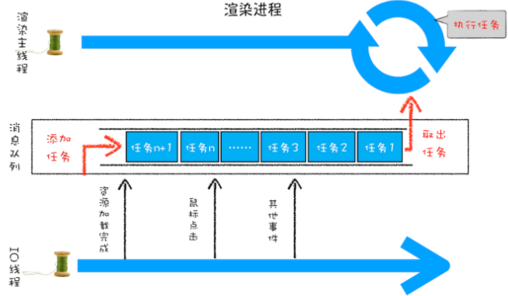
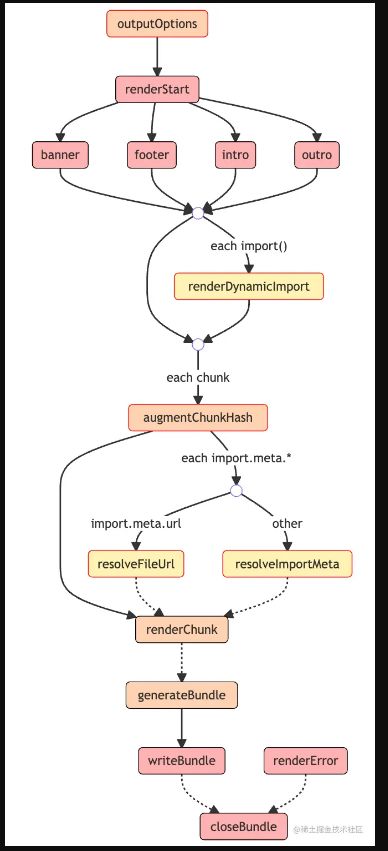
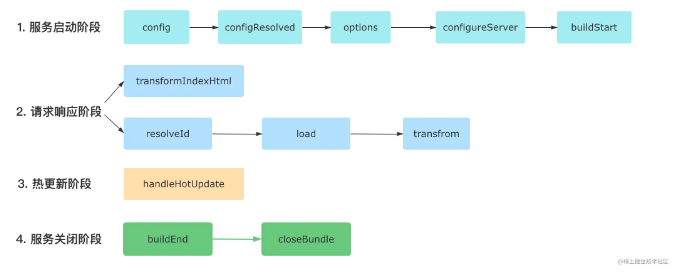

# 重学前端

## 模块一

### JavaScript类型

 JavaScript 的代码 undefined 是一个变量，而并非是一个关键字，建议使用 void 0 来获取 undefined 值。

null 表示的是：“定义了但是为空”。

 **3 与 new Number(3) 是完全不同的值，它们一个是 Number 类型， 一个是对象类型。当跟 new 搭配时，它们产生对象，当直接调用时，它们表示强制类型转换。**

### JavaScript对象：面向对象还是基于对象

各种语言的对象唯一标识性都是用内存地址来体现的， 对象具有唯一标识的内存地址，所以具有唯一的标识。


## 浏览器

### 一个浏览器时如何工作的（阶段二）

- <p“标签开始”的开始；
- class=“a” 属性；
- \> “标签开始”的结束；
- text text text 文本；
- 标签结束。

## JavaScript执行

### Promise里的代码为什么比setTimeout先执行

宏观任务的队列就相当于事件循环。

宏观任务中包含微观任务队列

Promise永远在队列尾部添加微观任务

```` javascript
// setTimeout先输入，微任务始终优先于宏任务    

setTimeout(()=>console.log("d"), 0)
    var r = new Promise(function(resolve, reject){
        resolve()
    });
    r.then(() => { 
        var begin = Date.now();
        while(Date.now() - begin < 1000);
        console.log("c1") 
        new Promise(function(resolve, reject){
            resolve()
        }).then(() => console.log("c2"))
    });
// 输出  c1 c2 d
````

```` javascript

void function(){
    var a;
    //code
}();
````

# 浏览器工作原理与实践 [参考](https://time.geekbang.org/column/article/117637)

## 宏观视角上的浏览器

### Chrome架构：仅仅打开一个页面，为什么有四个进程

Chrome、微软的 Edge 以及国内的大部分主流浏览器，都是基于 Chromium(**Chromium是一个开源浏览器项目，它是ChromeWeb浏览器的基础**) 二次开发而来。

线程是不能单独存在的，它是由进程来启动和管理的

启动一个程序的时候，操作系统会为该程序创建一块内存，用来存放代码、运行中的数据和执行任务的主线程，我们把这样的一个运行环境叫进程。

##### 进程和线程间的关系

- 进程中的任意一线程执行出错，都会导致整个进程的崩溃。

```javascript
A = 1+2
B = 20/0
C = 7*8
```

当线程执行到b的时候，会导致整个进程的崩溃，当然另外两个线程的执行的结果也没有了 

- 线程之间共享进程中的数据。

- 当一个进程关闭之后，操作系统会回收进程所占用的内存。

**当一个进程退出时，操作系统会回收该进程所申请的所有资源；即使其中任意线程因为操作不当导致内存泄漏，当进程退出时，这些内存也会被正确回收。**

比如之前的 IE 浏览器，支持很多插件，而这些插件很容易导致内存泄漏，这意味着只要浏览器开着，内存占用就有可能会越来越多，但是当关闭浏览器进程时，这些内存就都会被系统回收掉。

- 进程之间的内容相互隔离。

进程隔离是为保护操作系统中进程互不干扰的技术，**每一个进程只能访问自己占有的数据**，也就避免出现进程 A 写入数据到进程 B 的情况。正是因为进程之间的数据是严格隔离的，所以一个进程如果崩溃了，或者挂起了，是不会影响到其他进程的。如果进程之间需要进行数据的通信，这时候，就需要使用用于进程间通信（IPC）的机制了。

**做个简单的比喻：进程=火车，线程=车厢**

- 线程在进程下行进（单纯的车厢无法运行）
- 一个进程可以包含多个线程（一辆火车可以有多个车厢）
- 不同进程间数据**很难**共享（一辆火车上的乘客很难换到另外一辆火车，比如站点换乘）
- 同一进程下不同线程间数据很易共享（A车厢换到B车厢很容易）
- 进程要比线程消耗更多的计算机资源（采用多列火车相比多个车厢更耗资源）
- 进程间不会相互影响，**一个线程挂掉将导致整个进程挂掉**（一列火车不会影响到另外一列火车，但是如果一列火车上中间的一节车厢着火了，将影响到所有车厢）
- 进程可以拓展到多机，进程最多适合多核（不同火车可以开在多个轨道上，同一火车的车厢不能在行进的不同的轨道上）
- 进程使用的内存地址可以上锁，即一个线程使用某些[共享内存](https://www.zhihu.com/search?q=共享内存&search_source=Entity&hybrid_search_source=Entity&hybrid_search_extra={"sourceType"%3A"answer"%2C"sourceId"%3A"411179772"})时，其他线程必须等它结束，才能使用这一块内存。（比如火车上的洗手间）－"互斥锁"
- 进程使用的内存地址可以限定使用量（比如火车上的餐厅，最多只允许多少人进入，如果满了需要在门口等，等有人出来了才能进去）－“信号量”

##### 早期多进程架构


Chrome 的页面是运行在单独的渲染进程中的，同时页面里的插件也是运行在单独的插件进程之中，而进程之间是通过 IPC 机制进行通信

###### 多进程架构优点

- 进程是相互隔离的，所以当一个页面或者插件崩溃时，影响的仅仅是当前页面进程或者插件进程，并不会影响浏览器和其他页面。**这就完美的解决了页面或插件崩溃就会导致整个浏览器崩溃也就是不稳定的问题**
- Javascript运行在渲染进程中，所以即使Javascript阻塞了渲染进程，影响的也只是当前的渲染页面。而并不会影响浏览器和其他页面，因为其他页面的脚本是运行在它们自己的渲染进程中的。所以当我们再在 Chrome 中运行上面那个死循环的脚本时，没有响应的仅仅是当前的页面。
- 对于内存泄漏的解决方法那就更简单了，因为当关闭一个页面时，整个渲染进程也会被关闭，之后该进程所占用的内存都会被系统回收，这样就轻松解决了浏览器页面的内存泄漏问题。
- 采用多进程架构的额外好处是可以使用**安全沙箱（按照安全策略限制程序行为的执行环境，保护互联网安全的一种手段）**，你可以把沙箱看成是操作系统给进程上了一把锁，沙箱里面的程序可以运行，但是不能在你的硬盘上写入任何数据，也不能在敏感位置读取任何数据，例如你的文档和桌面。Chrome 把插件进程和渲染进程锁在沙箱里面，这样即使在渲染进程或者插件进程里面执行了恶意程序，恶意程序也无法突破沙箱去获取系统权限。

**打开浏览器至少需要四个进程（1 个网络进程、1 个浏览器进程、1 个 GPU 进程以及 1 个渲染进程）**

###### 多进程架构缺点：

- 更高的**资源占用**。因为每个进程都会包含公共基础结构的副本（如 JavaScript 运行环境），这就意味着浏览器会消耗更多的内存资源。
- 更复杂的体系架构。**浏览器各模块之间耦合性高、扩展性差等问题**，会导致现在的架构已经很难适应新的需求了

### TCP协议：如何保证页面文件能被完整送达浏览器

一个文件通常会被拆分为很多数据包来进行传输，而数据包在传输过程中又有很大概率丢失或者出错。那么如何保证页面文件能被完整地送达浏览器呢？

#### IP/UDP

IP是非常底层的协议，只负责把数据包传送到对方电脑，但是对方电脑并不知道把数据包交给哪个程序，需要基于IP之上开发能和应用打交道的协议，最常见的是“用户数据包协议（User Datagram Protocol）”，简称UDP。

每个想访问网络的程序都需要绑定一个端口号。通过端口号就能将指定的数据包发送给程序了。

**IP通过IP地址信息把数据包发送给指定的电脑，而UDP通过端口号把数据包分发给正确的程序。和IP头一样，端口号会被装进UDP头里面，UDP头再和原始数据包合并组成新的UDP数据包。UDP头中除了目的端口，还有源端口号等信息，对于错误的数据包，UDP并不提供重发机制，只是丢弃当前的包，而且在UDP发送之后也无法知道是否能到达目的地**

一个数据包从主机A发送给主机B，在传输之前，数据包上会被附加上主机B的IP地址信息，这样在传输过程中才能正确寻址。额外地，数据包上还会附加上主机A本身的IP地址，有了这些信息主机B才可以回复信息给主机A。这些附加的信息会被装进一个叫IP头的数据结构里。IP头是IP数据包开头的信息，包含IP版本、源IP地址、目标IP地址、生存时间等信息

#### TCP

使用UDP传输会存在两个问题

- 数据包在传输过程中容易丢失；
- 大文件会被拆分成很多小的数据包来传输，这些小的数据包会经过不同的路由，并在不同的时间到达接收端，而UDP协议并不知道如何组装这些数据包，从而把这些数据包还原成完整的文件

TCP（Transmission Control Protocol，传输控制协议）是一种面向连接的、可靠的、基于字节流的传输层通信协议，相对于UDP，TCP有下面两个特点:

- 对于数据包丢失的情况，**TCP提供重传机制**；
- **TCP引入了数据包排序机制**，用来保证把乱序的数据包组合成一个完整的文件

和UDP头一样，TCP头除了包含了目标端口和本机端口号外，还提供了用于排序的序列号，以便接收端通过序号来重排数据包。

一个完整的TCP连接的生命周期包括了“建立连接”“传输数据”和“断开连接”三个阶段。

- 连接阶段：三次握手建立连接
- 传输数据阶段：接收端在接收到数据包后，需要发送确认数据包给发送端。所以当发送端发送了一个数据包之后，在规定时间内没有接收到接收端反馈的确认消息，则判断为**数据包丢失**，并触发发送端的重发机制。同样，一个大的文件在传输过程中会被拆分成很多小的数据包，这些数据包到达接收端后，接收端会按照TCP头中的**序号**为其排序，从而保证组成完整的数据。
- 断开连接：四次挥手

**TCP为了保证数据传输的可靠性，牺牲了数据包的传输速度**，因为“三次握手”和“数据包校验机制”等把传输过程中的数据包的数量提高了一倍。

- 互联网中的数据是通过数据包来传输的，数据包在传输过程中容易丢失或出错。
- IP负责把数据包送达目的主机。
- UDP负责把数据包送达具体应用。
- 而TCP保证了数据完整地传输，它的连接可分为三个阶段：建立连接、传输数据和断开连接。

### HTTP请求流程：为什么很多站点第二次打开速度会很快

#### 浏览器发起HTTP请求流程

1. 浏览器构建请求行信息

```` javascript
GET /index.html HTTP1.1
````

2. 查找缓存

在真正发起网络请求之前，**浏览器会先在浏览器缓存（c盘）中**查询是否有要请求的文件。其中，浏览器缓存是一种在本地保存资源副本，以供下次请求时直接使用的技术。当浏览器发现请求的资源已经在浏览器缓存中存有副本，它会拦截请求，返回该资源的副本，并直接结束请求，而不会再去源服务器重新下载。

- 缓解服务器端压力，提升性能（获取资源的耗时更短了）；
- 对于网站来说，缓存是实现快速资源加载的重要组成部分。

当然，如果缓存查找失败，就会进入网络请求过程了。

3. 准备IP地址和端口

在HTTP工作开始之前，浏览器需要通过TCP与服务器建立连接。也就是说HTTP的内容是通过TCP的传输数据阶段来实现的，

浏览器还提供了DNS数据缓存服务，如果某个域名已经解析过了，那么浏览器会缓存解析的结果

4. 等待TCP队列

Chrome有个机制，同一个域名同时最多只能建立6个TCP连接，如果在同一个域名下同时有10个请求发生，那么其中4个请求会进入排队等待状态，直至进行中的请求完成。

当然，如果当前请求数量少于6，会直接进入下一步，建立TCP连接。

5. 建立TCP连接
6. 发送HTTP请求

#### 服务端处理HTTP请求

1. 返回请求

浏览器会随同请求发送请求头一样，服务器也会随同响应向浏览器发送响应头

2. 断开连接

通常情况下，一旦服务器向客户端返回了请求数据，它就要关闭 TCP 连接。不过如果浏览器或者服务器在其头信息中加入了：

```` javascript
Connection:Keep-Alive 
````

TCP连接在发送后将仍然保持打开状态，这样浏览器就可以继续通过同一个TCP连接发送请求

3. 重定向

**为什么很多站点第二次打开速度会很快？**

如果第二次页面打开很快，主要原因是第一次加载页面过程中，缓存了一些耗时的数据。DNS缓存和页面资源缓存这两块数据是会被浏览器缓存的。DNS缓存比较简单，它主要就是在浏览器本地把对应的IP和域名关联起来。

**浏览器DNS缓存：**浏览器在获取网站域名的实际IP地址后会对其IP进行缓存，减少网络请求的损耗。每种浏览器都有一个固定的DNS缓存时间，如Chrome的过期时间是1分钟，在这个期限内不会重新请求DNS。

浏览器是通过响应头中的Cache-Control字段来设置是否缓存该资源。

**登录状态是如何保持的？**

- 服务器接收到浏览器提交的信息之后，查询后台，验证用户登录信息是否正确，如果正确的话，会生成一段表示用户身份的字符串，并把该字符串写到响应头的`Set-Cookie`字段里，如下所示，然后把响应头发送给浏览器

````javascript
Set-Cookie: UID=3431uad;
````

- 浏览器在接收到服务器的响应头后，开始解析响应头，如果遇到响应头里含有Set-Cookie字段的情况，浏览器就会把这个字段信息保存到本地。比如把UID=3431uad保持到本地。

```javascript
Cookie: UID=3431uad;
```

- 当用户再次访问时，浏览器会发起HTTP请求，但在发起请求之前，浏览器会读取之前保存的Cookie数据，并把数据写进请求头里的Cookie字段里（如下所示），然后浏览器再将请求头发送给服务器。

### 在浏览器里，从输入 URL 到页面展示，这中间发生了什么

#### 从输入 URL 到页面展示完整流程示意图：


#### 浏览器进程、渲染进程和网络进程的主要职责。

- 浏览器进程主要负责用户交互、子进程管理和文件储存等功能。
- 网络进程是面向渲染进程和浏览器进程等提供网络下载功能。
- 渲染进程的主要职责是把从网络下载的 HTML、JavaScript、CSS、图片等资源解析为可以显示和交互的页面。因为渲染进程所有的内容都是通过网络获取的，会存在一些恶意代码利用浏览器漏洞对系统进行攻击，所以运行在渲染进程里面的代码是不被信任的。这也是为什么 **Chrome 会让渲染进程运行在安全沙箱里，就是为了保证系统的安全。**

#### 主要流程的核心节点

- 首先，浏览器进程接收到用户输入的 URL 请求，浏览器进程便将该 URL 转发给网络进程。
- 然后，在网络进程中发起真正的 URL 请求。
- 接着网络进程接收到了响应头数据，便解析响应头数据，并将数据转发给浏览器进程。
- 浏览器进程接收到网络进程的响应头数据之后，发送“提交导航 (CommitNavigation)”消息到渲染进程；
- 渲染进程接收到“提交导航”的消息之后，便开始准备接收 HTML 数据，接收数据的方式是直接和网络进程建立数据管道

- 最后渲染进程会向浏览器进程“确认提交”，这是告诉浏览器进程：“已经准备好接受和解析页面数据了”
- 浏览器进程接收到渲染进程“提交文档”的消息之后，便开始移除之前旧的文档，然后更新浏览器进程中的页面状态。

这其中，用户发出 URL 请求到页面开始解析的这个过程，就叫做导航

#### 从输入 URL **到页面展示**

##### 1.用户输入

当用户在地址栏中输入一个查询关键字时，地址栏会判断输入的关键字是搜索内容（**通过正则表达式判断  chrome://omnibox/**），还是请求的 URL。

- 如果是搜索内容，地址栏会使用浏览器默认的搜索引擎，来合成新的带搜索关键字的 URL。
- 如果判断输入内容符合 URL 规则，比如输入的是 time.geekbang.org，那么地址栏会根据规则，把这段内容加上协议，合成为完整的 URL。

当用户输入关键字并键入回车之后，这意味着当前页面即将要被替换成新的页面，不过在这个流程继续之前，浏览器还给了当前页面一次执行 beforeunload 事件的机会，beforeunload 事件允许页面在退出之前执行一些数据清理操作，还可以询问用户是否要离开当前页面，比如当前页面可能有未提交完成的表单等情况，因此用户可以通过 beforeunload 事件来取消导航，让浏览器不再执行任何后续工作。

当浏览器刚开始加载一个地址之后，标签页上的图标便进入了加载状态（loading）。但此时图中页面显示的依然是之前打开的页面内容，并没立即替换为极客时间的页面。因为需要等待提交文档阶段，页面内容才会被替换。

##### 2.URL请求过程

接下来，便进入了页面资源请求过程。这时，浏览器进程会通过进程间通信（IPC）把 URL 请求发送至网络进程，网络进程接收到 URL 请求后，会在这里发起真正的 URL 请求流程。那具体流程是怎样的呢？

首先，网络进程会查找本地缓存是否缓存了该资源。如果有缓存资源，那么直接返回资源给浏览器进程；如果在缓存中没有查找到资源，那么直接进入网络请求流程。这请求前的第一步是要进行 DNS 解析，以获取请求域名的服务器 IP 地址。如果请求协议是 HTTPS，那么还需要建立 TLS 连接。

接下来就是利用 IP 地址和服务器建立 TCP 连接。连接建立之后，浏览器端会构建请求行、请求头等信息，并把和该域名相关的 Cookie 等数据附加到请求头中，然后向服务器发送构建的请求信息。

服务器接收到请求信息后，会根据请求信息生成响应数据（包括响应行、响应头和响应体等信息），并发给网络进程。等网络进程接收了响应行和响应头之后，就开始解析响应头的内容了。（为了方便讲述，下面我将服务器返回的响应头和响应行统称为响应头。）

###### 重定向

在接收到服务器返回的响应头后，网络进程开始解析响应头，如果发现返回的状态码是 301 或者 302，那么说明服务器需要浏览器重定向到其他 URL。这时网络进程会从响应头的 Location 字段里面读取重定向的地址，然后再发起新的 HTTP 或者 HTTPS 请求，一切又重头开始了。

**在导航过程中，如果服务器响应行的状态码包含了 301、302 一类的跳转信息，浏览器会跳转到新的地址继续导航；如果响应行是 200，那么表示浏览器可以继续处理该请求。**

###### 响应数据处理

在处理了跳转信息之后，我们继续导航流程的分析。URL 请求的数据类型，有时候是一个下载类型，有时候是正常的 HTML 页面，那么浏览器是如何区分它们呢？

答案是 Content-Type。**Content-Type 是 HTTP 头中一个非常重要的字段， 它告诉浏览器服务器返回的响应体数据是什么类型**，然后浏览器会根据 Content-Type 的值来决定如何显示响应体的内容。

不同 Content-Type 的后续处理流程也截然不同。如果 Content-Type 字段的值被浏览器判断为下载类型，那么该请求会被提交给浏览器的下载管理器，同时该 URL 请求的导航流程就此结束。但如果是 HTML，那么浏览器则会继续进行导航流程。由于 Chrome 的页面渲染是运行在渲染进程中的，所以接下来就需要准备渲染进程了。

###### 准备渲染进程

默认情况下，Chrome 会为每个页面分配一个渲染进程，也就是说，每打开一个新页面就会配套创建一个新的渲染进程。但是，也有一些例外，在某些情况下，浏览器会让多个页面直接运行在同一个渲染进程中。

**那什么情况下多个页面会同时运行在一个渲染进程中呢？**

要解决这个问题，我们就需要先了解下什么是同一站点（same-site）。具体地讲，我们将“同一站点”定义为根域名（例如，geekbang.org）加上协议（例如，https:// 或者 http://），还包含了该根域名下的所有子域名和不同的端口，比如下面这三个：

```javascript
https://time.geekbang.org
https://www.geekbang.org
https://www.geekbang.org:8080
```

Chrome 的默认策略是，每个标签对应一个渲染进程。但如果从一个页面打开了另一个新页面，而新页面和当前页面属于同一站点的话，那么新页面会复用父页面的渲染进程。官方把这个默认策略叫 process-per-site-instance。

总结来说，打开一个新页面采用的渲染进程策略就是：

- 通常情况下，打开新的页面都会使用单独的渲染进程；
- 如果从 A 页面打开 B 页面，且 A 和 B 都属于同一站点的话，那么 B 页面复用 A 页面的渲染进程；如果是其他情况，浏览器进程则会为 B 创建一个新的渲染进程。

渲染进程准备好之后，还不能立即进入文档解析状态，因为此时的文档数据还在网络进程中，并没有提交给渲染进程，所以下一步就进入了提交文档阶段。

###### 提交文档

所谓提交文档，就是指浏览器进程将网络进程接收到的 HTML 数据提交给渲染进程，具体流程是这样的：

- 首先当浏览器进程接收到网络进程的响应头数据之后，便向渲染进程发起“提交文档”的消息；
- 渲染进程接收到“提交文档”的消息后，会和网络进程建立传输数据的“管道”；
- 等文档数据传输完成之后，渲染进程会返回“确认提交”的消息给浏览器进程；
- 浏览器进程在收到“确认提交”的消息后，会更新浏览器界面状态，包括了安全状态、地址栏的 URL、前进后退的历史状态，并更新 Web 页面。

其中，当渲染进程确认提交之后，更新内容如下图所示：


这也就解释了为什么在浏览器的地址栏里面输入了一个地址后，之前的页面没有立马消失，而是要加载一会儿才会更新页面。

###### 渲染阶段

一旦页面生成完成，渲染进程会发送一个消息给浏览器进程，浏览器接收到消息后，会停止标签图标上的加载动画

##### 总结

- 服务器可以根据响应头来控制浏览器的行为，如跳转、网络数据类型判断。
- Chrome 默认采用每个标签对应一个渲染进程，但是如果两个页面属于同一站点，那这两个标签会使用同一个渲染进程。
- 浏览器的导航过程涵盖了从用户发起请求到提交文档给渲染进程的中间所有阶段。

导航流程很重要，它是网络加载流程和渲染流程之间的一座桥梁，如果你理解了导航流程，那么你就能完整串起来整个页面显示流程，这对于你理解浏览器的工作原理起到了点睛的作用。

### 渲染流程（上）：HTML、CSS和JavaScript是如何变成页面的

按照渲染的时间顺序，流水线可分为如下几个子阶段：构建DOM树、样式计算、布局阶段、分层、绘制、分块、光栅化和合成

#### 构建DOM树

构建DOM树的输入内容是一个非常简单的HTML文件，然后经由HTML解析器解析，最终输出树状结构的DOM。，DOM是保存在内存中树状结构，可以通过JavaScript来查询或修改其内容。

#### 样式计算

document.styleSheets

转换样式表中的属性值，使其标准化

计算出Dom树中每个节点的具体样式

- css继承

#### 布局阶段

创建布局树

### 渲染流程（下）：HTML、CSS和JavaScript是如何变成页面的

#### 分层

**第一点，拥有层叠上下文属性的元素会被提升为单独的一层。**

**第二点，需要剪裁（clip）的地方也会被创建为图层。**

#### 栅格化

合成线程会将图层划分为图块（tile），这些图块的大小通常是256x256或者512x512，然后合成线程会按照视口附近的图块来优先生成位图，实际生成位图的操作是由栅格化来执行的。所谓栅格化，是指将图块转换为位图。而图块是栅格化执行的最小单位。

栅格化过程都会使用GPU来加速生成，使用GPU生成位图的过程叫快速栅格化，或者GPU栅格化，GPU操作是运行在GPU进程中，如果栅格化操作使用了GPU，那么最终生成位图的操作是在GPU中完成的，这就涉及到了跨进程操作。

**一个完整的渲染流程大致可总结为如下**

- 渲染进程将HTML内容转换为能够读懂的DOM树结构。
- 渲染引擎将CSS样式表转化为浏览器可以理解的styleSheets，计算出DOM节点的样式。
- 创建布局树，并计算元素的布局信息。
- 对布局树进行分层，并生成分层树。
- 为每个图层生成绘制列表，并将其提交到合成线程。
- 合成线程将图层分成图块，并在光栅化线程池中将图块转换成位图。
- 合成线程发送绘制图块命令DrawQuad给浏览器进程。
- 浏览器进程根据DrawQuad消息生成页面，并显示到显示器上


## 浏览器中的JavaScript执行机制

### 变量提升：JavaScript代码是按顺序执行的吗

### 调用栈：为什么JavaScript代码会出现栈溢出

函数执行结束之后，创建的函数执行上下文会被销毁。

在执行JavaScript时，可能会存在多个执行上下文，通过一种叫**栈的数据结构来管理执行上下文**

### 块级作用域：var缺陷以及为什么要引入let和const

```` javascript
var myname = "极客时间"
function showName(){
  console.log(myname);
  if(0){
   var myname = "极客邦" // myname会声明提升
  }
  console.log(myname);
}
showName()
// 输出 undefined
````

- 函数内部通过var声明的变量，在编译阶段全都被存放到变量环境里面了。
- 通过let声明的变量，在编译阶段会被存放到词法环境（Lexical Environment）中。

- 在函数的作用域内部，通过let声明的变量并没有被存放到词法环境中。

在词法环境内部，维护了一个小型栈结构，栈底是函数最外层的变量，进入一个作用域块后，就会把该作用域块内部的变量压到栈顶；当作用域执行完成之后，该作用域的信息就会从栈顶弹出，这就是词法环境的结构。变量是指通过let或者const声明的变量。

### 作用域链和闭包：代码出现相同的变量，JavaScript引擎如何选择

```` javascript
function bar() {
    console.log(myName)
}
function foo() {
    var myName = " 极客邦 "
    bar()
}
var myName = " 极客时间 "
foo()
// 输出 '极客时间'
// 查看调用栈
````

#### 作用域链

每个执行上下文的变量环境中，都包含了一个外部引用，用来指向外部的执行上下文，我们把这个外部引用称为outer。

#### 词法作用域

词法作用域是代码阶段就决定好的，和函数是怎么调用的没有关系

#### 块级作用域中的变量查找

当执行到代码块时，如果代码块中有 let 或者 const 声明的变量，那么变量就会存放到该函数的词法环境中

#### 闭包

#### 闭包是怎么回收的

如果引用闭包的函数是一个全局变量，那么闭包会一直存在直到页面关闭；但如果这个闭包以后不再使用的话，就会造成内存泄漏。**闭包只是让内存常驻**，而**滥用闭包才会导致内存泄漏**。

如果引用闭包的函数是个局部变量，等函数销毁后，在下次 JavaScript 引擎执行垃圾回收时，判断闭包这块内容如果已经不再被使用了，那么 JavaScript 引擎的垃圾回收器就会回收这块内存。

### this：从JavaScript执行上下文视角讲this

````javascript
var myObj = {
  name : " 极客时间 ", 
  showThis: function(){
    console.log(this)
  }
}
myObj.showThis()
// 使用对象来调用其内部的一个方法，该方法的 this 是指向对象本身的。
````

```` javascript
var myObj = {
  name : " 极客时间 ", 
  showThis: function(){
    console.log(this) // myObj
    function bar(){console.log(this)} // window -> 普通函数的this默认指向window
    bar()
  }
}
myObj.showThis()
````

ES6 中的箭头函数并不会创建其自身的执行上下文，所以箭头函数中的 this 取决于它的外部函数。

普通函数中的 this 默认指向全局对象 window

## V8工作原理

### 栈空间和堆空间：数据是如何存储的

在声明变量之前需要先定义变量类型。我们把这种在使用之前就需要确认其变量数据类型的称为静态语言。在运行过程中需要检查数据类型的语言称为动态语言。

 JavaScript 就是动态语言，因为在声明变量之前并不需要确认其数据类型。

在 JavaScript 的执行过程中， 主要有三种类型内存空间，分别是代码空间、栈空间和堆空间。其中的代码空间主要是存储可执行代码的，

 **JavaScript 引擎需要用栈来维护程序执行期间上下文的状态，如果栈空间大了话，所有的数据都存放在栈空间里面，那么会影响到上下文切换的效率，进而又影响到整个程序的执行效率。**

执行上下文放在栈中

引用类型的数据占用的空间都比较大

堆空间很大，能存放很多大的数据，不过缺点是分配内存和回收内存都会占用一定的时间。

JavaScript 引擎判断这是一个闭包，于是在堆空间创建换一个“closure(foo)”的对象（这是一个内部对象，JavaScript 是无法访问的），用来保存 myName 变量。

### 垃圾回收：垃圾数据如何自动回收

还有一个记录当前执行状态的指针（称为 ESP），指向调用栈中函数的执行上下文，表示当前正在执行的函数。

一个函数执行结束之后，JavaScript 引擎会通过向下移动 ESP 来销毁该函数保存在栈中的执行上下文

 V8 中会把堆分为新生代和老生代两个区域，新生代中存放的是生存时间短的对象，老生代中存放的生存时间久的对象。

新生区通常只支持 1～8M 的容量，而老生区支持的容量就大很多了。对于这两块区域，V8 分别使用两个不同的垃圾回收器，以便更高效地实施垃圾回收。

- 副垃圾回收器，主要负责新生代的垃圾回收。
- 主垃圾回收器，。

**垃圾回收器的工作流程**

第一步是标记空间中活动对象和非活动对象。所谓活动对象就是还在使用的对象，非活动对象就是可以进行垃圾回收的对象。

第二步是回收非活动对象所占据的内存。其实就是在所有的标记完成之后，统一清理内存中所有被标记为可回收的对象。

第三步是做内存整理。一般来说，频繁回收对象后，内存中就会存在大量不连续空间，我们把这些不连续的内存空间称为内存碎片

当内存中出现了大量的内存碎片之后，如果需要分配较大连续内存的时候，就有可能出现内存不足的情况。

#### 副垃圾回收器

副垃圾回收器主要负责新生区的垃圾回收。

把新生代空间对半划分为两个区域，一半是对象区域，一半是空闲区域，新加入的对象都会存放到对象区域，当对象区域快被写满时，就需要执行一次垃圾清理操作。

- 在垃圾回收过程中，首先要对对象区域中的垃圾做标记；标记完成之后，就进入垃圾清理阶段，
- 副垃圾回收器会把这些存活的对象复制到空闲区域中，同时它还会把这些对象有序地排列起来，所以这个复制过程，也就相当于完成了内存整理操作，复制后空闲区域就没有内存碎片了。

- 完成复制后，对象区域与空闲区域进行角色翻转，也就是原来的对象区域变成空闲区域，原来的空闲区域变成了对象区域。

- 也正是因为新生区的空间不大，所以很容易被存活的对象装满整个区域。为了解决这个问题，JavaScript 引擎采用了对象晋升策略，也就是经过两次垃圾回收依然还存活的对象，会被移动到老生区中。

#### 主垃圾回收器

主垃圾回收器主要负责老生区中的垃圾回收。除了新生区中晋升的对象，一些大的对象会直接被分配到老生区。因此老生区中的对象有两个特点，一个是**对象占用空间大**，另一个是**对象存活时间长。**

- 如果采用和副垃圾回收器一样的处理方式的话，复制这些大的对象将会花费比较多的时间，从而导致回收执行效率不高，同时还会浪费一半的空间

主垃圾回收器是采用标记 - 清除（Mark-Sweep）的算法进行垃圾回收的

不过对一块内存多次执行标记 - 清除算法后，会产生大量不连续的内存碎片。而碎片过多会导致大对象无法分配到足够的连续内存，于是又产生了另外一种算法——**标记 - 整理（Mark-Compact）** ，清除算法里的是一样的，但后续步骤不是直接对可回收对象进行清理，而是让所有存活的对象都向一端移动，然后直接清理掉端边界以外的内存

JavaScript 是运行在主线程之上的，一旦执行垃圾回收算法，都需要将正在执行的 JavaScript 脚本暂停下来，待垃圾回收完毕后再恢复脚本执行。我们把这种行为叫做全停顿（Stop-The-World）。	为了降低老生代的垃圾回收而造成的卡顿，V8 将标记过程分为一个个的子标记过程，同时让垃圾回收标记和 JavaScript 应用逻辑交替进行，直到标记阶段完成，我们把这个算法称为增量标记（Incremental Marking）算法。

使用增量标记算法，可以把一个完整的垃圾回收任务拆分为很多小的任务，这些小的任务执行时间比较短，可以穿插在其他的 JavaScript 任务中间执行，这样当执行上述动画效果时，就不会让用户因为垃圾回收任务而感受到页面的卡顿了

### 编译器和解析器：V8如何执行一段JavaScript代码的

编译器（Compiler）、解释器（Interpreter）、抽象语法树（AST）、字节码（Bytecode）、即时编译器（JIT）

1. 在编译型语言的编译过程中，编译器首先会依次对源代码进行词法分析、语法分析，生成抽象语法树（AST），然后是优化代码，最后再生成处理器能够理解的机器码。如果编译成功，将会生成一个可执行的文件。但如果编译过程发生了语法或者其他的错误，那么编译器就会抛出异常，最后的二进制文件也不会生成成功
2. 在解释型语言的解释过程中，同样解释器也会对源代码进行词法分析、语法分析，并生成抽象语法树（AST），不过它会再基于抽象语法树生成字节码，最后再根据字节码来执行程序、输出结果。

Babel 的工作原理就是先将 ES6 源码转换为 AST，然后再将 ES6 语法的 AST 转换为 ES5 语法的 AST，最后利用 ES5 的 AST 生成 JavaScript 源代码

ESLint 是一个用来检查 JavaScript 编写规范的插件，其检测流程也是需要将源码转换为 AST，然后再利用 AST 来检查代码规范化的问题。

**第一阶段是分词（tokenize），又称为词法分析**

**第二阶段是解析（parse），又称为语法分析**

 **生成字节码**

 V8 需要消耗大量的内存来存放转换后的机器码，为了解决内存占用问题，V8 团队大幅重构了引擎架构，引入字节码，并且抛弃了之前的编译器，最终花了将进四年的时间，实现了现在的这套架构。

字节码就是介于 AST 和机器码之间的一种代码。但是与特定类型的机器码无关，字节码需要通过解释器将其转换为机器码后才能执行。

**执行代码**

#### JavaScript的性能优化

- 提升单次脚本的执行速度，避免 JavaScript 的长任务霸占主线程，这样可以使得页面快速响应交互；
- 避免大的内联脚本，因为在解析 HTML 的过程中，解析和编译也会占用主线程；
- 减少 JavaScript 文件的容量，因为更小的文件会提升下载速度，并且占用更低的内存

## 浏览器中的页面循环系统

### 消息队列和事件循环：页面是怎么活起来的

**要想在线程运行过程中，能接收并执行新的任务，就需要采用事件循环机制**

渲染主线程会频繁接收到来自于 IO 线程的一些任务，接收到这些任务之后，渲染进程就需要着手处理，比如接收到资源加载完成的消息后，渲染进程就要着手进行 DOM 解析了；接收到鼠标点击的消息后，渲染主线程就要开始执行相应的 JavaScript 脚本来处理该点击事件。



- 添加一个消息队列；
- IO 线程中产生的新任务添加进消息队列尾部；
- 渲染主线程会循环地从消息队列头部中读取任务，执行任务。

通过使用消息队列，我们实现了线程之间的消息通信。

**如何处理其他进程发送过来的任务？**

渲染进程专门有一个 IO 线程用来接收其他进程传进来的消息，接收到消息之后，会将这些消息组装成任务发送给渲染主线程，后续的步骤就和前面讲解的“处理其他线程发送的任务”一样了，

#### 如何安全退出

当页面主线程执行完成之后，又该如何保证页面主线程能够安全退出呢？Chrome 是这样解决的，确定要退出当前页面时，页面主线程会设置一个退出标志的变量，在每次执行完一个任务时，判断是否有设置退出标志。如果设置了，那么就直接中断当前的所有任务，退出线程，

#### 页面使用单线程的缺点

页面线程所有执行的任务都来自于消息队列。消息队列是“先进先出”的属性，也就是说放入队列中的任务，需要等待前面的任务被执行完，才会被执行。鉴于这个属性，就有如下两个问题需要解决。

**第一个问题是如何处理高优先级的任务**

微任务

**第二个是如何解决单个任务执行时长过久的问题。**

JavaScript 任务因执行时间过久，占用了动画单帧的时间，这样会给用户制造了卡顿的感觉，JavaScript 可以通过回调功能来规避这种问题，也就是让要执行的 JavaScript 任务滞后执行

### Webapi：setTimeout是怎么实现的

浏览器内部实现取消定时器的操作也是非常简单的，就是直接从 delayed_incoming_queue 延迟队列中，通过 ID 查找到对应的任务，然后再将其从队列中删除掉就可以了。

当通过 JavaScript 调用 setTimeout 设置回调函数的时候，渲染进程将会创建一个回调任务，包含了回调函数 showName、当前发起时间、延迟执行时间，其模拟代码如下所示：

```` javascript
struct DelayTask{
  int64 id；
  CallBackFunction cbf;
  int start_time;
  int delay_time;
};
DelayTask timerTask;
timerTask.cbf = showName;
timerTask.start_time = getCurrentTime(); // 获取当前时间
timerTask.delay_time = 200;// 设置延迟执行时间
````

创建好回调任务之后，再将该任务添加到延迟执行队列中，代码如下所示：

```javascript
delayed_incoming_queue.push(timerTask)；
```

```` javascript
void ProcessTimerTask(){
  // 从 delayed_incoming_queue 中取出已经到期的定时器任务
  // 依次执行这些任务
}
 
TaskQueue task_queue；
void ProcessTask();
bool keep_running = true;
void MainTherad(){
  for(;;){
    // 执行消息队列中的任务
    Task task = task_queue.takeTask();
    ProcessTask(task);
    
    // 执行延迟队列中的任务
    ProcessDelayTask()
 
    if(!keep_running) // 如果设置了退出标志，那么直接退出线程循环
        break; 
  }
}
````

添加了一个ProcessDelayTask 函数，该函数是专门用来处理延迟执行任务的。这里我们要重点关注它的执行时机，在上段代码中，处理完消息队列中的一个任务之后，就开始执行 ProcessDelayTask 函数。ProcessDelayTask 函数会根据发起时间和延迟时间计算出到期的任务，然后依次执行这些到期的任务。等到期的任务执行完成之后，再继续下一个循环过程。通过这样的方式，一个完整的定时器就实现了。

#### 使用 setTimeout 的一些注意事项

**1. 如果当前任务执行时间过久，会延迟到期定时器任务的执行**

**2. 如果 setTimeout 存在嵌套调用，那么系统会设置最短时间间隔为 4 毫秒**

**3. 未激活的页面，setTimeout 执行最小间隔是 1000 毫秒**

**4. 延时执行时间有最大值**

**5. 使用 setTimeout 设置的回调函数中的 this 不符合直觉**

### Webapi：XMLHttpRequest是怎么实现的

### 宏任务和微任务：不是所有的任务都是一个待遇

### 使用Promise告别回调函数

页面中任务都是执行在主线程之上的

### async await使用同步方式写异步代码

协程是一种比线程更加轻量级的存在。你可以把协程看成是跑在线程上的任务，一个线程上可以存在多个协程，但是在**线程上同时只能执行一个协程**，

第一点：gen 协程和父协程是在主线程上交互执行的，并不是并发执行的，它们之前的切换是通过 yield 和 gen.next 来配合完成的。

第二点：当在 gen 协程中调用了 yield 方法时，JavaScript 引擎会保存 gen 协程当前的调用栈信息，并恢复父协程的调用栈信息。同样，当在父协程中执行 gen.next 时，JavaScript 引擎会保存父协程的调用栈信息，并恢复 gen 协程的调用栈信息。

在 JavaScript 中，生成器就是协程的一种实现方式，

async 是一个通过**异步执行**并**隐式返回 Promise** 作为结果的函数。

```javascript
async function foo() {
    console.log(1)
    let a = await 100
    console.log(a)
    console.log(2)
}
console.log(0)
foo()
console.log(3)
// 当执行到await 100时，会默认创建一个 Promise 对象
// JavaScript 引擎会暂停当前协程的执行，将主线程的控制权转交给父协程执行，同时会将 promise_ 对象返回给父协程
```

## 浏览器中的页面

- 首先，页面中的资源是有优先级的，比如 CSS、HTML、JavaScript 等都是页面中的核心文件，所以优先级最高；而图片、视频、音频这类资源就不是核心资源，优先级就比较低。通常当后者遇到前者时，就需要“让路”，进入待排队状态。
- 其次，我们前面也提到过，浏览器会为每个域名最多维护 6 个 TCP 连接，如果发起一个 HTTP 请求时，这 6 个 TCP 连接都处于忙碌状态，那么这个请求就会处于排队状态。
- 最后，网络进程在为数据分配磁盘空间时，新的 HTTP 请求也需要短暂地等待磁盘分配结束。

### DOM树：JavaScript是如何影响DOM树构建的

HTML 解析器并不是等整个文档加载完成之后再解析的，而是网络进程加载了多少数据，HTML 解析器便解析多少数据。

**那详细的流程是怎样的呢？**

- 网络进程接收到响应头之后，会根据响应头中的 content-type 字段来判断文件的类型，比如 content-type 的值是“text/html”，那么浏览器就会判断这是一个 HTML 类型的文件，然后为该请求选择或者创建一个渲染进程。
- 渲染进程准备好之后，网络进程和渲染进程之间会建立一个共享数据的管道，网络进程接收到数据后就往这个管道里面放，而渲染进程则从管道的另外一端不断地读取数据，并同时将读取的数据“喂”给 HTML 解析器。
- 你可以把这个管道想象成一个“水管”，网络进程接收到的字节流像水一样倒进这个“水管”，而“水管”的另外一端是渲染进程的 HTML 解析器，它会动态接收字节流，并将其解析为 DOM。

**字节流转换为 DOM 需要三个阶段。**

**第一个阶段，通过分词器将字节流转换为 Token。**

V8 编译 JavaScript 过程中的第一步是做词法分析，将 JavaScript 先分解为一个个 Token。解析 HTML 也是一样的，需要通过分词器先将字节流转换为一个个 Token，分为 Tag Token 和文本 Token。

**至于后续的第二个和第三个阶段是同步进行的，需要将 Token 解析为 DOM 节点，并将 DOM 节点添加到 DOM 树中**。

> HTML 解析器维护了一个Token 栈结构，该 Token 栈主要用来计算节点之间的父子关系，在第一个阶段中生成的 Token 会被按照顺序压到这个栈中。具体的处理规则如下所示：

- 如果压入到栈中的是StartTag Token，HTML 解析器会为该 Token 创建一个 DOM 节点，然后将该节点加入到 DOM 树中，它的父节点就是栈中相邻的那个元素生成的节点。
- 如果分词器解析出来是文本 Token，那么会生成一个文本节点，然后将该节点加入到 DOM 树中，文本 Token 是不需要压入到栈中，它的父节点就是当前栈顶 Token 所对应的 DOM 节点。
- 如果分词器解析出来的是EndTag 标签，比如是 EndTag div，HTML 解析器会查看 Token 栈顶的元素是否是 StarTag div，如果是，就将 StartTag div 从栈中弹出，表示该 div 元素解析完成。

script标签之前，所有的解析流程还是和之前介绍的一样，但是解析到script标签时，渲染引擎判断这是一段脚本，此时 HTML 解析器就会暂停 DOM 的解析，因为接下来的 JavaScript 可能要修改当前已经生成的 DOM 结构。

 JavaScript 会阻塞 DOM 生成，而样式文件又会阻塞 JavaScript 的执行

### 渲染流水线：CSS如何影响首次加载时的白屏时间？

当渲染进程接收 HTML 文件字节流时，会先开启一个预解析线程，如果遇到 JavaScript 文件或者 CSS 文件，那么预解析线程会提前下载这些数据，DOM 构建结束之后、theme.css 文件还未下载完成的这段时间内，渲染流水线无事可做，因为下一步是合成布局树，而合成布局树需要 CSSOM 和 DOM，所以这里需要等待 CSS 加载结束并解析成 CSSOM。

### 分层和合成机制：为什么css动画比JavaScript高效

渲染引擎的分层和合成机制，因为分层和合成机制代表了浏览器最为先进的合成技术，

显示器所做的任务很简单，就是每秒固定读取 60 次前缓冲区中的图像，并将读取的图像显示到显示器上。

显卡的职责就是合成新的图像，并将图像保存到后缓冲区中，一旦显卡把合成的图像写到后缓冲区，系统就会让后缓冲区和前缓冲区互换，这样就能保证显示器能读取到最新显卡合成的图像。通常情况下，显卡的更新频率和显示器的刷新频率是一致的。但有时候，在一些复杂的场景中，显卡处理一张图片的速度会变慢，这样就会造成视觉上的卡顿

#### 分层和合成

如果没有采用分层机制，从布局树直接生成目标图片的话，那么每次页面有很小的变化时，都会触发重排或者重绘机制

将素材分解为多个图层的操作就称为分层，最后将这些图层合并到一起的操作就称为合成。所以，分层和合成通常是一起使用的。

#### 分块

合成线程会将每个图层分割为大小固定的图块，然后优先绘制靠近视口的图块，这样就可以大大加速页面的显示速度。不过有时候， 即使只绘制那些优先级最高的图块，也要耗费不少的时间，因为涉及到一个很关键的因素——纹理上传，这是因为从计算机内存上传到 GPU 内存的操作会比较慢。

#### 如何利用分层技术优化代码

提前告诉渲染引擎 box 元素将要做几何变换和透明度变换操作，这时候渲染引擎会将该元素单独实现一帧，等这些变换发生时，渲染引擎会通过合成线程直接去处理变换，这些变换并没有涉及到主线程，这样就大大提升了渲染的效率

### 页面性能：如何系统优化页面

并非所有的资源都会阻塞页面的首次绘制，比如图片、音频、视频等文件就不会阻塞页面的首次渲染；而 JavaScript、首次请求的 HTML 资源文件、CSS 文件是会阻塞首次渲染的，因为在构建 DOM 的过程中需要 HTML 和 JavaScript 文件，在构造渲染树的过程中需要用到 CSS 文件。

在加载阶段，核心的优化原则是：优化关键资源的加载速度，减少关键资源的个数，降低关键资源的 RTT 次数。

在交互阶段，核心的优化原则是：尽量减少一帧的生成时间。可以通过减少单次 JavaScript 的执行时间、避免强制同步布局、避免布局抖动、尽量采用 CSS 的合成动画、避免频繁的垃圾回收等方式来减少一帧生成的时长。

### 虚拟DOM：虚拟DOM和实际DOM有何不同

#### DOM的缺陷

- 将页面改变的内容应用到虚拟 DOM 上，而不是直接应用到 DOM 上。
- 变化被应用到虚拟 DOM 上时，虚拟 DOM 并不急着去渲染页面，而仅仅是调整虚拟 DOM 的内部状态，这样操作虚拟 DOM 的代价就变得非常轻了。
- 在虚拟 DOM 收集到足够的改变时，再把这些变化一次性应用到真实的 DOM 上。

#### 什么是虚拟DOM

MVC 的整体结构比较简单，由模型、视图和控制器（controller）组成，其核心思想就是将数据和视图分离，也就是说视图和模型之间是不允许直接通信的，它们之间的通信都是通过控制器来完成的。

### PWA：解决了web应用哪些问题

####  Web 应用 VS 本地应用

web应用（运行在浏览器上的应用），本地应用（app）

#### 什么是Service Worker

在页面和网络之间增加一个拦截器，用来缓存和拦截请求。

**架构**

Web Worker 的目的是让 JavaScript 能够运行在页面主线程之外，Web Worker 中是没有当前页面的 DOM 环境的，所以在 Web Worker 中只能执行一些和 DOM 无关的 JavaScript 脚本，并通过 postMessage 方法将执行的结果返回给主线程。所以说在 Chrome 中， Web Worker 其实就是在渲染进程中开启的一个新线程，它的生命周期是和页面关联的。

**安全**

使站点支持 Service Worker，首先必要的一步就是要将站点升级到 HTTPS。

### webComponent：像搭积木一样构建web应用

 DOM 树中的 template 节点不会出现在布局树中，所以我们可以使用 template 来自定义一些基础的元素结构，这些基础的元素结构是可以被重复使用的。

## 浏览器中的网络

### HTTP1：HTTP性能优化

HTTP/1.1 中增加了持久连接的方法，持久连接在 HTTP/1.1 中是默认开启的，

持久连接虽然能减少 TCP 的建立和断开次数，但是它需要等待前面的请求返回之后，才能进行下一次请求。如果 TCP 通道中的某个请求因为某些原因没有及时返回，那么就会阻塞后面的所有请求，**FireFox、Chrome 都做过管线化的试验，但是由于各种原因，它们最终都放弃了管线化技术。**

HTTP/1.1 通过引入Chunk transfer 机制来解决这个问题，服务器会将数据分割成若干个任意大小的数据块，每个数据块发送时会附上上个数据块的长度，最后使用一个零长度的块作为发送数据完成的标志。这样就提供了对动态内容的支持。

### HTTP2：如何提升网络速度

我们知道 HTTP/1.1 为网络效率做了大量的优化，最核心的有如下三种方式：

- 增加了持久连接；
- 浏览器为每个域名最多同时维护 6 个 TCP 持久连接；
- 使用 CDN 的实现域名分片机制。

**HTTP/1.1 对带宽的利用率不理想**，是因为 HTTP/1.1 很难将带宽用满。比如我们常说的 100M 带宽，实际的下载速度能达到 12.5M/S，而采用 HTTP/1.1 时，也许在加载页面资源时最大只能使用到 2.5M/S，很难将 12.5M 全部用满。

**第一个原因，TCP 的慢启动。**

刚开始 TCP 协议会采用一个非常慢的速度去发送数据，然后慢慢加快发送数据的速度，直到发送数据的速度达到一个理想状态，我们把这个过程称为慢启动。

慢启动是 TCP 为了减少网络拥塞的一种策略，我们是没有办法改变的。

**第二个原因，同时开启了多条 TCP 连接，那么这些连接会竞争固定的带宽**

有的 TCP 连接下载的是一些关键资源，如 CSS 文件、JavaScript 文件等，而有的 TCP 连接下载的是图片、视频等普通的资源文件，但是多条 TCP 连接之间又不能协商让哪些关键资源优先下载，这样就有可能影响那些关键资源的下载速度了。

**第三个原因，HTTP/1.1 队头阻塞的问题。**

在 HTTP/1.1 中使用持久连接时，虽然能公用一个 TCP 管道，但是在一个管道中同一时刻只能处理一个请求，在当前的请求没有结束之前，其他的请求只能处于阻塞状态。这意味着我们不能随意在一个管道中发送请求和接收内容。

#### HTTP/2 的多路复用

HTTP/2 的思路就是一个域名只使用一个 TCP 长连接来传输数据，这样整个页面资源的下载过程只需要一次慢启动

队头阻塞的问题，等待请求完成后才能去请求下一个资源，这种方式无疑是最慢的，所以 HTTP/2 需要实现资源的并行请求，也就是任何时候都可以将请求发送给服务器，而并不需要等待其他请求的完成，然后服务器也可以随时返回处理好的请求资源给浏览器。

每个请求都有一个对应的 ID，如 stream1 表示 index.html 的请求，stream2 表示 foo.css 的请求。这样在浏览器端，就可以随时将请求发送给服务器了

HTTP/2 使用了多路复用技术，可以将请求分成一帧一帧的数据去传输，这样带来了一个额外的好处，就是当收到一个优先级高的请求时，比如接收到 JavaScript 或者 CSS 关键资源的请求，服务器可以暂停之前的请求来优先处理关键资源的请求

#### HTTP/2 其他特性

**1.可以设置请求的优先级**

**2. 服务器推送**

**3.头部压缩**

HTTP/2 对请求头和响应头进行了压缩，在浏览器发送请求的时候，基本上都是发送 HTTP 请求头，很少有请求体的发送，通常情况下页面也有 100 个左右的资源，如果将这 100 个请求头的数据压缩为原来的 20%，那么传输效率肯定能得到大幅提升。

### HTTP3：甩掉TCP、TCL包袱构建高效网络

HTTP/2 的一个核心特性是使用了**多路复用技术**，因此它可以通过一个 TCP 连接来发送多个 URL 请求。多路复用技术能充分利用带宽，最大限度规避了 TCP 的慢启动所带来的问题，同时还实现了**头部压缩、服务器推送**等功能，使得页面资源的传输速度得到了大幅提升。在 HTTP/1.1 时代，为了提升并行下载效率，浏览器为每个域名维护了 6 个 TCP 连接；而采用 HTTP/2 之后，浏览器只需要为每个域名维护 1 个 TCP 持久连接，同时还解决了 HTTP/1.1 队头阻塞的问题。

你可以把 TCP 连接看成是一个按照顺序传输数据的管道，管道中的任意一个数据丢失了，那之后的数据都需要等待该数据的重新传输

在 TCP 传输过程中，由于单个数据包的丢失而造成的阻塞称为 TCP 上的队头阻塞。

在 HTTP/2 中，多个请求是跑在一个 TCP 管道中的，如果其中任意一路数据流中出现了丢包的情况，那么就会阻塞该 TCP 连接中的所有请求。

HTTP/3 中的 **QUIC 协议**集合了以下几点功能。

- 实现了类似 TCP 的流量控制、传输可靠性的功能。虽然 UDP 不提供可靠性的传输，但 QUIC 在 UDP 的基础之上增加了一层来保证数据可靠性传输。它提供了数据包重传、拥塞控制以及其他一些 TCP 中存在的特性。
- 集成了 TLS 加密功能。目前 QUIC 使用的是 TLS1.3，相较于早期版本 TLS1.3 有更多的优点，其中最重要的一点是减少了握手所花费的 RTT 个数。
- 实现了 HTTP/2 中的多路复用功能。和 TCP 不同，QUIC 实现了在同一物理连接上可以有多个独立的逻辑数据流。实现了数据流的单独传输，就解决了 TCP 中队头阻塞的问题。

由于 QUIC 是基于 UDP 的，所以 QUIC 可以实现使用 0-RTT 或者 1-RTT 来建立连接，这意味着 QUIC 可以用最快的速度来发送和接收数据，这样可以大大提升首次打开页面的速度

### 同源策略：为什么XMLHttpRequest不能跨域请求资源

同源策略主要表现在 DOM、Web 数据和网络这三个层面。

**第一个，DOM 层面**。同源策略限制了来自不同源的 JavaScript 脚本对当前 DOM 对象读和写的操作。

**第二个，数据层面。同源策略限制了不同源的站点读取当前站点的 Cookie、IndexDB、LocalStorage 等数据**。由于同源策略，我们依然无法通过第二个页面的 opener 来访问第一个页面中的 Cookie、IndexDB 或者 LocalStorage 等内容

**第三个，网络层面**。同源策略限制了通过 XMLHttpRequest 等方式将站点的数据发送给不同源的站点

### 沙盒：页面和系统之间的隔离墙

浏览器被划分为**浏览器内核**和**渲染内核**两个核心模块，其中浏览器内核是由网络进程、浏览器主进程和 GPU 进程组成的，渲染内核就是渲染进程。

#### 安全沙箱

由于渲染进程需要执行 DOM 解析、CSS 解析、网络图片解码等操作，如果渲染进程中存在系统级别的漏洞，那么以上操作就有可能让恶意的站点获取到渲染进程的控制权限，进而又获取操作系统的控制权限，这对于用户来说是非常危险的。

我们需要在渲染进程和操作系统之间建一道墙，即便渲染进程由于存在漏洞被黑客攻击，但由于这道墙，黑客就获取不到渲染进程之外的任何操作权限。**将渲染进程和操作系统隔离的这道墙就是我们要聊的安全沙箱**

浏览器中的安全沙箱是利用操作系统提供的安全技术，让渲染进程在执行过程中无法访问或者修改操作系统中的数据，在渲染进程需要访问系统资源的时候，需要通过浏览器内核来实现，然后将访问的结果通过 IPC 转发给渲染进程。

如下文件内容的读写都是在浏览器内核中完成的：

- 存储 Cookie 数据的读写。通常浏览器内核会维护一个存放所有 Cookie 的 Cookie 数据库，然后当渲染进程通过 JavaScript 来读取 Cookie 时，渲染进程会通过 IPC 将读取 Cookie 的信息发送给浏览器内核，浏览器内核读取 Cookie 之后再将内容返回给渲染进程。
- 一些缓存文件的读写也是由浏览器内核实现的，比如网络文件缓存的读取。

不过在现代浏览器中，由于每个渲染进程都有安全沙箱的保护，所以在渲染进程内部是无法直接操作窗口句柄的，这也是为了限制渲染进程监控到用户的输入事件。

由于渲染进程不能直接访问**窗口句柄**，所以渲染进程需要完成以下两点大的改变。

- 第一点，渲染进程需要渲染出位图。为了向用户显示渲染进程渲染出来的位图，渲染进程需要将生成好的位图发送到浏览器内核，然后浏览器内核将位图复制到屏幕上。
- 第二点，操作系统没有将用户输入事件直接传递给渲染进程，而是将这些事件传递给浏览器内核。然后浏览器内核再根据当前浏览器界面的状态来判断如何调度这些事件，如果当前焦点位于浏览器地址栏中，则输入事件会在浏览器内核内部处理；如果当前焦点在页面的区域内，则浏览器内核会将输入事件转发给渲染进程。

**为了限制渲染进程有监控到用户输入事件的能力，所以所有的键盘鼠标事件都是由浏览器内核来接收的**，然后浏览器内核再通过 IPC 将这些事件发送给渲染进程。

由于渲染进程引入了安全沙箱，所以浏览器的持久存储、网络访问和用户交互等功能都不能在渲染进程内直接使用了，因此我们需要把这些功能迁移到浏览器内核中去实现，

#### 站点隔离（Site Isolation）

### HTTPS：让数据传输更安全

#### 第一版：使用对称加密

HTTPS 首先要协商加解密方式，这个过程就是 HTTPS 建立安全连接的过程。为了让加密的密钥更加难以破解，我们让服务器和客户端同时决定密钥

- 浏览器发送它所支持的加密套件列表和一个随机数 client-random，这里的**加密套件是指加密的方法**，加密套件列表就是指浏览器能支持多少种加密方法列表。
- 服务器会从加密套件列表中选取一个加密套件，然后还会生成一个随机数 service-random，并将 service-random 和加密套件列表返回给浏览器。
- 最后浏览器和服务器分别返回确认消息。

这样浏览器端和服务器端都有相同的 client-random 和 service-random 了，然后它们再使用相同的方法将 client-random 和 service-random 混合起来生成一个密钥 master secret，有了密钥 master secret 和加密套件之后，双方就可以进行数据的加密传输了。

#### 第二版：使用非对称加密

- 首先浏览器还是发送加密套件列表给服务器。
- 然后服务器会选择一个加密套件，不过和对称加密不同的是，使用非对称加密时服务器上需要有用于浏览器加密的公钥和服务器解密 HTTP 数据的私钥，由于公钥是给浏览器加密使用的，因此服务器会将加密套件和公钥一道发送给浏览器。
- 最后就是浏览器和服务器返回确认消息。

- **第一个是非对称加密的效率太低**。这会严重影响到加解密数据的速度，进而影响到用户打开页面的速度。
- **第二个是无法保证服务器发送给浏览器的数据安全**。虽然浏览器端可以使用公钥来加密，但是服务器端只能采用私钥来加密，私钥加密只有公钥能解密，但黑客也是可以获取得到公钥的，**这样就不能保证服务器端数据的安全了**

#### 第三版：对称加密和非对称加密搭配使用

**传输数据阶段依然使用对称加密，但是对称加密的密钥我们采用非对称加密来传输**。

- 首先浏览器向服务器发送对称加密套件列表、非对称加密套件列表和随机数 client-random；
- 服务器保存随机数 client-random，选择对称加密和非对称加密的套件，然后生成随机数 service-random，向浏览器发送选择的加密套件、service-random 和公钥；
- 浏览器保存公钥，并利用 client-random 和 service-random 计算出来 pre-master，然后利用公钥对 pre-master 加密，并向服务器发送加密后的数据；
- 最后服务器拿出自己的私钥，解密出 pre-master 数据，并返回确认消息。

服务器和浏览器就有了共同的 client-random、service-random 和 pre-master，然后服务器和浏览器会使用这三组随机数生成**对称密钥**，因为服务器和浏览器使用同一套方法来生成密钥，所以最终生成的密钥也是相同的。

有了对称加密的密钥之后，双方就可以使用对称加密的方式来传输数据了。

需要特别注意的一点，**pre-master 是经过公钥加密之后传输的，所以黑客无法获取到 pre-master，这样黑客就无法生成密钥，也就保证了黑客无法破解传输过程中的数据了**

####  第四版：**添加数字证书**

我要打开极客时间的官网，但是黑客通过 DNS 劫持将极客时间官网的 IP 地址替换成了黑客的 IP 地址，这样我访问的其实是黑客的服务器了，黑客就可以在自己的服务器上实现公钥和私钥，而对浏览器来说，它完全不知道现在访问的是个黑客的站点。

对于浏览器来说，数字证书有两个作用：一个是通过数字证书向浏览器证明服务器的身份，另一个是数字证书里面包含了服务器公钥。

**在申请和使用证书的过程中，还需要注意以下三点：**

- 申请数字证书是不需要提供私钥的，要确保私钥永远只能由服务器掌握；
- 数字证书最核心的是 CA 使用它的私钥生成的数字签名；
- 内置 CA 对应的证书称为根证书，根证书是最权威的机构，它们自己为自己签名，我们把这称为自签名证书。


# 计算机操作系统

## [计算机操作系统](**https://www.bilibili.com/video/BV1YE411D7nH?p=2&vd_source=ad69edc9a457e7180dde2d7baf02ad26**)

软件控制硬件

操作系统与运行操作系统的内核硬件关系密切。操作系统扩展了计算机指令集并管理计算机的资源

 进程是一个程序的执行过程，执行前需要将该程序放到内存中，才能被CPU（处理机）处理

### 操作系统的功能和目标

命令接口： 允许用户直接使用

程序接口：允许用户通过程序间接使用

GUI：现在操作系统中最流行的图形用户接口

#### 操作系统的特征

**并发：指两个或者多个事件在同一个事件间隔内发生。这些事件在宏观上是同时发生的，但在微观上是交替发生的。**

**并行：指两个或者多个事件在同一时刻同时发生。**

操作系统的并发性指计算机系统中同时存在着多个运行着的程序

一个单核处理器（CPU）同一时刻只能执行一个程序，因此操作系统会负责协调多个程序交替执行（微观上交替执行，宏观上同时执行），操作系统和程序并发是一起诞生的。

共享；资源共享，系统中的资源可供内存中的多个并发执行的进程共同使用 

一个程序需要放入内存，并给他分配cpu才能执行。

虚拟处理器技术，实际上只有一个单核cpu，但是在用户看来似乎有6个cpu在同时自己服务

#### 操作系统的发展和分类

硬实时操作系统（导弹发射），软实时操作系统（12306订票系统）

#### 操作系统的运行机制和体系结构

大内核和小内核

#### 中断和异常

发生中断就意味着需要操作系统介入，开展管理工作，不同的中断信号，会进行不同的处理。

内中断和外中断

执行完每次指令后，cpu都会检查是否又外部中断信号，如果检测到外部中断信号，则需要保护被中断的cpu环境，根据中断类型转入相应的中断处理程序。然后恢复原进程的cpu环境并退出中断，返回原进程继续往下执行。

#### 系统调用

操作系统向上提供系统调用，编程语言，向上提供库函数。

### 进程

单道程序、多道程序。操作系统所需的数据都在pcb中。

 运行态（占有cpu并在cpu上运行）、就绪态（没有空闲cpu而暂时不能运行）、阻塞态（因等待某一事件而暂时不能运行）。

#### 进程控制

 原语

#### 进程通信

进程是分配系统资源的的单位（包括内存地址空间），因此各进程拥有的内存地址空间相互独立

为了保证安全，一个进程不能直接访问另外一个进程的地址空间。要使用操作系统提供的方法，操作系统提供一个共享空间，两个进程对共享空间的访问必须是互斥的（互斥访问通过操作系统提供的工具实现）。

**共享存储**

- 基于数据结构的共享
- 基于存储区的共享：在内存中画出一块共享存储区，数据的形式和存放位置都由进程控制，而不是操作系统。这种共享方式速度更快，是一种高级通信方式。

**管道通信**

- 管道只能采用半双工通信，某一时间只能实现单项的传输，如果要实现双向通信，则要设置两个管道
- 各进程要互斥的访问管道
- 数据以字符流的形式写入管道， 读写进程系统将会依据读写情况决定是否阻塞
- 没写满不允许读，没读空不允许写
- 数据一旦被读出，就被抛弃，读进程最多只有一个，否则可能有读错数据的情况

**消息传递**

以格式化的消息为单位。

#### 线程概念和多线程模型

线程是程序执行流的最小单位。

线程是处理机调度的单位，多cpu计算机中，各个进程可占用不同的cpu

 用户级线程和内核级线程。 内核级线程才是处理线程的单位

多对一模型

一对一模型

多对多模型

#### 处理机调度

从就绪队列中按照一定的算法选择一个进程并将处理机分配给它运行，以实现进程的并发执行

引入了虚拟内存技术之后，可将暂时不能运行的进程调至外存等待。提高内存利用率和系统吞吐量

 #### 进程同步 进程互斥

进程具有异步性的特征。 

#### 死锁

死锁： 各进程互相等待对方手里的资源，导致各进程被阻塞，无法向前推进的现象

饥饿：由于长期得不到想要的资源，某进程无法向前推进的现象

死循环： 某进程执行过程中一直跳不出某个循环的现象。有时是程序逻辑bug导致的，有时是程序员故意设计的。

### 内存

操作系统负责内存空间的分配和回收

**覆盖技术**解决程序大小超过物理内存总和的问题，将程序分为多个段，常用的段常驻内存，不常用的在需要时调入内存

**交换技术**，某些进程暂时换出外存，外存中已具备运行条件的进程换入内存。（进程在内存与磁盘间动态调度） 

交换通常在许多进程运行且内存吃紧时进行，而系统负荷降低就暂停

PCB会常驻内存，不会被换出内存。

在内存管理中，**内部碎片**是已经被分配出去的的内存空间大于请求所需的内存空间。

**外部碎片**是指还没有分配出去，但是由于大小太小而无法分配给申请空间的新进程的内存空间空闲块。

#### 连续分配管理方式

内存空间的分配和回收：分为连续分配管理方式、非连续分配管理方式。

连续分配指为用户进程分配的必须是一个连续的内存空间

在**单一连续分配内存**中，内存被分为系统区和用户区。系统区通常位于内存的低地址部分，用于存放操作系统相关数据；用户区用于存放用户进程相关数据。内存中只能有一道用户程序，用户程序独占整个用户区内存空间。

分配给某进程的内存区域中，如果有些部分没有用上，就是内部碎片。

内存中的某些空闲分区由于太小而难以利用就是外部碎片。

数据结构：分区说明表

动态分区分配没有内部碎片，但是又外部碎片

紧凑技术解决外部碎片。但是紧凑技术的时间代价很高。

#### 虚拟内存

很多暂时用不到的数据也会长期占用内存，导致内存利用率不高。

若内存空间不够，由操作系统负责将内存中暂时用不到的信息换出到外存。

虚拟内存技术是指**在程序装入内存时，可以将程序很快会用到的部分装入内存，暂时用不到的部分留在外存；程序运行时，当访问的信息不在内存时（缺页），OS将该进程所需信息从外存调入内存，继续运行程序。调入内存时在内存空间不够的情况下，OS将内存中暂时用不到的信息**（例如不在运行态的其他进程 或 本进程暂时用不到的存储单元）换出到外存。之所以可以这样做是因为程序运行**遵循局部性原理**。

在操作系统的换入换出下，在用户进程看来似乎有一个比实际内存大得多的内存可以容纳得下它们，所以叫虚拟内存。实 际的物理内存大 小没有变，**只是 在逻辑上进行了 扩充**。


**虚拟内存的特征**（正好相对应传统内存分配策略）

1、多次性：进程可以分多次装入内存，而非一次性装入；

2、对换性：进程无需一直常驻内存，允许在进程运行、就绪和阻塞时换入换出；

3、虚拟性：从逻辑上扩充了内存的容量，使用户看到的内存容量大于实际内存容量，能够分配给更多进程。

### 文件管理

文件分配方式-连续分配

#### 文件的基本操作

- 在外存中找到文件所需的空间，根据文件存放路径找到该目录对应的目录文件，在目录中创建该文件对应的目录项。
- 目录项包含了文件名、文件在外存中的存放位置等信息。

打开文件表

#### 磁盘的结构

磁盘的表面由一些磁性物质组成，可以用这些磁性物质记录二进制数据。

磁盘的盘面被划分成一个个磁道，一个圈就是一个磁道。一个磁道又被划分成一个个扇区，每个扇区就是一个个磁盘块。每个扇区存放的数据量相同

### I/O设备

鼠标/键盘（输入设备），显示器（输入设备）

#### 缓冲区

缓冲区是一个存储区域，使用硬件作为缓冲区的成本较高，容量也较小，一般仅用在对速度与要求非常高的场合。一般情况下都是用的内存作为缓冲区。

cpu可以把数据放入缓冲区，然后做别的事情。


# 计算机组成原理

## [计算机组成原 理](https://www.bilibili.com/video/BV1BE411D7ii?p=2&vd_source=ad69edc9a457e7180dde2d7baf02ad26)

计算机硬件唯一能识别的数据-二进制 0/1

用高电平和低电平表示0/1（电压）

电路传递多个二进制数，每个二进制数位称为1bit

字节 Byte 和比特 bit 的换算关系是 1 Byte = 8 bit 。

### 计算机系统

计算机系统由硬件和软件（分为**系统软件**（操作系统、数据库管理系统）、**应用软件**（qq、微信））组成

逻辑元件用来处理电信号最小的逻辑单元   bug： 小虫子

机器字长：计算机一次整数运算所能处理的二进制位数。（32位、64位）

#### 软件的发展

汇编语言会把机器语言转换成人类更方便阅读。

#### 计算机硬件的基本组成


存储器分为主存（运行内存8G）和辅存（机身存储128G）

#### 各个硬件的工作原理

##### 主存储器的基本组成

主存储器分为存储体、MAR（存储地址寄存器）、MDR（存储数据寄存器）->取数据的地方

CPU获取数据的地址，在存储体中找到后放在MDR中，CPU从MDR中把数据取走。CPU写入数据的例子也差不多 

MAR=4位 总共有2的四次方个存储单元
MDR=16位，每个存储单元可存放16bit，一个字（word）=16bit

一个字节（Byte） = 8bit

1B = 1个字节， 1b = 1个bit

宽带100M**b**ps, 迅雷下载10M**B**/s, 所以需要100 / 8， 注意区分**B** 和 **b**

##### 运算器的基本组成

用于实现算术运算、如加减乘除、逻辑运算

##### 控制器的基本组成

CU：控制单元，分析指令、给出控制信号

IR：指令寄存器，存放当前执行的指令

PC：程序计数器、存放下一条指令地址，有自动加一功能

##### 计算机的工作过程


 

冯诺依曼机以运算器为核心，现在计算机以内存为核心。

#### 计算机系统的层次结构

 用编译程序翻译成汇编语言，再用汇编程序翻译成机器语言程序

编译程序只要翻译一次， 解释程序每次执行都要翻译

#### 计算机的性能指标

##### 存储器的性能指标

二进制有多少种组合方式？

 2^10: K 、2^20: M、 2^30: G、 2^40: T

##### CPU的性能指标

##### 系统整体的性能指标

数据通路带宽：各硬件部件通过数据总线传输数据

吞吐量：系统在单位时间处理请求的数量

响应时间

**基准程序**： 跑分软件

### 数据的表示和运算

#### 字符和字符串

ASCII码

#### 强制类型转化

长整数变短整数，高位截断，保留低位。

#### 电路的基本原理、加法器的设计


# 计算机网络

## 什么是计算机网络？ [参考](https://www.bilibili.com/video/BV124411k7uV/?spm_id_from=333.337.search-card.all.click&vd_source=ad69edc9a457e7180dde2d7baf02ad26)

计算机网络是实现计算机之间的通信的。

### 集线器


为了是多台计算机设备能互相通信，就想到了转发，但是用转发的话计算机就要有标识	--->但是太麻烦了

所以设计出了 一个中转站（也叫HUB集线器）集线器来做消息的转发，计算机1的消息会同时的发送到计算机2345。这个时候就会对标识来进行比较

，成功则读取，对比失败则将数据包丢弃。但是2同时也要发数据的话，就会将消息糅合到一起。同时发送给计算机345，针对这个就出了一个CS/MA/CD的协议，载波监听，通过载波监听的方式。检测链路有没有人正在发送数据，没有人发送的话，在进行数据的发送。

**集线器只适用于小规模网络工作在物理层**

**缺点**： 

- 进行数据的广播会导致带宽利用率较低
- 链路上只能同时又一台设备发送数据


### 交换机（简称SW）

 交换机是可以记录地址（mac地址）的，记录的地址主要是记录端口和这个地址的映射关系。mac地址（**局域网地址**）是在出厂的时候就已经写死了，但是是可以修改的，交换机存储着一张表，不同的mac地址对应着不同的端口。交换机是全双工的，使用的是我们的网线。网线下是有八根线的，正常情况下至少有四根线在工作。交换机所在的这一层叫做数据链路层。 数据链路层的头存储的就是mac地址，尾部保存数据。交换机能存储几千个mac地址。数据链路层有时也叫mac层

缺点： 

- 只能在比较小的局域网内达到一个高效的传输
- 但是如果网络变大就不行。

#### 桥接

交换机的两个端口连接就叫桥接，桥接之后 ，多个mac地址是可以对应同一个物理端口的。

### 路由器（也叫网关）

交换机通过路由器连接。IP地址：标识网络、标识设备，路由器也是有一台路由表的。路由器经过算法是会自动的计算出路由表的。 ip地址是一个抽象地址，只能使用mac地址进行通信，因为mac是一个真实的地址。根据ip地址去查mac地址(根据ARP协议去查)


## [计算机网络-通俗易懂讲解每个知识点](https://www.bilibili.com/video/BV1EU4y1v7ju/?spm_id_from=333.999.0.0&vd_source=ad69edc9a457e7180dde2d7baf02ad26)

### 互联网数据传输原理 ｜OSI七层网络参考模型

TCP/IP四层网络模型，实际划分为五层更符合实际（应用层、传输层、网络层、数据链路层、物理层）

用浏览器访问网站，两个应用如何进行交互就是应用层的事情了。

网卡具有全球唯一的MAC地址

ip地址实现端到端的基础

假设用火狐和谷歌同时登录网站。

如何让数据去到指定的软件服务上，这就需要端口号来作为地址来定位了。传输层，端到端实现了服务进程到服务进程的传输。

传输层（**可靠传输（TCP）**， **不可靠传输（UDP）**），其中TCP允许把字节流分为多个段，而不是整个字节数据，完整的发送出去。传输层还有流量控制来确保传输速度。

登录了某个网站，网站服务可以保持登录状态，不用每次输入登录账号和密码，（**会话层**）

给文件瘦身、压缩（**表示层**）

应用层--报文，传输层--段--端口号--服务进程到服务进程，网络层--包--IP地址--端到端，数据链路层--帧-MAC地址--跳到跳，物理层--比特。


**地址解析协议**，**ARP协议**是根据IP地址获取物理地址的一个TCP/IP协议，主机发送信息时将包含目标IP地址的ARP请求广播到局域网络上的所有主机，并接收返回消息，以此确定目标的物理地址；收到返回消息后将该IP地址和物理地址存入本机ARP缓存中并保留一定时间，下次请求时直接查询ARP缓存以节约资源


ARP协议进行广播，找到网关IP对应的MAC地址，把包封装成帧，源MAC填自己的，目标MAC地址填广播地址。假设当前网络是二层交换机，这个交换机只需要记录下不同的接口对应的MAC地址就好了，交换机收到广播后就发送出去，默认网关收到消息后，查看了帧，发现了发送端的MAC地址，在解封发现IP地址，就会把客户端MAC地址和IP地址关联为一台主机。同时默认网关会把自己的IP地址放入包里，再结合自己的默认地址封装成帧。

### IPv4和子网掩码

每一组十进制的数字范围就是0到255

IP地址由两个**网络号**+**主机号**组成

为了解决简单分类导致的IP分配不合理就诞生了子网掩码

### IPv6和IPv4的主要区别

IPv4用二进制表示，IPv6用16进制表示。

### 数据是如何漂洋过海的？BGP的原理是什么？

由路由器传送到指定的设备，**a向c发送数据，需要经过b，但是b挂了**

**自治系统**都使用BGP规则来进行数据的流通，用了编号就可以宏观的看待整个互联网，有了这个表示一群路由的编号，路由器或者服务器就不需要把全世界的路由信息都记录下来。而是把自治系统编号记录下来。

边界网关协议（BGP）试运行在TCP上的一种自治系统的路由协议，BGP 是唯一一个用来处理像因特网大小的网络的协议，也是唯一能够妥善处理好不相关路由域间的多路连接的协议。

BGP分为**eBGP**和**iBGP**，e表示external外部类似于外交部，i表示internal内部类似于国际媒体，

BGP使用的TCP协议进行传输，使用了179端口。

### TCP三次握手和四次挥手

传输层，客户端到服务端就是端到端。客户端和服务端都是有各自的ip地址，在访问软件服务的时候会自动添加上端口号。这样进行连接就会用特定的管道进行传输。

为什么需要三次握手? 因为TCP/IP不可靠,为了在不可靠建立起一种可靠传输,必须要有握手确认机制, 为啥是3次? 因为TCP是全双工协议,需要通信双方同时通信.   所以再次基础上的双向确认最少需要3次, 实际上你100次确认都行,  但最少需要3次.  

### HTTPS

代理服务器就是在客户端和源服务器之间的服务器，代理服务器备份源服务器的资源作为缓存。客户端有需求的时候就可以直接从中间的代理服务器中索取。

SSL是TLS的前身，都是加密安全协议，现在绝大部分浏览器都不支持SSL，而是支持TLS

非对称加密，用两个密钥来进行加密和解密，公开密钥是所有人都知道的密钥，私有密钥仅仅是持有方才有的密钥。一般来说私钥放在服务器里。数据经过公钥加密就只能被私钥解密。数据经过私钥解密就只能被公钥解密。

服务端拥有成对的私钥和公钥，公布自己的公钥让客户端知道，客户端用公钥把自己的数据来进行加密。加密后用公钥反而无法解密这段数据。一定要用服务端的私钥才能解密。这样的非对称加密也叫公钥加密。 

对称加密只是用私钥进行加密。

HTTPS的默认端口443

客户端把自己支持的TLS版本，加密套件发给服务端，同时还生成一个随机数（第一个随机数）给服务端，接着服务端打招呼。服务端确认支持的TLS版本以及选择的加密套件，并且服务器也生成了一个随机数发给客户端（第二个随机数），接着服务端还把证书和公钥发给客户端，服务端都发送完毕就轮到客户端，现在客户端生成随机数（第三个随机数，预主密钥），预主密钥不会发送出去，而是用刚刚收到的公钥进行加密后在发送出去。然后客户端这边的TLS协商已经没问题了，加密开始。。服务端收到加密后的预主密钥后，会用自己的私钥进行解密，这样服务器就知道了预主密钥。而且只有客户端和服务端知道预主密钥。最后客户端用预主密钥，第一随机数和第二随机数计算出会话密钥，服务端也参照这种方式计算出会话密钥。各自得到的会话密钥是相同的。**会话密钥只应用在当前密钥**

### HTTP/1.1，HTTP/2和HTTP/3的区别

浏览器会限制同一个连接的请求数，其实是限制每个域的连接数。chrome默认同时有六个连接，会造成阻塞，网站就可以弄出多个域，使得浏览器可以同时下载这些资源。比如说有五个图片，就可以同时设置五个图片域名，这样浏览器就可以同时进行下载了。（域名分片）

HTTP1.1默认持久连接， HTTP1.1有个叫做管线化的技术，意思是单个连接可以发送多个请求。响应的时候必须按照发送的顺序接收。

TCP除了三次握手的固定开销以外，还会有个慢启动。为了拥塞控制，也就是为了不造成网络堵塞。一开始只会发送较小量的TCP数据段，到了后面再慢慢增加，因此会导致新访问网页刷新速度较慢。

HTTP1.1

- HTTP本身就会产生各种开销，请求和响应都是有首部的，而且大部分首部都是重复的。发完一次，大部分还得重发。首部明文传输，报文压缩，首部不压缩

HTTP2

- 多路复用，主要就是解决HTTP1.1的队头阻塞问题，可以交错进行请求和响应，而且请求和响应之间不影响。HTTP并不是单个文件直接响应过去，而是请求和响应报文都被划分为各个不同的帧，帧分为首部帧和数据帧。帧有个流标识符，即使没有顺序，按照流标识符就可以按照顺序进行组合。还可以设置权重（优先级）。

- 首部，报文都压缩

- HTTP2也只是在应用层进行传输，实际上还是得要到传输层，依靠TCP来进行传输，会造成TCP层面的队头阻塞
- TCP协议是由操作系统内核实现的

HTTP3

- HTTP3把TCP和TLS的过程**整合**到一起了，直接减少了来回带来的开销，如果是恢复的会话，还可以不用握手，实现0-RTT。

- 但是TCP和TLS是两个协议，实际上为了让HTTP3能进行部署，只能选择传输层的UDP协议了，并且在UDP协议上新增一个协议，也就是QUIC，这个QUIC整合了整个TCP和TLS。使得HTTP3默认就是要使用加密传输的。
- QUIC也是加了流标识符，但是HTTP3的应用层上并没有所谓帧的概念，把数据帧移到了QUIC里面，相当于在传输层就有了数据帧，从源头解决了队头阻塞的问题，实现多路复用，QUIC帧又再次被封装为QUIC数据包，QUIC数据包会加上一些信息，这里最重要的是加了Connection ID连接ID，如果网络发生全面改变，比如从wifi转到4G网络，虽然IP地址发生改变，但是因为客户端和服务端都协商好了连接ID，因此可以用连接ID来识别为同一个连接，避免再次握手，这是QUIC快的原因，而且QUIC数据包会把里面的QUIC帧给加密了。QUIC数据包会被UDP封装成数据段，UDP就会加上端口号，当选择HTTP3来进行通信的时候，QUIC就会像TCP那样开启连接。

### CDN

内容分发网络，边缘服务器就是接近用户的这些服务器。cdn就是帮服务器近距离给用户分发网页内容的。

cdn没有网站的源内容，源服务器就会把静态内容提前备份给cdn也叫push，这样在世界各地用户需要访问网页的时候，就近的cdn服务器就会把静态内容提供给用户，不需要每次都麻烦源服务器了。

如果某台cdn服务器超载了，就会把用户那边的请求转移到没有超载的cdn服务器那边，为的就是平均分配网络流量，也叫负载均衡。采用的任播的通信技术，服务器对外都有同样一个ip地址，如果这个ip地址收到用户的请求以后，请求就会由距离用户最近的服务器来响应。

### DNS域名解析过程

任播。

输入url地址，浏览器查看浏览器缓存中有没有对应的IP记录，同时还要查询主机本地文件里有没有对应记录，如果有记录就没必要进行后面的步骤了。浏览器为了域名解析是为了调动解析器的，解析器可以帮助浏览器调用系统的网络功能，解析器就相当于dns客户端，dns客户端需要向dns服务器查询ip地址，解析器就会向dns服务器发送请求，本地dns服务器在收到请求后会查看自己的缓存，如果有就直接返回ip地址，会标注非权威non-authoritative，

### 在浏览器输入URL回车之后发生了什么？

其实dns就是一个数据库，记录着很多url地址和对应的ip地址。

### 黑客是如何找到漏洞，并发起DDoS攻击的？

大规模的网络流量，使得正常流量不能访问网站。

### VPN概念，技术原理和误区

http明文，并没有对数据进行加密。

### SSH协议握手核心过程

 SSH是一种加密的通信方式，

哈希运算，同种哈希值。ssh三次握手

# JavaScript核心原理解析 [参考](https://time.geekbang.org/column/intro/100039701)

```` javascript
var eles = document.getElementsByTagName('*');
for (var i = 0; i < eles.length; i++) {
    eles[i].style.userSelect = 'text';
}
````

## 从零开始：JavaScript语言是如何构建起来的

### 01丨delete0：JavaScript中到底有什么是可以销毁的

delelet 这个操作的正式语法设计并不是“删除某个东西”，而是“删除一个表达式的结果”：

- delete 运算符尝试删除值数据时，会返回 true，用于表示没有错误（Error）。

- delete 0 的本质是删除一个表达式的值（Result）。

- delete x 与上述的区别只在于 Result 是一个引用（Reference）。

- delete 其实只能删除一种引用，即对象的成员（Property）。

只有在delete x等值于delete obj.x时 delete 才会有执行意义。例如with (obj) ...语句中的 delete x，以及全局属性 global.x。****

### 02 | var x = y = 100：声明语句与语法改变了JavaScript语言核心性质

# [JSConf](https://www.youtube.com/@jsconf_)

# [Vite世界指南（带你从0到1深入学习 vite）](https://www.bilibili.com/video/BV1GN4y1M7P5/?spm_id_from=333.337.search-card.all.click&vd_source=ad69edc9a457e7180dde2d7baf02ad26)

什么是构建工具？

提升开发体验、降低开发成本，使开发者不用关心代码怎么在浏览器中运行，只需要关心代码怎么写的爽就行了 

浏览器只认识html、css、js

构建工具的作用

- 模块化开发支持：支持直接从node_modules里引入代码+多种模块化支持
- 处理代码兼容性：比如：语法降级、less、ts语法转换，构建工具将这些语法对应的处理工具集成，进行自动化处理
- 提高项目性能：压缩文件、代码分割、
- 优化开发体验，自动监听文件变化，当文件变化后调用对应的集成工具进行打包（热更新）
- 开发服务器：跨域的问题

**依赖预构建**

vite会找到对应的依赖，然后调用esbuild，将其代码转换成esmodule规范，然后放到当前目录下，同时对esmodule的规范进行统一集成

- 不同的库有不同的导出格式，import   或者 module.export
- 对路径的处理上可以直接是用.vite
- 网络多包传输的性能问题

````javascript
export {default as a } from './a.js'
// 相当于
import a from './a.js'
export const a = a;

// vite 重写之后 
function a() {}
````

vite 内置dotenv第三方库

dotenv会自动读取env文件，并解析这个文件中对应的环境变量，并将其注入到process对象上，但是vite考虑到其他配置的一些冲突问题，并不会直接注入到process对象上

 **浏览器为什么可以识别vue文件？**

如果是vue文件，会做一个字符串替换：mainVueContent.toString().find("<template>")，如果匹配到了就全部进行字符串替换。

vite天生支持对css的处理

- vite在读取到main.js中引用到了Index.css
2. 直接去使用fs模块去读取index.css中文件内容
3. 直接创建一个style标签, 将index.css中文件内容直接copy进style标签里
4. 将style标签插入到index.html的head中
5. 将该css文件中的内容直接替换为js脚本(方便热更新或者css模块化), 同时设置Content-Type为js 从而让浏览器以JS脚本的形式来执行该css后缀的文件

**cssmodule**

1. module.css (module是一种约定, 表示需要开启css模块化)
2. 他会将你的所有类名进行一定规则的替换（将footer 替换成 _footer_i22st_1）
3. 同时创建一个映射对象{ footer: "_footer_i22st_1" }
4. 将替换过后的内容塞进style标签里然后放入到head标签中 (能够读到index.html的文件内容)
5. 将componentA.module.css内容进行全部抹除, 替换成JS脚本
5. 将创建的映射对象在脚本中进行默认导出

```js
 devSourcemap: true, // 开启css的sourceMap（文件索引）
```

vite会在不同的生命周期的阶段调用不同的插件以达到不同的目的

## vite性能优化概述

-  开发时态的构建速度，yarn serve  敲下的一瞬间到呈现结果要占用多长时间
  - webpack：cache-loader cache 如果两次构建源代码没有发生变化，则直接用缓存，不调用vite，thread-loader，开启多线程去构建
  - vite是按需加载，所以不太需要care这一方面
- 页面性能指标

**js逻辑：**

- requestAnimationFrame、requestIdleCallback卡浏览器帧率

  - 浏览器帧率：16.6ms去更新一次（执行js逻辑，以及重排重绘。。。），假设js执行逻辑超过了16.6，掉帧了
  - concurrent mode -->concurrency 可终端渲染 react

- 防抖、节流这里的都用loadsh，

  - foreach 是用lodash的 foreach

  - ````javascript
    const arr = [1,2,3]
    for(let i = 0, len = arr.length; i<len; i ++) {}
    ````

**css**

- 能继承的就不要重新写，，，不然浏览器又要重新渲染
- 尽量避免过深的css嵌套

**生产的优化 、vite、webpack**

- 体积压缩：treeshaking、图片资源压缩、cdn加载、分包

**分包策略**

浏览器的缓存策略

- 静态资源：名字只要没有变化，那么他就不会去拿xxx.js
- hash：只要内容有一丁点的变化，hash字符串完全不一样

分包就是把不会常规更新的文件。进行单独打包处理

````js
rollupOptions: {
    input: {
        main: path.resolve(_dirname, './index.html'),
     	product: path。resolve(_dirname, './product.html')
    },
 	output: {
        manualChunks: (id:string) => {
		console.log('id',id)
            if(id.includes("node_modules")) {
                return "vendor"
            }
        }
    }
}
````

**gzip压缩**

````js
yarn add vite-plugin-compression -D
````

**动态导入**

路由动态导入，import函数始终返回一个promise，  import函数始终没有resolve，，一直都是pendiing状态。

```js
function import(path) {
    return new Promise((resolve) =>{
        // 不进入fullfilled状态的话，就不会返回resolve
        // 进入到路由时再将webpack_require.e 这个promise设置为fullfill，调用resolve
        // 创造一个promise.all，创建一个script标签，src指向home这个编译过后的js文件，webpck一早就把jsx代码编译过了，只不过没有给浏览器
        // 
        webpack_require.e().then(() => {
		const result = webpack_require(path)
        })
    })
}
// 当没有进入某个页面或者组件时，把这个组件的代码放入script标签中，但是这个script标签不放入到body中
// 当进入这个页面时，将script放入到body中

// 代码会被webpack编译  但是不会被加载
```

**cdn加速**

````js
import viteCDNPlugin from 'vite-plugin-cdn-import'
````

**vite处理跨域**

同源策略，仅在浏览器端发生，是浏览器的规则。

跨域限制是服务器已经响应了东西，但是浏览器不给你，不是说服务器没响应东西，发送请求的时候是不可能拦截的，因为它不确保请求的服务器地址允不允许跨域。

开发环境：客户端请求自己的服务器，自己的服务器请求，服务端的服务器。

生产环境：     把后端服务+前端代码放到同一个域下面。

- nginx、
- 配置响应头，告诉浏览器，哪些ip不用拦截。

# [深入浅出 Vite](https://juejin.cn/book/7050063811973218341)

## 让vite助力你的前端工程化之路

前端工程的痛点

- 模块化需求，兼容不同的模块规范，以适应不同的执行环境
- 兼容浏览器，编译高级语法。
- 线上代码的质量问题。安全性、兼容性、线上代码运行时的性能问题
- 开发效率。**项目的冷启动/二次启动时间**、**热更新时间**

webpack中，最占用时间的就是代码打包和文件编译。

Vite 在开发阶段基于浏览器原生 ESM 的支持实现了`no-bundle`服务

## 为什么ESM是前端模块化的未来

CommonJS 以同步的方式进行模块加载，这种加载机制放在服务端是没问题的，一来模块都在本地，不需要进行网络 IO，二来只有服务启动时才会加载模块，而服务通常启动后会一直运行，所以对服务的性能并没有太大的影响。但如果这种加载机制放到浏览器端，会带来明显的性能问题。它会产生大量同步的模块请求，浏览器要等待响应返回后才能继续解析模块。也就是说，**模块请求会造成浏览器 JS 解析过程的阻塞**，导致页面加载速度缓慢。

 ES Module 能够同时在浏览器与 Node.js 环境中执行，拥有天然的跨平台能力。如果在 HTML 中加入含有`type="module"`属性的 script 标签，那么浏览器会按照 ES Module 规范来进行依赖加载和模块解析，这也是 Vite 在开发阶段实现 no-bundle 的原因，由于模块加载的任务交给了浏览器，即使不打包也可以顺利运行模块代码

## 如何玩转秒级依赖预构建的能力

在开发阶段需要对依赖进行预构建

**请求瀑布流问题：**在应用代码中调用了`debounce`方法，这个方法会依赖很多工具函数。因此在这种`依赖层级深`、`涉及模块数量多`的情况下，会触发成百上千个网络请求，巨大的请求量加上 Chrome 对同一个域名下只能同时支持 `6` 个 HTTP 并发请求的限制，导致页面加载十分缓慢。	在进行**依赖的预构建**之后，`lodash-es`这个库的代码被打包成了一个文件，这样请求的数量会骤然减少，页面加载也快了许多。

Vite 项目的启动可以分为两步，第一步是依赖预构建，第二步才是 Dev Server 的启动，`npx vite optimize`相比于其它的方案，仅仅完成第一步的功能。

Vite 将预构建相关的配置项都集中在`optimizeDeps`属性上

**二次预构建：**通过`include`参数提前声明需要按需加载的依赖

预编译的时候commonJs会转换成esm

## Vite是如何站在巨人的肩膀上实现的？

 Vite 的双引擎架构在`开发阶段使用 Esbuild，生产环境用 Rollup`的阶段

对于第三方依赖，需要在应用启动前进行**打包**并且**转换为 ESM 格式**。

**Esbuild 作为打包工具也有一些缺点**。

- 不支持降级到 `ES5` 的代码。这意味着在低端浏览器代码会跑不起来。
- 不支持 `const enum` 等语法。这意味着单独使用这些语法在 esbuild 中会直接抛错。
- 不提供操作打包产物的接口，像 Rollup 中灵活处理打包产物的能力(如`renderChunk`钩子)在 Esbuild 当中完全没有。
- 不支持自定义 Code Splitting 策略。传统的 Webpack 和 Rollup 都提供了自定义拆包策略的 API，而 Esbuild 并未提供，从而降级了拆包优化的灵活性。

**Esbuild 并没有实现 TS 的类型系统**，在编译 `TS`(或者 `TSX`) 文件时仅仅抹掉了类型相关的代码，暂时没有能力实现类型检查。，注意初始化工程的构建脚本，`vite build`**之前会先执行`tsc`命令，也就是借助 TS 官方的编译器进行类型检查**。

vite官宣默认使用 Esbuild 来进行生产环境的代码压缩，包括 JS 代码和 CSS 代码。。在生产环境中 Esbuild 压缩器通过插件的形式融入到了 Rollup 的打包流程中

传统的方式都是使用 **Terser** 这种 JS 开发的压缩器来实现，在 Webpack 或者 Rollup 中作为一个 Plugin **来完成代码打包后的压缩混淆的工作**

**但 Terser 其实很慢，主要有 2 个原因。**

1. 压缩这项工作涉及大量 AST 操作，并且在传统的构建流程中，AST 在各个工具之间无法共享，比如 Terser 就无法与 Babel 共享同一个 AST，造成了很多重复解析的过程。
2. JS 本身属于解释性 + JIT（即时编译） 的语言，对于压缩这种 CPU 密集型的工作，其性能远远比不上 Golang 这种原生语言。

Vite 将 Esbuild 作为自己的性能利器，将 Esbuild 各个垂直方向的能力(`Bundler`、`Transformer`、`Minifier`)利用的淋漓尽致，给 Vite 的高性能提供了有利的保证。

**Vite 默认选择在生产环境中利用 `Rollup` 打包**

- **CSS 代码分割**。如果某个异步模块中引入了一些 CSS 代码，Vite 就会自动将这些 CSS 抽取出来生成单独的文件，提高线上产物的`缓存复用率`。
- **自动预加载**。Vite 会自动为入口 chunk 的依赖自动生成预加载标签`<link rel="modulepreload">`
- **异步 Chunk 加载优化**。chunk A依赖 chunk C，，在浏览器加载A的时候会自动的预加载chunk C，节省的等待请求的耗时

这种适当预加载的做法会让浏览器提前下载好资源，优化页面性能。

## Esbuild功能使用与插件开发实战

**为什么 Esbuild 性能极高？**

1. **使用 Golang 开发**，构建逻辑代码直接被编译为原生机器码，而不用像 JS 一样先代码解析为字节码，然后转换为机器码，大大节省了程序运行时间。
2. **多核并行**。内部打包算法充分利用多核 CPU 优势，所有的步骤尽可能并行，这也是得益于 Go 当中多线程共享内存的优势。
3. **从零造轮子**。 几乎没有使用任何第三方库，所有逻辑自己编写，大到 AST 解析，小到字符串的操作，保证极致的代码性能。
4. **高效的内存利用**。Esbuild 中从头到尾尽可能地复用一份 AST 节点数据，而不用像 JS 打包工具中频繁地解析和传递 AST 数据（如 string -> TS -> JS -> string)，造成内存的大量浪费

## 深入理解Rollup的插件机制

插件的各种 Hook 可以根据这两个构建阶段分为两类: `Build Hook` 与 `Output Hook`。

- `Build Hook`即在`Build`阶段执行的钩子函数，在这个阶段主要进行模块代码的转换、AST 解析以及模块依赖的解析，那么这个阶段的 Hook 对于代码的操作粒度一般为`模块`级别，也就是单文件级别。
- `Ouput Hook`(官方称为`Output Generation Hook`)，则主要进行代码的打包，对于代码而言，操作粒度一般为 `chunk`级别(一个 chunk 通常指很多文件打包到一起的产物)。

### Build 阶段工作流

1. 首先经历 `options` 钩子进行配置的转换，得到处理后的配置对象。
2. 随之 Rollup 会调用`buildStart`钩子，正式开始构建流程。
3. Rollup 先进入到 `resolveId` 钩子中解析文件路径。(从 `input` 配置指定的入口文件开始)。
4. Rollup 通过调用`load`钩子加载模块内容。
5. 紧接着 Rollup 执行所有的 `transform` 钩子来对模块内容进行进行自定义的转换，比如 babel 转译。
6. 现在 Rollup 拿到最后的模块内容，进行 AST 分析，得到所有的 import 内容，调用 moduleParsed 钩子:
   - **6.1** 如果是普通的 import，则执行 `resolveId` 钩子，继续回到步骤`3`。
   - **6.2** 如果是动态 import，则执行 `resolveDynamicImport` 钩子解析路径，如果解析成功，则回到步骤`4`加载模块，否则回到步骤`3`通过 `resolveId` 解析路径。
7. 直到所有的 import 都解析完毕，Rollup 执行`buildEnd`钩子，Build 阶段结束

### Output 阶段工作流



## 如何开发一个完整的vite插件



## 代码改动后，如何进行毫秒级的局部更新

Vite 本身实现了一套 HMR 系统，这套系统基于原生的 ESM 模块规范来实现，在文件发生改变时 Vite 会侦测到相应 ES 模块的变化，从而触发相应的 API，实现局部的更新。

在 `import.meta.hot` 对象上有一个非常关键的方法`accept`，因为它决定了 Vite 进行热更新的边界

“接受” 热更新的模块被认为是 **HMR 边界**。

````js
const render = () => (document.querySelector("#app").innerHTML = `<h1>hi</h1>`);
render();

if (import.meta.hot) {
  import.meta.hot.accept((newModule) => {
    console.log(newModule);
    newModule.render();
  });
}
````

在代码发生变动的时候，Vite 会定位到发生变化的局部模块，也就是找到对应的 HMR 边界，然后基于这个边界进行更新，其他的模块并没有受到影响

`import.meta.hot`对象只有在开发阶段才会被注入到全局，生产环境是访问不到的，另外增加条件守卫之后，打包时识别到 if 条件不成立，会自动把这部分代码从打包产物中移除，来优化资源体积

vite 的 vue 或者 react 插件会帮你在每一个组件文件自动添加 import.meta.accept()和一些框架特定的热更新代码，因此相当于整个项目所有路径只要是组件都是自接受的热更新

## 打包完产物体积太大，怎么拆包

打包之后文件过大，会导致两个问题：

- 无法做到**按需加载**，即使是当前页面不需要的代码也会进行加载。
- 线上**缓存复用率**极低，改动一行代码即可导致整个 bundle 产物缓存失效

 Vite 实现了自动 **CSS 代码分割**的能力,当第三方包更新的时候，也只会更新其中一个 chunk 的 url，而不会全量更新，从而提高了第三方包产物的缓存命中率

````js
// 确定 react 相关包的入口路径
const chunkGroups = {
  'react-vendor': [
    require.resolve('react'),
    require.resolve('react-dom')
  ],
}
````

- 1. 我们可以通过 manualChunks 提供的入参`getModuleInfo`来获取模块的详情`moduleInfo`，然后通过`moduleInfo.importers`拿到模块的引用者，针对每个引用者又可以递归地执行这一过程，从而获取引用链的信息。
- 1. 尽量使用缓存。由于第三方包模块数量一般比较多，对每个模块都向上查找一遍引用链会导致开销非常大，并且会产生很多重复的逻辑，使用缓存会极大加速这一过程。

Vite 自定义拆包的终极解决方案 -`vite-plugin-chunk-split`。

## 如何体系化的对vite项目进行性能优化

### http2

HTTP2 对性能的提升非常可观，几乎成为了一个必选项。 `vite-plugin-mkcert`插件仅用于开发阶段，在生产环境中我们会对线上的服务器进行配置，从而开启 HTTP2 的能力

### DNS预解析

`dns-prefetch` 技术将这一过程提前，降低 DNS 解析的延迟时间

````js
<!-- href 为需要预解析的域名 -->
<link rel="dns-prefetch" href="https://fonts.googleapis.com/"> 
````

````js
<!-- dns-prefetch会与preconnect 搭配使用，前者用来解析 DNS，而后者用来会建立与服务器的连接,对于 preconnect 的 link 标签一般需要加上 crorssorigin(跨域标识)，否则对于一些字体资源 preconnect 会失效。 -->
<link rel="preconnect" href="https://fonts.gstatic.com/" crossorigin>
<link rel="dns-prefetch" href="https://fonts.gstatic.com/"
````

### Preload/Prefetch

### 资源优化

`rollup-plugin-visualizer`来进行产物分析。

对于 JS 代码压缩的理解仅仅停留在去除空行、混淆变量名的层面是不够的，为了达到极致的压缩效果，压缩器一般会根据浏览器的目标，会对代码进行语法层面的转换

为了线上的稳定性，推荐大家最好还是将 target 参数设置为`ECMA`语法的最低版本`es2015`/`es6`。

 Vite 中我们一般使用 `vite-plugin-imagemin`来进行图片压缩

如果不对产物进行`代码分割`(或者`拆包`)，全部打包到一个 chunk 中，会产生如下的问题:

- 首屏加载的代码体积过大，即使是当前页面不需要的代码也会进行加载。
- 线上**缓存复用率**极低，改动一行代码即可导致整个 bundle 产物缓存失效。

而 Vite 中内置如下的代码拆包能力:

- CSS 代码分割，即实现一个 chunk 对应一个 css 文件。
- 默认有一套拆包策略，将应用的代码和第三方库的代码分别打包成两份产物，并对于动态 import 的模块单独打包成一个 chunk。

```js
// vite.config.ts
{
  build {
    rollupOptions: {
      output: {
        // 1. 对象配置
        manualChunks: {
          // 将 React 相关库打包成单独的 chunk 中
          'react-vendor': ['react', 'react-dom'],
          // 将 Lodash 库的代码单独打包
          'lodash': ['lodash-es'],
          // 将组件库的代码打包
          'library': ['antd'],
        },
        // 2. 函数配置
          if (id.includes('antd') || id.includes('@arco-design/web-react')) {
            return 'library';
          }
          if (id.includes('lodash')) {
            return 'lodash';
          }
          if (id.includes('react')) {
            return 'react';
          }
      },
    }
  },
}
```

对于组件内部的逻辑，我们也可以通过动态 import 的方式来延迟执行，进一步优化首屏的加载性能

预渲染优化（SSR）

## 配置文件在vite内部被转化成什么样子了

Vite 中的配置解析由 [resolveConfig](https://link.juejin.cn/?target=https%3A%2F%2Fgithub.com%2Fvitejs%2Fvite%2Fblob%2Fmain%2Fpackages%2Fvite%2Fsrc%2Fnode%2Fconfig.ts%23L255) 函数来实现

Vite 配置文件解析的逻辑由 `resolveConfig` 函数统一实现，其中经历了**加载配置文件**、**解析用户插件**、**加载环境变量**、**创建路径解析器工厂**和**生成插件流水线**这几个主要的流程。

对于 TS 配置文件来说，Vite 会将编译后的 js 代码写入`临时文件`，通过 Node 原生 ESM Import 来读取这个临时的内容，以获取到配置内容，再直接删掉临时文件:

````js
fs.writeFileSync(resolvedPath + '.js', bundled.code)
userConfig = (await dynamicImport(`${fileUrl}.js?t=${Date.now()}`)).default
fs.unlinkSync(resolvedPath + '.js')
````

其次，在`加载配置文件`的过程中，Vite 需要处理四种类型的配置文件，其中对于 ESM 和 CommonJS 两种格式的 TS 文件，分别采用了`AOT(先编译配置文件,再将产物写入临时目录，最后加载临时目录产物的做法)`和`JIT`两种编译技术实现了配置加载。

## 理解vite的核心编译能力

Vite 在开发阶段实现了一个按需加载的服务器，每一个文件请求进来都会经历一系列的编译流程，然后 Vite 会将编译结果响应给浏览器。在生产环境下，Vite 同样会执行一系列编译过程，将编译结果交给 Rollup 进行模块打包。

## 基于ESM的毫秒级HMR的实现揭秘

HMR 更新由客户端和服务端配合完成，两者通过 WebSocket 进行数据传输。在服务端，Vite 通过查找模块依赖图确定热更新的边界，并将局部更新的信息传递给客户端，而客户端接收到热更信息后，会通过动态 import 请求并加载最新模块的内容，并执行派发更新的回调，即 import.meta.hot.accept 中定义的回调函数，从而完成完整的热更新过程。

## 手写Bundle，实现代码打包，tree shaking

**下面是 Vite 实现 Tree Shaking 的大致流程：**

1. 静态分析：Vite 使用静态分析技术来确定模块之间的依赖关系和引用关系。它会分析你的源代码，并构建一个依赖图谱，以了解模块之间的导入和导出关系。
2. 按需导入：根据依赖图谱，Vite 会识别出未使用的模块和代码片段。在打包过程中，它只会导入和包含那些被实际使用的模块，而忽略未使用的模块。
3. 代码压缩：Vite 还会应用代码压缩技术，例如移除未被引用的变量、函数和类等。这进一步减小了最终生成的文件大小。
4. 生成最终输出：在 Tree Shaking 和代码压缩完成后，Vite 会生成最终的优化后的输出文件，其中只包含被使用的模块和代码片段。

# Vite从入门到精通，玩转新时代前端构建法则

## Rollup系统学习

````js
rollup -i index.js --file dist.js 
./node_modules/.bin/rollup --config rollup.config.js --plugin json

````

## Esbuild

## Vite源码及解析

| `vite`           | `Vite` 主库，负责 `Vite` 项目的本地开发（插件调度）和生产产物构建（Rollup 调度） |
| ---------------- | ------------------------------------------------------------ |
| `create-vite`    | 用于创建新的 `Vite` 项目，内部存放了多个框架（如 `react、vue`）的初始化模板 |
| `plugin-vue`     | `Vite` 官方插件，用于提供 Vue 3 单文件组件支持               |
| `plugin-vue-jsx` | `Vite` 官方插件，用于提供 Vue 3 JSX 支持（通过 专用的 Babel 转换插件）。 |
| `plugin-react`   | `Vite` 官方插件，用于提供完整的 React 支持                   |
| `plugin-legacy`  | `Vite` 官方插件，用于为打包后的文件提供传统浏览器兼容性支持  |
| `playground`     | `Vite` 内置的一些测试用例及 **Demo**                         |

# [Babel 插件通关秘籍](https://juejin.cn/book/6946117847848321055)

Babel是一个转译器，会把esnext，ts等转化为低版本的javascript供浏览器识别，有parse、transform、generate三个阶段。parse阶段会把源代码经过词法分析转化为token字符，然后语法分析把token组装成ast，transform是一个遍历器模式对ast遍历并调用相对应的visitor去处理ast并生成新的ast，generate阶段会将ast生成目标代码和sourcemap

path 的 api 是学习 babel 插件最核心的

- `@babel/parser` 对源码进行 parse，可以通过 plugins、sourceType 等来指定 parse 语法
- `@babel/traverse` 通过 visitor 函数对遍历到的 ast 进行处理，分为 enter 和 exit 两个阶段，具体操作 AST 使用 path 的 api，还可以通过 state 来在遍历过程中传递一些数据
- `@babel/types` 用于创建、判断 AST 节点，提供了 xxx、isXxx、assertXxx 的 api
- `@babel/template` 用于批量创建节点
- `@babel/code-frame` 可以创建友好的报错信息
- `@babel/generator` 打印 AST 成目标代码字符串，支持 comments、minified、sourceMaps 等选项。
- `@babel/core` 基于上面的包来完成 babel 的编译流程，可以从源码字符串、源码文件、AST 开始。

## 压缩混淆

- 名字转换。变量名、函数名这些我们会注意命名要有含义，但是编译后的代码就不需要了，可以把各种 identifier 的 name 重命名为没有含义的 abcd，修改作用域中某个变量的名字，同时还要修改用到它的地方，这个可以通过 path.scope.rename 的 api。
- 逻辑转换。if 的逻辑可以用 switch 来代替，for 的逻辑可以用 while 来代替，这都是等价的，把一种方式实现的代码转成另一种等价的形式就可以达到混淆的目的。做混淆工具主要是要找到这种等价的变化，而且后者一定要特别复杂难以分析，然后实现这种转换，就达到了混淆的目的。

遍历所有会生成作用域的节点，然后对每一个声明（binding）都重命名为无意义的名字，并且更新所有引用这个声明的地方

# [React技术揭秘](https://react.iamkasong.com/preparation/idea.html#react%E7%90%86%E5%BF%B5)

## 理念篇

### react理念

我们日常使用App，浏览网页时，有两类场景会制约`快速响应`：

- 当遇到大计算量的操作或者设备性能不足使页面掉帧，导致卡顿。
- 发送网络请求后，由于需要等待数据返回才能进一步操作导致不能快速响应。

这两类场景可以概括为：

- CPU的瓶颈
- IO的瓶颈

#### cpu瓶颈

主流浏览器刷新频率为60Hz，即每（1000ms / 60Hz）16.6ms浏览器刷新一次。

JS可以操作DOM，`GUI渲染线程`与`JS线程`是互斥的。所以**JS脚本执行**和**浏览器布局、绘制**不能同时执行。

在每16.6ms时间内，需要完成如下工作： JS脚本执行 -----  样式布局 ----- 样式绘制

当JS执行时间过长，超出了16.6ms，这次刷新就没有时间执行**样式布局**和**样式绘制**了。

在Demo中，由于组件数量繁多（3000个），JS脚本执行时间过长，页面掉帧，造成卡顿。

**如何解决这个问题呢？**

在浏览器每一帧的时间中，预留一些时间给JS线程，`React`利用这部分时间更新组件，预留的初始时间是5ms，当预留的时间不够用时，`React`将线程控制权交还给浏览器使其有时间渲染UI，`React`则等待下一帧时间到来继续被中断的工作。这样的操作被称为**时间切片**

#### IO瓶颈

点击“Siri与搜索”后，先在当前页面停留了一小段时间，这一小段时间被用来请求数据。

当“这一小段时间”足够短时，用户是无感知的。如果请求时间超过一个范围，再显示`loading`**的效果**

为此，`React`实现了[Suspense ](https://zh-hans.reactjs.org/docs/concurrent-mode-suspense.html)功能及配套的`hook`——[useDeferredValue ](https://zh-hans.reactjs.org/docs/concurrent-mode-reference.html#usedeferredvalue)。

而在源码内部，为了支持这些特性，同样需要将**同步的更新**变为**可中断的异步更新**。

### 老的React架构

- Reconciler（协调器）—— 负责找出变化的组件
- Renderer（渲染器）—— 负责将变化的组件渲染到页面上

**Reconciler**和**Renderer**是交替工作的，当第一个`li`在页面上已经变化后，第二个`li`再进入**Reconciler**。

```js
当第一个li完成更新时中断更新，即步骤3完成后中断更新，此时后面的步骤都还未执行。

用户本来期望123变为246。实际却看见更新不完全的DOM！（即223）

基于这个原因，React决定重写整个架构。
```

React15架构不能支撑异步更新以至于需要重构

### 新的React架构

React16架构可以分为三层：

- Scheduler（调度器）—— 调度任务的优先级，高优任务优先进入**Reconciler**
- Reconciler（协调器）—— 负责找出变化的组件
- Renderer（渲染器）—— 负责将变化的组件渲染到页面上

React15中**Reconciler**是递归处理虚拟DOM的，React16得Reconciler，更新工作从递归变成了可以中断的循环过程。每次循环都会调用`shouldYield`判断当前是否有剩余时间。

# [react零基础入门到项目实战完整版](https://www.bilibili.com/video/BV1dP4y1c7qd?p=42&spm_id_from=pageDriver&vd_source=ad69edc9a457e7180dde2d7baf02ad26)

## api

### 插槽

````js
// 默认插槽 && 具名插槽
this.props.children[0]
````

### useEffect

React中函数式组件用useEffect模拟三个生命周期钩子函数
这里就得用到一个hooks来模拟钩子函数，这个hooks就是useEffect，这个useEffect可以模拟三个钩子函数，分别是componentDidMount，componentWillUnmount和componentDidUpdate。

````js
React.useEffect(() => {
        console.log("这是模拟componentDidMount钩子函数")
        return () => {//return出来的函数本来就是更新前，销毁前执行的函数，现在不监听任何状态，所以只在销毁前执行
                console.log("这是模拟componentWillUnmount钩子函数")
        }
},[])//第二个参数一定是一个空数组，因为如果不写会默认监听所有状态，这样写就不会监听任何状态，只在初始化时执行一次。
````

### useCallback

