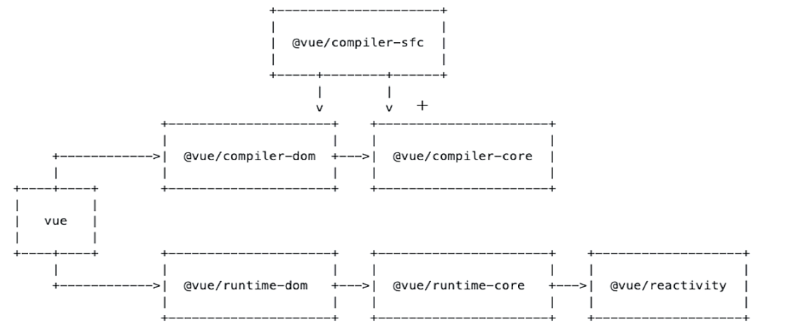
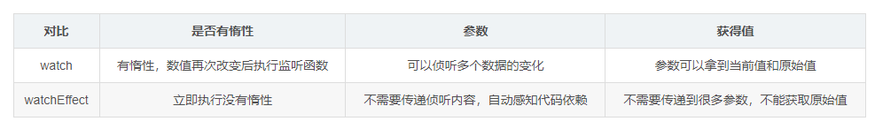

#  vue3

## 模块组织方式及结构



编译部分： compiler-dom 	compiler-core	compiler-sfc

运行时：runtime-dom	runtime-core（核心运行时）	reactivity

sfc的底层依赖于 compiler-dom 	compiler-core

 template编译成render函数

rollup一般用于库的打包，而webpack一般用于应用的打包

compiler-dom 	compiler-core 将template转换成render函数。剩下的就交给运行时执行

### reactivity的核心流程

- proxy、reflect

创建proxy代理对象，监听用户的get、set操作，再通过reflect反射给代理对象，这两步操作会触发createGetter、createSetter方法，这两个方法主要是对代理对象的是否只读和浅层响应式来进行判断，同时将代理对象所要获取的值给return出去。

当get时会track（收集依赖），当set时会trigger（触发依赖）

- effect依赖收集、触发依赖

收集响应式对象的fn，创建effect，执行fn，触发get操作，执行track方法，把effect收集起来作为依赖

- track 在触发get的时候进行依赖收集

将代理对象做为map的key，存入map中，没有就存入

- trigger在触发set的时候进行触发依赖   

先取出来之前存起来的depsMap，遍历，然后effect.run()执行依赖

修改响应式对象的值的、触发set操作、执行trigger、重新运行effect函数，执行fn、触发get操作，执行track方法，把effect收集起来作为依赖

### runtime-core初始化的流程

```javascript
// 主要依赖于createApp（App）和mount（rootContainer）传入一个根组件和根容器。基于根组件会生成一个虚拟节点（var vnode = createVNode(rootComponent)）,在通过render(vnode , rootContainer) 将其渲染出来，redner方法会触发patch（vnode，container）方法。最后会将mount方法return出去。
function createApp(rootComponent) {
    const app = {
      _component: rootComponent,
      mount(rootContainer) {
        console.log("基于根组件创建 vnode");
        const vnode = createVNode(rootComponent);
        console.log("调用 render，基于 vnode 进行开箱");
        render(vnode, rootContainer);
      },
    };

    return app;
  };
```

- render方法渲染组件

render函数接收虚拟节点和根容器作为参数，主要是调用patch方法，基于vnode的类型来进行不同的处理（通过shapeFlags二进制的方式来对组件进行判断）

```javascript
function patch(
    n1,
    n2,
    container = null,
    anchor = null,
    parentComponent = null
  ) {
    // 基于 n2 的类型来判断
    // 因为 n2 是新的 vnode
    const { type, shapeFlag } = n2;
    switch (type) {
      case Text:
        processText(n1, n2, container);
        break;
      // 其中还有几个类型比如： static fragment comment
      case Fragment:
        processFragment(n1, n2, container);
        break;
      default:
        // 这里就基于 shapeFlag 来处理
        if (shapeFlag & ShapeFlags.ELEMENT) {
          console.log("处理 element");
          processElement(n1, n2, container, anchor, parentComponent);
        } else if (shapeFlag & ShapeFlags.STATEFUL_COMPONENT) {
          console.log("处理 component");
          processComponent(n1, n2, container, parentComponent);
        }
    }
  }
```

- 初始化组件的流程

  - 对比之前的值和之后的值，然后创建一个初始化的组件，包含了组件上的一些方法（比如attrs、ctx、emit、props、provides、slots、types、vnode（虚拟节点挂载到这个属性上面）），初始化props、slots、render方法，初始化setup时会判断，return给setup的是函数还是对象，是函数就会编译成render函数，是对象就会存到setupsSate中，其中最重要的就是保证一定要有render函数
  - 调用render函数获取vnode（子组件）
  - 触发生命周期beforeMounted hook
  - 调用patch初始化子组件（递归）
  - 触发生命周期mounted hook

- 组件更新

  - 检测是否需要更新
  - 提前更新组件的数据
  - 生成最新的subTree
  - 调用patch处理subTree（递归）

- 初始化element

  - 调用hostCreateElement（）创建真实的element

  - 处理children节点

    文本类型调用hostSetElementText（）、数组类型调用patch

  - 调用hostPatchProp（）设置元素的prop

  - 触发beforeMount（）

  - 渲染hostInsert   插入真实的dom

  - 触发Mounted（）

- element更新
  - 对比props
  - 对比children，遍历所有的child调用patch（递归）

### runtime-core更新的核心知识

响应式的值改变时触发更新、触发当前组件的effect函数执行（instance、update）、再次执行当前组件的render函数获取最新的subTree、触发beforeUpdate hook，触发onVnodeBeforeUpdate、重新调用patch（进行双端diff对比）、触发updated hook、触发onVnodeUpdated

### compiler-core

-  将template变成string
- parse 将string转换成ast
- transform任意编辑处理节点，增删改查节点
- codegen生成对应的代码
- 最终生成一个render函数

## vue3源码知识

所有的逻辑操作都会基于虚拟节点（vnode）来做处理

### vue3自定义渲染器

### vue3源码分为两个部分

- 编译部分
- 运行时

挂载到vue对象上时，tree shaking就没用了 ，因为tree shaking无法分辨用还是没用 

teleport 内置组件

vue3 return出ref时会自动的进行解构，所以在模板中就不用写.value

computed计算出来的值 和 ref 没有区别。

watch观察对象值的改变需要进行一个深拷贝

setup = beforecreate 和 created

**ref**

- :ref = (el) => {if(el) => lis[i] = el}
- const li = ref(null)

结构ref类型会造成响应式数据丢失，可以用torefs解决  

vite 的开发环境用的是esbuild 生产用的rollup

weakMap() 不会导致内存泄漏 弱引用

Reflect的作用是让this依旧指向代理对象

### watch

**watch和watcheffect的区别**



watch监控对象无法区分前后的新值和老值。watch1的本质就是effect，内部会对用户填写的数据进行依赖收集

watch的第一个参数，用回调函数把当前需要监控的变量保存起来

### 调度器（Scheduler）

````javascript
// 最大可并发任务数
this.max = max;
// 当前并发任务数
this.count = 0;
// 阻塞的任务队列
this.queue = [];
````


## 手写Vue3

### reactivity

- reactive的流程
  - 利用reactive创建一个响应式对象
  - 创建一个ReactiveEffect，将实例化对象赋值给activeEffect
  - 调用effect.run()，
  - 触发响应式对象的get操作，触发track来做依赖收集
  - 创建一个map容器，将fn全部收集进去
  - 再触发set操作，触发trigger
  - 对收集起来的fn进行遍历，同时触发effect.run()。

#### effect

````javascript
// 依赖收集，传入的fn会触发get操作，同时收集fn 
// 对响应式对象进行set操作时，会触发所收集的fn
export function effect(fn, options: any = {}) {
  const _effect = new ReactiveEffect(fn, options.scheduler);
  Object.assign(_effect, options);
  extend(_effect, options);
  _effect.run(); // return fn
  const runner: any = _effect.run.bind(_effect);
  runner.effect = _effect;

  return runner;
}
````

#### reactive

````javascript
export function reactive(raw) {
    return new Proxy(raw, {
        get(target, key) {
            const res = Reflect.get(get, key)
            // TODO 收集依赖
            return res
        },
        set(target, key, value) {
            const res = Reflect.set(target, key, value)
            // TODO 触发依赖
            retrun res
        }
    })
}
````

#### track

```javascript
// 触发get的时候会收集依赖
const targetMap = new Map();
export function track(target, key) {
  //   target -> key -> dep
  let depsMap = targetMap.get(target);
  if (!depsMap) {
    depsMap = new Map();
    targetMap.set(target, depsMap);
  }
	// 通过key（属性值）来获取到依赖
  let dep = depsMap.get(key);
  if (!dep) {
    dep = new Set();
    depsMap.set(key, dep);
  }
  dep.add(activeEffect);
  // const dep = new Set()
}
```

#### trigger

````JavaScript
// 触发set的时候会触发依赖
export function trigger(target, key) {
    let depsMap = targetMap.get(target)
    let dep = depsMap.get(key)
    // 遍历之前收集到的所有的fn，然后调用它
    for(const effect of dep) {
        effect.run( )
    }
}
````

#### ref

````javascript
class RefImpl {
  private _value: any;
  public dep;
  private _rawValue: any;
  private _v_isRef = true;
  constructor(value) {
    this._rawValue = value;
    //  covert用来查看value1是否是一个对象
    this._value = covert(value);
    this.dep = new Set();
  }
  get value() {
    trackRefValue(this);
    return this._value;
  }
  set value(newValue) {
    // 已经先去修改了value的
    // hasChange
    if (hasChanged(newValue, this._rawValue)) {
      this._rawValue = newValue;
      this._value = covert(newValue);
      triggerEffects(this.dep);
    }
  }
}  

export function ref(value) {
    return new RefImpl(value)
}

````

#### computed

````javascript

// 当用户触发get value 时会将收集起来的值给触发
// computed具有缓存的能力，通过_dirty它会监听getter是否被调用过
// 当内部依赖的响应式对象发生改变时会触发trigger，然后触发scheduler的逻辑

class ComputedRefImpl {
  private _getter: any;
  private _dirty: Boolean = true;
  private _value: any;
  private _effect: any;
  constructor(getter) {
    this._getter = getter;
    this._effect = new ReactiveEffect(getter, () => {
      if (!this._dirty) {
        this._dirty = true;
      }
    });
  }
  get value() {
    // 当依赖的响应式对象的值发生改变的时候 get value -> dirty应该变成 true
    // 调用完一次get操作后，就控制dirty，不让再次调用
    if (this._dirty) {
      this._dirty = false;
      this._value = this._effect.run();
      // this._value = this._getter()
    }
    return this._value;
  }
}

export function computed(getter) {
  return new ComputedRefImpl(getter);
}
````

### runtime-core

- 实现组件
  - 触发createApp方法，会返回mount（rootContainer）方法
  - 在mount中创建出虚拟节点，基于虚拟节点再做下一步的处理
  - 创建完虚拟节点后再触发render（vnode，rootContaienr）方法
  - render方法其实就是调用patch方法
  - patch方法会对组件或者element进行不同的对比，然后渲染
  - patch方法中也会递归的去调用patch
  - 然后挂载component，挂载的时候会抽象出一个实例化对象，
  - 然后对pros、slots、setup进行处理
  - 拿到最终的render出来的虚拟节点subTree
  - subTree给到patch方法，patch方法在做进一步的处理
- 实现element

#### createApp

````javascript
function createApp(rootComponent) {
    return {
      mount(rootContainer) {
        // 先转换成虚拟节点(vnode)
        // 所有的逻辑操作都会基于虚拟节点（vnode）来做处理
        const vnode = createVNode(rootComponent);
        render(vnode, rootContainer);
      },
    };
  };

export function createVNode(type, props?, children?) {
  const vnode = {
    type,
    props,
    children,
    component: null,
    key: props && props.key,
    shapeFlag: getShapeFlag(type),
    el: null,
  };
  // children
  // |  |=  => 位运算符
  if (typeof children == "string") {
    vnode.shapeFlag |= ShapeFlags.TEXT_CHILDREN;
  } else if (Array.isArray(children)) {
    vnode.shapeFlag |= ShapeFlags.ARRAY_CHILDREN;
  }
  if (vnode.shapeFlag & ShapeFlags.STATEFUL_COMPONENT) {
    if (typeof children === "object") {
      vnode.shapeFlag |= ShapeFlags.SLOT_CHILDREN;
    }
  }

  return vnode;
}

  function render(vnode, container) {
    // 调用patch方法
    // 主要就是用来对比两次虚拟dom的方法，做的主要就是diff的操作

    patch(null, vnode, container, null, null);
  }

  function patch(n1, n2, container, parentComponent, anchor) {
    // 去处理组件
    //  TODO 判断是不是element类型
    // processELement()
    const { type, shapeFlag } = n2;
    switch (type) {
      case Fragment:
        processFragment(n1, n2, container, parentComponent, anchor);
        break;
      case Text:
        processText(n1, n2, container);
        break;
      default:
        // Fragment -> 只渲染chidlren
        if (shapeFlag & ShapeFlags.ELEMENT) {
          processELement(n1, n2, container, parentComponent, anchor);
        } else if (shapeFlag & ShapeFlags.STATEFUL_COMPONENT) {
          processComponent(n1, n2, container, parentComponent, anchor);
        }
        break;
    }
  }
// 如果是组件
  function processComponent(
    n1,
    n2: any,
    container: any,
    parentComponent,
    anchor
  ) {
    if (!n1) {
      mountComponent(n2, container, parentComponent, anchor);
    } else {
      updateComponent(n1, n2);
    }
  }
// 如果是普通元素
 function processELement(
    n1,
    n2: any,
    container: any,
    parentComponent,
    anchor
  ) {
    if (!n1) {
      mountElement(n2, container, parentComponent, anchor);
    } else {
      patchElement(n1, n2, container, parentComponent, anchor);
    }
  }
// 创建组件
  function mountComponent(
    initialVNode: any,
    container: any,
    parentComponent,
    anchor
  ) {
    const instance = (initialVNode.component = createComponentInstance(
      initialVNode,
      parentComponent
    ));

    setupComponent(instance);
    setupRenderEffect(instance, initialVNode, container, anchor);
  }

````

### runtime-dom

### diff

- 通过render方法获取到虚拟节点
- render函数会触发依赖收集

**VNode** 

本质上vnode这个东西就不是用来提高性能的，它的提出更多是为了对原生dom系统做一个抽象表达，方便跨平台处理，比如在SSR时，宿主环境是node，根本就没有dom的概念，但你又得表述dom的东西，那vnode 抽象出来的一套模拟dom系统就很有用了。抽象层在跨平台设计中是很实用有效的架构设计，既然我想要的东西你没有，那我去自己模拟一套就好了。

**Diff 算法的目的是什么？**

为了减少 DOM 操作的性能开销，我们要尽可能的复用 DOM 元素。所以我们需要判断出是否有节点需要移动，应该如何移动以及找出那些需要被添加或删除的节点

**双端diff算法**

先看虚拟节点的左侧，再看右侧，锁定中间乱序的部分，

#### 双端diff

````javascript
// 筛选乱序的范围
// 通过指针对新旧dom进行对比，构造三个指针(c1,c2,i)
//	找出稳定序列，再排列不稳定序列的位置
 function patchKeyedChildren(
    c1,
    c2,
    container,
    parentComponent,
    parentAnchor
  ) {
    const l2 = c2.length;
    let i = 0;
    let e1 = c1.length - 1;
    let e2 = l2 - 1;
    function isSomeVNodeType(n1, n2) {
      // type
      // key
      return n1.type === n2.type && n1.key === n2.key;
    }
    // 左侧
    while (i <= e1 && i <= e2) {
      const n1 = c1[i];
      const n2 = c2[i];
      if (isSomeVNodeType(n1, n2)) {
        patch(n1, n2, container, parentComponent, parentAnchor);
      } else {
        break;
      }
      i++;
    }

    // 右侧
    while (i <= e1 && i <= e2) {
      const n1 = c1[e1];
      const n2 = c2[e2];
      if (isSomeVNodeType(n1, n2)) {
        patch(n1, n2, container, parentComponent, parentAnchor);
      } else {
        break;
      }
      e1--;
      e2--;
    }

    // 新的比老的多 创建
    if (i > e1) {
      if (i <= e2) {
        const nextPos = e2 + 1;
        const anchor = nextPos < l2 ? c2[nextPos].el : null;
        while (i <= e2) {
          patch(null, c2[i], container, parentComponent, anchor);
          i++;
        }
      }
    } else if (i > e2) {
      while (i <= e1) {
        hostRemove(c1[i].el);
        i++;
      }
    } else {
      // 中间对比
      let s1 = i;
      let s2 = i;
      const toBePatched = e2 - s2 + 1;
      let patched = 0;
      const keyToNewIndexMap = new Map();
      const newIndexToolIndexMap = new Array(toBePatched);
      let moved = false;
      let maxNewIndexSoFar = 0;
      for (let i = 0; i < toBePatched; i++) newIndexToolIndexMap[i] = 0;

      for (let i = s2; i <= e2; i++) {
        const nextChild = c2[i];
        keyToNewIndexMap.set(nextChild.key, i);
      }
      for (let i = s1; i <= e1; i++) {
        const prevChild = c1[i];

        if (patched >= toBePatched) {
          hostRemove(prevChild.el);
          continue;
        }
        // null undefined

        let newIndex;
        if (prevChild !== null) {
          newIndex = keyToNewIndexMap.get(prevChild.key);
        } else {
          for (let j = s2; j <= e2; j++) {
            if (isSomeVNodeType(prevChild, c2[j])) {
              newIndex = j;
              break;
            }
          }
        }
        if (newIndex === undefined) {
          hostRemove(prevChild.el);
        } else {
          if (newIndex >= maxNewIndexSoFar) {
            maxNewIndexSoFar = newIndex;
          } else {
            moved = true;
          }
          newIndexToolIndexMap[newIndex - s2] = i + 1;
          patch(prevChild, c2[newIndex], container, parentComponent, null);
          patched++;
        }
      }

      const increasingNewIndexSqquence = moved
        ? getSequence(newIndexToolIndexMap)
        : [];
      let j = increasingNewIndexSqquence.length - 1;

      for (let i = toBePatched - 1; i >= 0; i--) {
        const nextIndex = i + s2;
        const nextChild = c2[nextIndex];
        const anchor = nextIndex + 1 < l2 ? c2[nextIndex + 1].el : null;

        if (newIndexToolIndexMap[i] === 0) {
          patch(null, nextChild, container, parentComponent, anchor);
        } else if (moved) {
          if (j < 0 || i !== increasingNewIndexSqquence[j]) {
            hostInsert(nextChild.el, container, anchor);
            console.log(1);
          } else {
            j--;
            console.log(j);
          }
        }
      }
    }
  }

// 求最长递增子序列
function getSequence(arr: number[]): number[] {
  const p = arr.slice();
  const result = [0];
  let i, j, u, v, c;
  const len = arr.length;
  for (i = 0; i < len; i++) {
    const arrI = arr[i];
    if (arrI !== 0) {
      j = result[result.length - 1];
      if (arr[j] < arrI) {
        p[i] = j;
        result.push(i);
        continue;
      }
      u = 0;
      v = result.length - 1;
      while (u < v) {
        c = (u + v) >> 1;
        if (arr[result[c]] < arrI) {
          u = c + 1;
        } else {
          v = c;
        }
      }
      if (arrI < arr[result[u]]) {
        if (u > 0) {
          p[i] = result[u - 1];
        }
        result[u] = i;
      }
    }
  }
  u = result.length;
  v = result[u - 1];
  while (u-- > 0) {
    result[u] = v;
    v = p[v];
  }
  return result;
}
````

### compiler-core

- 将template变成string
- parse 将string转换成ast
- transform任意编辑处理节点，增删改查节点
- codegen生成对应的代码
- 最终生成一个render函数

# vite

## 项目如何启动

node-gyp下载python（这一步也许不用）

[playwright](https://playwright.dev/dotnet/docs/browsers#install-behind-a-firewall-or-a-proxy)

```text
pnpm install --unsafe-perm
```

[gyp ERR!与node-pre-gyp ERR!报错解决](https://zhuanlan.zhihu.com/p/345314156)

# Rollup

## rollup是怎么打包的 

Rollup 是一个 JavaScript 模块打包器，主要用于将多个 JavaScript 模块打包成单个文件，以提高应用程序的加载性能。

1. 解析模块：Rollup 从入口模块开始，递归地解析所有的模块依赖关系。在解析每个模块时，Rollup 根据模块的导入语句和模块的依赖关系构建一个模块依赖图。
2. 分析模块依赖：Rollup 根据模块依赖图确定每个模块的依赖关系和导出的变量。通过这些信息，Rollup 可以确定哪些变量需要被保留，并将它们合并到一个单独的输出文件中。
3. 生成捆绑包：在分析模块依赖后，Rollup 会生成捆绑包。这个捆绑包包含了所有模块的代码和模块之间的依赖关系，并按照指定的输出格式输出到文件中。
4. 优化捆绑包：在生成捆绑包后，Rollup 会进行优化，以减小输出文件的大小。Rollup 的优化策略包括删除未使用的代码、合并相同的代码块、移除重复的代码等等。
5. 输出文件：最后，Rollup 将优化后的捆绑包输出到指定的文件中，完成打包过程。

Rollup 的打包过程与其他打包器类似，但 Rollup 的优化策略和支持的模块格式不同于其他打包器。Rollup 专注于打包 ES6 模块，并支持 Tree-shaking 技术，这使得 Rollup 成为一个优秀的 JavaScript 模块打包器。
