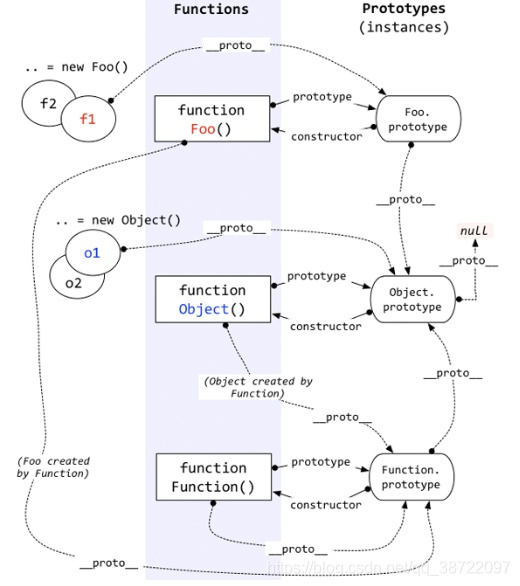

# JavaScript 权威指南

## 原型和原型链

### 原型链图




只有函数对象才有prototype**‘属性’**，原型对象上才有constructor属性，实例化对象才有__proto__属性

* new做了什么（资源共享、节约内存）
  
  * 开辟新的空间

* 修改this指向到这个空间
  
  * 执行构造函数

* 即使没有出现严格模式指令，class声明体中的所有代码也默认处于严格模式。

## 生成器(generator)和迭代器(iterator)

* 生成器是可控制迭代器的函数，控制代码运行的暂停和开始(next())

* 箭头函数不能创建生成器，function*（）关键词加星号

* yield类似return 但是可以使用next（）继续运算

* 数组、字符串、Set、Map都是可迭代的

* 迭代器可使用三点运算符和解构赋值

* **函数表达式没有提升，被函数表达式赋值的变量会有name属性**

```javascript
const a = function() {}
console.log(a.name) // a
console.log(a.prototype)
```

* **模块代码默认在严格模式下运行**

* **Set类是可迭代的，JavaScript的Set会记住元素的插入顺序，而且始终按该顺序迭代集合（Set是集合，没有索引，可以使用foreach方法）**

* **Map的set方法可以联系调用.set().set()**

* **iterator返回一个迭代器对象，有next（）方法，调用next（）为一个object对象，有两个结果，value和done（done为具体的布尔值）**

## 杂谈

typeof是一个操作符，typeof null 返回一个object, 这是因为特殊值null被认为是一个空对象的引用。

存储浮点值使用的内存空间时存储整数值的两倍。

基本数据类型的字符串是不可变得，一旦创建，值就不能变化了，要修改某个变量中得字符值，必须先销毁原始的字符串。

模板字面量可以定义HTML模板`<div/>`,模板字面量不是字符串，而是一种特殊的JavaScript句法表达式，只不过求值后得到的是字符串。

符号没有字面量语法，只要创建Symbol实例并将其用作对象的新属性，就可以保证它不会覆盖已有的对象属性，无论是符号属性还是字符串属性。

Symbol函数不能用作构造函数。

- **一个进程可以有一个或者多个线程**。同一进程下的各个线程共享空间
  
  - 单线程和多线程指的是一个“进程"下的单和多,JavaScript是浏览器中运行的没有多进程的概念
  - 同步任务在主线程上执行，形成执行栈。异步任务进入任务队列
  - setTimeout不能准时实行可能在推入到事件列表的时候，主线程正在执行其他代码。
  - JavaScript若是多线程会导致严重的同步问题

- **高阶数组方法**也是需要遍历的，箭头函数箭头后面写了大括号就要加return
  
  - 高阶数组方法有遍历效果的最后一位是undefined，是因为没有办法跳出循环，所以遍历最后一次结束时还接着再去遍历一次

- **事件循环问题**（运用闭包来解决）
  
  - for(var i = 0; i < a.length; i++){
    
    (function(i){
    
    setTimeout(() => {
    
    ​    console.log(i);
    
       }, 100);
    
       })(i)
    
      }

## Promise

- promise抛出异常并不会卡死，而是会进到catch中
- Promise 构造函数是同步执行的（微任务）promise.then 中的函数是异步执行的。(微任务)
- 状态改变只能是 pending->fulfilled 或者 pending->rejected，状态一旦改变则不能再变。
- 构造函数中的 resolve 或 reject 只有第一次执行有效，多次调用没有任何作用，

**async和await**

- - async定义的函数内部会默认返回一个promise对象，
  
  - async等待内部所有await命令的promise对象执行完毕，才会发生状态改变。
+ **get和post传递参数的不同**
  
  + get利用params传递参数，post利用data和params传递参数
  + params是添加到url的请求中，服务器不会读取http noday的请求，这样的话传递的就是params里面请求的参数
  + post请求中，data是添加到请求体中的

+ **axios和ajax**
  
  + axios是基于promise的http库，而ajax是对原生xhr的封装
  + ajax技术实现了局部数据的刷新，而axios实现了对ajax的封装
  + axios通过promise实现对ajax技术的一种封装，axios有的ajax都有，ajax由的axios不一定有

+ **ES6模块化**
  
  + export 暴露，import需要加{}，可暴露多个
  + export default 不需要，只暴露一个，引入时只需要知道文件名就行，可更改暴露的变量名

+ **单页面应用不利于搜索引擎优化**

+ **浏览器的加载顺序**
  
  + 浏览器一边下载HTML网页，一边解析
  + 发现script标签，暂停解析，网页渲染的控制权交给JavaScript引擎，如果scipt引用了外部脚本就下载该脚本
  + 执行完毕，控制权交还给渲染引擎，恢复往下解析HTML网页（**所以才将js放在最后面**）

+ **前端项目优化**
  
  + 代码层面优化
    + 服务端ssr（将静态资源作为HTML结构返回给客户端）
      + 优点：利于seo、更利于首屏渲染
      + 缺点：服务端压力大，时间耗时久
    + 通过addventListener添加的事件需要自行销毁。
  + webpack层面优化
  + web层面优化

+ **对不同数据结构进行统一遍历  `for of`** 

+ map是键值对（哈希表），而set是值跟值得集合，weakMap和weakMap
* XML是用来传输和存储数据的，现在都是json

* return false； 阻止默认事件

**执行上下文栈**

- JavaScript 引擎创建了执行上下文栈来管理执行上下文。可以把执行上下文栈认为是一个存储函数调用的栈结构，遵循先进后出的原则。

- JavaScript 执行在单线程上，所有的代码都是排队执行。

- 一开始浏览器执行全局的代码时，首先创建全局的执行上下文，压入执行栈的顶部。

- 每当进入一个函数的执行就会创建函数的执行上下文，并且把它压入执行栈的顶部。当前函数执行完成后，当前函数的执行上下文出栈，并等待垃圾回收。

- 浏览器的 JS 执行引擎总是访问栈顶的执行上下文。

- 全局上下文只有唯一的一个，它在浏览器关闭时出栈。

- 执行上下文栈永远都有一个全局执行上下文（因为JavaScript开始解析代码的时候最先遇到的就是全局执行上下文）

**全局执行上下文**

 javascript 引擎并非一行一行地分析执行程序，而是一段一段地分析执行。当执行一段代码的时候，会进行一个“准备工作”，比如第一个例子中的变量提升，和第二个例子中的函数提升

## 作用域和闭包

### 作用域

- 作用域负责收集并维护所有声明变量组成的一系列查询，并确定当前执行的代码对这些标识符的访问权限
- 作用域会在找到第一个匹配的标识符时停止 
- 在多层嵌套的作用域中可以定义同名的标识符  （遮蔽效应），
- 非全局变量的如果被遮蔽了，无论如何都不会被访问到

### 词法单元

- 定义了JavaScript的基本名词规范，包括字符编码、命名规则、标识符、关键字、注释规则、运算符和分隔符等。

### 词法作用域

- eval 

- 欺骗词法作用域会导致性能下降

- 严格模式下，eval有自己的词法作用域，意味着eval中的声明无法修改所在的作用域

- 由函数是个书写的位置决定 

### 函数作用域和块作用域

- {  } 块作用域中定义的内容执行完可以销毁  =》JavaScriptu引擎

# 深入浅出node

## node简介

浏览器除了v8作为JavaScript引擎之外还有一个webkit引擎


ndoe结构与chrome十分相似。都是基于事件驱动的异步架构，浏览器通过事件驱动来服务界面上的交互，node通过事件驱动来服务io 

node保持了JavaScript在浏览器中单线程的特点，单线程的最大好处是不用向多线程编程那样处处在意状态的同步问题。

单线程的弱点有： 

- 无法利用多核CPU
- 错误会引起整个应用退出，应用的健壮性值得考验
- 大量计算占用CPU导致无法继续调用异步I/O

浏览器中JavaScript与UI共用一个线程，JavaScript长时间执行会导致UI渲染和响应被中断。在node中，长时间的cpu占用也会导致后续的IO发不出调用，已完成的异步IO的回调函数也会得不到及时执行。

web workers能创建工作线程来进行计算，以此来解决JavaScript大计算组测UI渲染的问题。工作线程为了不阻塞主线程，通过消息传递的方式来出传递运行结果，这也是的工作线程不能访问到主线程中的UI。

``Web Worker 的作用，就是为 JavaScript 创造多线程环境，允许主线程创建 Worker 线程，将一些任务分配给后者运行。在主线程运行的同时，Worker 线程在后台运行，两者互不干扰。等到 Worker 线程完成计算任务，再把结果返回给主线程。这样的好处是，一些计算密集型或高延迟的任务，被 Worker 线程负担了，主线程（通常负责 UI 交互）就会很流畅，不会被阻塞或拖慢``。

node采用了与web workers相同的思路来解决单线程中大计算量的问题：child_process

node基于libuv实现跨平台，Libuv主要是，利用系统提供的事件驱动模块解决网络异步IO，利用线程池解决文件IO。另外还实现了定时器，对进程，线程等使用进行了封装

node擅长IO密集型的应用场景

## 模块机制

在node中引入模块，需要经历三个步骤

- 路径分析
- 文件定位
- 编译执行

在node中模块分为两类，一类是node提供的核心模块，另一类是用户编写的文件模块。核心模块在node源代码的编译过程中，编译进了二进制执行文件。在node启动时，部分的核心模块就被直接加载进了内存中，所以这部分核心模块引入时，文件定位和编译执行这两个步骤可以省略掉，并且在路径分析中优先判断，所以它的加载速度时最快的

与浏览器会缓存脚本文件以提高性能一样，node对引入过的模块都会进行缓存，以减少二次引入时的开销，不同的地方在于，浏览器仅缓存文件。而node缓存的时编译和执行之后的对象。require（）对于相同模块的二次加载都采用缓存优先的方式

node查找到package.json，通过JSON.Parse解析出包描述对象，从中取出main属性指定的文件名和进行定位。如果缺少扩展名，就会进入扩展名分析的步骤。而如果main属性指定的文件名错误，或者压根没有package.json文件，node就会将index当作默认文件名，然后一次查找index.js、index.json、index.node。如果在目录分析的过程中依然没有成功定位任何文件，则自定义模块进入下一个模块路径进行查找。如果模块路径数组都被遍历完毕，依然没有找到目标文件则会抛出查找异常的错误。

在node核心模块中，有的核心模块全部由C/C++编写，有些模块则由c/c++完成核心部分，其他则由JavaScript实现包装或者向外导出。以满足性能要求。JavaScript核心模块在编译的过程中，需要将JavaScript模块文件编译成为c/c++代码，在这个过程中，JavaScript代码是以字符串的形式存储在node命名空间中，是不可直接执行的。在启动node进程时，JavaScript代码直接加载进内存中。在加载的过程中，JavaScript核心模块经历标识符分析后直接定位到内存中，比普通的文件模块从磁盘中一处一处查找要快很多。

包结构

- package.json：包描述文件
- bin：用于存放可执行二进制文件的目录
- lib：用于存放JavaScript 代码的目录
- doc：用域存放文档的目录
- test：用域存放单元测试用例的代码

-g全局模式并不是将一个模块包安装为一个全局包的意思，并不意味着可以从任何地方通过require（）来引用到它。-g是将一个包安装为全局可用的可执行命令。根据包中的bin字段的配置，将实际脚本链接到与node可执行文件相同的路径下。事实上通过全局安装的所有模块包都安装进了一个统一的目录下，这个目录可以通过一些方式推算出来。

前后端的JavaScript分别搁置在HTTP的两端，他们扮演的角色并不同。浏览器的JavaScript需要经历从同一个服务器端分发到多个客户端执行，而服务器端JavaScript则是相同的代码需要多次执行。前者的瓶颈在于带宽，而后者的瓶颈在于CPU和内存等资源。前者需要通过网络加载代码，后者从磁盘中加载，两者的加载速度不在一个数量级上。

## 异步I/O

Node: 利用单线程，远离多线程死锁、状态同步等问题；利用异步I/O，让单线程原理阻塞，以更好的是用CPU。

阻塞I/O造成CPU的等待浪费，非阻塞带来的麻烦却是需要轮询去确认是否完全完成数据获取，他会让CPU处理状态判断，是对CPU资源的浪费。

时常提到的Node是单线程的，这里的单线程仅仅只是JavaScript执行在单线程中罢了，其实Node自身其实是多线程的。在Node中，无论是Linux还是Windows平台，内部完成I/O任务的另有线程池。

**nodejs其实只有js执行是单线程，I/O显然是其它线程。js执行线程是单线程，把需要做的I/O交给libuv**

Node通过事件驱动的方式处理请求，无需为每一个请求创建额外的对应线程 ，可以省掉创建线程和销毁线程的开销，同时操作系统在调度任务时因为线程较少，上下文切换的代价很低。这使得服务器能够有条不紊的处理请求，即使在大量连接的情况下，也不受上下文切换开销的影响，这也是高性能的一个原因。

## 异步编程

### 难点

#### 难点1：异常处理

异步I/O的实现主要包括两个阶段，提交请求和处理结果。这两个阶段中间有事件循环的调度，两者彼此不关联。异步方法则通常再第一个阶段提交请求后返回，因为异常不一定发生在这个阶段，

```javascript
// 未完成
// process 进程对象
const a = 1;
const add = (b) => {
  console.log(1212)
  return console.log(b, 'wwww');
};
const async = function (callback) {
  process.nextTick(callback);
};
try {
  async(add(a))
} catch (error) {
  console.log(error, '11111')
}
```

#### 难点2：函数嵌套过深

#### 难点3：阻塞代码

阻塞代码会持续占用CPU进行判断。由于Node单线程的原因，CPU资源全都会用于为这段代码服务，导致其余任何请求都会得不到响应。

#### 难点4：多线程编程

WebWorkers能解决利用CPU和减少阻塞UI渲染，但是不能解决UI渲染的效率问题。

#### 难点5：异步转同步

Node提供了绝大部分的异步API和少量的同步API，偶尔出现的同步需求将会因为没有同步API让开发者无所适从。Node中试图同步式编程，但并不能得到原生支持，因为借助库或者编译等手段来实现。但对于异步调用，通过良好的流程控制，还是能将逻辑梳理成顺序式的形式。

# Node.js实战

## 欢迎进入Node.js世界

V8让Node在性能上得到了巨大提升，因为他去掉了中间环节，执行的不是字节码，用的也不是解释器，而是直接翻译成了本地机器码。

Node在服务端使用JavaScript还有其他好处：

- 用一种语言就能编写Web应用，这可以减少开发客户端和服务端所需的语言切换。这样代码可以在客户端和服务端中共享
- JSON是目前非常流行的数据交换格式，并且还是JavaScript原生的。
- 有些NoSQL数据库用的就是JavaScript语言（比如CouchDB和MongoDB），所以跟他们是天作之合
- JavaScript是一门编译目标语言，现在有很多可以编译成JavaScript的语言
- Node用的V8紧跟ECMAScript标准。换句话说，在Node中如果想用新的语言特性，不用等到所有浏览器都支持。

## 构建有多个房间的聊天室程序

### WebSockets

**WebSockets** 是一种先进的技术。它可以在用户的浏览器和服务器之间打开交互式通信会话。使用此 API，您可以向服务器发送消息并接收事件驱动的响应，而无需通过轮询服务器的方式以获得响应。

[`WebSocket`](https://developer.mozilla.org/zh-CN/docs/Web/API/WebSocket)用于连接 WebSocket 服务器的主要接口，之后可以在这个连接上发送 和接受数据。

[`CloseEvent`](https://developer.mozilla.org/zh-CN/docs/Web/API/CloseEvent)连接关闭时 WebSocket 对象发送的事件。

[`MessageEvent`](https://developer.mozilla.org/zh-CN/docs/Web/API/MessageEvent)当从服务器获取到消息的时候 WebSocket 对象触发的事件。

WebSockets开始使用HTTP连接，只不过后面保持TCP持久连接。请求URI用的是ws或者wss

```javascript
// 修改头信息
connect：Upgrade；
Upgrade：websocket；
Sec-WebSocket-Key: 
Sec-WebSocket-Version:    // 版本号 
```

## Node编程基础

Node的事件轮询会跟踪还没有完成的异步逻辑。只要有未完成的异步逻辑，Node进程就不会退出。事件轮询会跟踪所有数据库连接，直到它们关闭，以防止Node退出。用**闭包控制程序的状态**

## 构建Node Web程序

Node.js REPL(Read Eval Print Loop:交互式解释器) 表示一个电脑的环境，类似 Windows 系统的终端或 Unix/Linux shell，我们可以在终端中输入命令，并接收系统的响应。

用Stream.pipr()， 用这个方法可以极大的简化服务器的代码。

用HTTPS加强程序的安全性

## Express

```javascript
npm install express -g
npm install express express-generator -g
```

## 让正常运行时间和性能达到最优

现在的计算机DPU大多数是多核的，但是单个Node进程在运行的时候只能是用其中的一个内核，如果想用Node最大限度的利用服务器，可以再不同的TCP/IP端口上启动多个程序实例，并通过负载均衡把Web流量分发到不同的实例上，但这种方式设置起来很费劲。为了让单个程序使用多核实现起来更容易，Node增加了集群API。借助这个API，程序可以再不同的内核上同时运行多个工人，每个工人做的都是相同的事情，并且是在同一个TCP/IP端口上返回响应。

# Vue设计与实现

## 权衡的艺术

### vue3自定义渲染器

### vue3源码分为两个部分

- 编译部分
- 运行时

挂载到vue对象上时，tree shaking就没用了 ，因为tree shaking无法分辨用还是没用 

teleport 内置组件

vue3 return出ref时会自动的进行解构，所以在模板中就不用写.value

computed计算出来的值 和 ref 没有区别。

watch观察对象值的改变需要进行一个深拷贝

setup = beforecreate 和 created

**ref**

- :ref = (el) => {if(el) => lis[i] = el}
- const li = ref(null)

结构ref类型会造成响应式数据丢失，可以用torefs解决  

vite 的开发环境用的是esbuild 生产用的rollup

weakMap() 不会导致内存泄漏 弱引用

Reflect的作用是让this依旧指向代理对象

### watch

**watch和watcheffect的区别**


watch监控对象无法区分前后的新值和老值。watch1的本质就是effect，内部会对用户填写的数据进行依赖收集

watch的第一个参数，用回调函数把当前需要监控的变量保存起来

## 框架设计的核心要素

### 控制框架代码的体积

 `_DEV_` ， 控制DEV来决定是否打包 

当调用函数的时候会对外部产生影响，例如修改了全局变量。这个就叫做副作用

`/*#_PURE_*/`，作用就是告诉rollup，对于函数的调用不会产生副作用，可以Tree-Shaking

```javascript
// 统一处理错误
function callWithErrorHandling(fn) {
    try {
        fn && fn()
    } catch(e) {
        console.log(e)
    }
}
```

## vue3的设计思路

## 响应系统

如果trigger触发执行的副作用函数与当前正在执行的副作用函数相同，则不触发执行


# 图解Http

# 你不知道的JavaScript（上）

## 作用域和闭包

### 作用域是什么

#### 编译原理

一段代码在执行之前会经历三个步骤

1. 词法分析

​		var a = 2， 被分解为var、a、2、 空格？ -> 词法单元

2. 语法分析

​		转换成抽象语法树

3. 代码生成

​		将一组AST转换成机器指令，创建一个叫做a的变量（包括分配内存），并将一个值存储再a中。

#### 理解作用域

var a = 2； 这段程序有两个不同的声明，一个由编译器再编译时处理，另一个则由引擎在运行时处理。

1. 遇到 var a，编译器会询问作用域是否已经有一个该名称的变量存在。有就忽略该声明，没有就创建。

2. 编译器会为引擎生成运行时所需的代码，这些代码被用来处理 a = 2 这个赋值操作。引擎运行时会首先询问作用域，在当前的作用域集合中是否存在一个叫作 a 的变量。如果是，引擎就会使用这个变量；如果否，引擎会继续查找该变量。如果引擎最终找到了 a 变量，就会将 2 赋值给它。否则引擎就报错

当引擎执行 LHS 查询时，如果在顶层（全局作用域）中也无法找到目标变量，全局作用域中就会创建一个具有该名称的变量，并将其返还给引擎，前提是程序运行在非“严格模式”下

**严格模式禁止自动的或者隐式的创建全局变量**

**如果查找的目的是对变量进行赋值，那么就会使用 LHS 查询；如果目的是获取变量的值，就会使用 RHS 查询**

### 词法作用域

作用域查找会在找到第一个匹配的标识符时停止。

let、const声明的变量不会放到window上，因为Let和const有块作用域，会放到块作用域**Script**中

#### 欺骗词法

欺骗词法作用域会导致性能下降

eval可以接受一个字符串作为参数，将其中的内容视为书写时就存在于这个程序当中。**eval("2 + 2")**

eval通常被用来执行动态创建的代码

**不推荐使用with和eval**

### 函数作用域和块作用域

无法从外到内的访问作用域

**最小暴露原则**

function(){} -> 称作匿名函数表达式，因为没有名称标识符

匿名函数没有函数名，调试会很困难，省略了名称，导致可读性变差。

### 提升

声明提升，函数会被优先提升，然后才是变量。

### 作用域闭包

外部函数被回收的时候，内部作用域在被使用，因此没有被回收

词法作用域在写代码时定义，而动态作用域是在运行时确定

## this和对象原型

### 关于this

this是在运行时绑定，他的上下文取决于函数调用时的各种条件。this的绑定和函数声明的位置没有关系，只取决于函数调用的方式

### this全面解析

**隐式丢失**

显示绑定比隐式绑定优先级高、new比隐式绑定优先级高、new无法和call/apply一起使用

把null和undefined作为this的绑定对象传入call、apply和bind，这些值在调用时会被忽略，实际应用的时默认绑定规则

箭头函数的绑定无法被修改。

## 对象

 ## 混合对象"类"

## 原型

## 行为委托

