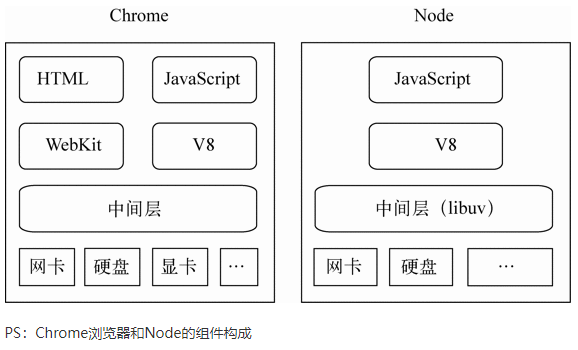
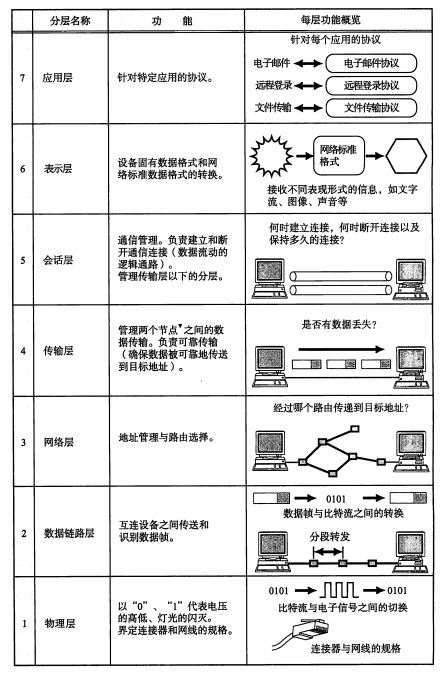

# JavaScript 权威指南

## 生成器(generator)和迭代器(iterator)

* 生成器是可控制迭代器的函数，控制代码运行的暂停和开始(next())

* 箭头函数不能创建生成器，function*（）关键词加星号

* yield类似return 但是可以使用next（）继续运算

* 数组、字符串、Set、Map都是可迭代的

* 迭代器可使用三点运算符和解构赋值

* **函数表达式没有提升，被函数表达式赋值的变量会有name属性**，name返回函数实例的名称，name式只读的

```javascript
const a = function() {}
const b = function add() {}
console.log(b.name)
console.log(a.name) // a
console.log(a.prototype)
```

* **模块代码默认在严格模式下运行**

* **Set类是可迭代的，JavaScript的Set会记住元素的插入顺序，而且始终按该顺序迭代集合（Set是集合，没有索引，可以使用foreach方法）**

* **Map的set方法可以联系调用.set().set()**

* **iterator返回一个迭代器对象，有next（）方法，调用next（）为一个object对象，有两个结果，value和done（done为具体的布尔值）**

## Promise

- promise抛出异常并不会卡死，而是会进到catch中
- Promise 构造函数是同步执行的（微任务）promise.then 中的函数是异步执行的。(微任务)
- 状态改变只能是 pending->fulfilled 或者 pending->rejected，状态一旦改变则不能再变。
- 构造函数中的 resolve 或 reject 只有第一次执行有效，多次调用没有任何作用，

**async和await**

- async等待内部所有await命令的promise对象执行完毕，才会发生状态改变。

**执行上下文栈**

- JavaScript 引擎创建了执行上下文栈来管理执行上下文。可以把执行上下文栈认为是一个存储函数调用的栈结构，遵循先进后出的原则。

- JavaScript 执行在单线程上，所有的代码都是排队执行。

- 一开始浏览器执行全局的代码时，首先创建全局的执行上下文，压入执行栈的顶部。

- 每当进入一个函数的执行就会创建函数的执行上下文，并且把它压入执行栈的顶部。当前函数执行完成后，当前函数的执行上下文出栈，并等待垃圾回收。

- 浏览器的 JS 执行引擎总是访问栈顶的执行上下文。

- 全局上下文只有唯一的一个，它在浏览器关闭时出栈。

- 执行上下文栈永远都有一个全局执行上下文（因为JavaScript开始解析代码的时候最先遇到的就是全局执行上下文）

**全局执行上下文**

 javascript 引擎并非一行一行地分析执行程序，而是一段一段地分析执行。当执行一段代码的时候，会进行一个“准备工作”，比如第一个例子中的变量提升，和第二个例子中的函数提升

## 作用域和闭包

### [JavaScript 的静态作用域链与“动态”闭包链](https://juejin.cn/post/6957913856488243237)

要再创建个对象，要把子函数内引用（refer）的父作用域的变量打包里来，给子函数打包带走。

会在父函数销毁时，把子函数引用到的变量打成 Closure 包放到函数的 [[Scopes]] 上，让它计算父函数销毁了也随时随地能访问外部环境。打包的只是环境内没有的，也就是闭包只保存外部引用。

闭包最少会包含全局作用域。

调用 func3 的时候，JS 引擎 会取出 [[Scopes]] 中的打包的 Closure + Global 链，设置成新的作用域链， 这就是函数用到的所有外部环境了，有了外部环境，自然就可以运行了。

 eval 的实现，因为没法静态分析动态内容所以全部打包成闭包了，本来闭包就是为了不保存全部的作用域链的内容，结果 eval 导致全部保存了，所以尽量不要用 eval。会导致闭包保存内容过多。但是 JS 引擎只处理了直接调用，也就是说直接调用 eval 才会打包整个作用域，如果不直接调用 eval，就没法分析引用，也就没法形成闭包了。

 JavaScript 引擎会把内存分为函数调用栈、全局作用域和堆，其中堆用于放一些动态的对象，调用栈每一个栈帧放一个函数的执行上下文，里面有一个 local 变量环境用于放内部声明的一些变量，如果是对象，会在堆上分配空间，然后把引用保存在栈帧的 local 环境中。全局作用域也是一样，只不过一般用于放静态的一些东西，有时候也叫静态域。

# 深入浅出node

## node简介

浏览器除了v8作为JavaScript引擎之外还有一个webkit引擎



ndoe结构与chrome十分相似。都是基于事件驱动的异步架构，浏览器通过事件驱动来服务界面上的交互，node通过事件驱动来服务io 

### 单线程的好处：

- 多线程占用内存高
- 多线程间切换使得CPU开销大
- 多线程由内存同步开销
- 编写单线程程序简单
- 线程安全

### 单线程的劣势：

- CPU密集型任务占用CPU时间长（可通过cluster方式解决）
- 无法利用CPU的多核（可通过cluster方式解决）
- 单线程抛出异常使得程序停止（可通过try catch方式或自动重启机制解决）

浏览器中JavaScript与UI共用一个线程，JavaScript长时间执行会导致UI渲染和响应被中断。在node中，长时间的cpu占用也会导致后续的IO发不出调用，已完成的异步IO的回调函数也会得不到及时执行。

node基于libuv实现跨平台，Libuv主要是，利用系统提供的事件驱动模块解决网络异步IO，利用线程池解决文件IO。另外还实现了定时器，对进程，线程等使用进行了封装

node擅长IO密集型的应用场景

## 模块机制

在node中引入模块，需要经历三个步骤

- 路径分析
- 文件定位
- 编译执行

在node中模块分为两类，一类是node提供的核心模块，另一类是用户编写的文件模块。

核心模块在node源代码的编译过程中，编译进了二进制执行文件。在node启动时，部分的核心模块就被直接加载进了内存中，所以这部分核心模块引入时，文件定位和编译执行这两个步骤可以省略掉，并且在路径分析中优先判断，所以它的加载速度时最快的

与浏览器会缓存脚本文件以提高性能一样，node对引入过的模块都会进行缓存，以减少二次引入时的开销，不同的地方在于，**浏览器仅缓存文件。而node缓存的时编译和执行之后的对象。require（）对于相同模块的二次加载都采用缓存优先的方式**

node查找到package.json，通过JSON.Parse解析出包描述对象，从中取出main属性指定的文件名和进行定位。如果缺少扩展名，就会进入扩展名分析的步骤。而如果main属性指定的文件名错误，或者压根没有package.json文件，node就会将index当作默认文件名，然后一次查找index.js、index.json、index.node。如果在目录分析的过程中依然没有成功定位任何文件，则自定义模块进入下一个模块路径进行查找。如果模块路径数组都被遍历完毕，依然没有找到目标文件则会抛出查找异常的错误。

在node核心模块中，有的核心模块全部由C/C++编写，有些模块则由c/c++完成核心部分，其他则由JavaScript实现包装或者向外导出。以满足性能要求。JavaScript核心模块在编译的过程中，需要将JavaScript模块文件编译成为c/c++代码，在这个过程中，JavaScript代码是以字符串的形式存储在node命名空间中，是不可直接执行的。在启动node进程时，JavaScript代码直接加载进内存中。在加载的过程中，JavaScript核心模块经历标识符分析后直接定位到内存中，比普通的文件模块从磁盘中一处一处查找要快很多。

- package.json：包描述文件
- bin：用于存放可执行二进制文件的目录
- lib：用于存放JavaScript 代码的目录
- doc：用域存放文档的目录
- test：用域存放单元测试用例的代码

-g全局模式并不是将一个模块包安装为一个全局包的意思，并不意味着可以从任何地方通过require（）来引用到它。**-g是将一个包安装为全局可用的可执行命令**。根据包中的bin字段的配置，将实际脚本链接到与node可执行文件相同的路径下。事实上通过全局安装的所有模块包都安装进了一个统一的目录下，这个目录可以通过一些方式推算出来。

前后端的JavaScript分别搁置在HTTP的两端，他们扮演的角色并不同。浏览器的JavaScript需要经历从同一个服务器端分发到多个客户端执行，而服务器端JavaScript则是相同的代码需要多次执行。前者的瓶颈在于带宽，而后者的瓶颈在于CPU和内存等资源。前者需要通过网络加载代码，后者从磁盘中加载，两者的加载速度不在一个数量级上。

## 异步I/O

Node: 利用单线程，远离多线程**死锁**（死锁是指两个或两个以上的进程（线程）在执行过程中，由于竞争资源或者由于彼此通信而造成的一种阻塞的现象）、状态同步等问题；利用异步I/O，让单线程原理阻塞，以更好的使用CPU。

阻塞I/O造成CPU的等待浪费，非阻塞带来的麻烦却是需要轮询去确认是否完全完成数据获取，他会让CPU处理状态判断，是对CPU资源的浪费。

时常提到的Node是单线程的，这里的单线程仅仅只是JavaScript执行在单线程中罢了，其实Node自身其实是多线程的。在Node中，无论是Linux还是Windows平台，内部完成I/O任务的另有线程池。

**nodejs其实只有js执行是单线程，I/O显然是其它线程。js执行线程是单线程，把需要做的I/O交给libuv**

Node通过事件驱动的方式处理请求，无需为每一个请求创建额外的对应线程 ，可以省掉创建线程和销毁线程的开销，同时操作系统在调度任务时因为线程较少，上下文切换的代价很低。这使得服务器能够有条不紊的处理请求，即使在大量连接的情况下，也不受上下文切换开销的影响，这也是高性能的一个原因。

## 异步编程

### 难点

#### 难点1：异常处理

异步I/O的实现主要包括两个阶段，提交请求和处理结果。这两个阶段中间有事件循环的调度，两者彼此不关联。异步方法则通常再第一个阶段提交请求后返回，因为异常不一定发生在这个阶段，

```javascript
// 未完成
// process 进程对象
const a = 1;
const add = (b) => {
  console.log(1212)
  return console.log(b, 'wwww');
};
const async = function (callback) {
  process.nextTick(callback);
};
try {
  async(add(a))
} catch (error) {
  console.log(error, '11111')
}
```

#### 难点2：函数嵌套过深

#### 难点3：阻塞代码

阻塞代码会持续占用CPU进行判断。由于Node单线程的原因，CPU资源全都会用于为这段代码服务，导致其余任何请求都会得不到响应。

#### 难点4：多线程编程

WebWorkers能解决利用CPU和减少阻塞UI渲染，但是**不能解决UI渲染的效率问题**。

#### 难点5：异步转同步

Node提供了绝大部分的异步API和少量的同步API，偶尔出现的同步需求将会因为没有同步API让开发者无所适从。Node中试图同步式编程，但并不能得到原生支持，因为借助库或者编译等手段来实现。但对于异步调用，通过良好的流程控制，还是能将逻辑梳理成顺序式的形式。

# Node.js实战

## 欢迎进入Node.js世界

**V8让Node在性能上得到了巨大提升，因为他去掉了中间环节，执行的不是字节码，用的也不是解释器，而是直接翻译成了本地机器码**。

Node在服务端使用JavaScript还有其他好处：

- 用一种语言就能编写Web应用，这可以减少开发客户端和服务端所需的语言切换。这样代码可以在客户端和服务端中共享
- JSON是目前非常流行的数据交换格式，并且还是JavaScript原生的。
- 有些NoSQL数据库用的就是JavaScript语言（比如CouchDB和MongoDB），所以跟他们是天作之合
- JavaScript是一门编译目标语言，现在有很多可以编译成JavaScript的语言
- Node用的V8紧跟ECMAScript标准。换句话说，**在Node中如果想用新的语言特性，不用等到所有浏览器都支持**。

## 构建有多个房间的聊天室程序

### WebSockets

**WebSockets** 是一种先进的技术。它可以在用户的浏览器和服务器之间打开交互式通信会话。使用此 API，您可以向服务器发送消息并接收事件驱动的响应，而无需通过轮询服务器的方式以获得响应。

[`WebSocket`](https://developer.mozilla.org/zh-CN/docs/Web/API/WebSocket)用于连接 WebSocket 服务器的主要接口，之后可以在这个连接上发送 和接受数据。

[`CloseEvent`](https://developer.mozilla.org/zh-CN/docs/Web/API/CloseEvent)连接关闭时 WebSocket 对象发送的事件。

[`MessageEvent`](https://developer.mozilla.org/zh-CN/docs/Web/API/MessageEvent)当从服务器获取到消息的时候 WebSocket 对象触发的事件。

WebSockets开始使用HTTP连接，只不过后面保持TCP持久连接。请求URI用的是ws或者wss

```javascript
// 修改头信息
connect：Upgrade；
Upgrade：websocket；
Sec-WebSocket-Key: 
Sec-WebSocket-Version:    // 版本号 
```

## Node编程基础

Node的事件轮询会跟踪还没有完成的异步逻辑。只要有未完成的异步逻辑，Node进程就不会退出。事件轮询会跟踪所有数据库连接，直到它们关闭，以防止Node退出。用**闭包控制程序的状态**

## 构建Node Web程序

Node.js REPL(Read Eval Print Loop:交互式解释器) 表示一个电脑的环境，类似 Windows 系统的终端或 Unix/Linux shell，我们可以在终端中输入命令，并接收系统的响应。

用Stream.pipr()， 用这个方法可以极大的简化服务器的代码。

用HTTPS加强程序的安全性

## Express

```javascript
npm install express -g
npm install express express-generator -g
```

## 让正常运行时间和性能达到最优

现在的计算机CPU大多数是多核的，但是单个Node进程在运行的时候只能是用其中的一个内核，如果想用Node最大限度的利用服务器，可以再不同的TCP/IP端口上启动多个程序实例，并通过负载均衡把Web流量分发到不同的实例上，但这种方式设置起来很费劲。为了让单个程序使用多核实现起来更容易，Node增加了集群API。借助这个API，程序可以再不同的内核上同时运行多个工人，每个工人做的都是相同的事情，并且是在同一个TCP/IP端口上返回响应。

# Vue设计与实现

## 权衡的艺术

### vue3自定义渲染器

### vue3源码分为两个部分

- 编译部分
- 运行时

挂载到vue对象上时，tree shaking就没用了 ，因为tree shaking无法分辨用还是没用 

teleport 内置组件

watch观察对象值的改变需要进行一个深拷贝

setup = beforecreate 和 created

**ref**

- :ref = (el) => {if(el) => lis[i] = el}
- const li = ref(null)

结构ref类型会造成响应式数据丢失，可以用torefs解决  

vite 的开发环境用的是esbuild 生产用的rollup

weakMap() 不会导致内存泄漏 弱引用

**Reflect的作用是让this依旧指向代理对象**

### watch

**watch和watcheffect的区别**


watch监控对象无法区分前后的新值和老值。watch1的本质就是effect，内部会对用户填写的数据进行依赖收集

watch的第一个参数，用回调函数把当前需要监控的变量保存起来

## 框架设计的核心要素

### 控制框架代码的体积

 `_DEV_` ， 控制DEV来决定是否打包 

当调用函数的时候会对外部产生影响，例如修改了全局变量。这个就叫做副作用

`/*#_PURE_*/`，作用就是告诉rollup，对于函数的调用不会产生副作用，可以Tree-Shaking

```javascript
// 统一处理错误
function callWithErrorHandling(fn) {
    try {
        fn && fn()
    } catch(e) {
        console.log(e)
    }
}
```

## vue3的设计思路

## 响应系统

如果trigger触发执行的副作用函数与当前正在执行的副作用函数相同，则不触发执行

# 图解HTTP

## 了解Web及网络基础

TCP/IP 是在 IP 协议的通信过程中，使用到的协议族的统称。

TCP/IP 协议族按层次分别分为以下 4 层：应用层、传输层、网络层和数据链路层。

在传输层有两个性质不同的协议：TCP（Transmission ControlProtocol，传输控制协议）和 UDP（User Data Protocol，用户数据报协议）。

利用 TCP/IP 协议族进行网络通信时，会通过分层顺序与对方进行通信。发送端从应用层往下走，接收端则往物理层往上走。

**发送端在层与层之间传输数据时，每经过一层时必定会被打上一个该层所属的首部信息。反之，接收端在层与层传输数据时，每经过一层时会把对应的首部消去。**

IP 地址可以和 MAC 地址进行配对。IP 地址可变换，但 MAC地址基本上不会更改

TCP 位于传输层，提供可靠的字节流服务。字节流服务（Byte Stream Service）是指，为了方便传输，将大块数据分割成以报文段（segment）为单位的数据包进行管理。而可靠的传输服务是指，能够把数据准确可靠地传给对方。一言以蔽之，TCP 协议为了更容易传送大数据才把数据分割，而且 TCP 协议能够确认数据最终是否送达到对方

udp面向报文，应用层交给UDP多长的报文，UDP都会发送，一次发送一个报文。

## 简单的http协议

http是无状态协议，通过cookie可以变成有状态。

统一资源标志符URI（身份证）    统一资源定位符URL（家庭住址）

无状态协议当然也有它的优点。由于不必保存状态，自然可减少服务器的 CPU 及内存资源的消耗

## http报文内的http信息

利用 MIME 来描述标记数据类型。而在 MIME 扩展中会使用一种称为多部分对象集合（Multipart）的方法，来容纳多份不同类型的数据

## 返回结果的http状态码

## 与http协作的web服务器

HTTP/1.1 规范允许一台 HTTP 服务器搭建多个 Web 站点。比如，提供 Web 托管服务（Web Hosting Service）的供应商，可以用一台服务器为多位客户服务，也可以以每位客户持有的域名运行各自不同的网站。这是因为利用了**虚拟主机**（Virtual Host，又称虚拟服务器）的功能。

即使物理层面只有一台服务器，但只要使用虚拟主机的功能，则可以假想已具有多台服务器。

使用代理服务器的理由有：利用缓存技术减少网络带宽的流量，组织内部针对特定网站的访问控制，以获取访问日志为主要目的。

**网关**的工作机制和代理十分相似。而网关能使通信线路上的服务器提供非 HTTP 协议服务。利用网关能提高通信的安全性，因为可以在客户端与网关之间的通信线路上加密以确保连接的安全。

**隧道**可按要求建立起一条与其他服务器的通信线路，届时使用 SSL等加密手段进行通信。隧道的目的是确保客户端能与服务器进行安全的通信。隧道本身不会去解析 HTTP 请求。也就是说，请求保持原样中转给之后的服务器。隧道会在通信双方断开连接时结束。

**缓存**是指代理服务器或客户端本地磁盘内保存的资源副本。利用缓存可减少对源服务器的访问，因此也就节省了通信流量和通信时间。

**缓存服务器**是代理服务器的一种，并归类在缓存代理类型中。换句话说，当代理转发从服务器返回的响应时，代理服务器将会保存一份资源的副本。缓存服务器的优势在于利用缓存可避免多次从源服务器转发资源。因此客户端可就近从缓存服务器上获取资源，而源服务器也不必多次处理相同的请求了。

## http首部

当 HTTP 报文首部中出现了两个或两个以上具有相同首部字段名时会怎么样？这种情况在规范内尚未明确，根据浏览器内部处理逻辑的不同，结果可能并不一致。有些浏览器会优先处理第一次出现的首部字段，而有些则会优先处理最后出现的首部字段。

no-cache 指令的目的是为了防止从缓存中返回过期的资源。no-store才是不缓存资源

HTTP/1.1 之前的 HTTP 版本的默认连接都是非持久连接

## 确保安全的https

**通信的加密**可以通过和 SSL（Secure Socket Layer，安全套接层）或TLS（Transport Layer Security，安全层传输协议）的组合使用用 SSL建立安全通信线路之后，就可以在这条线路上进行 HTTP通信了。与 SSL组合使用的 HTTP 被称为 HTTPS（HTTPSecure，超文本传输安全协议）或 HTTP over SSL。

**内容的加密**把HTTP 报文里所含的内容进行加密处理

不验证通信方的身份就可能遭遇伪装，任何人都可发起请求，服务器只要接收到请求，不管对方是谁都会返回一个响应（但也仅限于发送端的 IP 地址和端口号没有被 Web 服务器设定限制访问的前提下）

虽然使用 HTTP 协议无法确定通信方，但如果使用 SSL则可以。SSL不仅提供加密处理，而且还使用了一种被称为**证书**的手段，可用于确定通信方

HTTP 协议无法证明通信的报文完整性

**HTTPS** 是身披 **SSL** 外壳的 **HTTP**

SSL是独立于 HTTP 的协议，所以不光是 HTTP 协议，其他运行在应用层的 SMTP 和 Telnet 等协议均可配合 SSL协议使用。可以说 SSL是当今世界上应用最为广泛的网络安全技术。

SSL采用一种叫做公开密钥加密（Public-key cryptography）的加密处理方式

HTTPS 采用共享密钥加密和公开密钥加密两者并用的混合加密机制。

无法证明公开密钥就是货真价实的公开密钥

**https的安全通信机制？**

当使用ssl的时候，处理速度会变慢，因为需要做加密解密处理，所以需要消耗cpu和内存

## 确认访问用户的什么认证

计算机本身无法判断坐在显示器前的使用者的身份，需要核对用户信息才能知道到底是不是本人。

HTTP/1.1 使用的认证方式如下所示。**BASIC** 认证（基本认证），**DIGEST** 认证（摘要认证），**SSL** 客户端认证，**FormBase** 认证（基于表单认证）

## 基于http的功能追加协议

## 构建web内容的技术

## web的攻击技术

 简单的http协议本身并不存在安全性问题 ，因此协议本身不会成为被攻击的对象

# 图解TCP/IP

## 网络基础知识

计算机网络分为广域网、城域网和局域网

一个cpu通常在同一时间只能运行一个程序。为了让多个程序同时运行，操作系统采用cpu时间片轮转机制，在多个程序之间进行切换，合理调度。这种方式叫做**多任务调度**。



表示层是进行“统一的网络数据格式”与“某一台计算机或某一款软件特有的数据格式”之间相互转换的分层。

会话层只对何时建立连接、何时发送数据等问题进行管理，并不具有实际传输数据的功能。

网络层和传输层保证数据包能发送到世界各地，实现可靠传输

通信传输实际上是通过物理的传输介质实现的。数据链路层的作用就是在这些通过传输介质互连的设备之间进行数据处理。

传输方式分为有连接型和无连接型

分组交换

网关不仅转发数据还对数据进行转换

## TCP/IP基础知识

**MIME**（邮件或者web 服务器或者web 应用中的媒体内容的类型）属于表示层协议

每个包首部至少包含两个信息：一个发送端和接收端的地址，另一个是上一层的协议类型

## 数据链路

数据链路层定义了通信媒介之间的规范，(包括双绞线电缆、同轴电缆、光纤、红外线等介质)

计算机以0、1表示信息，而通信媒介却以电压的高低，光的闪灭以及电波的强弱等信号

**半双工**是指，只发送或只接收的通信方式。而全双工不同，它允许在同一时间既可以发送数据也可以接收数据

**因特网（互联网：一种把许多网络都连接在一起的国际性网络）是用于通信的基础设施**，或者说基础平台，这样全世界数以百万计的计算机可以轻易地互相通信。**万维网（一个透过互联网访问的，由许多互相链接的超文本组成的信息系统，万维网并不等同于互联网）**连接着提供信息和请求信息的计算机，其中提供信息的叫服务器，请求信息的叫客户机（比如我们的个人计算机）。万维网使用因特网建立连接和传送信息，并为获取其他基于因特网的服务提供界面。

**以太网（以太网是一种计算机局域网技术。它规定了包括物理层的连线、电子信号和介质访问层协议的内容）是一种通信协议标准**

## IP协议

IP(IPv4、IPv6)相当于OSI参考模型的第三层-网络层

路由控制表,一种是手动设置，另一种是路由器与其他路由器相互交换信息时自动刷新

IP面向无连接。即在发包之前，不需要建立与对端目标地址之间的连接。上层如果遇到需要发送给P的数据，该数据会立即被压缩成P包发送出去。

## IP协议相关技术

DNS解析器和域名服务器将最新了解的信息暂时保存到缓存中

# 你不知道的JavaScript（上）

## 作用域和闭包

### 作用域是什么

#### 编译原理

一段代码在执行之前会经历三个步骤

1. **词法分析**

​		var a = 2， 被分解为var、a、2、 空格？ -> 词法单元

2. **语法分析**

​		转换成抽象语法树

3. **代码生成**

​		将一组AST转换成机器指令，创建一个叫做a的变量（包括分配内存），并将一个值存储再a中。

#### 理解作用域

var a = 2； 这段程序有两个不同的声明，一个由编译器在编译时处理，另一个则由引擎在运行时处理。

1. 遇到 var a，编译器会询问作用域是否已经有一个该名称的变量存在。有就忽略该声明，没有就创建。
2. 编译器会为引擎生成运行时所需的代码，这些代码被用来处理 a = 2 这个赋值操作。引擎运行时会首先询问作用域，在当前的作用域集合中是否存在一个叫作 a 的变量。如果是，引擎就会使用这个变量；如果否，引擎会继续查找该变量。如果引擎最终找到了 a 变量，就会将 2 赋值给它。否则引擎就报错

**LHS**（left-hand Side）引用和**RHS**（right-hand Side）引用，通常是指等号（赋值运算）的左右边的引用。

当引擎执行 LHS 查询时，如果在顶层（全局作用域）中也无法找到目标变量，全局作用域中就会创建一个具有该名称的变量，并将其返还给引擎，前提是程序运行在非“严格模式”下

**严格模式禁止自动的或者隐式的创建全局变量**

**如果查找的目的是对变量进行赋值，那么就会使用 LHS 查询；如果目的是获取变量的值，就会使用 RHS 查询**

### 词法作用域

作用域查找会在找到第一个匹配的标识符时停止。

let、const声明的变量不会放到window上，因为Let和const有块作用域，会放到**块作用域Script**中

#### 欺骗词法

欺骗词法作用域会导致性能下降

eval可以接受一个字符串作为参数，将其中的内容视为书写时就存在于这个程序当中。**eval("2 + 2")**

eval通常被用来执行动态创建的代码

**不推荐使用with和eval**

## this和对象原型

### 关于this

this是在运行时绑定，他的上下文取决于函数调用时的各种条件。this的绑定和函数声明的位置没有关系，只取决于函数调用的方式

### this全面解析

**隐式丢失**

显示绑定比隐式绑定优先级高、new比隐式绑定优先级高、new无法和call/apply一起使用

把null和undefined作为this的绑定对象传入call、apply和bind，这些值在调用时会被忽略，实际应用的时默认绑定规则

箭头函数的绑定无法被修改。

# 前端性能揭秘

## 从Vite起步

### 从实践开始

接口请求前对图片进行预加载

使用vite-plugin-import插件可以帮助css实现按需引入，还可以指定css的路径

```javascript
// 动态import
promise.all([
    import('ant/es/modal'),
    import('ant/es/modal/style/css'),
]).then(([Modal]) => {
    Modal.info({})
})

// 动态import 本身并不减小文件的体积，背后实现这一点的是vite的code splitting(代码分割),将代码分割成多个文件，在需要的时候进行加载，而动态import则可以告诉构建工具代码分割的分割点在哪
// webpack会对代码进行解析，将调用import()之处作为分离的模块起点，并打包它和它引用的子模块分离到单独的chunk中。再通过babel转换器，进行转换？？？
```

[**import动态引入返回promise**](https://zhuanlan.zhihu.com/p/96720381)

```javascript
 const main = document.querySelector("main");
  for (const link of document.querySelectorAll("nav > a")) {
    link.addEventListener("click", e => {
      e.preventDefault();

      import(`./section-modules/${link.dataset.entryModule}.js`)
        .then(module => {
          module.loadPageInto(main);
        })
        .catch(err => {
          main.textContent = err.message;
        });
    });
  }
```


## 性能优化方法论

### 度量

**避免盲目优化**

requestAnimationFrame   是一个浏览器API，作用是按帧对网页进行重绘，它能保证回调函数在屏幕每一次的刷新间隔中只被执行一次

FPS（每秒传输帧数）降低的根本原因是UI线程被阻塞，如长时间的JavaScript任务执行或者浏览器回流、重绘。而使用**Long Task API** 可以定位这些阻塞UI线程的长任务

### 分析

清洗数据，如在performance API 浏览器其不兼容时上报-1

TTFB 指客户端从发请求到接收服务器响应的第一个字节的事件

### 实验

### 工具

Preserve log 保留日志

## 网络协议和性能

### TTFB为什么这么长

### 建立连接为什么这么慢

### Fetch之前浏览器在干什么

### HTTPS比HTTP更慢吗 

### HTTP2、HTTP3和性能

HTTP复用连接

对http2及其多路复用进行优化

- 尽可能的统一域名、ip地址或者证书、减少连接的成本
- 对于请求是否成功复用连接或者preconnect，需要关注credentials是否一致
- 跨域名也可以复用连接、只是无法节约域名解析成本
- 停用域名拆分，如果需要保留对http1用户的优化，至少需要让多个域名指向同一个ip地址，从而在http2复用请求

头部压缩

- cookie压缩

### 压缩和缓存

## 浏览器和性能

### 浏览器和性能

最小渲染路径

- 生成dom树
- 阻塞解析JavaScript
- 生成cssom
- 生成渲染树
- 计算布局
- 分层
- 绘制

### 异步任务和性能

### 内存为什么会影响性能

[《Chrome V8原理讲解》第十七篇 JS对象的内存布局与创建过程](https://www.anquanke.com/post/id/257484)

- 当应该被回收的内存空间无法被回收时，就会导致内存不断被占用，这种情况被称为**内存泄漏**

- 内存泄露是老浏览器（主要是IE6）由于垃圾回收有问题导致的 `bug`，跟 `JS` 本身没有关系。

- 闭包和内存泄漏之间并不存在必然联系，使用不当容易引起内存泄漏，

- 闭包不会造成内存泄漏，程序写错了才会造成内存泄漏

- 跟闭包和内存泄露有关系的地方是，使用闭包的同时比较容易形成循环引用，如果闭包的作用域链中保存着一些 `DOM` 节点，这时候就有可能造成内存泄露。但这本身并非闭包的问题，也并非 `JavaScript` 的问题。

有人认为内存占用过多就会导致性能变慢，实际上这两者之间没有什么必然联系，因为对于同样的内存来说，它被占用和不占用对于性能没有任何影响的，并不是占用内存多就直接导致卡顿。。。一旦内存占用达到临界值，内存的垃圾回收机制就会被迫开始工作，一旦进入内存泄漏状态，即使垃圾收集器开始工作也往往无能为力。最终垃圾回收被触发的越来越频繁，导致性能下降。

### 使用ServiceWorker改善性能

### 字体对性能的影响 

## 前端工程和性能

### 构建工具和性能

commonjs使用同步方式导入一个模块

amd就是一种异步加载的模块化规范

es module 和commonjs最大的差异就是前者考虑了静态分析的需求

使用工具链在构建或者编译时改善构建产物的性能称为编译时优化或静态优化。

bundle体积优化

针对较大的JavaScript Bundle，在构建时可以从以下几个角度出发

- 使用分析器分析打包文件的构成
- 尽可能使用ES Module，这样可以用tree shaking移除不需要的依赖，以及借助scope hoisting来减小模块打包的体积
- 拆分首屏的逻辑，在需要时加载
- 使用Ugify等工具压缩JavaScript文件和css文件的体积
- 压缩文件，通过压缩移除开发阶段的代码

### 服务器端渲染和性能

ssr的性能很大程度上也依赖于缓存

在服务端，需要自行处理缓存的失效机制，并利用优先的磁盘空间。通常将其称为缓存替换机制

运行时对象缓存：如果把这些可复用的运行时对象缓存在内存中，当下次用户访问时，就可以直接使用。把一些公用的模块通过require的方式进行引用而不是打到Bundle，这样在渲染不同页面时就可以重复使用这些模块导出的运行时对象。

页面缓存，对于页面级别的缓存，一般将其保存在cdn节点上而不是服务器端。因为cdn节点离用户的距离更近，可以在更短的距离内尽早响应用户请求。

按需渲染：在服务器渲染时按需跳过部分不必要区块的渲染可以提高服务器端渲染的性能

## 泛前端技术与性能

### 跨端技术与性能

### cdn和性能

cdn可以用来托管静态文件

边缘节点

- 也称CDN节点、Cache节点等， CDN节点是相对于网络的复杂结构而提出的一个概念，指距离最终用户接入具有较少的中间环节的网络节点，对最终接入用户有较好的响应能力和连接速度。其作用是将访问量较大的网页内容和对象保存在服务器前端的专用cache设备上，以此来提高网站访问的速度和质量。

回源

- 当有用户访问某一个URL的时候，若是被解析到的那个CDN节点没有缓存响应的内容，或者是缓存已经到期，就会回源站去获取
- 回源是指浏览器在发送请求报文时，响应该请求报文的是源站点的服务器，而不是各节点上的缓存服务器（比如nginx开启缓存），那么这个过程相对于通过各节点上的缓存服务器来响应的话就称作为回源。回源的请求或流量太多的话，有可能会让源站点的服务器承载着过大的访问压力，进而影响服务的正常访问。

**提高缓存利用率**

- 减少缓存分裂

- 缓存忽略动态参数
- 长效缓存

**静态加速和动态加速相结合**

- 连接复用

HTTPS优化

动静分离

压缩

# React设计原理

## 理念篇

### 前端框架原理概览

AngularJS是一款内置多种功能的前端框架

React 是一个库而非框架

# 重构改善既有代码的设计

## 重构，第一个示例

变量命名是代码清晰的关键，好的命名能提升代码的可读性

如果重构引入了性能损耗，先完成重构，在做性能优化

# JavaScript设计模式与开发实践

## 面向对象的JavaScript

JavaScript使用原型模式来构造面向对象系统

### this、call、apply

### 闭包和高阶函数

闭包可以延长局部变量的生命周期

局部变量被封闭在闭包形成的环境中时，局部变量能一直生存下去。将闭包放在全局作用域中或者闭包中，对内存方面的影响是一致的，这里并不能说成是内存泄漏。

高阶函数满足其中一条条件

- 函数可以作为参数被传递
- 函数可以作为返回值输出

AOP（面向切面编程）的主要作用就是把一些跟核心业务逻辑模块无关的功能抽离出来，这些跟业务逻辑无关的功能通常包括日志统计、安全控制，异常处理等，把这些功能抽离出来后，再通过**动态织入**的方式参入业务逻辑代码中，这样做的好处是可以保持业务逻辑模块的纯净和高内聚性，其次是可以很方便的服用日志统计等功能模块

## 设计模式

### 单例模式

JavaScript其实是一门无类语言，单例模式的核心是确保只有一个实例，并提供全局访问

全局变量容易造成**命名空间污染**，

### 策略模式

一个基于策略模式的程序至少由两部分组成，第一个部分是一组策略类，策略类封装了具体的算法，并负责具体的计算过程。第二个是环境类Context，Context接收客户的请求，随后将请求委托给具体某一个策略类。

### 代理模式

### 迭代器模式

迭代器模式是指提供一种方法顺序访问一个聚合对象中的各个元素，而又不暴露该对象的内部表示。迭代器模式可以把迭代的过程从业务逻辑中分离出来，在使用迭代器模式后，即使不关心对象的内部构造，也可以按顺序访问其中的每个元素。

### 发布订阅模式

创建订阅者本身要消耗一定的时间和内存，而且当订阅一个消息时，也许这个消息一直未触发，但是这个订阅者会一直存在于这个内存中。另外，发布订阅模式虽然可以弱化对象之间的联系，但是如果过度使用的话，对象和对象之间的必要联系也会被弱化，会导致程序难以跟踪维护。特别是多个发布者和订阅者嵌套到一起的时候。

### 命令模式

宏命令

### 组合模式

组合模式将对象合成树形结构，以表示部分-整体的层次结构。除了用来表示树形结构之外，组合模式的另一个好处就是通过对象的多态性表现，使得用户对单个对象和组合对象的使用具有一致性。

### 模板方法模式

### 享元模式

### 职责链模式

### 中介者模式

一个对象应该尽可能少的了解另外的对象。如果对象之间的耦合性太高，一个对象发生改变之后，难免会影响到其他的对象

### 装饰器模式

### 状态模式

### 适配器

## 设计原则和编程技巧

### 单一职责（SRP）

SRP原则的优点是降低了单个类或者对象的复杂度，按照职责把对象分解成更小的粒度，这有助于代码的复用，也有利于单元测试，当一个职责变更时不会影响到其他的职责，，缺点是会增加编写代码的复杂度，

### 最小知识原则（LKP）

在设计程序时，应当减少对象之间的交互。如果两个对象之间不必彼此通信，可引入第三者对象来承担这些对象之间的通信作用。

把变量的可见性限制在一个尽可能小的范围内，这个变量对其他不相关模块的影响就越小

### 开放封闭原则

- 挑选出最容易发生变化的地方，然后构造抽象来封闭这些变化
- 在不可避免发生修改的时候，尽量修改哪些相对容易修改的地方。哪一个开源库来说，修改他提供的配置文件，总比修改他的代码简单

## 接口和面向接口编程

## 代码重构

# 程序员修炼之道（通向务实的最高境界）

## 务实的哲学

团队新人&承担责任

技术债

如果身处一个健康的团队，你的的项目如此完美-编写清晰、设计优良、简洁优雅，就会格外小心，防止代码被破坏

永远留意大局，持续不断审视身边发生的事情，而不要只专注于个人在做的事情

许多用户宁愿今天就用上一个毛糙的软件，而不愿意等上一年再用那个打磨光亮、功能齐备的版本（实际上他们一年后真正需要的东西可能完全不同）

构建知识组合，读技术书还要读非技术书，持续投资、批判性思维、交流

## 务实的哲学

ETC原则（easier to change，更容易变更）

收集、组织、维护以及治理知识。把知识文档化，写进规范；通过代码与逆行赋予知识和活力；在测试过程中，运用知识去知道应该提供哪些检查。

DRY原则：在一个系统中，每一处知识都必须单一、明确、权威的表达，不要重复

正交性：独立性和解耦性

编写正交的系统，一般都能获得两个收益，提高生产力和降低风险

模块化、基于组件、分层。系统应该由一组相互协作的模块构成，每个模块的功能因独立于其他模块。有时这些模块组件还被组织到不同的层次上，每一层都做了一级抽象。
