# JavaScript

## 散读笔记

```javascript
// try catch 注意事项
const num = 10 
try {
    return num
} catch {} 
finally {
 num += 10    
}
// 输出10， return会把值缓存起来，然后
```

```javascript
// async await 原理

```

## JavaScript手写代码

### 1. 函数的call() / apply() / bind()

```js
/* 
自定义函数对象的call方法
*/
function call (fn, obj, ...args) {
  // 如果传入的是null/undefined, this指定为window
  if (obj===null || obj===undefined) {
    // obj = window
    return fn(...args)
  }
  // 给obj添加一个方法: 属性名任意, 属性值必须当前调用call的函数对象
  obj.tempFn = fn
  // 通过obj调用这个方法
  const result = obj.tempFn(...args)
  // 删除新添加的方法
  delete obj.tempFn
  // 返回函数调用的结果
  return result
}

/* 
自定义函数对象的apply方法
*/
function apply (fn, obj, args) {
  // 如果传入的是null/undefined, this指定为window
  if (obj===null || obj===undefined) {
    obj = window
  }
  // 给obj添加一个方法: 属性名任意, 属性值必须当前调用call的函数对象
  obj.tempFn = fn
  // 通过obj调用这个方法
  const result = obj.tempFn(...args)
  // 删除新添加的方法
  delete obj.tempFn
  // 返回函数调用的结果
  return result
}

/* 
  自定义函数对象的bind方法
  重要技术:
    高阶函数
    闭包
    call()
    三点运算符
*/
function bind (fn, obj, ...args) {
  return function (...args2) {
    return call(fn, obj, ...args, ...args2)
  }
}
```


### 2. 函数的节流(throttle)与防抖(debounce)

```js
/* 
用于产生节流函数的工具函数
*/
function throttle (callback, delay) {
  // 用于保存处理事件的时间, 初始值为0, 保证第一次会执行
  let start = 0
  // 返回事件监听函数 ==> 每次事件发生都会执行
  return function (event) {
    console.log('---throttle')
    // 发生事件的当前时间
    const current = Date.now()
    // 与上一次处理事件的时差大于delay的时间
    if (current-start>delay) {
      // 执行处理事件的函数
      callback.call(event.target, event)
      // 保证当前时间
      start = current
    }
  }
}

/* 
用于产生防抖函数的工具函数
*/
function debounce (callback, delay) {
  // 返回事件监听函数 ==> 每次事件发生都会执行
  return function (event) {
    console.log('---debounce')
    // 如果还有未执行的定时器, 清除它
    if (callback.timeoutId) {
      clearTimeout(callback.timeoutId)
    }
    // 启动延时delay的定时器, 并保证定时器id
    callback.timeoutId = setTimeout(() => {
      // 执行处理事件的函数
      callback.call(event.target, event)
      // 删除保存的定时器id
      delete callback.timeoutId
    }, delay);
  }
}
```


### 3. 数组去重(unique)

```js
/*
方法1: 利用forEach()和indexOf()
  说明: 本质是双重遍历, 效率差些
*/
function unique1 (array) {
  const arr = []
  array.forEach(item => {
    if (arr.indexOf(item)===-1) { // 内部在遍历判断出来的    includes(item)
      arr.push(item)
    }
  })
  return arr
}

/*
方法2: 利用forEach() + 对象容器
  说明: 只需一重遍历, 效率高些
  [1, 3, 5, 3]
*/
function unique2 (array) {    
  const arr = []
  const obj = {}
  array.forEach(item => {
    if (!obj.hasOwnProperty(item)) {// 不用遍历就能判断出是否已经有了
      obj[item] = true
      arr.push(item)
    }
  })
  return arr
}

/*
方法3: 利用ES6语法
    1). from + Set
    2). ... + Set
    说明: 编码简洁
*/
function unique3 (array) {
  // return Array.from(new Set(array))
  return [...new Set(array)]
}
```


### 4. 数组扁平化(flatten) 

```js
/* 
数组扁平化: 取出嵌套数组(多维)中的所有元素放到一个新数组(一维)中
  如: [1, [3, [2, 4]]]  ==>  [1, 3, 2, 4]
*/

/*
方法一: 递归 + reduce() + concat() + some()
*/
function flatten1 (array) {

  return array.reduce((pre, item) => {
    if (Array.isArray(item) && item.some((cItem => Array.isArray(cItem)))) {
      return pre.concat(flatten1(item))
    } else {
      return pre.concat(item)
    }
  }, [])
}

/*
方法二: ... + some() + concat()
*/
function flatten2 (arr) {
  // 只要arr是一个多维数组(有元素是数组)
  while (arr.some(item => Array.isArray(item))) {
    // 对arr进行降维
    arr = [].concat(...arr)
  }
  return arr
}
```


### 5. 深拷贝

```js
/* 
深度克隆
1). 大众乞丐版
    问题1: 函数属性会丢失
    问题2: 循环引用会出错
2). 面试基础版本
    解决问题1: 函数属性还没丢失
3). 面试加强版本
    解决问题2: 循环引用正常
4). 面试加强版本2(优化遍历性能)
    数组: while | for | forEach() 优于 for-in | keys()&forEach() 
    对象: for-in 与 keys()&forEach() 差不多
    
    cloneDeep()
*/

const obj = {
    a: {
       m: 1 
    },
    b: [3, 4],
    fn: function (){}
    d: 'abc'
}
obj.a.c = obj.b
obj.b[2] = obj.a

/* 
1). 大众乞丐版
  问题1: 函数属性会丢失
  问题2: 循环引用会出错
*/
export function deepClone1(target) { // 从后台获取的数据都可以用
  return JSON.parse(JSON.stringify(target))
}

/* 
获取数据的类型字符串名
*/
function getType(data) {
  return Object.prototype.toString.call(data).slice(8, -1)  // -1代表最后一位
    // [object Array]  ===> Array  [object Object] ==> Object
}

/*
2). 面试基础版本
  解决问题1: 函数属性还没丢失
*/
function deepClone2(target) {
  const type = getType(target)

  if (type==='Object' || type==='Array') {
    const cloneTarget = type === 'Array' ? [] : {}
    for (const key in target) {
      if (target.hasOwnProperty(key)) {
        cloneTarget[key] = deepClone2(target[key])
      }
    }
    return cloneTarget
  } else {
    return target
  }
}

/* 
3). 面试加强版本
  解决问题2: 循环引用正常
*/
function deepClone3(target, map = new Map()) {
  const type = getType(target)
  if (type==='Object' || type==='Array') {
     // 从map容器取对应的clone对象
    let cloneTarget = map.get(target)
    // 如果有, 直接返回这个clone对象
    if (cloneTarget) {
      return cloneTarget
    }
    cloneTarget = type==='Array' ? [] : {}
    // 将clone产生的对象保存到map容器
    map.set(target, cloneTarget)
    for (const key in target) {
      if (target.hasOwnProperty(key)) {
        cloneTarget[key] = deepClone3(target[key], map)
      }
    }
    return cloneTarget
  } else {
    return target
  }
}

/* 
4). 面试加强版本2(优化遍历性能)
    数组: while | for | forEach() 优于 for-in | keys()&forEach() 
    对象: for-in 与 keys()&forEach() 差不多
*/
function deepClone4(target, map = new Map()) {
  const type = getType(target)
  if (type==='Object' || type==='Array') {
    let cloneTarget = map.get(target)
    if (cloneTarget) {
      return cloneTarget
    }

    if (type==='Array') {
      cloneTarget = []
      map.set(target, cloneTarget)
      target.forEach((item, index) => {
        cloneTarget[index] = deepClone4(item, map)
      })
    } else {
      cloneTarget = {}
      map.set(target, cloneTarget)
      Object.keys(target).forEach(key => {
        cloneTarget[key] = deepClone4(target[key], map)
      })
    }

    return cloneTarget
  } else {
    return target
  }
}
```


### 6. 自定义new和instanceof工具函数

```js
/* 
自定义new工具函数
  语法: newInstance(Fn, ...args)
  功能: 创建Fn构造函数的实例对象
  实现: 创建空对象obj, 调用Fn指定this为obj, 返回obj
*/
function newInstance(Fn, ...args) {
  // 创建一个新的对象
  const obj = {}
  // 执行构造函数
  const result = Fn.apply(obj, args) // 相当于: obj.Fn()
  // 如果构造函数执行的结果是对象, 返回这个对象
  if (result instanceof Object) {
    return result
  }
  
  // 给obj指定__proto__为Fn的prototype
  obj.__proto__ = Fn.prototype
  // 如果不是, 返回新创建的对象
  return obj
}

function Fn () {
    this.name = 'tom'
    return []
}
new Fn()

/* 
自定义instanceof工具函数: 
  语法: myInstanceOf(obj, Type)
  功能: 判断obj是否是Type类型的实例
  实现: Type的原型对象是否是obj的原型链上的某个对象, 如果是返回true, 否则返回false
*/
function myInstanceOf(obj, Type) {
  // 得到原型对象
  let protoObj = obj.__proto__

  // 只要原型对象存在
  while(protoObj) {
    // 如果原型对象是Type的原型对象, 返回true
    if (protoObj === Type.prototype) {
      return true
    }
    // 指定原型对象的原型对象
    protoObj = protoObj.__proto__
  }

  return false
}
```

### 7. 字符串处理

```js
/* 
1. 字符串倒序: reverseString(str)  生成一个倒序的字符串
2. 字符串是否是回文: palindrome(str) 如果给定的字符串是回文，则返回 true ；否则返回 false
3. 截取字符串: truncate(str, num) 如果字符串的长度超过了num, 截取前面num长度部分, 并以...结束
*/

/* 
1. 字符串倒序: reverseString(str)  生成一个倒序的字符串
*/
function reverseString(str) {  // abc
  // return str.split('').reverse().join('')
  // return [...str].reverse().join('')
  return Array.from(str).reverse().join('')
}

/* 
2. 字符串是否是回文: palindrome(str) 如果给定的字符串是回文，则返回 true ；否则返回 false
	abcba  abccba
*/
function palindrome(str) {
  return str === reverseString(str)
}

/* 
3. 截取字符串: truncate(str, num) 如果字符串的长度超过了num, 截取前面num长度部分, 并以...结束
abcde...
*/
function truncate(str, num) {
  return str.length > num ? str.slice(0, num) + '...' : str
}

abcdd...
```


### 8. 简单排序: 冒泡 / 选择 / 插入

```js
/* 
冒泡排序的方法
*/
function bubbleSort (array) {
  // 1.获取数组的长度
  var length = array.length;

  // 2.反向循环, 因此次数越来越少
  for (var i = length - 1; i >= 0; i--) {
    // 3.根据i的次数, 比较循环到i位置
    for (var j = 0; j < i; j++) {
      // 4.如果j位置比j+1位置的数据大, 那么就交换
      if (array[j] > array[j + 1]) {
        // 交换
        // const temp = array[j+1]
        // array[j+1] = array[j]
        // array[j] = temp
        [array[j + 1], array[j]] = [array[j], array[j + 1]];
      }
    }
  }

  return arr;
}

/* 
选择排序的方法
*/
function selectSort (array) {
  // 1.获取数组的长度
  var length = array.length

  // 2.外层循环: 从0位置开始取出数据, 直到length-2位置
  for (var i = 0; i < length - 1; i++) {
    // 3.内层循环: 从i+1位置开始, 和后面的内容比较
    var min = i
    for (var j = min + 1; j < length; j++) {
      // 4.如果i位置的数据大于j位置的数据, 记录最小的位置
      if (array[min] > array[j]) {
        min = j
      }
    }
    if (min !== i) {
      // 交换
      [array[min], array[i]] = [array[i], array[min]];
    }
  }

  return arr;
}

/* 
插入排序的方法
*/
function insertSort (array) {
  // 1.获取数组的长度
  var length = array.length

  // 2.外层循环: 外层循环是从1位置开始, 依次遍历到最后
  for (var i = 1; i < length; i++) {
    // 3.记录选出的元素, 放在变量temp中
    var j = i
    var temp = array[i]

    // 4.内层循环: 内层循环不确定循环的次数, 最好使用while循环
    while (j > 0 && array[j - 1] > temp) {
      array[j] = array[j - 1]
      j--
    }

    // 5.将选出的j位置, 放入temp元素
    array[j] = temp
  }

  return array
}


products.sort((item1, item2) => {  
    // 返回正数, item2在右边, 返回负数, item1在右边, 返回0为原本顺序
    return item1.price - item2.price
})
```

### 9、继承

```javascript
 //封装一个父类
        function Person(name, age, sex) {
            this.name = name;
            this.age = age;
            this.sex = sex;
        }
        Person.prototype.eat = function () {
            console.log("螺蛳粉");
        }


        //封装一个子类
        function Student(classRoom, score, name, age, sex) {
            this.classRoom = classRoom;
            this.score = score;
            //构造函数继承调用父类，并把父类的this指向自己的this
            Person.call(this, name, age, sex)
        }
        //以下方法缺点：1.eat共享了  2.如果继承多个属性或方法 需要一个个添加
        // Student.prototype.eat = Person.prototype.eat;

        //以下方法的缺点：1.赋值是地址的赋值，子类和父类的原型对象共享了  2.构造器属性也是不对的
        // Student.prototype = Person.prototype;

        //原型对象继承:把父类的实例化对象 当做自己的原型对象
        Student.prototype = new Person;
        //修正构造器属性(添加constructor属性)
        Student.prototype.constructor = Student;
        Student.prototype.study = function () {
            console.log("面向对象");
        }


        var s1 = new Student(405, 100, "张三", 18, "男");
        console.log(s1);
        console.log(s1.eat);
        console.log(s1.study);
        console.log(s1.constructor);
```

## 函数柯里化

### 精简版柯里化

```javascript
const curring = (protocol) => {
  return function (hostname, pathname) {
    return `${protocol}${hostname}${pathname}`;
  };
};
const https = curring("https://");
const uri = https('www.baidu.com', '/picture')
console.log(uri) // https://www.baidu.com/picture

// 2、如何通过数组解耦获取属性值
const list = [
  {mid:'123', per:'123'},
  {mid: 'qqq', per: '2222'}
]
const curring = key => item => item[key]
const mid = curring('mid')
const per = curring('per')
console.log(list.map(mid))	// [ '123', 'qqq' ]
console.log(list.map(per))	// [ '123', '2222' ]
```

### 柯里化 (隐式调用)

```javascript

function num(...args) {
  console.log(...args) // 1 2 3·
  return args
}

num(1,2,3)

// 此方法无法无限输入参数链式调用
function add(a) {
  // arguments是一个类数组对象，
  // 可通过Array.prototype.slice.call 转换成数组
  // Array.prototype.slice.call(arguments)能将具有length属性的对象转成数组
  let args = Array.prototype.slice.call(arguments);
  let inner = function () {
    args.push(...arguments)
    let sum = args.reduce(function (perv, cur) {
      return prev + cur
    })
    return sum
  }
  return inner
}

console.log(add(1)(2))

// 通过修改toString 隐式调用来达到柯里化的目的，但是输出的是一个函数类型
function add(a) {
  // arguments是一个类数组对象，
  // 可通过Array.prototype.slice.call 转换成数组
  // Array.prototype.slice.call(arguments)能将具有length属性的对象转成数组
  let args = Array.prototype.slice.call(arguments);
  let inner = function () {
    args.push(...arguments)
    return inner
  }
  inner.toString = function () {
    return args.reduce(function (prev, cur) {
      return prev + cur
    })
  }
  return inner
}
```

### 柯里化

```javascript
const curring = (func) => {
    const args = [];
    return function result(...rest) {
        if(rest.lenght === 0) {
            return func(...args)
        } else {
            args.push(...rest);
            return result;
        }
    }
}	
```

### 定制柯里化

```JavaScript
// 求和函数
const sumFn = (...args) => {
  return args.reduce((a, b) => {
    return a + b;
  });
};
// 对参数进行排序
const sortFn = (...args) => {
  return args.sort((a, b) => {
    a - b;
  });
};
const curring = (func) => {
  const args = [];
  return function result(...rest) {
    if (rest.length === 0) {
      return func(...args);
    } else {
      args.push(...rest);
      return result;
    }
  };
};

console.log(curring(sumFn)(1, 2, 3, 4, 5)(6)() )  // 21
console.log(curring(sortFn)(1)(3)(2)(5, 4)() )	//  [1,2,3,4,5]

```


# Node

## 应用监控（APM）  

- 终端用户体验-反应用户的真实体验
- 应用架构映射-从监控逆向分析出真实链路
- 应用事务分析-能从一个唯一的线索找出整条事务或者操作
- 深度应用诊断-精准定位问题N
- 分析与报告-提供实时精准的大数据查询和可视化  

### APM的形态-服务器性能指标监控

- 对服务依赖的硬件性能进行监控如cpu内存、硬盘容量
- 监控服务器性能指标的实时值，用于出紧急问题时及时报警
- 监控历史趋势，可以观察每天的访问情况以及对异常点进行分析

### APM的形态-服务监控

- 对提供的服务进行监控
- 检测服务的情况，如请求数、响应数成功率

### APM的形态-错误/异常监控

- 对报错或异常进行监控
- 一般需要主动上报

### APM的形态-日志收集

- 对服务的所有情况进行记录
- 不管是业务本身、还是访问记录、都需要尽可能记录日志
- 日志的查询分析都很困难、所以APM一般都有日志收集和分析的能力
- 日志会占用大量的硬盘空间，所以需要定期清除，清楚掉就很难查到问题了

### APM的形态-依赖监控

- 对服务的依赖进行监控、如数据库、缓存、外部服务
- 几乎所有的响应缓慢问题均由依赖导致
- 依赖监控也是比较大范围的监控，只能发现问题，很难跟服务本身关联起来

### APM的形态-分布式事务追踪

- 还原真实场景，一个服务从发起到完成，要经历很多的节点 
- 传统的APM工具只能监测一个或者多个节点的情况，无法串起来
- 分布是十五追踪可以通过一个ID就可以查询到一次请求的全链路情况

### APM的形态-代码级监控分析

- 一般利用自动化的代码茶庄技术，获取nodejs进程内方法的调用链路
- 可以查看调用栈上的总执行时间和占的百分比
- 结合v8 Profiling，查看可能出现的内存泄露问题

### 三种统计指标类型

- Gauges ：指定要发送到指标数据库的值。比如CPU利用率，内存等等
- Counter: 当通过时间区间定义的时间过去后，StatsD将最终累计值发送到指标后端，并将计数器重置为0。StatsD之后会为当前指标创建.count和.rate两个附属指标。‘count'是总值，而'rate'是每秒平均值。一般用于统计访问量，错误率等。
- Sets: 系统会自动计算指标类型数。

## 杂学

- Windows二进制文件与linux的不兼容，所以是不能直接使用Windows下的环境变量的。于是，便需要自己手动在linux中下载node。

## 负载均衡

### nginx

### lvs

### dns

## 集群方式下的优雅退出

work 

 node是一个运行环境，基于谷歌的v8引擎，是c++开发出来的。

node是一个单线程程序

`Node`是基于`Chrome V8`引擎开发的能使`JavaScript`在服务器端运行的运行时环境

异步非阻塞、事件驱动、io是指的浏览器读写操作

node借助JavaScript的事件驱动机制加浏览器v8高性能引擎。使得编写高性能web服务轻而易举

缺点：回调函数嵌套太多、太深（俗称回调地狱）

单线程，处理不好CPU密集型任务，最好处理数据密集型

node有一个单独得线程池（处理高并发），作为中间层可以对数据进行增删改

browser得全局对象是window，node得全局对象是global，node里面完全没有DOM，保留少量BOM（setImediate异步中得立即调用）

node使用第三方库libuv做到非阻塞。libuv会开启不同得线程去处理这些异步操作，处理完之后，会把异步操作得回调函数放到node得轮询队列中，node会在适当得时候处理轮询队列中得回调函数，从而实现非阻塞

 **node事件轮询分为六个阶段（宏任务的处理），每个阶段都会有一个队列来执行回调**。

* timer阶段：处理settimeout和setinterval得回调函数（虽然是第一个阶段但是不一定第一个执行）
* pending calbacks阶段：处理系统操作得回调函数
* idle prepare阶l段：仅供node内部操作
* poll阶段：处理IO操作，网络请求等异步操作。1：当进入此阶段是如果存在回调函数，执行完此回调之后就会进入下一个阶段。2：如果没有回调就会一直等待，除非第一个阶段中出现了定时器函数或者说还设置有setImmediate还没有执行

* check阶段：这个阶段用来处理setImmediate得回调函数，当处理完成之后会进入下一个阶段。如果pol阶段为空，check阶段存在回调函数，则立即跳出poll阶段执行check阶段
* close callback阶段：用来处理socket得close事件

commonJs是一套规范

node的外层函数，一个node模块的外层包裹着一层函数。这个函数有五个形参

JavaScript语言是没有读取或者操作二进制数据流的机制，Buffer类被引入作为Node的一部分，使其可以在文件系统操作等场景中处理二进制数据流。Buffer是一个和数组类似的对象，不同的是Buffer是专门用来保存二进制数据的（数据储存为二进制，性能是最好的），Buffer是在global全局作用域中。

process（进程）对象是一个全局变量，它提供有关当前 Node.js 进程的信息并对其进行控制。

path用于处理路径的工具

fs文件，同步方法（带sync）和异步方法（不带sync）

promiseify解决回调地狱问题

A往B写入文件，流失写入关闭开头

浏览器地址栏的请求都是get请求

webpack对comonjs可以解析，comonjs可以运行在node环境及webpack环境下，但不能在浏览器中直接使用。commonjs为动态加载

Abstract Syntax Tree（AST 抽象语法树） 很多工具和库的核心都是通过JavaScript Parse把代码转换为AST。AST定义了代码的结构，通过操作这棵树，我们可以精准的定位到声明语句、赋值语句、运算语句等，实现对代码的分析优化变更等操作。

## 事件循环模型（Event Loop）

以事件为基础的循环机制 

调用栈（内存空间的运行）只接受有限的调用

Libuv专为Node.js而设计，异步io库，跨平台能力

栈指针（Stack Pointer），函数执行完毕之后有的会出栈有的就放在栈里面。

v8是JavaScript运行时的引擎，node是基于v8运行在操作系统上（node包含v8）

node和浏览器的事件循环是一致的

两个任务队列，一个是宏任务队列一个是微任务队列

node天生有处理异步的机制

 同步代码和微任务

主任务代码执行完毕才会执行微任务和宏任务

## node爬虫

发出的请求是从客服端还是从服务端发出的，服务端是分辨不出来的

广告推荐依靠的就是cookie

cheerio是nodejs的抓取页面模块，为服务器定制的jquery核心实现。适合各种web各种爬虫程序

防盗链？？？？

防爬？？？

npm link？？？

## node异常中间件

- 异常中间件只包含一个
- 异常中间件可以传递给普通中中间件
- 一场中间件需要放在所有中间件的最后
- 异常中间件只能捕获回调函数zhong

## Koa洋葱模型


````javascript
const app = new Koa();
app.use((ctx, next) => {
    console.log(1);
    next();
    console.log(2);
});

app.use((ctx, next) => {
    console.log(3);
    next();
    console.log(4);
});

app.listen(8000, '0.0.0.0', () => {
    console.log(`Server is starting`);
});
// 输出
Server is starting
1
3
4
2
````
- 每一层相当于一个中间件，用来处理特定的功能
- 先执行next()前请求,再执行next()函数，最后执行next()后响应
- 利用洋葱模型可以计算操作耗时

# 数据结构与算法

链式存储结构存储下一位的地址值

逻辑结构 存储结构 算法 

稀疏多项式

KMP算法?? 比较指针回溯。

位运算符替代加减乘除可以提高效率

## 单链表

头节点：head

归并排序

## 刷题顺序

数组-> 链表-> 哈希表->字符串->栈与队列->树->回溯->贪心->动态规划->图论->高级数据结构

数组、字符串 链表 双指针 BFS\DFS 二叉树 二分法 分治法 回溯法 数学 栈 堆 队列

# HTTP

* **超文本传输协议**
* **http:**
  * http是明文传输
  * https是以安全为目标的http协议（http的安全版本）
  * https是在http下加入了一个ssl层对http进行加密
  * 一般来说http的默认端口是80，https的端口号是443
  * http不需要证书，https需要证书

* 报文首行，报文头，报文空行，报文体

* get请求没有报文体，他是放在url地址上的

* GET和POST区别
  - 参数位置：GET是在url里，POST是在请求报文体中
  - 参数长度：GET受限制，POST不受限制
  - 参数安全性：GET较差，POST较好
  - 浏览器访问直接都是GET请求
  - 缓存：GET默认读取缓存，POST不读取缓存

* 响应状态码：
  - 1XX: 临时响应，还需要请求者继续操作，一般表示正在处理

    - 100：请求正常，请继续请求
    - 101：需要服务器切换协议，服务器正在切换协议

  - 2XX: 成功，表示成功处理了请求

    - 200：成功，服务器处理成功

    - 201：成功，并且创建了新的资源（一般是POST请求）

  - 3XX: 代表需要后续操作才能完成

    - 301：永久重定向，自动将请求者转移到新的位置
    - 302：临时重定向
    - 304：缓存，上次请求到现在资源没有发生修改，直接读取浏览器缓存即可

  - 4XX：客户端错误

    - 400：请求错误，服务器不认识发送的语法
    - 401：未授权，需要身份验证
    - 403：服务器拒绝请求
    - 404：服务器找不到你请求的网页

  - 5XX：服务端错误

    - 500：服务端错误，无法完成请求
    - 503：服务器超载或者宕机，无法使用

## TCP三次握手：

        - 三次握手的作用是：客户端和服务端都可以确定对方的接收和发送能力正常

1. 客户端向服务端发送请求，服务端接收到请求（服务端可以确定：客户端的发送能力正常）

   - 客户端发送的是一个syn的字段，syn是建立新连接的数据包

2. 服务端接收到请求并向客户端发送数据包，客户端接收(客户端确认：服务端的接收和发送能力正常)

   - 先发送一个ack数据包，应答刚才的syn的请求连接，并又发送了syn数据包，要求建立新连接

         3. 客户端向服务端发送应答字段，服务端接收（服务端可以确认：客户端的接收能力正常）

   - 客户端发送的是一个ack应答包

##  TCP四次挥手：

        - TCP是双向的，需要两个方向分别关闭，每个方向的关闭又需要请求和确认，总共4次，被称作为四次挥手
                - 客户客户端给服务端发送释放信号(一次挥手)
            - Fin数据包：释放字段
                - 服务端接收到了客户端的释放信号，并给出了回应信号（二次挥手），但是此时可能还有数据没有处理完成，等待传输
            - ack数据包：确认客户端的释放信号
                - 服务端给客户端发送释放信号，并表示数据也已经发送完毕了（三次挥手）
            - Fin数据包：释放字段
                - 客户端给服务端发送确认信号，表示收到了服务端的释放信号（四次挥手）
            - ack数据包：确认客户端的释放信号

## 网络编程

 网络模型理论上分为七层：物理层、数据链路层、网络层、传输层、会话层、表示层、应用层。 

实际上tcpi协议分为四层：物理层+数据链路层（以太网、无线LAN）、网络层（ARP、ipv4、ipv6）、传输层（TCP、udp、sctp）、应用层(ssh、http、pop)

# 浏览器

 cookie：本质工作就是维持状态

4kb 50个左右，按照域名存储、明文传输

sessionStorage: 存放在服务端中

## MongoDB

非关系型数据库（mongodb）没有关系型数据库（mysql）安全性高，（从内存存储到硬盘）

mongodb也能处理高并发

mongodb不需要暴露对象

mongo以管理员身份运行

## 浏览器缓存

**强制缓存**：强制浏览器使用当前缓存

**协商缓存**： 强制缓存失效之后，由服务器缓存表示决定是否使用缓存的实现。

# Webpack

- **Entry**：入口起点(entry point)指示 webpack 应该使用哪个模块，来作为构建其内部依赖图的开始。
- **Output**：output 属性告诉 webpack 在哪里输出它所创建的 bundles，以及如何命名这些文件，默认值为 ./dist。
- **Loader**：loader 让 webpack 能够去处理那些非 JavaScript 文件（webpack 自身只能解析 JavaScript）。
- **Plugins**：插件则可以用于执行范围更广的任务。插件的范围包括，从打包优化和压缩，一直到重新定义环境中的变量等。
- **Mode**：模式，有生产模式 production 和开发模式 development
- **chunk**：中间文件

## 执行webpack

npx webpack 启动

webpack的适用场景非常大

wepack默认为一个入口（单页面应用），可以创建多个入口

webpack.config.js为默认配置名（名称是可以换的）

webpack占位符【name】来根据入口文件名输出与入口文件相同的文件名，避免了同一个输出文件名然后报错。

字符串和数组是对应的单页面应用，只有对象才可以单页面应用或者多页面应用。

chunk是打包后的代码块的意思

webpack默认支支持js、json

postcss？处理编译css

babel？处理编译js

浏览器本身就有一个降级的处理

loader 本质上是一个函数 不可以是箭头函数，必须有返回值，返回值为string buffer

[name][ext]

dataURl 将图片转换成base64编码的字符串形式

sourcemap：源代码打包后代码的关系映射，定位到打包前的源代码中。

线上监控系统搜索报错信息就是sourcemap的信息

web-dev-serve ?

babel： 	JavaScript 编译器

polyfill： 垫片（包含ecma新特性的库）

由于运行在nodejs上的webpack是单线程模型的，所以webpack需要处理的事情需要一件一件的做，需要webpack处理多个任务，需要发挥多核cpu电脑的威力

什么是chunk？？ chunk是一堆module的集合

## webpack优化

### 图片优化

- 转换成base64注入到包里
- dataUrlCondition： {maxSize：4*1024}  

### js分离

### js/css 压缩

- uglifyjs-webpack-plugin 压缩js
- css-minimizer-webpack-plugin 压缩css 

### treeshaking

- 必须通过解构的方式获取方法，才可以触发treeshaking
- 调用的npm包必须使用ESM  ==》 export function a() {}

### splitChunk(代码分割)

- 项目包含第三方依赖以及自己写的代码，代码分割后值返回此页面相关的chunk，再加上**浏览器的并行请求策略**，加快系统响应
- 代码分割以后，将比较大的第三方依赖库分离到chunk中，以后即使用户修改业务代码，只要不改变此库的版本或者库代码，在浏览器端的此chunk的缓存会一直有效

### ejs实现公共代码复用

### CleanWebpackPlugin清空dist目录


## 构建性能优化

性能优化常用方法：

- 通过多进程加快构建速度
- 通过分包减小构建目标容量
- 减少构建目标加快构建速度

多进程thread-loader构建

分包策略  

利用缓存提高构建性能  

webpack实现图片五倍压缩 

css 体积优化 

## webpack4和webpack5区别

- tree shaking能力上 
- 构建性能和打包体积  
- webpack5支持在请求中处理协议 
- webpack5副作用处理的差异
- 模块联邦

## bebel插件

babel的三个处理步骤： 解析、转换、生成。

词法解析阶段把字符串形式的代码转换为tokens流 

# AST（抽象语法树）

代表着一种数据结构，把结构样式抽象成语法树的形式， 树形结构标识编程语言的语法结构

## 数据转换

eslint、pretiier把源代码转换AST,转换成为正确代码格式的输出（**源代码结构的一种抽象表示**）

- AST的解析过程分为两个步骤： 

  - 分词：将整个代码字符串分割成最⼩语法单元数组
  - 语法分析：在分词基础上建⽴分析语法单元之间的关系

# 前端性能优化


## 性能优化方式

1. 加速或减少HTTP请求损耗：使⽤CDN加载公⽤库，使⽤强缓存和协商缓存，⼩图⽚使⽤Base64 代替，⻚⾯内跳转其他域名或请求其他域名的资源时使⽤浏览器prefetch预解析等； 
2. 延迟加载：⾮重要的库、⾮⾸屏图⽚延迟加载在window.onload得时候进行处理，SPA的组件懒加载等； 
3. 减少请求内容的体积：开启服务器Gzip压缩，JS、CSS⽂件压缩合并，减少cookies⼤⼩，SSR直 接输出渲染后的HTML等； 
4. 浏览器渲染原理：优化关键渲染路径，尽可能减少阻塞渲染的JS、CSS； 
5. 优化⽤⼾等待体验：⽩屏使⽤加载进度条、菊花图、⻣架屏代替等； 
5. polyfill 兼容浏览器，但是体积大，动态polyfill

## 性能优化

- 开发环境的优化
  - 提示更多信息，方式调试
  - 优化打包事件
- 生产环境的优化
  - 输出文件的优化
  - HTML CSS JS图片文件的压缩
  - 去掉冗余代码
- 项目的优化
  - 结构
  - 配置文件的拆分

## 性能的计算方式

### 确认自己需要关注的指标

常见的指标有：

1. 页面总加载时间 load （window.addEventListener('load')）

2. 首屏时间 用户第一次进入页面（白屏）->开始渲染->第一屏最后一个元素展现出来

3. 白屏时间  用户第一次进入页面（白屏） -> 页面上第一个元素出现（比如loading）

- 代码 尝试用一个指令, 挂载在重要元素上, 当此元素inserted就上报
- 比较关注得通用指标一般是页面总加载时间和白屏时间

**前端性能监控： window.performance**

### 各个属性所代表的含义

1. connectStart, connectEnd
   分别代表TCP建立连接和连接成功的时间节点。如果浏览器没有进行TCP连接（比如使用持久化连接webscoket），则两者都等于domainLookupEnd；


2. domComplete
   Html文档完全解析完毕的时间节点；

3. domContentLoadedEventEnd
   代表DOMContentLoaded事件触发的时间节点：页面文档完全加载并解析完毕之后,会触发DOMContentLoaded事件，HTML文档不会等待样式文件,图片文件,子框架页面的加载(load事件可以用来检测HTML页面是否完全加载完毕(fully-loaded))。

4. domContentLoadedEventStart
   代表DOMContentLoaded事件完成的时间节点，此刻用户可以对页面进行操作，也就是jQuery中的domready时间；

5. domInteractive
   代表浏览器解析html文档的状态为interactive时的时间节点。domInteractive并非DOMReady，它早于DOMReady触发，代表html文档解析完毕（即dom tree创建完成）但是内嵌资源（比如外链css、js等）还未加载的时间点；

6. domLoading
   代表浏览器开始解析html文档的时间节点。我们知道IE浏览器下的document有readyState属性，domLoading的值就等于readyState改变为loading的时间节点；

7. domainLookupStart domainLookupEnd
   分别代表DNS查询的开始和结束时间节点。如果浏览器没有进行DNS查询（比如使用了cache），则两者的值都等于fetchStart；


8. fetchStart
   是指在浏览器发起任何请求之前的时间值。在fetchStart和domainLookupStart之间，浏览器会检查当前文档的缓存；
9. loadEventStart, loadEventEnd
   分别代表onload事件触发和结束的时间节点
10. navigationStart

浏览器最初加载页面得时间，所有时间指标都以此为基准


8. redirectStart, redirectEnd
   如果页面是由redirect而来，则redirectStart和redirectEnd分别代表redirect开始和结束的时间节点；
9. requestStart
   代表浏览器发起请求的时间节点，请求的方式可以是请求服务器、缓存、本地资源等；
10. responseStart, responseEnd
    分别代表浏览器收到从服务器端（或缓存、本地资源）响应回的第一个字节和最后一个字节数据的时刻；
11. ecureConnectionStart
    可选。如果页面使用HTTPS，它的值是安全连接握手之前的时刻。如果该属性不可用，则返回undefined。如果该属性可用，但没有使用HTTPS，则返回0；
12. unloadEventStart, unloadEventEnd
    如果前一个文档和请求的文档是同一个域的，则unloadEventStart和unloadEventEnd分别代表浏览器unload前一个文档的开始和结束时间节点。否则两者都等于0；

### performance具体计算

代码：performance.ts

### 首屏渲染计算方法

```javascript
// 自定义指令监听页面得第一个元素出现得时间，监听页面的最后一个元素出现的时间
Vue.directive('analysis', {
	inserted(el, options) {
        console.log(`${options.value} = ${Date.now() - window.performance.timing.navigationStart}`)
    }
})
v-analysis="firstPaint"
v-analysis="firstScreen"
```

# 数据埋点方案、监控方案

## 代码埋点

优点： 

1. 灵活，因为是代码埋点，所以可以手动写到代码里得任何位置，上报任何数据

缺点：

1. 每一次埋点得修改，都需要耗费研发得人力
2. 产品 -> 文档 -> 研发 ，比较低效 -> 发布上线

一般大厂内部会封装自己的一套埋点上报的npm包, track.ts, npm , script 提供给各业务线使用。

一般我们需要上报什么信息呢？

1. 埋点的标识信息, 按钮， '/click/report/buy',click, event

   eventId: 唯一得，可以用来唯一标识一个埋点，比如'/click/report/buy' 

   eventType：一个枚举，列举出所有埋点得类型，比如click点击事件，event曝光事件

2. 业务自定义的信息, 比如教育行业, 点击一个按钮, 我们要上报用户点击的是哪个年级

3. 通用的设备信息, 比如用户的userId, useragent, deviceId,浏览器版本，安卓/ios，系统版本，手机型号， timestamp, locationUrl等等

一般怎么上报？

1. 实时上报, 业务方调用发送埋点的api后, 立即发出上报请求
2. 延时上报, sdk内部收集业务方要上报的信息, 在浏览器空闲时间或者页面卸载前统一上报，上报失败会做补偿措施。
3. 使用gif上报得原因，防止跨域，不会阻塞代码得运行，节约流量

### 实现 

代码

## 无埋点

### 概念 

无埋点并不是真正的字面意思，其真实含义其实是，不需要研发去手动埋点。

一般会有一个 sdk 封装好各种逻辑, 然后业务方直接引用即可。

sdk中做的事情一般是监听所有页面事件, 上报所有点击事件以及对应的事件所在的元素，然后通过后台去分析这些数据。

业界有GrowingIO, 神策, 诸葛IO, Heap, Mixpanel等等商业产品

### 实现


1. 监听window元素

```js
window.addEventListener("click", function(event){
    let e = window.event || event;
    let target = e.srcElement || e.target;
}, false);
    
```

2. 获取元素唯一标识 xPath

```js
function getXPath(element) {
    // 如果元素有id属性，直接返回//*[@id="xPath"]
    if (element.id) {
        return '//*[@id=\"' + element.id + '\"]';
    }
    // 向上查找到body，结束查找, 返回结果
    if (element == document.body) {
        return '/html/' + element.tagName.toLowerCase();
    }
    let currentIndex = 1, // 默认第一个元素的索引为1
        siblings = element.parentNode.childNodes;


    for (let sibling of siblings) {
        if (sibling == element) {
            // 确定了当前元素在兄弟节点中的索引后, 向上查找
            return getXPath(element.parentNode) + '/' + element.tagName.toLowerCase() + '[' + (currentIndex) +
                ']';
        } else if (sibling.nodeType == 1 && sibling.tagName == element.tagName) {
            // 继续寻找当前元素在兄弟节点中的索引
            currentIndex++;
        }
    }
};
```

## 获取元素的位置

```js
function getOffset(event) {
    const rect = getBoundingClientRect(event.target);
    if (rect.width == 0 || rect.height == 0) {
        return;
    }
    let doc = document.documentElement || document.body.parentNode;
    const scrollX = doc.scrollLeft;
    const scrollY = doc.scrollTop;
    const pageX = event.pageX || event.clientX + scrollX;
    const pageY = event.pageY || event.clientY + scrollY;

    const data = {
        offsetX: ((pageX - rect.left - scrollX) / rect.width).toFixed(4),
        offsetY: ((pageY - rect.top - scrollY) / rect.height).toFixed(4),
    };

    return data;
}

```

## 上报

```js
window.addEventListener("click", function(event){
    const e = window.event || event;
    const target = e.srcElement || e.target;
    const xPath = getXPath(target);
    const offsetData = getOffset(event);

    report({ xPath,  ...offsetData});
}, false);
```

# 浏览器

## 浏览器渲染原理

**Gui线程和js引擎线程(互斥)** **==》 会阻塞**  

**Gui线程：**

- 负责渲染浏览器的HTML元素
- 当页面需要重绘或者由于某种操作引发了回流时，该线程就会执行
- 在JavaScript引擎运行脚本期间，gui渲染线程都是处于挂起状态，也就是被冻结了

**Js引擎线程**

- gui线程与js线程时互斥的，主要是由于JavaScript是操作DOM的，如果他们两同时运行获取的元素数据就可能不一致
- 当JavaScript引擎执⾏时GUI线程会被挂起，GUI更新会被保存在⼀个队列中等到引擎线程空闲时⽴即被执⾏。
- 由于GUI渲染线程与JS执⾏线程是互斥的关系，当浏览器在执⾏JS程序的时候，GUI渲染线程会被保存在⼀个队列中，直到JS程序执⾏完成，才会接着执⾏。
- 因此如果JS执⾏的时间过⻓，这样就会造成⻚⾯的渲染不连贯，导致⻚⾯渲染加载阻塞的感觉

**浏览器渲染流程**

- 解析HTML⽣成DOM树 - 渲染引擎⾸先解析HTML⽂档，⽣成DOM树
- 构建Render树 - 接下来不管是内联式，外联式还是嵌⼊式引⼊的CSS样式会被解析⽣成CSSOM树，根据DOM树与CSSOM树⽣成另外⼀棵⽤于渲染的树-渲染树(Render tree)
- 布局Render树 - 然后对渲染树的每个节点进⾏布局处理，确定其在屏幕上的显⽰位置
- 绘制Render树 - 最后遍历渲染树并⽤UI后端层将每⼀个节点绘制出来
- 现代浏览器总是并⾏加载资源，例如，当 HTML 解析器（Parser）被脚本阻塞时，解析器虽 然会停⽌构建 DOM，但仍会识别该脚本后⾯的资源，并进⾏预加载。 

**CSS 被视为渲染阻塞资源(包括JS)，这意味着浏览器将不会渲染任何已处理的内容，直⾄ CSSOM    (CSS对象模型)  构建完毕，才会进⾏下⼀阶段。CSS不会阻塞DOM的解析，但会阻止其渲染**

**JavaScript 被认为是解释器阻塞资源，HTML解析会被JS阻塞，它不仅可以读取和修改 DOM 属 性，还可以读取和修改CSSOM 属性**

**当存在阻塞的css资源时，浏览器会延迟JavaScript执行和DOM构建。**

- 当浏览器遇到⼀个 script 标记时，DOM 构建将暂停，直⾄脚本完成执⾏。 
- JavaScript 可以查询和修改 DOM 与 CSSOM。
- CSSOM 构建时，JavaScript 执⾏将暂停，直⾄ CSSOM 就绪。 

## 浏览器原理

浏览器为了优化重排和重绘, 尽量提高性能, 维护了一个队列, 会把引起重排、重绘的操作放入这个队列, 然后做批量处理, 这样就把多次的重排操作合并为一次了。 类似于react中的setState, 合并执行。

虽然浏览器有这个优化, 但是我们的一些操作会引起队列的提前执行。

比如：

offsetTop, offsetLeft, offsetWidth, offsetHeight

scrollTop/Left/Width/Height

clientTop/Left/Width/Height

width,height

getComputedStyle()

等等...

当你请求上面的一些属性的时候，为了保证实时性和准确性，也就是为了给你最精确的值, 浏览器会立即执行队列里的任务。

因为队列中可能会有影响到这些值的操作, 所以浏览器认为应该执行完已存在的队列任务, 才能给你最准确的值。

## 浏览器原理与PWA

这节课我们就Chrome浏览器来讲解浏览器原理。

正式开始之前, 咱们先来复习一下大学学的cpu.gpu.内存.进程.线程的概念, 会有助于这节课的听讲。

1. CPU

中央处理器, 解释计算机指令以及处理计算机软件中的数据, 它可以串行地一件接着一件处理交给它的任务

现代电脑上cpu通常会有多个核心, 比如经常听到的8核处理器, 4核处理器等等。

CPU的核心数是指物理上，也就是硬件上存在着几个核心。比如，双核就是包括2个相对独立的CPU核心单元组，四核就包含4个相对独立的CPU核心单元组

2. GPU

图形处理器, 单个GPU核心只能处理一些简单的任务，不过它胜在数量多，单片GPU上会有很多很多的核心可以同时工作，也就是说它的并行计算能力是非常强的

3. 进程 & 线程

进程 - 可以看成正在被执行的应用程序（executing program）。
线程 - 是跑在进程里面的，一个进程里面可能有一个或者多个线程，这些线程可以执行任何一部分应用程序的代码

当你启动一个应用程序的时候，操作系统会为这个程序创建一个进程同时还为这个进程分配一片私有的内存空间，这片空间会被用来存储所有程序相关的数据和状态。
当你关闭这个程序的时候，这个程序对应的进程也会随之消失，进程对应的内存空间也会被操作系统释放掉。


很多应用程序都会采取多进程的方式来工作，因为进程和进程之间是互相独立的，它们互不影响。

换句话来说，如果其中一个工作进程挂掉了，其他进程不会受到影响，而且挂掉的进程还可以重启

## 一、浏览器架构

这里看下图 单进程和多进程浏览器的区别.png

咱们要讲的Chrome浏览器, 是多进程架构, 先来看一下都包含哪些进程。

Browser(一个) - 浏览器进程, 只有一个浏览器进程，负责浏览器的主体部分，包括导航栏，书签， 前进和后退按钮, 提供存储等功能

Network(一个) - 网络进程, 主要负责页面的网络资源加载，之前是作为一个模块运行在浏览器进程里面的，直至最近才独立出来，成为一个单独的进程

GPU(一个) - 图像渲染进程, 负责独立于其它进程的GPU任务。它之所以被独立为一个进程是因为它要处理来自于不同tab的渲染请求并把它在同一个界面上画出来。

Renderer(多个) - 渲染进程, 负责tab内和网页展示相关的所有工作, 比如将 HTML、CSS 和 JavaScript 转换为用户可以与之交互的网页, 默认情况下每个tab都有一个独立的渲染进程。

Plugin(多个) - 插件进程

Extensions(多个) - 扩展程序进程

其他进程 - 工具进程，辅助框架等等

可以在chrome浏览器 更多工具 - 任务管理器 查看当前浏览器所开启的进程, 以及内存和cpu消耗

### 多进程架构的好处

1. 容错性

Chrome会为每个tab单独分配一个属于它们的渲染进程（render process）。举个例子，假如你有三个tab，你就会有三个独立的渲染进程。

当其中一个tab的崩溃时，你可以随时关闭这个tab并且其他tab不受到影响。可是如果所有的tab都跑在同一个进程的话，它们就会有连带关系，一个挂全部挂。

2. 安全性和沙盒性

因为操作系统可以提供方法让你限制每个进程拥有的能力，所以浏览器可以让某些进程不具备某些特定的功能。例如，由于tab渲染进程可能会处理来自用户的随机输入，所以Chrome限制了它们对系统文件随机读写的能力。

3. 每个进程可以拥有更多内存

因为每个进程都会分配一块独立的内存空间, 所以理所当然的, 每个进程都会有更多的内存。

### 多进程架构的坏处

其实上面已经提到了, 每个进程都会拥有自己独立的内存空间, 他们并不能像同一个进程中的线程一样共享内存空间。

而一些基础的东西比如V8 Javascript引擎, 会在不同进程的内存空间中同时存在, 所以就消耗了不必要的内存。

### 多进程架构内存的优化

- 那么Chrome是怎么优化这种情况的呢？

答案就是：限制启动的进程数目，当进程数目达到一定界限后, Chrome会将访问同一个网站的tab都放在一个进程里面跑。

- Chrome的服务化, 节省更多的内存

这里可以看一下图 assets/Chrome的服务化.png

同样的优化方法也可以被使用在浏览器进程（browser process）上面。

Chrome浏览器的架构正在发生一些改变，目的是将和浏览器本身（Chrome）相关的部分拆分为一个个不同的服务，服务化之后，这些功能既可以放在不同的进程里面运行也可以合并为一个单独的进程运行。

这样做的主要原因是让Chrome在不同性能的硬件上有不同的表现。当Chrome运行在一些性能比较好的硬件时，浏览器进程相关的服务会被放在不同的进程运行以提高系统的稳定性。相反如果硬件性能不好，这些服务就会被放在同一个进程里面执行来减少内存的占用。

这样，原来的各种模块会被重构成独立的服务（Service），每个服务（Service）都可以在独立的进程中运行，访问服务（Service）必须使用定义好的接口，通过 IPC 来通信，从而构建一个更内聚、松耦合、易于维护和扩展的系统，更好实现 Chrome 简单、稳定、高速、安全的目标。

### 网站隔离 （Site Isolation）

网站隔离会为网站内不同站点的iframe分配一个独立的渲染进程。

之前说过Chrome会为每个tab分配一个单独的渲染进程，可是如果一个tab只有一个进程的话不同站点的iframe都会跑在这个进程里面，这也意味着它们会共享内存，这就有可能会破坏同源策略。

同源策略是浏览器最核心的安全模型，它可以禁止网站在未经同意的情况下去获取另外一个站点的数据，因此绕过同源策略是很多安全攻击的主要目的。

而进程隔离（proces isolation）是隔离网站最好最有效的办法了。因此在Chrome 67版本之后，桌面版的Chrome会默认开启网站隔离功能，这样每一个跨站点的iframe都会拥有一个独立的渲染进程。


## 二、一个经典问题, 导航时都发生了什么？

上面提到过，浏览器中tab外面发生的一切都是由浏览器进程（browser process）控制的。

浏览器进程有很多负责不同工作的线程（worker thread），其中包括：

1. UI线程（UI thread）：绘制浏览器顶部按钮和导航栏输入框等组件，当你在导航栏里面输入一个URL的时候，其实就是UI线程在处理你的输入。
2. 存储线程（storage thread）： 控制文件读写。


所以，当你在导航栏上输入一串内容的时候，Chrome到底为我们做了哪些工作？

### 处理输入

当用户开始在导航栏上面输入内容的时候，UI线程（UI thread）做的第一件事就是询问：“你输入的字符串是一些搜索的关键词（search query）还是一个URL地址呢？”。

因为对于Chrome浏览器来说，导航栏的输入既可能是一个可以直接请求的域名，也可能是用户想在搜索引擎里面搜索的关键词信息，
所以当用户在导航栏输入信息的时候，UI线程要进行一系列的解析来判定是将用户输入发送给搜索引擎还是直接请求你输入的站点资源。

### 开始导航

当用户按下回车键的时候，UI线程会通知网络进程初始化一个网络请求来获取站点的内容。

这时候tab上的icon会展示一个提示资源正在加载中的旋转圈圈，而且网络进程会进行一系列诸如DNS寻址以及为请求建立TLS连接的操作。

- tips: 这时如果网络进程收到服务器的HTTP 301重定向响应，它就会告知UI线程进行重定向然后它会再次发起一个新的网络请求。

### 读取响应

1. 响应类型判断

网络进程在收到HTTP响应的主体时，在必要的情况下它会先检查一下流的前几个字节以确定响应主体的具体媒体类型（MIME Type）。

响应主体的媒体类型一般可以通过HTTP头部的Content-Type来确定，不过Content-Type有时候会缺失或者是错误的，这种情况下浏览器就要进行MIME类型嗅探来确定响应类型了。

- 这里可以打开一个窗口, 看一下Content-type响应头

2. 不同响应类型的处理

如果响应的主体是一个HTML文件，浏览器会将获取的响应数据交给渲染进程（renderer process）来进行下一步的工作。
如果拿到的响应数据是一个压缩文件（zip file）或者其他类型的文件，响应数据就会交给下载管理器（download manager）来处理。

3. 安全检查

网络进程在把内容交给渲染进程之前还会对内容做SafeBrowsing检查。

如果请求的域名或者响应的内容和某个已知的病毒网站相匹配，网络进程会给用户展示一个警告的页面。除此之外，网络进程还会做CORB（Cross Origin Read Blocking）检查来确定那些敏感的跨站数据不会被发送至渲染进程。

### 寻找一个渲染进程来绘制页面

在网络进程做完所有的检查后并且能够确定浏览器应该导航到该请求的站点，它就会告诉UI线程所有的数据都已经被准备好了。

UI线程在收到网络进程的确认后会为这个网站寻找一个渲染进程（renderer process）来渲染界面。

- tips. 这里chrome有个小优化

因为网络请求的耗时可能会很长, 所以第二步中当UI线程发送URL链接给网络进程后，它其实已经知晓它们要被导航到哪个站点了。

所以在网络进程干活的时候，UI线程会主动地为这个网络请求启动一个渲染线程。如果一切顺利的话（没有重定向之类的东西出现），网络进程准备好数据后页面的渲染进程已经就准备好了，这就节省了新建渲染进程的时间。

不过如果发生诸如网站被重定向到不同站点的情况，刚刚那个渲染进程就不能被使用了，它会被摒弃，一个新的渲染进程会被启动。

### 提交导航

到这一步的时候，数据和渲染进程都已经准备好了，浏览器进程（browser process）会通过IPC告诉渲染进程去提交本次导航（commit navigation）。

除此之外浏览器进程还会将刚刚接收到的响应数据流传递给对应的渲染进程让它继续接收到来的HTML数据。

一旦浏览器进程收到渲染线程的回复说导航已经被提交了（commit），导航这个过程就结束了，文档的加载阶段（document loading phase）会正式开始。

到了这个时候，导航栏会被更新，安全指示符和站点设置会展示新页面相关的站点信息。
当前tab的会话历史（session history）也会被更新，这样当你点击浏览器的前进和后退按钮也可以导航到刚刚导航完的页面。为了方便你在关闭了tab或窗口（window）的时候还可以恢复当前tab和会话（session）内容，当前的会话历史会被保存在磁盘上面。

### 加载完成

当导航提交完成后，渲染进程开始着手加载资源以及渲染页面。

一旦渲染进程完成渲染（load），它会通过IPC告知浏览器进程，然后UI线程就会停止导航栏上旋转的圈圈。

## 三、导航到不同的站点

上面讲述了一个导航的过程, 那么这时候如果我们想去浏览另一个网页, 浏览器会怎么做呢？

能够想到的是, 浏览器必然会重复一遍导航的步骤, 但是在这之前, 浏览器还有一些收尾工作要做！

浏览器进程会对渲染进程说, 我准备重新发起导航了, 你那边是否需要处理beforeunload事件？

beforeunload可以在用户重新导航或者关闭当前tab时给用户展示一个“你确定要离开当前页面吗？”的二次确认弹框。

浏览器进程之所以要在重新导航的时候和当前渲染进程确认的原因是，当前页面发生的一切（包括页面的JavaScript执行）是不受它控制而是受渲染进程控制，它不知道里面的具体情况。

- tips：所以不要随便给页面添加beforeunload事件监听，你定义的监听函数会在页面被重新导航的时候执行，因此这会增加重导航的时延。
  beforeunload事件监听函数只有在十分必要的时候才能被添加，例如用户在页面上输入了数据，并且这些数据会随着页面消失而消失。

1. 如果第二次导航是在页面内发起的, 比如页面内Js执行了location.href=xxxx, 这时候浏览器是怎么做的？

渲染进程会自己先检查一个它有没有注册beforeunload事件的监听函数，如果有的话就执行，执行完后发生的事情就和之前的情况没什么区别了，唯一的不同就是这次的导航请求是由渲染进程给浏览器进程发起的。

2. 如果第二次导航是到不同的站点呢？

会有另外一个渲染进程被启动来完成这次重导航，而当前的渲染进程会继续处理现在页面的一些收尾工作，例如unload事件的监听函数执行。

- 这里可以看一下图 重新导航不同站点.png

## 四、Service Worker场景下的导航

如果开发者在service worker里设置了当前的页面内容从缓存里面获取，当前页面的渲染就不需要重新发送网络请求了，这就大大加快了整个导航的过程。

这里要重点留意的是service worker其实只是一些跑在渲染进程里面的JavaScript代码。

那么问题来了，当导航开始的时候，浏览器进程是如何判断要导航的站点存不存在对应的service worker并启动一个渲染进程去执行它的呢？

其实service worker在注册的时候，它的作用范围（scope）会被记录下来。

在导航开始的时候，网络进程会根据请求的域名在已经注册的service worker作用范围里面寻找有没有对应的service worker。如果有命中该URL的service worker，UI线程就会为这个service worker启动一个渲染进程（renderer process）来执行它的代码。Service worker既可能使用之前缓存的数据也可能发起新的网络请求。


## 五、导航预加载

在上面的例子中，你应该可以感受到如果启动的service worker最后还是决定发送网络请求的话，浏览器进程和渲染进程这一来一回的通信包括service worker启动的时间其实增加了页面导航的时延。

导航预加载就是一种通过在service worker启动的时候并行加载对应资源的方式来加快整个导航过程效率的技术。预加载资源的请求头会有一些特殊的标志来让服务器决定是发送全新的内容给客户端还是只发送更新了的数据给客户端。

## 六、渲染进程中具体做了什么

渲染进程负责标签（tab）内发生的所有事情。

渲染进程的主要任务是将HTML，CSS，以及JavaScript转变为我们可以进程交互的网页内容。

渲染进程里面有：一个主线程（main thread），几个工作线程（worker threads），一个合成线程（compositor thread）以及一个光栅线程（raster thread）

在渲染进程里面，主线程（main thread）处理了绝大多数你发送给用户的代码。如果你使用了web worker或者service worker，相关的代码将会由工作线程（worker thread）处理。合成（compositor）以及光栅（raster）线程运行在渲染进程里面用来高效流畅地渲染出页面内容。


### 解析

1. 构建DOM

上面提到过，渲染进程在导航结束的时候会收到来自浏览器进程提交导航的消息，在这之后渲染进程就会开始接收HTML数据，同时主线程也会开始解析接收到的文本数据，并把它转化为一个DOM（Document Object Model）对象。

DOM对象既是浏览器对当前页面的内部表示，也是Web开发人员通过JavaScript与网页进行交互的数据结构以及API。

如何将HTML文档解析为DOM对象是在HTML标准中定义的。

不过在你的web开发生涯中，你可能从来没有遇到过浏览器在解析HTML的时候发生错误的情景。

这是因为浏览器对HTML的错误容忍度很大。举些例子：如果一个段落缺失了闭合p标签（</p>），这个页面还是会被当做为有效的HTML来处理；

```html
Hi! <b>I'm <i>Chrome</b>!</i> 
```

虽然有语法错误，不过浏览器会把它处理为

```html
Hi! <b>I'm <i>Chrome</i></b><i>!</i>。
```


2. 子资源加载

除了HTML文件，网站通常还会使用到一些诸如图片，CSS样式以及JavaScript脚本等子资源，这些文件会从缓存或者网络上获取。

主线程会按照在构建DOM树时遇到各个资源的循序一个接着一个地发起网络请求，为了提升效率，浏览器会同时运行“预加载扫描”程序。

如果在HTML文档里面存在诸如或者<link>这样的标签，预加载扫描程序会在HTML解析器里面找到对应要获取的资源，并把这些要获取的资源告诉浏览器进程里面的网络线程。

- 看一下图片 6.子资源加载.png

3. JavaScript会阻塞HTML的解析过程

当HTML解析器碰到script标签的时候，它会停止HTML文档的解析从而转向JavaScript代码的加载，解析以及执行。

为什么要这样做呢？因为script标签中的JavaScript可能会使用诸如document.write()这样的代码改变文档流（document）的形状，从而使整个DOM树的结构发生根本性的改变。因为这个原因，HTML解析器不得不等JavaScript执行完成之后才能继续对HTML文档流的解析工作。

### 给浏览器一点如何加载资源的提示

Web开发者可以通过很多方式告诉浏览器如何才能更加优雅地加载网页需要用到的资源。

你可以为script标签添加一个async或者defer属性来使JavaScript脚本进行异步加载。

<link rel="preload">资源预加载可以用来告诉浏览器这个资源在当前的导航肯定会被用到，你想要尽快加载这个资源。

### 样式计算 CSS

拥有了DOM树我们还不足以知道页面的外貌，因为我们通常会为页面的元素设置一些样式。

主线程会解析页面的CSS从而确定每个DOM节点的计算样式（computed style）。计算样式是主线程根据CSS样式选择器（CSS selectors）计算出的每个DOM元素应该具备的具体样式，你可以打开devtools来查看每个DOM节点对应的计算样式。

即使你的页面没有设置任何自定义的样式，每个DOM节点还是会有一个计算样式属性，这是因为每个浏览器都有自己的默认样式表。
因为这个样式表的存在，页面上的h1标签一定会比h2标签大，而且不同的标签会有不同的magin和padding。

- 看图片. 7.样式计算.png

### 布局 Layout

前面这些步骤完成之后，渲染进程就已经知道页面的具体文档结构以及每个节点拥有的样式信息了，可是这些信息还是不能最终确定页面的样子.

只知道网站的文档流以及每个节点的样式是远远不足以渲染出页面内容的，还需要通过布局（layout）来计算出每个节点的几何信息。

布局的具体过程是：

1. 主线程会遍历刚刚构建的DOM树，根据DOM节点的计算样式计算出一个布局树（layout tree）。
2. 布局树上每个节点会有它在页面上的x，y坐标以及盒子大小（bounding box sizes）的具体信息。布局树长得和先前构建的DOM树差不多，不同的是这颗树只有那些可见的（visible）节点信息。

举个例子，如果一个节点被设置为了display:none，这个节点就是不可见的就不会出现在布局树上面（visibility:hidden的节点会出现在布局树上面）。同样的，如果一个伪元素（pseudo class）节点有诸如p::before{content:"Hi!"}这样的内容，它会出现在布局上，而不存在于DOM树上。

### 绘画 - Paint

知道了DOM节点以及它的样式和布局其实还是不足以渲染出页面来的。

为什么呢？举个例子，假如你现在想对着一幅画画一幅一样的画，你已经知道了画布上每个元素的大小，形状以及位置，你还是得思考一下每个元素的绘画顺序，因为画布上的元素是会互相遮挡的（z-index）。

如果页面上的某些元素设置了z-index属性，绘制元素的顺序就会影响到页面的正确性。

### 高成本的渲染流水线（rendering pipeline）更新

关于渲染流水线有一个十分重要的点就是流水线的每一步都要使用到前一步的结果来生成新的数据，这就意味着如果某一步的内容发生了改变的话，这一步后面所有的步骤都要被重新执行以生成新的记录。举个例子，如果布局树有些东西被改变了，文档上那些被影响到的部分的绘画顺序是要重新生成的。

- 看图 8.渲染流水线.png

如果你的页面元素有动画效果（animating），浏览器就不得不在每个渲染帧的间隔中通过渲染流水线来更新页面的元素。

我们大多数显示器的刷新频率是一秒钟60次（60fps），如果你在每个渲染帧的间隔都能通过流水线移动元素，人眼就会看到流畅的动画效果。可是如果流水线更新时间比较久，动画存在丢帧的状况的话，页面看起来就会很“卡顿”。

即使你的渲染流水线更新是和屏幕的刷新频率保持一致的，这些更新是运行在主线程上面的，这就意味着它可能被同样运行在主线程上面的JavaScript代码阻塞。

- 看图 9.js阻塞渲染流水线.png

对于这种情况，你可以将要被执行的JavaScript操作拆分为更小的块然后通过requestAnimationFrame这个API把他们放在每个动画帧中执行。想知道更多关于这方面的信息的话，可以参考Optimize JavaScript Execution。当然你还可以将JavaScript代码放在WebWorkers中执行来避免它们阻塞主线程。

- 看图 10.rAF优化

### 合成

1. 如何绘制一个页面

浏览器已经知道了关于页面以下的信息：文档结构，元素的样式，元素的几何信息以及它们的绘画顺序。那么浏览器是如何利用这些信息来绘制出页面来的呢？将以上这些信息转化为显示器的像素的过程叫做光栅化（rasterizing）。

现代浏览器采用合成的方式, 来展示整个页面

2. 什么是合成

合成是一种将页面分成若干层，然后分别对它们进行光栅化，最后在一个单独的线程 - 合成线程（compositor thread）里面合并成一个页面的技术。当用户滚动页面时，由于页面各个层都已经被光栅化了，浏览器需要做的只是合成一个新的帧来展示滚动后的效果罢了。页面的动画效果实现也是类似，将页面上的层进行移动并构建出一个新的帧即可。

# 脚手架搭建（cli）

downlaod-git-repo	下载模板

ora	显示加载中的效果，类似前端页面的loading效果

handlebare 	前端模板引擎

figlet	输出文字

clear	清屏

chalk	修改终端字符

open	打开

commaner	插件生成基础命令

约定路由功能？？？ 

## 脚手架执行原理

1. 在终端输入‘vue create vue-test-app'
2. 终端解析出‘vue’命令
3. 终端在环境变量中找到‘vue’命令
4. 终端根据‘vue’命令链接到实际文件‘vue。js’
5. 终端根据node 执行vue。js
6. vue。js解析command/options
7. vue.js执行command 
8. 执行完毕，退出执行

## 脚手架开发流程

- 创建npm项目
- 创建脚手架入口文件，最上方添加：#！/usr/bin/env node
- 配置package.json ，添加bin属性
- 编写脚手架代码
- 将脚手架发布到npm

# Linux

一切皆文件 

kali linux：安全渗透测试使用（有兴趣做安全得可以学习 ）

开机会启动很多程序，他们在windows叫做'服务'（service）, 在linux中就叫做'守护进程'(daemon)

关机之前需要输入 sync`将数据同步到硬盘中`，然后再关机

## 常用命令

### 处理目录常用命令

- ls: 列出目录

  - -a ：全部的文件，连同隐藏文件( 开头为 . 的文件) 一起列出来(常用)
  - -l ：长数据串列出，包含文件的属性与权限等等数据；(常用)

- cd：切换目录

- pwd：显示目前的目录

  - 选项与参数：**-P** ：显示出确实的路径，而非使用连接(link) 路径

- mkdir：创建一个新的目录

  - -m ：配置文件的权限喔！直接配置，不需要看默认权限 (umask) 的脸色～
  - -p ：帮助你直接将所需要的目录(包含上一级目录)递归创建起来！

- rmdir：删除一个空的目录

  - 选项与参数：**-p ：**连同上一级『空的』目录也一起删除

- cp: 复制文件或目录

  - **-a：**相当於 -pdr 的意思，至於 pdr 请参考下列说明；(常用)
  - **-p：**连同文件的属性一起复制过去，而非使用默认属性(备份常用)；

  - **-d：**若来源档为连结档的属性(link file)，则复制连结档属性而非文件本身；

  - **-r：**递归持续复制，用於目录的复制行为；(常用)

  - **-f：**为强制(force)的意思，若目标文件已经存在且无法开启，则移除后再尝试一次；

  - **-i：**若目标档(destination)已经存在时，在覆盖时会先询问动作的进行(常用)

  - **-l：**进行硬式连结(hard link)的连结档创建，而非复制文件本身。

  - **-s：**复制成为符号连结档 (symbolic link)，亦即『捷径』文件；

  - **-u：**若 destination 比 source 旧才升级 destination ！

- rm: 移除文件或目录
  - -f ：就是 force 的意思，忽略不存在的文件，不会出现警告信息；
  - -i ：互动模式，在删除前会询问使用者是否动作
  - -r ：递归删除啊！最常用在目录的删除了！这是非常危险的选项！！！
- mv: 移动文件与目录，或修改文件与目录的名称
  - -f ：force 强制的意思，如果目标文件已经存在，不会询问而直接覆盖；
  - -i ：若目标文件 (destination) 已经存在时，就会询问是否覆盖！
  - -u ：若目标文件已经存在，且 source 比较新，才会升级 (update)

## 基本属性

在Linux中我们可以使用`ll`或者`ls –l`命令来显示一个文件的属性以及文件所属的用户和组，如：

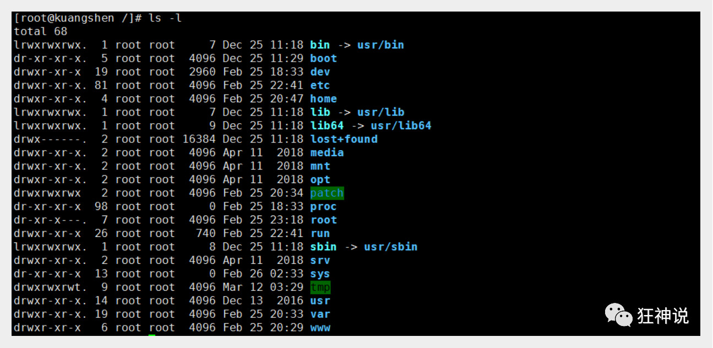

在Linux中第一个字符代表这个文件是目录、文件或链接文件等等：

- 当为[ **d** ]则是目录
- 当为[ **-** ]则是文件；
- 若是[ **l** ]则表示为链接文档 ( link file )；
- 若是[ **b** ]则表示为装置文件里面的可供储存的接口设备 ( 可随机存取装置 )；
- 若是[ **c** ]则表示为装置文件里面的串行端口设备，例如键盘、鼠标 ( 一次性读取装置 )。


其中，[ r ]代表可读(read)、[ w ]代表可写(write)、[ x ]代表可执行(execute)。

Linux系统中使用以下命令来查看文件的内容：

- cat 由第一行开始显示文件内容
- tac 从最后一行开始显示，可以看出 tac 是 cat 的倒着写！
- nl  显示的时候，顺道输出行号！
- more 一页一页的显示文件内容
- less 与 more 类似，但是比 more 更好的是，他可以往前翻页！
- head 只看头几行
- tail 只看尾巴几行

## 硬连接和软连接

### 硬连接

硬连接指通过索引节点来进行连接。在 Linux 的文件系统中，保存在磁盘分区中的文件不管是什么类型都给它分配一个编号，称为索引节点号(Inode Index)。在 Linux 中，多个文件名指向同一索引节点是存在的。比如：A 是 B 的硬链接（A 和 B 都是文件名），则 A 的目录项中的 inode 节点号与 B 的目录项中的 inode 节点号相同，即一个 inode 节点对应两个不同的文件名，两个文件名指向同一个文件，A 和 B 对文件系统来说是完全平等的。删除其中任何一个都不会影响另外一个的访问。

硬连接的作用是允许一个文件拥有多个有效路径名，这样用户就可以建立硬连接到重要文件，以防止“误删”的功能。其原因如上所述，因为对应该目录的索引节点有一个以上的连接。只删除一个连接并不影响索引节点本身和其它的连接，只有当最后一个连接被删除后，文件的数据块及目录的连接才会被释放。也就是说，文件真正删除的条件是与之相关的所有硬连接文件均被删除。

### 软连接

另外一种连接称之为符号连接（Symbolic Link），也叫软连接。软链接文件有类似于 Windows 的快捷方式。它实际上是一个特殊的文件。在符号连接中，文件实际上是一个文本文件，其中包含的有另一文件的位置信息。比如：A 是 B 的软链接（A 和 B 都是文件名），A 的目录项中的 inode 节点号与 B 的目录项中的 inode 节点号不相同，A 和 B 指向的是两个不同的 inode，继而指向两块不同的数据块。但是 A 的数据块中存放的只是 B 的路径名（可以根据这个找到 B 的目录项）。A 和 B 之间是“主从”关系，如果 B 被删除了，A 仍然存在（因为两个是不同的文件），但指向的是一个无效的链接。

# Docker

## 虚拟机与Docker对比

**虚拟机：**


**容器：**


容器内得应用直接运行在宿主机中，容器是没有自己得内核得，每个容器间是互相隔离，每个容器内都有一个属于自己得文件系统

一个物理机可以运行多个容器实例。

docker version 查看是否安装成功

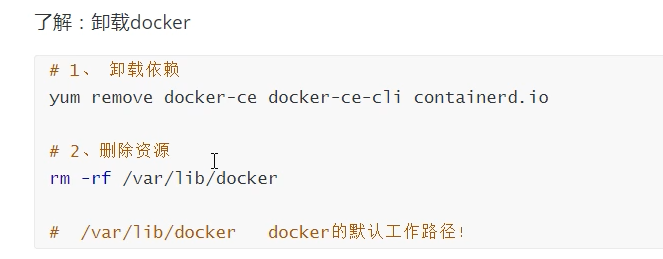

## Docker阿里云镜像加速

```javascript
sudo mkdir -p /etc/docker
sudo tee /etc/docker/daemon.json <<-'EOF'
{
  "registry-mirrors": ["https://20g53jxg.mirror.aliyuncs.com"]
}
EOF
sudo systemctl daemon-reload
sudo systemctl restart docker
```


Docker利用宿主机得操作系统

## Docker的常用命令

### 帮助命令

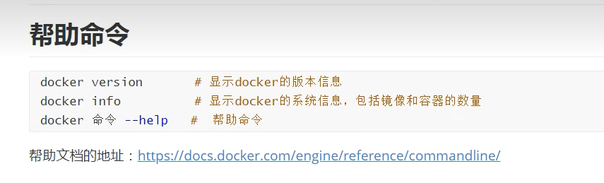

### 镜像命令

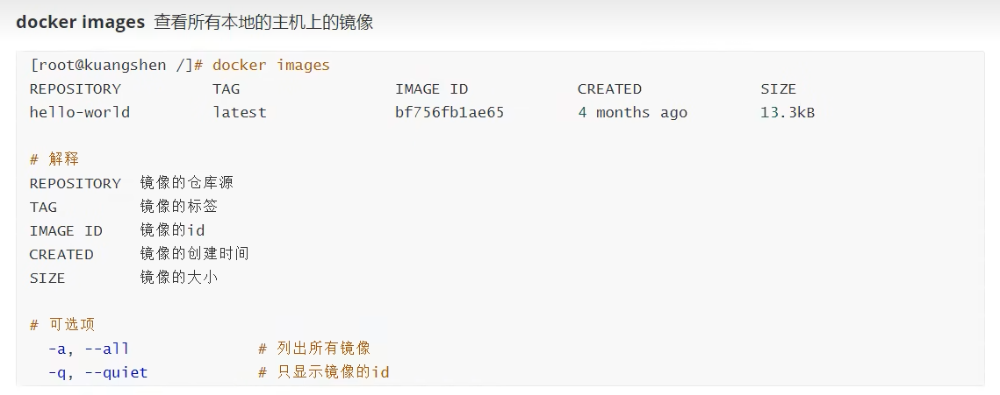

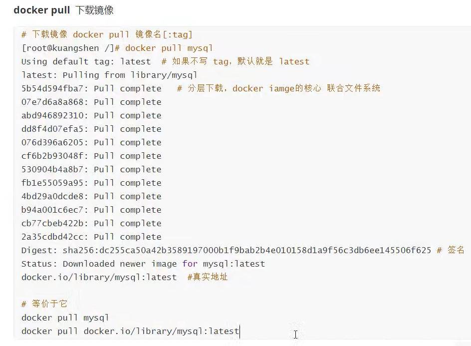

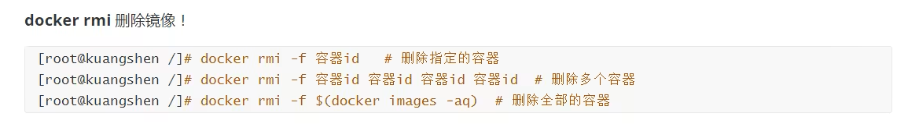

### 容器命令

#### 新建容器并启动

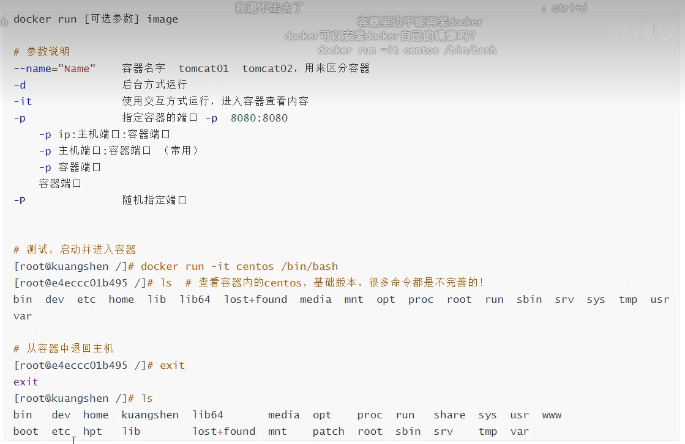

#### 列出所有的运行容器 

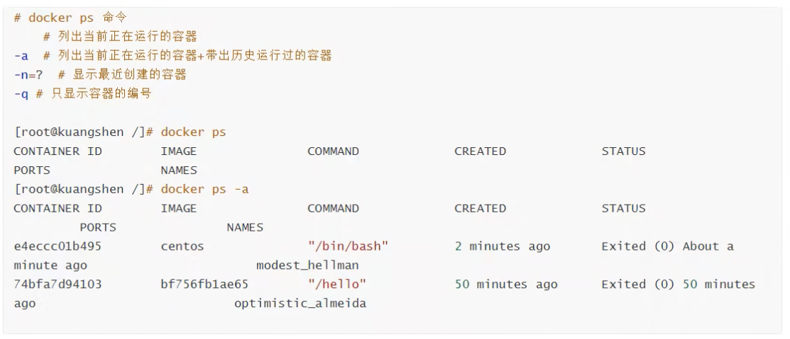

#### 退出容器

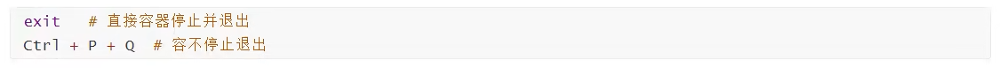

#### 删除容器

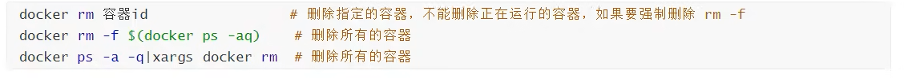

#### 启动和停止容器的操作 

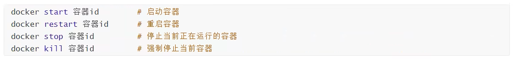

### 常用其它命令

#### 查看日志

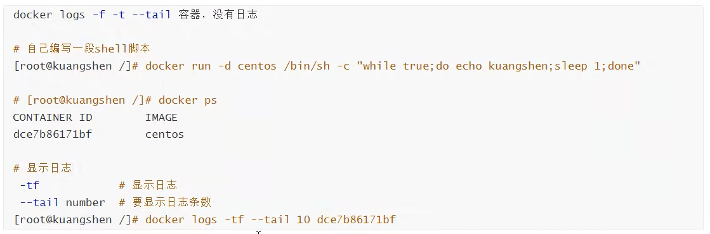

#### 查看容器中进程信息

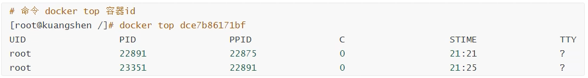

#### 查看镜像的元数据

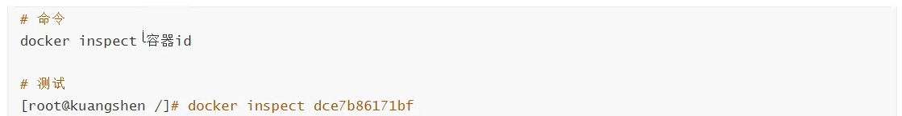

#### 进入当前正在运行的容器

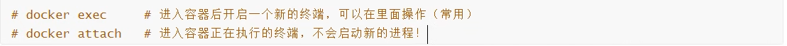

#### 从容器内拷贝到主机上


### Docker安装Nginx

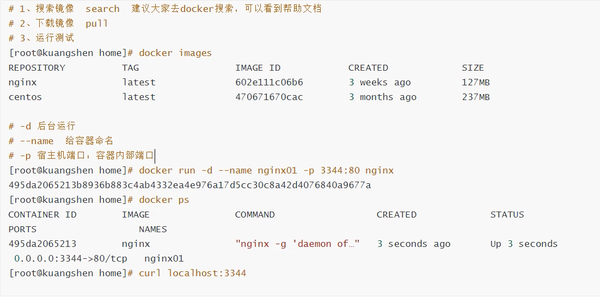

#### 端口暴露的概念 


### Dorcker安装Tomcat

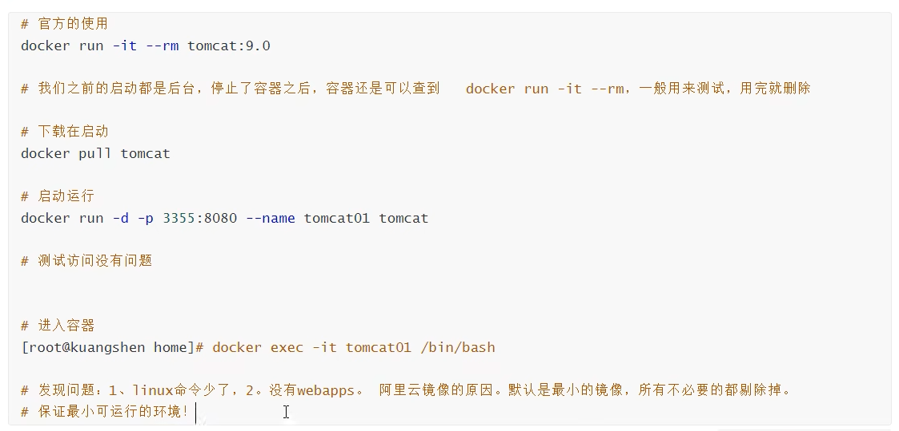

### Portainer可视化面板安装

```javascript
docker run -d -p 8088:9000 --restart=always -v /var/run/docker.sock:/var/run/docker.sock --privileged=true portainer/portainer
```

 ## Docker镜像加载原理

分层管理系统，支持对文件系统的修改的一层层的叠加，联合文件系统 

## Docker分层理解

Docker镜像都是只读的，当容器启动时，一个新的可写层被加载到镜像的顶部

这一层就是我们通常说的容器层，容器之下的都叫镜像层！

## commit镜像

