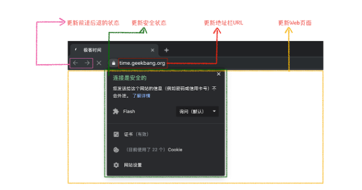
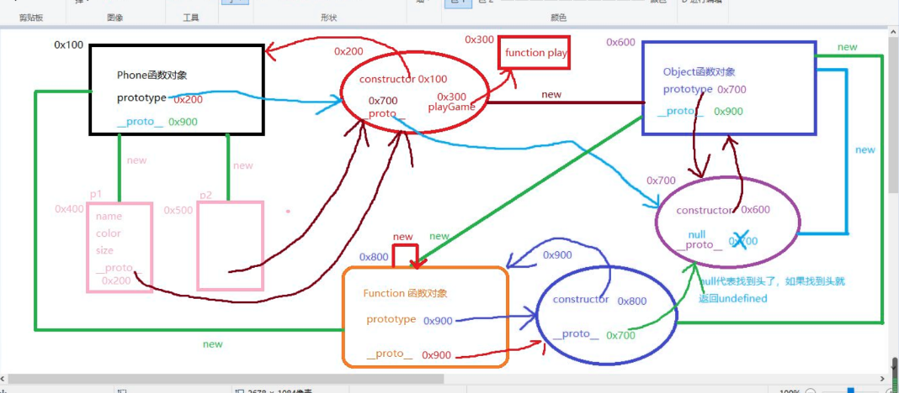

# 计算机组成原理

## CPU

cpu由运算器和控制器、存储单元组成，cpu决定电脑的计算能力

编译器将计算机语言编译成机器语言.exe文件，在内存中生成exe副本，cpu解释并执行程序内容，，CPU负责解释和运行最终转换成机器语言的内容

CPU和内存都是由许多晶体管组成的电子部件，可以把它比作计算机的心脏和大脑。它能够接收数据输入，执行指令并且处理相关信息。它与输入/输出（I / O）设备进行通信，这些设备向 CPU 发送数据和从 CPU 接收数据。从功能上来看，CPU的内容是由寄存器、控制器、运算器和时钟四部分组成的，各个部分之间通电信号来连通。

内存是与 CPU 进行沟通的桥梁。

计算机中所有程序的运行都在内存中得到运行的。内存一般又被称为主存，它的作用是存放CPU中的运算数据，以及与硬盘等外部存储设备交换的数据。

CPU会在计算机运转时，把需要运算的数据调到主存中进行运算。在运算完成之后，CPU将结果传送出来，主存的运行也决定了计算机的稳定运行。主存一般通过控制芯片与CPU相连，由可读写的元素构成，每个字节都有一个地址编号。CPU 通过地址从主存中读取数据和指令，也可以根据地址写入数据。

当计算机关机时，内存中的指令和数据也会被清除。
### CPU 指令执行过程

CPU 到底是怎么一条条的执行指令的呢？工作都可以分为5个阶段:取指令、指令译码、执行指令、访存取数、结果写回。

- 取指令阶段就是将内存中的指令读取到CPU中寄存器的过程，程序起存起用语存储下一条指令所在的地址；
- 在取指令完成后，立马进入指令译码阶段，在指令译码阶段，指令编码器按照预先的指令格式，对取回的指令进行拆分和解释，识别区分出不同的指令类别和各种获取操作数的方法；
- 执行指令阶段的任务是完成指令所规定的各种操作，具体实现指令的功能；

- 访问取数阶段的任务是：根据指令地址码，得到操作数在主存中的地址，并从主存中读取该操作数用于运算；

- 结果写回阶段作为最后一个阶段，把执行指令阶段的运行结果数据“写回”到某种存储形式：结果数据经常被写到CPU的内部寄存器中，以便被后续的指令快速地存取。

# 计算机操作系统

## 内存

内存是存放数据的硬件。程序执行前需要先放到内存中才能被CPU处理。

平时各种各样的软件都是存储在外存中的，电脑中的外存指的硬盘，硬盘是一种慢速的设备，而内存是一种超快速的设备。将需要运行的各种各样的软件都放到内存里，cpu直接从内存中存取这些设备。

内存分为内存地址和存储单元，每个内存地址对应一个存储单元。内存的存储大小要看是按字节还是按字编址，如果计算机**按字节编址**，每个存储单元大小为1字节（1B），如果字长为16位的计算机**按字编址**，则每个存储单元大小为1个字，每个字的大小为16个二进制位。

（进程由三个部分组成，程序段、数据端还有PCB），写的代码经过编译之后会形成对应的机器指令，而这些指令会放在内存中，cpu根据内存中程序段中一系列的指令来完成事情，

编译其实就是把高级语言编译成机器语言，编译程序会将用户的源代码编译成多个目标模块，，由链接程序将编译后形成的一组目标模块，以及所需库函数链接在一起，形成一整个的装入模块，再由装入程序将装入模块装入内存中运行。

内存不够时，系统将内存中某些进程暂时换出外存，把外存中某些已具备运行条件的进程换入内存（进程在内存与磁盘空间动态调度）。

（单一连续分配）

（固定分区分配）为了能在内存中装入多道程序，且这些程序不会相互干扰，于是就将内存分配成了多个分区，在每个分区中只装入一道作业。操作系统建立了一个分区说明表，来实现各个分区的分配和回收。每个表项包括分区的大小、起始地址、状态（是否已分配）。当用户要装入内存的时候，操作系统就会根据分区说明表，从其中找到一个满足大小未分配的分区，分配给该程序，然后修改状态为已分配。

（动态分区分配）在进程装入内存的时候，根据进程的大小动态的创建分区。使分区的大小正好适合进程的需要，这种分配方式会建立一个空闲分区表，表项 中包含分区号、 分区大小、分区 起始地址等信息。

在一开始给多个进程分配分区时，这些进程在内存中是紧挨着的，随着多次回收和分配，进程在内存中会变成离散分布，并可能出现大量外部碎片。动态分区不会产生内部碎片，因为每个分区大小都等于该进程所需内存大小。

此时可以用**紧凑**技术解决，将离散的进程变成在内存中紧密相连，**紧缩是指将所有进程占用的分区移动到一端使其紧凑的挨在一起，空闲区留在另一端**。

## 栈和堆的区别

cpu中有个核心模块叫ALU,专门用来做逻辑运算，如果算式比较复杂，没法一次性算出结果，会先计算，得到一个临时结果，这就需要将临时结果找个地方存放一下，这个玩意就叫寄存器。

为了降低cpu设计的复杂性以及成本，但同时又为了实现更复杂的计算，需要在内存中划分一个专门的区域用来存放临时数据。

栈和堆本质上都只是内存中的一片区域。从栈中取出数据的时候会先复制到cpu中的寄存器，出栈时这个数据还在堆栈里，但是已经被当作垃圾了。

在多线程环境下每一个线程都可以有他自己完全的独立的栈，但是他们共享堆。并行存取被堆控制而不是栈

**栈:**

1. 和堆一样存储在计算机 RAM 中。
2. 在栈上创建变量的时候会扩展，并且会自动回收。
3. 相比堆而言在栈上分配要快的多。
4. 用数据结构中的栈实现。
5. 存储局部数据，返回地址，用做参数传递。
6. 当用栈过多时可导致栈溢出（无穷次（大量的）的递归调用，或者大量的内存分配）。
7. 在栈上的数据可以直接访问（不是非要使用指针访问）。
8. 如果你在编译之前精确的知道你需要分配数据的大小并且不是太大的时候，可以使用栈。
9. 当你程序启动时决定栈的容量上限。

**堆：**

1. 和栈一样存储在计算机RAM。
2. 在堆上的变量必须要手动释放，不存在作用域的问题。数据可用 delete, delete[] 或者 free 来释放。
3. 相比在栈上分配内存要慢。
4. 通过程序按需分配。
5. 大量的分配和释放可造成内存碎片。
6. 在 C++ 中，在堆上创建数的据使用指针访问，用 new 或者 malloc 分配内存。
7. 如果申请的缓冲区过大的话，可能申请失败。
8. 在运行期间你不知道会需要多大的数据或者你需要分配大量的内存的时候，建议你使用堆。
9. 可能造成内存泄露。

进程的堆用于动态内存分配，即存放编译时大小未知的变量。和能够自动释放的栈不同，堆由用户进程自行管理，堆内的变量需要显式释放（free指令），否则该变量会一直存在于内存中，一直不释放会造成内存泄漏。

## 进程和线程

### 进程

早期计算机运行程序时只能一次运行一个程序，而且所有的系统资源（如CPU、内存和IO设备等）都由该程序单独使用，在该程序运行完之前其他程序无法运行，这就是单道程序设计。

**单道程序系统**的内存中除了操作系统这个内核程序之外，只有一个用户程序在内存中。其缺点时浪费资源且程序运行效率低。

**多道程序设计**允许内存中存放多道程序，它们在操作系统的调度下交替的在CPU上运行从而实现程序的并发，提高了程序执行的效率和资源利用率。

由于计算机中有多道程序，因此内存中保存了多个程序的程序段和数据段，操作系统如何才能找到各个程序程序段和数据段的位置？计算机里的设备分配给不同的程序，如何知道哪些设备被哪些程序占用？CPU运行一个程序A运行到一半就切换到另一个程序，程序A的CPU环境或者说它的运行状态和进度存放到哪里？

为此，操作系统为每一个要投入运行的程序设置了一个PCB（进程控制块）的结构来保存上述的程序控制信息。由此，也引出了进程的概念，多道程序设计中程序的并发执行就是通过进程实现的。

**进程是程序的一次执行过程，是系统进行资源分配和调度的单位**。

**一个进程实体（进程映像）由数据段、程序段和PCB三部分组成，它们离散的存储在内存中**。

PCB保存了所有操作系统管理和控制该进程所需的控制信息

进程分为几种状态

**运行状态**：当前进程已经分配到CPU的状态。处于这种状态的进程数不会大于计算机CPU的个数。

**就绪状态**：进程已具备运行条件和所有所需资源但唯独没有分配到CPU的状态，一旦CPU空闲，该进程就有机会获得CPU控制权进入运行状态。

**阻塞状态**：进程因等待某种事件而暂时不能运行的状态（如等待某个输入或输出、等待其他进程发来的信号等）。即使CPU空闲也无法获取其控制权。

**新建状态**：进程正在被创建，操作系统正为进程分配资源 和 初始化PCB的状态。

**终止状态**：进程完成自己任务正常终止或遇到错误被迫终止或人工干预终止时，操作系统正回收进程的资源，撤销PCB过程的状态。

### 线程

一个进程可能也需要同时处理多个任务，例如QQ软件可能要同时运行视频聊天的处理程序，也要运行传送文件程序。

为了满足这种需求，操作系统引入了线程，进程就不再是运行调度的最小单位，而只是资源分配的单位，线程变成了运行调度的最小单位（作为CPU的分配单元），同一个进程内的线程之间可以并发，不同进程之间（的线程）也可以并发

线程也有就绪、阻塞和运行这3种基本状态；

线程几乎不独立拥有系统资源，而是共享进程内的资源，但线程可以独立拥有CPU资源（一个进程内的多个线程可以在不同的CPU上并行运行证明线程可以拥有CPU资源）。

由于共享进程的内存空间，因此同一个进程中的线程间通信几乎无需系统干预；

切换同一进程的线程不会引起进程切换，开销很小；切换不同进程的线程会引起进程切换，开销大。

### 线程和进程关系

一个进程可以有多个线程，但至少要有一个线程；

一个线程只能在该进程的地址空间活动。

资源分配给进程，同一进程下的所有线程共享该进程所有资源。

同一进程中的多线程只能并发不能并行，因为他们只能运行在一个CPU上，用户程序在同一个进程时间片内切换多个线程

## 操作系统中进程和线程怎么通信

### 进程通信的方式

- **共享内存**：共享内存是在内存分配一块空间作为多个通信进程的共享存储区，**需要通信的多个进程把共享存储区附加到自己的地址空间**就可以对共享存储区读写，多个进程对共享空间的访问是互斥的，通过操作系统提供的互斥工具实现互斥，因此进程间共享需要系统介入，
- **管道通信：**管道是用于连接读写进程的一个共享文件（又称pipe文件），其本质是OS在内存中开辟的一个大小固定的缓冲区（通常为一个内存页大小，约为4K）。读写进程可以通过该共享文件传递数据。
  -  管道采用半双工通信，某一时间段内只能实现单向传输
  - 写进程写的时候，读进程不能读，必须写完之后，写进程释放管道，读进程才能从管道读
  - 数据以字符流的形式写入管道。管道写满时，写进程执行write()系统调用会阻塞进程，直到管道有空间写入；管道读空时，读进程执行read()系统调用会阻塞进程，直到管道有数据到来；
  - 如果没写满，则不允许读；如果没读空，就不允许写
  - 数据一旦被读出，就会被管道抛弃

# 计算机网络

## TCP三次握手和四次挥手

### 三次握手

一个文件通常会被拆分为很多数据包来进行传输，而数据包在传输过程中又有很大概率丢失或者出错。TCP的头部包含源端口号、目的端口号、序列号等，TCP是传输层协议。全双工通信，三次握手是建立连接时的准备工作，其实就是把自身的序列号发送给对方（**syn~ack~ack**），看对方能不能收到。最开始服务器监听某个端口，客户端发送syn包，可以建立连接之后服务端返回syn+ack包，客户端再发送ack包。

tcp连接会建立一个发送缓冲区，第一个自己的序列号是0，后面的每个字节的序列号就会增加1，

- 发送数据时就会从发送缓冲区取一部分数据组成发送报文，在tcp协议头中会附带序列号和长度。
- 接受端在收到数据后需要回复确认报文，确认报文ack=接受序列号+长度，也就是下一包（**客户端**）需要发送的起始序列号
- 发送端可以发送一次连续的多包数据。接收端只需要回复一次ack就可以了。
- 这样发送端可以把一系列的数据切割成碎片发送给服务端
- 服务端根据序号和长度在接受后重构出来完整的数据
- 数据包丢失，客户端可以重传

### 四次挥手

客户端和服务端都可以先发起关闭请求

- 客户端向服务端发起关闭请求，需要向服务端发送fin包，客户端禁止终止等待1状态， （第一次挥手）
- 服务端发送ack包，表示服务端进入了关闭等待状态
- 客户端进入终止等待2状态，（第二次挥手）
- 服务端发送fin包进入最后确认状态 （第三次挥手）
- 客户端收到之后回复ack包，进入超时等待状态（为了保证服务端收到ack包），经过超时时间之后关闭连接，而服务端收到ack包后立即关闭连接（第四次挥手）
- 超时等待是为了保证服务端已经收到ack包，假设客户端发送了最后一包ack包后就释放了连接，一旦ack包在网络中丢失，服务端将一直停留在最后确认状态。如果客户端发哦是那个最后一包ack包后，等待一段时间，这时服务端因为没有收到ack包，会 重发fin包。客户端会响应这个ack包并刷新超时时间。

### TCP为什么不能两次握手

因为TCP是全双工协议,需要通信双方同时通信.   所以再次基础上的双向确认最少需要3次, 实际上你100次确认都行,  但最少需要3次. 

两次握手只能保证客户端的序列号成功被服务端接收，而服务端是无法确认自己的序列号是否被客户端成功接收。所以是不行的

第一次发送syn包时，如果丢了，客户端发第二次，服务端返回syn+ack，此时建立连接，但是如果第一次恢复了。服务端就会误以为又要建立连接了。此时客户端认为时两次连接，而服务端任务时一次连接，造成状态不一致。

第三次握手，如果客户段没有收到最后的syn包，就不会认为连接成功

## UDP和TCP的对比

只要在网络层使用ip协议，就可以接入到使用tcp/ip体系的网络中，

真正通信的实体是主机中的应用进程互相通信。tcp/ip的运输层使用端口号来区分不同的应用进程

UDP： 

- 无连接，（在传输前不需要建立连接，通信双方可随时发送数据）
- 支持一对一，一对多和多对一、多对多交互通信（单播、广播、多播）
- 对应用层交付的报文直接打包
- 尽最大的努力交付，也就是不可靠；不使用流量控制和拥塞控制
- 首部开销小，仅8字节

TCP：

- 面向连接
- 每一条TCP连接只能有两个端点EP，只能是一对一通信
- 面向字节流
- 可靠传输、使用流量控制和拥塞控制
- 首部最小20字节，最大60字节。

## 输入⼀个URL发生了什么

### 1.用户输入

当用户开始在导航栏上面输入内容的时候。UI线程要进行一系列的解析来判定是将用户输入发送给搜索引擎还是直接请求你输入的站点资源。

- 如果是搜索内容，地址栏会使用浏览器默认的搜索引擎，来合成新的带搜索关键字的 URL。
- 如果判断输入内容符合 URL 规则，比如输入的是 time.geekbang.org，那么地址栏会根据规则，把这段内容加上协议，合成为完整的 URL。

当用户按下回车键的时候，UI线程会通知网络进程初始化一个网络请求来获取站点的内容。

这时候tab上的icon会展示一个提示资源正在加载中的旋转圈圈，而且网络进程会进行一系列诸如DNS寻址以及为请求建立TLS连接的操作。

- tips: 这时如果网络进程收到服务器的HTTP 301重定向响应，它就会告知UI线程进行重定向然后它会再次发起一个新的网络请求。

当用户输入关键字并键入回车之后，这意味着当前页面即将要被替换成新的页面，不过在这个流程继续之前，浏览器还给了当前页面一次执行 beforeunload 事件的机会，beforeunload 事件允许页面在退出之前执行一些数据清理操作，还可以询问用户是否要离开当前页面，比如当前页面可能有未提交完成的表单等情况，因此用户可以通过 beforeunload 事件来取消导航，让浏览器不再执行任何后续工作。

当浏览器刚开始加载一个地址之后，标签页上的图标便进入了加载状态（loading）。但此时图中页面显示的依然是之前打开的页面内容，并没立即替换为需要跳转的页面。因为需要等待提交文档阶段，页面内容才会被替换。

### 2.URL请求过程

接下来，便进入了页面资源请求过程。这时，浏览器主进程收到了地址栏的用户输入，

**因为浏览器是分为**

- **Browser(一个) - 浏览器进程**, 只有一个浏览器进程，负责浏览器的主体部分，包括导航栏，书签， 前进和后退按钮, 提供存储等功能
- **Network(一个) - 网络进程**, 主要负责页面的**网络资源加载**，之前是作为一个模块运行在浏览器进程里面的，直至最近才独立出来，成为一个单独的进程
- **GPU(一个) - 图像渲染进程**, 其实，Chrome 刚开始发布的时候是没有 GPU 进程的。而 GPU 的使用初衷是为了实现 3D CSS 的效果，只是随后网页、Chrome 的 UI 界面都选择采用 GPU 来绘制，这使得 GPU 成为浏览器普遍的需求。负责独立于其它进程的GPU任务。它之所以被独立为一个进程是因为它要处理来自于不同tab的渲染请求并把它在同一个界面上画出来。
- **Extensions(多个) - 扩展程序进程**
- **其他进程** - 工具进程，辅助框架等等

浏览器发起请求是需要调用网络进程的，因为进程之间的内容是需要相互隔离的，进程隔离是为保护操作系统中进程互不干扰的技术，每一个进程只能访问自己占有的数据，也就避免出现进程 A 写入数据到进程 B 的情况。正是因为进程之间的数据是严格隔离的，当需要跨进程通信的时候，浏览器进程会通过进程间通信机制（IPC）把 URL 请求发送至网络进程。

网络进程接收到 URL 请求后，会在这里发起真正的 URL 请求流程。

首先，网络进程会查找本地缓存是否缓存了该资源。如果有缓存资源，那么直接返回资源给浏览器进程；如果在缓存中没有查找到资源，那么直接进入网络请求流程。这请求前的第一步是要进行 DNS 解析，以获取请求域名的服务器 IP 地址。

**DNS解析**

因为ip地址是一种用于互联网上访问内容的虚拟地址，要想访问他人的网络就要记住ip地址才行，因为互联网不能通过域名直接访问，系统就会去hosts文件里，去查询这个域名对应的ip地址是什么。然后电脑会去访问这个ip。因为电脑不可能保存所有的域名和对应的ip地址。所以单独出来了一个服务器，让服务器去专门存储这个世界上**绝大多数域名**和ip的映射表，这个服务器就是dns服务器。

如果请求协议是 HTTPS，那么还需要建立 TLS 连接。

接下来就是利用 IP 地址和服务器建立 TCP 连接。连接建立之后，浏览器端会构建请求行、请求头等信息，并把和该域名相关的 Cookie 等数据附加到请求头中，然后向服务器发送构建的请求信息。

服务器接收到请求信息后，会根据请求信息生成响应数据（包括响应行、响应头和响应体等信息），并发给网络进程。等网络进程接收了响应行和响应头之后，就开始解析响应头的内容了。

在接收到服务器返回的响应头后，网络进程开始解析响应头，如果发现返回的状态码是 301 或者 302，那么说明服务器需要浏览器重定向到其他 URL。这时网络进程会从响应头的 Location 字段里面读取重定向的地址，然后再发起新的 HTTP 或者 HTTPS 请求，一切又重头开始了。

**在导航过程中，如果服务器响应行的状态码包含了 301、302 一类的跳转信息，浏览器会跳转到新的地址继续导航；如果响应行是 200，那么表示浏览器可以继续处理该请求。**

#### 响应数据处理

在处理了跳转信息之后，浏览器会根据 Content-Type 的值来决定如何显示响应体的内容。

不同 Content-Type 的后续处理流程也截然不同。如果 Content-Type 字段的值被浏览器判断为下载类型，那么该请求会被提交给浏览器的下载管理器，同时该 URL 请求的导航流程就此结束。但如果是 HTML，那么浏览器则会继续进行导航流程。由于 Chrome 的页面渲染是运行在渲染进程中的，所以接下来就需要准备渲染进程了。

网络进程在把内容交给渲染进程之前还会对内容做SafeBrowsing检查，如果请求的域名或者响应的内容和某个已知的病毒网站相匹配，网络进程会给用户展示一个警告的页面。除此之外，网络进程还会做CORB（Cross Origin Read Blocking）检查来确定那些敏感的跨站数据不会被发送至渲染进程。

##### 寻找一个渲染进程来绘制页面

在网络进程做完所有的检查后并且能够确定浏览器应该导航到该请求的站点，它就会告诉UI线程所有的数据都已经被准备好了。

UI线程在收到网络进程的确认后会为这个网站寻找一个渲染进程（renderer process）来渲染界面

因为网络请求的耗时可能会很长, 所以第二步中当UI线程发送URL链接给网络进程后，它其实已经知晓它们要被导航到哪个站点了。

所以在网络进程干活的时候，UI线程会主动地为这个网络请求启动一个渲染线程。如果一切顺利的话（没有重定向之类的东西出现），网络进程准备好数据后页面的渲染进程已经就准备好了，这就节省了新建渲染进程的时间。

不过如果发生诸如网站被重定向到不同站点的情况，刚刚那个渲染进程就不能被使用了，它会被摒弃，一个新的渲染进程会被启动。

##### 提交导航

到这一步的时候，数据和渲染进程都已经准备好了，浏览器进程（browser process）会通过IPC告诉渲染进程去提交本次导航（commit navigation）。

除此之外浏览器进程还会将刚刚接收到的响应数据流传递给对应的渲染进程让它继续接收到来的HTML数据。

一旦浏览器进程收到渲染线程的回复说导航已经被提交了（commit），导航这个过程就结束了，文档的加载阶段（document loading phase）会正式开始。

到了这个时候，导航栏会被更新，安全指示符和站点设置会展示新页面相关的站点信息。
当前tab的会话历史（session history）也会被更新，这样当你点击浏览器的前进和后退按钮也可以导航到刚刚导航完的页面。为了方便你在关闭了tab或窗口（window）的时候还可以恢复当前tab和会话（session）内容，当前的会话历史会被保存在磁盘上面。

##### 加载完成

当导航提交完成后，渲染进程开始着手加载资源以及渲染页面。

一旦渲染进程完成渲染（load），它会通过IPC告知浏览器进程，然后UI线程就会停止导航栏上旋转的圈圈。

#### 准备渲染进程

到这一步的时候，数据和渲染进程都已经准备好了，浏览器进程（browser process）会通过IPC告诉渲染进程去提交本次导航（commit navigation）。

除此之外浏览器进程还会将刚刚接收到的响应数据流传递给对应的渲染进程让它继续接收到来的HTML数据。

一旦浏览器进程收到渲染线程的回复说导航已经被提交了（commit），导航这个过程就结束了，文档的加载阶段（document loading phase）会正式开始。

到了这个时候，导航栏会被更新，安全指示符和站点设置会展示新页面相关的站点信息。当前tab的会话历史（session history）也会被更新，这样当你点击浏览器的前进和后退按钮也可以导航到刚刚导航完的页面。为了方便你在关闭了tab或窗口（window）的时候还可以恢复当前tab和会话（session）内容，当前的会话历史会被保存在磁盘上面。

默认情况下，Chrome 会为每个页面分配一个渲染进程，也就是说，每打开一个新页面就会配套创建一个新的渲染进程。但是，也有一些例外，在某些情况下，浏览器会让多个页面直接运行在同一个渲染进程中。

**那什么情况下多个页面会同时运行在一个渲染进程中呢？**

要解决这个问题，我们就需要先了解下什么是同一站点（same-site）。具体地讲，我们将“同一站点”定义为根域名（例如，geekbang.org）加上协议（例如，https:// 或者 http://），还包含了该根域名下的所有子域名和不同的端口，比如下面这三个：

```javascript
https://time.geekbang.org
https://www.geekbang.org
https://www.geekbang.org:8080
```

Chrome 的默认策略是，每个标签对应一个渲染进程。但如果从一个页面打开了另一个新页面，而新页面和当前页面属于同一站点的话，那么新页面会复用父页面的渲染进程。官方把这个默认策略叫 process-per-site-instance。

总结来说，打开一个新页面采用的渲染进程策略就是：

- 通常情况下，打开新的页面都会使用单独的渲染进程；
- 如果从 A 页面打开 B 页面，且 A 和 B 都属于同一站点的话，那么 B 页面复用 A 页面的渲染进程；如果是其他情况，浏览器进程则会为 B 创建一个新的渲染进程。

渲染进程准备好之后，还不能立即进入文档解析状态，因为此时的文档数据还在网络进程中，并没有提交给渲染进程，所以下一步就进入了提交文档阶段。

#### 提交文档

所谓提交文档，就是指浏览器进程将网络进程接收到的 HTML 数据提交给渲染进程，具体流程是这样的：

- 首先当浏览器进程接收到网络进程的响应头数据之后，便向渲染进程发起“提交文档”的消息；
- 渲染进程接收到“提交文档”的消息后，会和网络进程建立传输数据的“管道”；
- 等文档数据传输完成之后，渲染进程会返回“确认提交”的消息给浏览器进程；
- 浏览器进程在收到“确认提交”的消息后，会更新浏览器界面状态，包括了安全状态、地址栏的 URL、前进后退的历史状态，并更新 Web 页面。

其中，当渲染进程确认提交之后，更新内容如下图所示：



这也就解释了为什么在浏览器的地址栏里面输入了一个地址后，之前的页面没有立马消失，而是要加载一会儿才会更新页面。

#### 渲染阶段

一旦页面生成完成，渲染进程会发送一个消息给浏览器进程，浏览器接收到消息后，会停止标签图标上的加载动画。

渲染进程的主要任务是将HTML，CSS，以及JavaScript转变为我们可以进程交互的网页内容。

渲染进程里面有：一个主线程（main thread），几个工作线程（worker threads），一个合成线程（compositor thread）以及一个光栅线程（raster thread）

在渲染进程里面，主线程（main thread）处理了绝大多数你发送给用户的代码。如果你使用了web worker或者service worker，相关的代码将会由工作线程（worker thread）处理。合成（compositor）以及光栅（raster）线程运行在渲染进程里面用来高效流畅地渲染出页面内容。

##### 构建Dom

渲染进程在导航结束的时候会收到来自浏览器进程提交导航的消息，在这之后渲染进程就会开始接收HTML数据，同时主线程也会开始解析接收到的文本数据，并把它转化为一个DOM（Document Object Model）对象。

上面提到过，渲染进程在导航结束的时候会收到来自浏览器进程提交导航的消息，在这之后渲染进程就会开始接收HTML数据，同时主线程也会开始解析接收到的文本数据，并把它转化为一个DOM（Document Object Model）对象。

DOM对象既是浏览器对当前页面的内部表示，也是Web开发人员通过JavaScript与网页进行交互的数据结构以及API。

如何将HTML文档解析为DOM对象是在HTML标准中定义的。

不过在你的web开发生涯中，你可能从来没有遇到过浏览器在解析HTML的时候发生错误的情景。

这是因为浏览器对HTML的错误容忍度很大。举些例子：如果一个段落缺失了闭合p标签（</p>），这个页面还是会被当做为有效的HTML来处理；

```html
Hi! <b>I'm <i>Chrome</b>!</i> 
```

虽然有语法错误，不过浏览器会把它处理为

```html
Hi! <b>I'm <i>Chrome</i></b><i>!</i>。
```

##### 子资源加载

除了HTML文件，网站通常还会使用到一些诸如图片，CSS样式以及JavaScript脚本等子资源，这些文件会从缓存或者网络上获取。

主线程会按照在构建DOM树时遇到各个资源的循序一个接着一个地发起网络请求，为了提升效率，浏览器会同时运行“预加载扫描”程序。

如果在HTML文档里面存在诸如或者<link>这样的标签，预加载扫描程序会在HTML解析器里面找到对应要获取的资源，**并把这些要获取的资源告诉浏览器进程里面的网络线程**

##### JavaScript会阻塞HTML的解析过程

当HTML解析器碰到script标签的时候，它会停止HTML文档的解析从而转向JavaScript代码的加载，解析以及执行。

为什么要这样做呢？因为script标签中的JavaScript可能会使用诸如document.write()这样的代码改变文档流（document）的形状，从而使整个DOM树的结构发生根本性的改变。因为这个原因，HTML解析器不得不等JavaScript执行完成之后才能继续对HTML文档流的解析工作。

开发者可以通过很多方式告诉浏览器如何才能更加优雅地加载网页需要用到的资源。比如你可以为script标签添加一个async或者defer属性来使JavaScript脚本进行异步加载。<link rel="preload">资源预加载可以用来告诉浏览器这个资源在当前的导航肯定会被用到，你想要尽快加载这个资源。

##### 样式计算 CSS

主线程会解析页面的CSS从而确定每个DOM节点的计算样式（computed style）。计算样式是主线程根据CSS样式选择器（CSS selectors）计算出的每个DOM元素应该具备的具体样式，即使你的页面没有设置任何自定义的样式，每个DOM节点还是会有一个计算样式属性，这是因为每个浏览器都有自己的默认样式表。
因为这个样式表的存在，页面上的h1标签一定会比h2标签大，而且不同的标签会有不同的magin和padding

##### 布局 Layout

前面这些步骤完成之后，渲染进程就已经知道页面的具体文档结构以及每个节点拥有的样式信息了，可是这些信息还是不能最终确定页面的样子.

只知道网站的文档流以及每个节点的样式是远远不足以渲染出页面内容的，还需要通过布局（layout）来计算出每个节点的几何信息。

布局的具体过程是：

1. 主线程会遍历刚刚构建的DOM树，根据DOM节点的计算样式计算出一个布局树（layout tree）。
2. 布局树上每个节点会有它在页面上的x，y坐标以及盒子大小（bounding box sizes）的具体信息。布局树长得和先前构建的DOM树差不多，不同的是这颗树只有那些可见的（visible）节点信息。

举个例子，如果一个节点被设置为了display:none，这个节点就是不可见的就不会出现在布局树上面（visibility:hidden的节点会出现在布局树上面）。同样的，如果一个伪元素（pseudo class）节点有诸如p::before{content:"Hi!"}这样的内容，它会出现在布局上，而不存在于DOM树上。

##### 绘画

知道了DOM节点以及它的样式和布局其实还是不足以渲染出页面来的。

为什么呢？举个例子，假如你现在想对着一幅画画一幅一样的画，你已经知道了画布上每个元素的大小，形状以及位置，你还是得思考一下每个元素的绘画顺序，因为画布上的元素是会互相遮挡的（z-index）。

如果页面上的某些元素设置了z-index属性，绘制元素的顺序就会影响到页面的正确性。

##### 合成

浏览器已经知道了关于页面以下的信息：文档结构，元素的样式，元素的几何信息以及它们的绘画顺序。那么浏览器是如何利用这些信息来绘制出页面来的呢？将以上这些信息转化为显示器的像素的过程叫做光栅化（rasterizing）。

现代浏览器采用合成的方式, 来展示整个页面

合成是一种将页面分成若干层，然后分别对它们进行光栅化，最后在一个单独的线程 - 合成线程（compositor thread）里面合并成一个页面的技术。当用户滚动页面时，由于页面各个层都已经被光栅化了，浏览器需要做的只是合成一个新的帧来展示滚动后的效果罢了。页面的动画效果实现也是类似，将页面上的层进行移动并构建出一个新的帧即可。


## https原理

**对称加密**：通信双方都持有同一个密钥，通过这个密钥可以对信息进行加密和解密。

**非对称加密:**	

1. 某网站服务器拥有公钥A与对应的私钥A’；浏览器拥有公钥B与对应的私钥B’。
2. 浏览器把公钥B明文传输给服务器。
3. 服务器把公钥A明文给传输浏览器。
4. 之后浏览器向服务器传输的内容都用公钥A加密，服务器收到后用私钥A’解密。由于只有服务器拥有私钥A’，所以能保证这条数据的安全。
5. 同理，服务器向浏览器传输的内容都用公钥B加密，浏览器收到后用私钥B’解密。同上也可以保证这条数据的安全。

**浏览器无法确认收到的公钥是不是网站自己的，因为公钥本身是明文传输的**

要想确认浏览器收到的公钥一i的那个是该网站的公钥，就需要用到数字证书了。

网站在使用HTTPS前，需要向**CA机构**申领一份**数字证书**，数字证书里含有证书持有者信息、公钥信息等。服务器把证书传输给浏览器，浏览器从证书里获取公钥就行了，证书就如身份证，证明“该公钥对应该网站”。

为了防止证书被篡改。把证书原本的内容生成一份“签名”，比对证书内容和签名是否一致就能判别是否被篡改。这就是数字证书的“防伪技术”，这里的“签名”就叫`数字签名`。

**浏览器验证过程：**

1. 拿到证书，得到明文T，签名S。
2. 用CA机构的公钥对S解密（由于是浏览器信任的机构，所以浏览器保有它的公钥。详情见下文），得到S’。
3. 用证书里指明的hash算法对明文T进行hash得到T’。
4. 显然通过以上步骤，T’应当等于S‘，除非明文或签名被篡改。所以此时比较S’是否等于T’，等于则表明证书可信。

**怎么证明CA机构的公钥是可信的？**

操作系统、浏览器本身会预装一些它们信任的根证书，如果其中会有CA机构的根证书，这样就可以拿到它对应的可信公钥了。

### https握手过程

https在七层协议里面属于应用层，他基于tcp协议，所以，https握手的过程，一定先经过tcp的三次握手，tcp链接建立好之后，才进入https的对称密钥协商过程，对称密钥协商好之后，就开始正常的收发数据流程。

## 跨域

**浏览器的同源策略**

``计算机的本地和web是不同的层面，web运行在浏览器上，而被限制了直接进行本地数据的读写``

同源策略是对浏览器的一个重要的安全策略，是众多安全策略（系统安全、网络安全、页面安全）的一个，是web层面上的策略。它限制了非同源的请求，如果没有同源策略，不同源的数据和资源就能相互访问。

同源策略规定：**不同域**的**客户端脚本**在没明确**授权**的情况下，不能**读写**对方的**资源**

1. 不同域
  
    指的是协议、域名、端口
2. 客户端脚本

    客户端脚本主要是指JavaScript、ActionScript（flash）的脚本语言，以及JavaScript与AsctionScript都遵循的ECMAScript脚本标准
3. 授权

    一般情况下，看到这个词，我们往往会想到服务端对客户端访问的授权。客户端也存在授权现象，比如:HTML5新标准中提到关于**AJAX**跨域访问的情况，默认情况下是不允许跨域访问的，只有目标站点明确返回HTTP响应头：**Access-Control-Allow-origin**
    
 4. 读写权限

    Web 上的资源有很多，有的只有读权限，有的同时拥有读和写的权限。比如:HTTP请求头里的Referer(表示请求来源）只可读，而document.cookie则具备读写权限。这样的区分也是为了安全上的考虑。

 5. 资源

    只要是数据就可以认为是资源。同源策略里面的资源指的是web客户端的资源，包括HTTP消息头、整个DOM树、浏览器存储等。客户端安全威胁都是围绕这些资源进行的。

在同一个域内，客户端脚本可以任意读写同源内的资源，前提是这个资源本身是可读可写的。

## 跨域时如何处理cookie

前端请求时在`request`对象中配置`"withCredentials": true`；

服务端在`response`的`header`中配置`"Access-Control-Allow-Origin", "http://xxx:${port}"`;

服务端在`response`的`header`中配置`"Access-Control-Allow-Credentials", "true"`

## TCP有哪些手段保证可靠交付

- 将数据截断为合理的长度。

应用数据被分割成TCP认为最适合发送的数据块。这和UDP完全不同，应用程序产生的数据报长度将保持不变。

- 超时重发

当TCP发出一个段后，它启动一个定时器，等待目的端确认收到这个报文段。如果不能及时收到确认消息，将重发这个报文段。
对于收到的请求，给出确认响应
当TCP收到发自TCP连接另一端的数据，它将发送一个确认。这个确认不是立即发送，通常将推迟几分之一秒。(之所以推迟，可能是要对包做完整校验)

- 校验出包有错，丢弃报文段，不给出响应，TCP发送数据端，超时时会重发数据

TCP将保持它首部和数据的检验和。这是一个端到端的检验和，目的是检测数据在传输过程中的任何变化。 如果收到段的检验和有差错，TCP将丢弃这个报文段和不确认收到此报文段。 （希望发端超时并重发）

- 对失序数据进行重新排序，然后才交给应用层

既然TCP报文段作为IP数据报来传输，而IP数据报的到达可能会失序，因此TCP报文段的到达也可能会失序。 如果必要，TCP将对收到的数据进行重新排序，将收到的数据以正确的顺序交给应用层。

- 对于重复数据，能够丢弃重复数据

既然IP数据报会发生重复，TCP的接收端必须丢弃重复的数据。

- TCP还能提供流量控制。

## 如何应对流量劫持

- DNS劫持

手动设置一些权威的DNS服务器，比如8.8.8.8，4.4.4.4，设置权限，让DNS和host文件无法被更改。

- http劫持

**CSP** 原本是为了和 XSS 对抗而产生的一种技术方案，其原理是在 HTML 加载的时候，指定每种资源的 URL 白名单规则，防止 XSS 的运行和数据外送。但如果巧妙利用规则，也可以让所有的资源强制走 https ，这样就可以降低流量劫持的可能性。

**SRI** 是专门用来校验资源的一种方案，它读取资源标签中的`integrity`属性，将其中的信息摘要值，和资源实际的信息摘要值进行对比，如果发现无法匹配，那么浏览器就会拒绝执行资源。对于`script`标签来说，就是拒绝执行其中的代码，对于 CSS 来说则是不加载其中的样式

- https劫持

- cdn流量劫持

## Http2的多路复用

多路复用，主要就是解决HTTP1.1的队头阻塞问题，可以交错进行请求和响应，而且请求和响应之间不影响。HTTP并不是单个文件直接响应过去，而是请求和响应报文都被划分为各个不同的帧，帧分为首部帧和数据帧。帧有个流标识符，即使没有顺序，按照流标识符就可以按照顺序进行组合。还可以设置权重（优先级）

## HTTP/1.1，HTTP/2和HTTP/3的区别

浏览器会限制同一个连接的请求数，其实是限制每个域的连接数。chrome默认同时有六个连接，会造成阻塞，网站就可以弄出多个域，使得浏览器可以同时下载这些资源。比如说有五个图片，就可以同时设置五个图片域名，这样浏览器就可以同时进行下载了。（域名分片）

HTTP1.1默认持久连接， HTTP1.1有个叫做管线化的技术，意思是单个连接可以发送多个请求。响应的时候必须按照发送的顺序接收。

TCP除了三次握手的固定开销以外，还会有个**慢启动**。为了拥塞控制，也就是为了不造成网络堵塞。**一开始只会发送较小量的TCP数据段，到了后面再慢慢增加，因此会导致新访问网页刷新速度较慢。**

HTTP1.1

- HTTP本身就会产生各种开销，请求和响应都是有首部的，而且大部分首部都是重复的。发完一次，大部分还得重发。首部明文传输，报文压缩，首部不压缩

HTTP2

- 多路复用，主要就是解决HTTP1.1的队头阻塞问题，可以交错进行请求和响应，而且请求和响应之间不影响。HTTP并不是单个文件直接响应过去，而是请求和响应报文都被划分为各个不同的帧，帧分为首部帧和数据帧。帧有个流标识符，即使没有顺序，按照流标识符就可以按照顺序进行组合。还可以设置权重（优先级）。

- 首部，报文都压缩

- HTTP2也只是在应用层进行传输，实际上还是得要到传输层，依靠TCP来进行传输，会造成TCP层面的队头阻塞
- TCP协议是由操作系统内核实现的

HTTP3

- HTTP3把TCP和TLS的过程**整合**到一起了，直接减少了来回带来的开销，如果是恢复的会话，还可以不用握手，实现0-RTT。
- 但是TCP和TLS是两个协议，实际上为了让HTTP3能进行部署，只能选择传输层的UDP协议了，并且在UDP协议上新增一个协议，也就是QUIC，这个QUIC整合了整个TCP和TLS。使得HTTP3默认就是要使用加密传输的。
- QUIC也是加了流标识符，但是HTTP3的应用层上并没有所谓帧的概念，把数据帧移到了QUIC里面，相当于在传输层就有了数据帧，从源头解决了队头阻塞的问题，实现多路复用，QUIC帧又再次被封装为QUIC数据包，QUIC数据包会加上一些信息，这里最重要的是加了**Connection ID**连接ID，如果网络发生全面改变，比如从wifi转到4G网络，虽然IP地址发生改变，但是因为客户端和服务端都协商好了连接ID，因此可以用连接ID来识别为同一个连接，避免再次握手，这是QUIC快的原因，而且QUIC数据包会把里面的QUIC帧给加密了。QUIC数据包会被UDP封装成数据段，UDP就会加上端口号，当选择HTTP3来进行通信的时候，QUIC就会像TCP那样开启连接。

## TCP的发送缓存和接收缓存分别用于存放什么？

发送缓存用于存放：

- 发送应用程序传送给发送方TCP准备发送的数据；
- 已发送出但尚未收到确认的数据。

接收缓存用于存放：

- 按序到达的但尚未被接收应用程序读取的数据；
- 未按序到达的数据。

## TCP如何实现流量控制？

如果发送者发送数据过快，接收者来不及接收，那么就会有分组丢失。为了避免分组丢失，控制发送者的发送速度，使得接收者来得及接收，这就是流量控制。流量控制根本目的是防止分组丢失，它是构成TCP可靠性的一方面。

TCP通过滑动窗口协议（连续ARQ协议）实现流量控制，滑动窗口协议既保证了分组无差错、有序接收，也实现了流量控。即发送方的发送窗口不能超过接收方给出的接收窗口的数值，使得发送方的发送速率不要太快，要让接收方来得及接收。

但是出现的问题：接收方向发送方发送了零窗口的报文段后不久，接收方的接收缓存又有了一些存储空间，于是向发送方返回非零窗口的报文段，但这个报文段在传送过程中丢失了，双方都在等待，形成死锁，如何解决？

想要解决这个问题，可以：设置一个持续计时器，发送方只要收到零窗口通知，就启动持续计时器；若持续计时器设置的时间到期，就发送一个零窗口探测的报文段，仅携带1字节的数据，而接收方就在确认这个探测报文段时给出了现在的窗口值；如果此时窗口依然是零，那么发送方重置持续计时器。

##  TCP如何实现拥塞控制？

TCP进行拥塞控制的算法共有四种：慢开始、拥塞避免、快重传、快恢复。

发送方维持拥塞窗口的原则是：只要网络没有出现拥塞，拥塞窗口就可以再增大一些，以便发送更多的分组，从而提高网络利用率；但是只要网络出现拥塞或可能出现拥塞，则必须把拥塞窗口减小，以便缓解网络拥塞。

发送方判断网络拥塞的依据是：出现了超时

# Vue

数据驱动：不用用户去操作dom，有虚拟dom的提出，有响应式原理。在数据变化的同时，异步的更新视图。

## Vue SSR原理

### 服务端渲染的优缺点

**服务端渲染的优点：**

- 更好的SEO:因为SPA页面的内容是通过Ajax获取，而搜索引擎爬取工具并不会等待Ajax异步完成后再抓取页面内容，所以在SPA中是抓取不到页面通过Ajax获取到的内容；
- 而SSR是直接由服务端返回已经渲染好的页面（数据已经包含在页面中），所以搜索引擎爬取工具可以抓取渲染好的页面：更快的内容到达时间（首屏加载更快）：
- SPA会等待所有Vue编译后的js文件都下载完成后，才开始进行页面的渲染，文件下载等需要一定的时间等，所以首屏渲染需要一定的时间；SSR直接由服务端渲染好页面直接返回显示，无需等待下载js文件及再去渲染等，所以SSR有更快的内容到达时间：

**服务端渲染的缺点**：

- 更多的开发条件限制：例如**服务端渲染只支持beforCreate和created两个钩子函数**，这会导致一些外部展库需要特殊处理，才能在服务端渲染应用程序中运行；
- 并且与可以部署在任何静态文件服务器上的完全静态单页面应用程序SPA不同，服务端渲染应用程序，需要处于Node.js server运行环境；

## Vue3原理

### vue3原理面试题

#### Vue2和Vue3有哪些新特性和区别

- ts重构
- 双向绑定
- 虚拟dom
  - vue3新策略将vdom更新性能和模板大小解耦，变为动态节点的数量相关，整体比vue2性能提升2-5倍
  - vue2中dom性能瓶颈
    - 虽然vue能保证触发更新的组件最小化，但是单个组件部分变化需要遍历该组件的整个vdom树
    - 传统vdom性能跟模板大小成正相关，跟动态节点的数量无关
  - vue3优化工作
    - 将AST基于动态节点指令（if，for，slot）切割为嵌套的区块，更新一个块内节点的时候，就不需要递归遍历树，跟踪平面的数组了。执行开销小了一个量级
    - 使用编译器compiler主动检测模板中的静态节点，将其提升到render函数之外，避免每次在渲染时重新创建对象，提高内存使用率、减少垃圾回收频率
    - 给元素一个追踪标记，无论层级嵌套多深，更新时可以直接遍历动态节点

- Tree-shaking

vue2运行时大小在22.5kb，vue3是13.5kb

#### vue2和vue3的双向数据绑定的对比

- Object..defineProperty的缺点
  - 不能监听数组：因为数组没有getter和setter,因为数组长度不确定，如果太长性能负担太大
  - 只能监听属性，而不是整个对象，需要遍历循环属性
  - 只能监听属性变化，不能监听属性的删减
- proxy的好处
  - 可以监听数组
  - 监听整个对象不是属性
  - 13种拦截方法，强大很多
  - 返回新对象而不是直接修改原对象，更符合immutable;
  - **缺点**： 兼容性不好，而且无法用polyfill磨平

#### Vue3做了哪些优化

- **Proxy响应式**
  - `Vue3` 中实现响应式的 `Proxy` 会比 `vue2` 中的 `Object.defineProperty` 快
  - `defineProperty` 是一次性递归完成；而 `Proxy` 是什么时候 `get` ，什么时候再**深度递归**
  - 在 `vue2` 中， `defineProperty` 是**无法新增/删除属性**的，需要配合 `Vue.set` 和 `Vue.delete` 来使用，而在 `Vue3` 中， `Proxy` **可以新增和删除属性**，无需进行特殊处理
  - 在 `vue2` 中，监听数组变化是需要进行特殊处理，且**只能一次性深度递归完成**。而在 `vue3` 中，可以**监听数组变化**，并且是**什么时候get什么时候再递归**，获取不到的深层，不会触发响应式
- **PatchFlag**
  - 在编译模板时，使用**动态节点**做标记；
  - 标记，分为**不同的类型**，如`TEXT` 、 `PROPS` ；有的是直接获取 `text` ，有的则是修改 `props` ；
  - `diff` 算法比较时，可以区分**静态节点**，以及**不同类型的动态节点**。此处要注意的是， `patchflag` 并不是专门对 `diff` 算法做优化，而是在输入上做一些变更和做一些标记，从而达到对 `diff` 算法的优化。
  - 使用静态提升时，所有静态节点被提升到`render`方法外，这表明这些节点只会在初始化中创建一次，在更新时进行复用
- **hoistStatic**
  - 将静态节点的定义，提升到父作用域上，并缓存起来；
  - 多个**相邻的静态节点**，会被合并起来；
- **cacheHandler**
  - `vue3` 在处理点击事件时，会进行缓存
- **SSR优化**
  - 静态节点会直接进行输出，绕过了 `vdom` ；
  - 如果是**动态节点**，还是需要进行**动态渲染**
- **tree-shaking**
  - 编译时，根据不同的情况，引入不同的 `API`

#### VNode的对比

中间引入的东西越多反而会让性能不如直接操作原生。本质上vnode这个东西就不是用来提高性能的，它的提出更多是为了对原生dom系统做一个抽象表达，方便跨平台处理，比如在SSR时，宿主环境是node，根本就没有dom的概念，但你又得表述dom的东西，那vnode 抽象出来的一套模拟dom系统就很有用了。抽象层在跨平台设计中是很实用有效的架构设计，既然我想要的东西你没有，那我去自己模拟一套就好了

3.0版本提出了一个新的概念 —— **Block Tree**，block顾名思义就是块状区域树。那么他2又是用来解决什么问题的呢？为了解决2.0版本一直被人诟病的diff低效的问题，2.0的diff过程中有一部分没必要的性能浪费的，比如想要比较新旧两颗vnode tree，就得遍历整棵树比较一遍，但实际上我们只关注那些变化了的内容，只去对动态内容进行diff就可以了，而block就是为此而生

在3.0中两颗虚拟dom树的diff粒度不再是组件模版级别，而是做到了动态化靶向操作，降低到了动态内容粒度。block就是把vnode tree按照模版结构定义和动态内容组成划分成了一个个的块状子区域，每个block负责管控自己区域内的状态，同式block之间也是有父子关系的，因此会形成树状结构，就是所谓的Block Tree

每个block下会有一个dynamicChildren，在vnode / block创建阶段会将当前block子区域内的动态内容收集并填充到dynamicChildren，那么整个render函数执行完毕时，每个block下的动态子代内容就都被收集到各自的dynamicChildren中，在正式diff时就不再需要重新遍历整棵树，只需要比对同级block下dynamicChildren，无差别的深度遍历升级为靶向的同级比较，这就做到了只关注动态内容

#### 双向数据绑定和MVVM[参考](https://juejin.cn/post/7114626506239787039#heading-3)

通过数据监听和数据绑定来实现MVVM的模型，其中响应式就是双向绑定。vue是mvvm框架，用户不能直接操作dom，而是直接操作数据，当数据改变的时候，vue内部监听数据变化然后更新视图。同样，用户在视图上的操作（事件）也会反过来改变数据。

**MVVM的原理：**

- 实现一个数据监听器Observer，能对数据对象的所有属性进行监听，如有变动能拿到最新值并通知订阅者
- 实现一个指令解析器Compile，对每个元素节点指令进行扫描解析，根据指令模板替换数据以及绑定相应的更新函数
- 实现一个Watcher，作为连接监听器Observer和解析器Compile的桥梁，能订阅并且收到每个属性变动的通知，执行指令绑定的相应回调函数，从而更新视图

监听数据的变化，使得用户在设置数据时，可以通知vue内部进行视图更新。

#### 生命周期

#### SSR

#### keep-alive

### [响应式系统](https://zhuanlan.zhihu.com/p/306540786)

**Proxy** 对象用于创建一个对象的代理，从而实现基本操作的拦截（get、set）和自定义（如属性查找、赋值、枚举、函数调用等）。

**反射机制是为了获取或修改程序运行时信息**，ES6将很多object方法统一收容到Reflect上，对外暴露统一的访问渠道。

- vue3通过Proxy拦截对象的读取、设置等操作。但是不会直接操作源对象，而是通过对象的代理对象，通过paroxy和reflect来监听数据的改变
- 当数据读取时，通过track函数触发依赖的收集；当数据被设置时，通过trigger函数去派发更新，
- Reflect的作用主要是解决this的绑定问题，将this绑定到proxy对象而不是目标对象

使用computed、watch、视图渲染函数等时，可以看作声明了一个依赖响应式数据的回调，这个回调会被传入effect（副作用函数），当依赖的数据改变时，回调被重新调用，从而computed等得到更新

### [渲染系统](https://zhuanlan.zhihu.com/p/306594318)

### [编译系统](https://zhuanlan.zhihu.com/p/340995991) 

## Vuex原理

- 多个组件依赖于同一状态时，对于多层[嵌套](https://so.csdn.net/so/search?q=嵌套&spm=1001.2101.3001.7020)的组件的传参将会非常繁琐，并且对于兄弟组件间的状态传递无能为力
- 跨组件传参的行为需要变更同一状态。以往采用父子组件直接引用或者通过事件来变更和同步状态的多份拷贝。以上的这些模式非常脆弱，通常会导
  致无法维护的代码。

### 为什么要设计出 Mutation 和 Action 这两个东西

区分 actions 和 mutations 并不是为了解决竞态问题，而是为了能用 devtools 追踪状态变化xu

说到底只是一个函数，你在里面想干嘛都可以，只要最后触发 mutations 就行

## VueRouter原理

### 实现原理

vue-router可以通过mode参数设置为三种模式：hash模式、history模式、abstracti模式。

- hash模式默认是hash模式，基于浏览器history api,使用window.addEventListener(hashchange',callback,false)对浏览器地址进行监听。当调用push时，把新路由添加到浏览器访问历史的栈顶。使用replacel时，把浏览器访问历史的栈顶路由替换成新路由hash的值等于ul中#及其以后的内容。浏览器是根据hash值的变化，将页面加载到相应的DOM位置。锚点变化只是浏览器的行为，每次锚点变化后依然会在浏览器中留下一条历史记录，可以通过浏览器的后退按钮回到上一个位置
- History history模式，基于浏览器history api,使用window.onpopstate对浏览器地址进行监听。对浏览器history api中的oushState（）、replaceState(O进行封装，当方法调用，会对浏览器的历史栈进行修改。从而实现URL的跳转而无需加载页面但是他的问题在于当刷新页面的时候会走后端路由，所以需要服务端的辅助来兜底避免URL无法匹配到资源时能返回页面
- abstract不涉及和浏览器地址的相关记录。流程跟hash模式一样，通过数组维护模拟浏览器的历史记录栈服务端下使用。使用一个不依赖于浏览器的浏览器历史虚拟管理后台
- 总结hash模式和history模式都是通过window.addEvevtListenter（）方法监听hashchange和oopState进行相应路由的操作。可以通过back、foward、go等方法访问浏览器的历史记录栈，进行各种跳转。而abstract模式是自己维护一个模拟的浏览器历史记录栈的数组

### 核心步骤

- 给所有组件定义属性
- 创建路由表
- 格式化路由参数
- 监控路径变化
- 路由表和路径匹配逻辑
- 完成匹配更新视图

**路径变化监听**
通过mixin在每个组件的beforeCreate生命周期中给每个组件添加$route和$router属性

- 创建两个全局组件router-.link和router-.view
- 通过区分路由类型是history或者是hash来分别进行处理
- hash模式的话就通过window.location.hash='path'来进行切换，切换不刷新页面，并且通过window.onhashchange:来监听变化然后通过router-.view组件
  去渲染对应的组件内容
- history模式的话是通过window.history.pushState(,null,path)实现添加路径的，但是这样会强制刷新，可以由服务端解决刷新问题。然后通过
  ==window.onpopstate==事件来监听浏览器变化（优先使用）

**匹配并渲染**

- 将路由表中的路由提取出一个数组和一个映射map
- 拿到用户输入的路径通过创建好的匹配器去做匹配

### hash和history的实现原理 

#### hash的实现原理

基于localtion.hash来实现的，

hash路由模式的实现主要是基于下面几个特性：

- URL中hash值只是客户端的一种状态，也就是说当向服务器端发出请求时，hash部分不会被发送：hash值的改变，都会在浏览器的访问历史中增加一个记录。因此我们能通过浏览器的回退、前进按钮控制hash的切换
- 可以通过a标签，并设置href属性，当用户点击这个标签后，URL的hash值会发生改变；或者使用JavaScript来对loaction.hash进行赋值，改变URL的hash值
- 我们可以使用hashchange事件来监听hash值的变化，从而对页面进行跳转（渲染）

#### history的实现原理 

HTML5提供了History API来实现URL的变化。其中做最主要的API有以下两个：history.pushState（）和history.replaceState（）。这两个API可以在不进行刷新的情况下，操作浏览器的历史纪录。唯一不同的是，前者是新增一个历史记录，后者是直接替换当前的历史记录

- pushState和repalceState两个API来操作实现URL的变化
- 我们可以使用popstate事件来监听url的变化，从而对页面进行跳转（渲染）
- history.pushState(0或history.replaceState0不会触发popstate事件，这时我们需要手动触发页面跳转（渲染）

### 对于 History 路由而言，你觉得在服务端是如何做路由分发的呢

## vue面试题

### 一个for循环中改变当前组件依赖的数据，改变一万次，会有什么效果？(批量更新和 nextTick 原理）

 vue 采用的**异步更新策略**，当监听到数据发生变化的时候不会立即去更新DOM，而是开启一个任务队列，并缓存在同一事件循环中发生的所有数据变更;
 这种做法带来的好处就是可以将多次数据更新合并成一次，减少操作DOM的次数，如果不采用这种方法，假设数据改变100次就要去更新100次DOM，而频繁的DOM更新是很耗性能的；

**nextTick**将传入的回调函数包装成异步任务，异步任务又分微任务和宏任务，为了尽快执行所以优先选择微任务

**Vue 在内部对异步队列尝试使用原生的 Promise.then、MutationObserver 和 setImmediate，如果执行环境不支持，则会采用 setTimeout(fn, 0) 代替。**

### vue组件销毁时，所有自定义事件和原生事件都会跟着解绑吗

只有使用Vue事件绑定语法绑定的事件会被移除，再**addEventListener**上添加的事件不会被移除

### vuex是怎么做到将数据注入到每一个组件里的?

### 父子组件的生命周期

- 加载渲染过程

父beforeMount->子beforeCreate--子created--子beforeMount--子mounted--父mounted

- 子组件更新过程

父beforeUpdate--子beforeUpdate--子updated--父updated

- 销毁过程

父beforeDestroy--子beforeDestroy--子destroyed--父destroyed

### Virtual DOM 真的比操作原生 DOM 快吗？

没有任何框架可以比纯手动的优化 DOM 操作更快

React 从来没有说过 “React 比原生操作 DOM 快”，如果大数量只有一行数据变了，这也要重新渲染dom的化，显然就会造成大量的性能浪费

 Virtual DOM 真正的价值从来都不是性能，而是它 1) 为函数式的 UI 编程方式打开了大门；2) 可以渲染到 DOM 以外的 backend，比如 ReactNative。

# JavaScript

## 执行上下文与作用域链

执行栈是一个保存执行上下文的地方，执行上下文其实就是函数执行的准备工作，包括了声明提升，确定作用域链、确定this执行的步骤

**在 ES6 之前，JavaScript 只有两种作用域**： **全局变量** 与 **函数内的局部变量**。

每个执行上下文的变量环境中，都包含了一个外部引用，用来指向外部的执行上下文，我们把这个外部引用称为outer。当一段代码使用了一个变量时，JavaScript 引擎首先会在“当前的执行上下文”中查找该变量， 比如上面那段代码在查找 myName 变量时，如果在当前的变量环境中没有查找到，那么 JavaScript 引擎会继续在 outer 所指向的执行上下文中查找，**使用 var 关键字声明的变量不具备块级作用域的特性，它在 {} 外依然能被访问到**。

ES6规定，var 命令和 function 命令声明的全局变量，依旧是顶层对象的属性，但 let命令、const命令、class命令声明的全局变量，不属于顶层对象的属性。当执行到代码块时，如果代码块中有 let 或者 const 声明的变量，那么变量就会存放到该函数的词法环境中,let和const声明的全局变量是放在script中

 **JavaScript 作用域链是由词法作用域决定的，词法作用域是代码阶段就决定好的，和函数是怎么调用的没有关系。**

```` javascript
function bar() {
    var myName = " 极客世界 ";
    let test1 = 100;
    if (1) {
      let myName = "Chrome 浏览器 ";
      console.log(test);
    }
  }
  function foo() {
    var myName = " 极客邦 ";
    let test = 2;
    {
      let test = 3;
      bar();
    }
  }
  var myName = " 极客时间 ";
  let myAge = 10;
  let test = 1;
  foo();
// 输出 1
````

**this**

- 在全局环境中调用一个函数，函数内部的 this 指向的是全局变量 window。

- 通过一个对象来调用其内部的一个方法，该方法的执行上下文中的 this 指向对象本身。

```` javascript
var bar = {
    myName: "time.geekbang.com",
    printName: function () {
      console.log(myName);
      console.log(this)
    },
  };
  function foo() {
    let myName = " 极客时间 ";
    return bar.printName;
  }
  let myName = " 极客邦 ";
  let _printName = foo();
  _printName();
  bar.printName();

// 极客邦 
// Window {window: Window, self: Window, document: document, name: '', location: Location, …}
// 极客邦 
// {myName: 'time.geekbang.com', printName: ƒ}
````


## 原型



只有函数对象才有prototype**‘属性’**，原型对象上才有constructor属性，实例化对象才有__proto__属性

* new做了什么（资源共享、节约内存）

  * 开辟新的空间

* 修改this指向到这个空间

  * 执行构造函数

* 即使没有出现严格模式指令，class声明体中的所有代码也默认处于严格模式。

## 闭包

[JavaScript 的静态作用域链与“动态”闭包链](https://juejin.cn/post/6957913856488243237)

要再创建个对象，要把子函数内引用（refer）的父作用域的变量打包里来，给子函数打包带走。

会在父函数销毁时，把子函数引用到的变量打成 Closure 包放到函数的 [[Scopes]] 上，让它计算父函数销毁了也随时随地能访问外部环境。打包的只是环境内没有的，也就是闭包只保存外部引用。

闭包最少会包含全局作用域。

调用 func3 的时候，JS 引擎 会取出 [[Scopes]] 中的打包的 Closure + Global 链，设置成新的作用域链， 这就是函数用到的所有外部环境了，有了外部环境，自然就可以运行了。

 eval 的实现，因为没法静态分析动态内容所以全部打包成闭包了，本来闭包就是为了不保存全部的作用域链的内容，结果 eval 导致全部保存了，所以尽量不要用 eval。会导致闭包保存内容过多。但是 JS 引擎只处理了直接调用，也就是说直接调用 eval 才会打包整个作用域，如果不直接调用 eval，就没法分析引用，也就没法形成闭包了。

 JavaScript 引擎会把内存分为函数调用栈、全局作用域和堆，其中堆用于放一些动态的对象，调用栈每一个栈帧放一个函数的执行上下文，里面有一个 local 变量环境用于放内部声明的一些变量，如果是对象，会在堆上分配空间，然后把引用保存在栈帧的 local 环境中。全局作用域也是一样，只不过一般用于放静态的一些东西，有时候也叫静态域。

## js执行机制

js是单线程的，有一个主线程和调用栈，所有任务被放到调用栈等待主线程执行

- 因为node中的event loop和浏览器中的event loop运行方式不一样。
- 浏览器中的机制就像作者说的那样：一个宏，所有微；再一个宏，再所有微 这样的去执行事件循环（也可以理解为微任务在宏任务之间的间隙去执行）。
- 而node中，是一类一系列这样子去执行的。是一类宏，然后本次循环所有微；再一类宏，所有微 这样子的。
- 然后题中两个setTimeout属于一类，即使他们每个宏中又各自有微，也是先执行完这一类所有setTimeout之后才执行本次剩下的微任务的。所以是这个结果。当然，node中nextTick的执行优先级高于then的。

```` javascript
console.log('1');

setTimeout(function() {
    console.log('2');
    process.nextTick(function() {
        console.log('3');
    })
    new Promise(function(resolve) {
        console.log('4');
        resolve();
    }).then(function() {
        console.log('5')
    })
})
process.nextTick(function() { // process 非node模块，node与js执行机制有区别
    console.log('6');
})
new Promise(function(resolve) {
    console.log('7');
    resolve();
}).then(function() {
    console.log('8')
})

setTimeout(function() {
    console.log('9');
    process.nextTick(function() {
        console.log('10');
    })
    new Promise(function(resolve) {
        console.log('11');
        resolve();
    }).then(function() {
        console.log('12')
    })
})

// 输出为1，7，6，8，2，4，3，5，9，11，10，12
````


## js为什么是单线程的？

- 假定JavaScript同时有两个线程，一个线程在某个DOM节点上添加内容，另一个线程删除了这个节点，这时浏览器应该以哪个线程为准？？？？？？？
- js有异步机制，无需开启多线程，同时也能减少cpu的消耗，简化开发

## 怎么做并发请求

```` javascript
 class Scheduler {
    constructor(max) {
      // 最大可并发任务数
      this.max = max;
      // 当前并发任务数
      this.count = 0;
      // 阻塞的任务队列
      this.queue = [];
    }

    async add(fn) {
      if (this.count >= this.max) {
        // 若当前正在执行的任务，达到最大容量max
        // 阻塞在此处，等待前面的任务执行完毕后将resolve弹出并执行
        await new Promise((resolve) => this.queue.push(resolve));
      }
      // 当前并发任务数++
      this.count++;
      // 使用await执行此函数
      const res = await fn();
      let a = 0
      a++
      console.log(res, a)
      // 执行完毕，当前并发任务数--
      this.count--;
      // 若队列中有值，将其resolve弹出，并执行
      // 以便阻塞的任务，可以正常执行
      this.queue.length && this.queue.shift()();
      // 返回函数执行的结果
      return res;
    }
    }

    const sleep = (time) =>
    new Promise((resolve) => {
      setTimeout(resolve, time);
    });

    const scheduler = new Scheduler(2);

    const addTask = (time, val) => {
    scheduler.add(() => {
      return sleep(time).then(() => {
        console.log(val);
      });
    });
    };

    addTask(1000, "1");
    addTask(200, "5");
    addTask(500, "2");
    addTask(300, "3");
    addTask(400, "4");
````


````javascript
function createTask(i) {
    return () => {
      return new Promise((resolve, reject) => {
        setTimeout(() => {
          resolve(i);
        }, 2000);
      });
    };
    }

    class TaskQueue {
    constructor() {
      this.max = 10;
      this.taskList = [];
      setTimeout(() => {
        this.run();
      });
    }
    addTask(task) {
      this.taskList.push(task);
    }
    run() {
      const length = this.taskList.length;
      if (!length) {
        return;
      }
      const min = Math.min(this.max, length);
      for (let i = 0; i < min; i++) {
        // 开始占用一个任务的空间
        this.max--;
        const task = this.taskList.shift();
        task()
          .then((res) => {
            console.log(res);
          })
          .catch((error) => {
            console.log(error);
          })
          .finally(() => {
            // 释放一个任务空间
            this.max++;
            this.run();
          });
      }
    }
    }

    const taskQueue = new TaskQueue();
    for (let i = 0; i < 20; i++) {
    const task = createTask(i);
    taskQueue.addTask(task);
    }
````

## async await 经过编译后和 generator 有啥联系？

await后面的代码是会放到then方法中，即微任务中

```` javascript
// generator函数
function* gen() {
    yield 1
    yield 2
    yield 3
}
const g = gen()
console.log(g.next()) // {value: 1, done: false}

// 
async function sixuetang() {
        const data1 = await getData(1);
        const data2 = await getData(data1);
        return `success: ${data2}`;
      }

      function* sixuetang() {
        const data1 = yield getData(1);
        const data2 = yield getData(data1);
        return `success: ${data2}`;
      }

      const g = sixuetang();
      const next1 = g.next();
      next1.value.then((data1) => {
        console.log("data1: ", data1);
        const next2 = g.next(data1);
        next2.value.then((data2) => {
          console.log("data2: ", data2);
          console.log(g.next(data2));
        });
      });

      function generatorToAsync(generatorFun) {
        return function () {
          return new Promise((resolve, reject) => {
            const g = generatorFun();
            const next1 = g.next();
            next1.value.then((data1) => {
              const next2 = g.next(data1);
              next2.value.then((data2) => {
                resolve(g.next(data2).value);
              });
            });
          });
        };
      }

      function generatorToAsync(generatorFun) {
        return function () {
          const gen = generatorFun.apply(this.arguments);
          return new Promise((resolve, reject) => {
            function step(key, arg) {
              let res;
              try {
                res = gen[key](arg);
              } catch (error) {
                return reject(error);
              }
              const { value, done } = res;
              if (done) {
                return resolve(value);
              } else {
                return Promise.resolve(value).then(
                  (val) => step("next", val),
                  (err) => step("throw", err)
                );
              }
            }
            step("next");
          });
        };
      }

      const asyncFn = generatorToAsync(sixuetang);
      asyncFn().then((res) => console.log(res));

````

##  Promise的then方法为什么能链式调用？

## 一个超长字符串能存在栈内存里面吗

v8默认的栈区大小为984KiB，在不同时期，不同操作系统中V8对于字符串大小的限制并不相同。大概有个范围是256MiB ～ 1GiB，字符串并没有存到栈中，而是存到了一个别的地方，再把这个地方的地址存到了栈中。	

## 按地址传值

```` javascript
let arr = [1,2,3]
let obj = {}
function fun(arrtemp, objtemp) {
    arrtemp = [];
    objtemp.a = 1; // 改变了和obj共同指向的对象 -> {a:1}
    objtemp = {b:2} // objtemp 指向了另外一个地址的对象,
}
fun(arr, obj)
console.log('arr=', arr, 'obj=', obj) // arr=[1,2,3], obh = {a:1}

````

## Map和Object的区别？

## 垃圾回收

### 栈和堆的区别

1.栈会自动分配固定的内存大小，会自动释放
2.堆动态分配内存，大小不定，也不会自动释放
3.基本数据类型：存放在栈内存，存放的大小固定
4.引用数据类型：多个值构成的对象，保存在堆内存中，包含引用类型的变量实际上保存
的不是变量本身，而是指向的对象的指针
5.引用类型从一个向另一个变量复制引用类型的值，复制的其实是指针，因此两个变量最
终指向的是同一个对象，复制的是栈中的地址而不是堆中的对象
6.基本类型从一个向另一个便令复制是会创建这个基本数据类型的副本。

### 垃圾回收时栈和堆的区别

在栈中变量用完会自动释放，
V8堆内存分为新生代和老生代，在分代的基础上，

- 新生代的对象主要通过scavenge:算法进行垃圾回收，在scavenge算法的具体实现中，主要是采用chenny算法，它将新生代内存一分为二，一个使用一个闲置to空间是闲置空间，分配空间的时候首先从from空间进行分配，当开始垃圾回收，首先会检查fom空间的存活对象，这些存活对象会被复制到to空间，非存活空间占用的内存被释放，完成复制后的to空间和from空间的角色发生改变，scavengel的缺点是只能使用堆内存的一般空间，因为新生代兑现的声明周期较短，恰恰适合这个算法。
- 老生代对象，当一个对象多次复制依然存活，是生命周期较长的对象，这种生命周期较长的对象会被转移到老生代中，对于老生代中的对象，存活对象占用较大比重，在采用scavengel的时候会有两个问题：1存活对象较多，赋值存活对象的时候的效率降低。另一个问题还是浪费一半空间的问题，v8在老生代中采用Mark-Sweepi和mark-compact相结合的方式进行垃圾回收。mark-sweep是标记清除，分为标记和清除两个阶段，在标记阶段遍历堆中的所有对象，在清除阶段只清除没有被标记的对象，进行一次标记清除回收后，内存空间会存在不连续的状态，所以mark-compact被提出来，标记整理，在对象被标记死亡后，在整理的过程中，活着的对象，向上一段移动，然后清理边界内存。
- 触发垃圾回收：函数执行完毕后该作用域就会被销毁。同时作用域中声明的局部变量，分配在该作用域上，随着作用域的销毁而被销毁。
  - 标识符查找，所谓的标识符可以理解为变量名，js在执行中会查找该变量定义在哪里，也就是词法分析，最先查找当前作用域，如果当前作用域中无法找到该变量的声明，将会向上级的作用域查找，一层层查找构成作用域链
  - 变量的主动释放，如果变量是全局变量，由于全局作用域需要，直达退出进程才能释
    放，会导致引用的对象常驻老生代内存中。

# Typesctipt？

TypeScript 是添加了类型系统的JavaScript，适用于任何规模的项目。 TypeScript 是一门静态类型、弱类型的语言。 TypeScript 是完全兼容JavaScript 的，它不会修改JavaScript 运行时的特性。

## typescript有什么好处

## 随着 http2 的发展，webpack 有没有更好的打包方案

## webpack 热更新原理

# Web安全

## 常见安全问题

### CSRF

**核心知识：** 跨站点请求伪造请求。

**简单理解：** 攻击者盗用你的身份，以你的名义发送恶意请求。

常见场景：以你名义发送邮件，发消息，盗取你的账号，甚至于购买商品，虚拟货币转账等等。

造成影响：个人隐私泄露以及财产安全。

### XSS

反射性XSS :一般是前端没有做好防护导致的，不安全输入 

存储型XSS： 提交带有恶意脚本的内容     

是一种代码注入攻击。攻击者通过在目标网站上注入恶意脚本，使之在用户的浏览器上运行。利用这些恶意脚本，攻击者可获取用户的敏感信息如 Cookie、SessionID 等，进而危害数据安全。

### 越权

可能出现越权的场景： 任何存在id的场景，如论坛、商品、帖子。爬虫的基本原理是构造越权。网站没有即使清除用户信息

### SSRF

大部分公司的内外网是隔离的。通过暴露的接口可以访问到内网，从而获取到员工敏感信息、内部资料、账号密码等

### HPP

http参数污染，通过猜测代码里存在的问题，构造可能让服务器挂掉的代码

### 不安全的跳转（钓鱼）

伪造假网站，引诱用户点击

假的iframe覆盖，点击之后进行跳转

### 不安全的NPM包

- 随着应用重启，NPM包内的的脚本会主动运行，
- 大量的包存在性能问题d

### 目标遍历攻击

许多Web的应用程序一般会有对服务器的文件读取查看的功能，大多数回用到提交的参数来指定文件名，通过url构造相对路径，范围跟服务器上的文件，便可以查看到服务器上的敏感数据，如etc/passwd

- 网盘 99% 存在此问题
- 带有文件上传和预览的服务
- 一些云服务厂商的后台代码托管服务

### ISP劫持

多由运行商造成

### 计时攻击

cpu的运行时间与字符匹配度是有正关系的，字符串匹配度越高，cpu运行时间越长，因此便可以通过对比时间差的方式逐一猜测破解。通过设备的反馈去间接的猜测你的密码

### XST

客户端发TRACE请求至服务器，如果服务器按照标准实现了TRACE响应，则在response body里会返回此处请求的完整头信息，以此客户端可以获取http信息

### 哈希表碰撞

通过构造特殊的字符，可以让哈希表退化成链表

存在于各种语言，低版本Node尤其严重。

## 应用安全防范

### CSRF基本防范措施

POST请求的时候，不仅带上cookie，还带上Token即可

措施： 

- 服务端强token验证
- Double Cookie Submit

- Custom Header
- 验证码 

```javascript
// csrf方法那种渐渐
const csrf = require('csurf')
```

### XSS基本防范措施

添加XSS过滤

**使用CSP1.1**

CSP 通过告诉浏览器一系列规则，严格规定页面中哪些资源允许有哪些来源， 不在指定范围内的统统拒绝。相比同源策略，CSP 可以说是很严格了。

- 使用CSP1.1（资源加载的限制、来源url限制）
- 使用CSP2.0

### 越权

- 不用到危险的url： /admin、/manage

- id的原则：不规则、尽量短、无规则

- 登录态有过期时间，过期了重新登

### SSRF

- 识别危险跳转
- 危险跳转的类型：内网域名、IP、短链接网站
- 直接获取URL对应的IP，域名则返回对用IP，然后在对IP进行判断是否为内网IP，即可防御内网探测

### 如何避免安装不安全的NPM包

使用检测工具： 

- NSP
- NPM DEPENDENCIES check

### 安全编码规则

- 不要关闭任何安全配置
- 不要相信任何用户输入

- 跟进最新的社区版本的Node

# Node

## Node如何实现热更新？

热更新的副作用

- 内存泄漏

## 异步IO

Node: 利用单线程，远离多线程死锁、状态同步等问题；利用异步I/O，让单线程原理阻塞，以更好的利用CPU。

阻塞I/O造成CPU的等待浪费，非阻塞带来的麻烦却是需要轮询去确认是否完全完成数据获取，他会让CPU处理状态判断，是对CPU资源的浪费。

时常提到的Node是单线程的，这里的单线程仅仅只是JavaScript执行在单线程中罢了，其实Node自身其实是多线程的。在Node中，无论是Linux还是Windows平台，内部完成I/O任务的另有线程池。

**nodejs其实只有js执行是单线程，I/O显然是其它线程。js执行线程是单线程，把需要做的I/O交给libuv**

Node通过事件驱动的方式处理请求，无需为每一个请求创建额外的对应线程 ，可以省掉创建线程和销毁线程的开销，同时操作系统在调度任务时因为线程较少，上下文切换的代价很低。这使得服务器能够有条不紊的处理请求，即使在大量连接的情况下，也不受上下文切换开销的影响，这也是高性能的一个原因。

## 垃圾回收机制？

## 父进程或子进程的死亡是否会影响到对方？什么是孤儿进程

子进程死亡时，会向它的父进程发送死亡信号。 父进程死亡，一般情况下子进程也会随之死亡，但如果此时子进程处于可运行状态、僵死状态等等的话，子进程将被系统init 进程收养，从而成为孤儿进程。 另外，子进程死亡的时候（处于“终止状态”），父进程没有及时调 用 wait() 或 waitpid() 来返回死亡进程的相关信息，此时子进程还有一个 PCB 残 留在进程表中，被成为僵尸进程。

## 消息队列？

## 在 Node 应用中如何利用多核心CPU的优势？

Node.js 有一个名为 Cluster 的核心模块

## node中cluster是怎样开启多进程的，并且一个端口可以被多个进程监听吗

Nodejs的主进程是单线程的，但它有多线程处理方案（更准备来说是多进程方案），主进程开启不同的子进程，主进程接收所有请求，然后将分发给其它不同的nodejs子进程处理

Nodejs的cluster模式，它使用一个主线程master和多个子线程worker，形成一个集群，通过主线程来向子线程分发请求。

## node进程中怎么通信

node本身提供了cluster和child_process模块创建子进程，本质上cluster.fork()是child_process.fork()的上层实现，cluster带来的好处是可以监听共享端口，否则建议使用child_process。

## node可以开启多线程吗

node中开启多进程有两个模块：`child_process`模块的`cluster`模块。

## JWT优缺点

jwt是保存在客户端的。无状态 jwt不在服务端存储任何状态

优点 

- 无状态
- 有效避免了csrf攻击
- 适合移动端应用
- 单点登录友好

缺点：

- jwt令牌较长，占存储空间较大

## KOA洋葱模型

就是一种中间件机制，就是函数式组合的概念，将一组需要顺序执行的函数，复合为一个函数，外层函数的参数实际就是内层函数的返回值。

## Node端的事件循环和浏览器端的事件循环有什么区别

## koa2和express的区别

- express自身集成了路由、视图处理等功能：k0a本身不集成任何中间件，需要配合路由、视图等中间件进行开发
- 异步流程控制：express采用callback来处理异步，koa是采用generator,koa2采用async/await。。generator和async/await使同步的写法处理异步问题，明显好过callback和promise,async/awaie在语义化上比generator更强。
- 错误处理：express使用callback捕获异常，对于深层次的异常捕获不了；koa使用try catch,能更好的解决异常捕获
- 中间件模型：express基于connect中间件，线性模型；koa中间件采用洋葱模型，所有的请求在经过中间件的时候都会执行两次，能够非常方便的执行一些后置处理逻辑
- context:和express只有requesti和responsei两个对象不同，koa增加了一个context对象，作为这次请求的上下文对象(在koa中为中间件的this,在koa2中作为中间件的第一个参数传入)。同时context上挂载了request和responsei两个对象。和express类似，这个对象都提供了大量的便捷方法辅助开发

# 前端部署

## Docker

## Nginx

## CI/CD

### 前端如何进行多分支部署

# 前端构建

## Webpack

### webpack的构建原理

### webpack打包原理

### dev-server是怎么跑起来的 

## Vite

### 前端性能优化

#### 分包


## 合集

### [Webpack和vite的区别 ](https://www.zhihu.com/search?type=content&q=vite%E5%92%8Cwebpack%E7%9A%84%E5%8C%BA%E5%88%AB)

webpack core 是一个纯打包工具（对标 Rollup），而 Vite 其实是一个更上层的工具链方案，对标的是 （webpack + 针对 web 的常用配置 + webpack-dev-server）。

Vite 从一开始就不是冲着对标 webpack 100% 使用场景来的。这是一个目标场景 vs. 复杂度的取舍。有些场景，比如针对 Node 打包，本来就不属于 Vite 的目标场景（这个场景可以直接用 esbuild）。但是在纯 web 这个目标场景下，Vite 可以做到在对标 webpack 栈对等功能的前提下极大的降低配置复杂度和提升开发体验。

webpack 的本质就是先打包，再加载。webpack-dev-server 只是一个在内存里用 webpack 打包的服务器而已。webpack 的一个软肋是 loader / 插件机制跟打包的这个设计前提耦合过深，所以如果 webpack 走 no-bundle 路线跟开一个新项目没多大区别，会跟现有的 loader / 插件生态产生兼容性问题，等于自废武功。相比之下 Rollup 的插件机制就设计得相对更干净简洁，单个模块的 resolve / load / transform 跟打包环节完全解耦，所以 Vite 才能在开发时模拟 Rollup 的插件机制，并且兼容大部分 Rollup 插件

webpack 的打包模式在项目本身源码模块数量极大 (>1000) 的情况下还是有一点优势的，因为浏览器在处理这个级别的并发请求上会产生阻塞（但通常来说如果你一个路由下模块数到这个级别说明你代码分割/按需加载没做好）

**Vite 因为不打包不能上生产**

- 开发环境下，模块以原生 esm 的形式被浏览器加载。

- 生产环境下，模块被 Rollup 以传统方式打包，而且做了很多默认优化。虽然默认是打包的格式也是 ESM，但也可以通过 plugin-legacy 输出其它格式兼容旧浏览器。

- 开发和生产环境下共享同一套 Rollup 插件机制,所以单个模块的编译在开发和生产环境下是一致的**。**有些人担心一个打包一个不打包会产生不一致，这个理论上存在可能性 —— 本质上这依赖于 Rollup 的打包结果是否符合标准的 ESM semantics，而 Rollup 是一个相当成熟的打包工具了，这一点上还是值得信赖的。另一方面，webpack 开发和生产环境下打包出来的代码也是完全不一样的（你可以调不同的 sourcemap 配置自己看下），所以开发和生产环境不管是用什么工具都存在理论上的不一致问题，实际上只能以用的人够多并且没踩到坑为判断准则

**webpack**  

- webpack core 因为只针对打包不预设场景，所以设计得极其灵活，不局限于针对 web 打包，几乎所有可配置的环节都做成了可配置的
- 导致的缺点就是配置项极度复杂，针对常见的 web 也需要大量的配置,另外大量插件虽然单独发布却存在各种隐式耦合，很容易配置不当互相影响。
- webpack 从零开始配

**Vite**

- Vite 开箱即用
- 缩窄预设场景来降低复杂度。如果预设了 web 的场景，那么大部分常见的 web 构建需求都可以直接做成默认内置
- 由于内置，可以适当的增加各个环节之间的耦合来进一步降低复杂度；同时浏览器场景下意味着可以利用原生 ESM，更进一步又可以基于原生 ESM 实现理论最优性能的热更新。

### uniapp多环境配置？

- 需要使用Nodejs内置模块，如fs、path、process等模块，
- 配置scripts命令，
- 主要通过process.argv的第三个参数获取执行node命令时传入的参数，另外两个参数是获取Node.js进程的可执行文件所在的绝对路径和为当前执行的JavaScript文件路径， 
- 当前通过 `process.env` 拿到当前项目运行环境的信息，最后通过dotenv配置环境。 
- 其中`fs.writeFileSync`、`fs.readFileSync`对文件进行写入或者读取。
- 使用`path.resolve`和`path.join` 对文件路径进行解析 `__dirname`返回当前文件所在的绝对路径

- cross-env NODE_ENV=h5beta  进行环境变量配置

# 前端监控

## 搭建Node.jsAPM监控平台

### 利用docker-compose 搭建APM

```shell
version: "3"
services:
    grafana:
        image: grafana/grafana
        ports:
            - 3000:3000

    graphite-statsd:
        image: graphiteapp/graphite-statsd
        ports:
            - 2003-2004:2003-2004
            - 2023-2024:2023-2024
            - 8125:8125/udp
            - 8126:8126
            - 8080:80
```

### Alinode的架构和部署

**Alinode**改造后的Node.js runtime,基本等于原生node,只是阿里添加了aump数据的能力，能够远程收集性能数据（无需关心有什么后门）

**agenthub**。安装在应用服务器上的agent，负责与云端alinode服务进行通讯。云端管理系统进行命令下发、机器进行数据上报都要经过这个agent来执行，是node进程与云端管理平台的桥梁

[自助式部署 runtime](https://help.aliyun.com/document_detail/60902.html)

- 文档采用的linux命令，windows可安装wsl子系统
- **agenthub start config.json** 需要在linux启动 

[Node.js性能平台](https://node.console.aliyun.com/dashboard/apps/91529/setting)


## 数据埋点方案、监控方案

### 代码埋点

优点： 

1. 灵活，因为是代码埋点，所以可以手动写到代码里得任何位置，上报任何数据

缺点：

1. 每一次埋点得修改，都需要耗费研发得人力
2. 产品 -> 文档 -> 研发 ，比较低效 -> 发布上线

一般大厂内部会封装自己的一套埋点上报的npm包, track.ts, npm , script 提供给各业务线使用。

一般我们需要上报什么信息呢？

1. 埋点的标识信息, 按钮， '/click/report/buy',click, event

   eventId: 唯一得，可以用来唯一标识一个埋点，比如'/click/report/buy' 

   eventType：一个枚举，列举出所有埋点得类型，比如click点击事件，event曝光事件

2. 业务自定义的信息, 比如教育行业, 点击一个按钮, 我们要上报用户点击的是哪个年级

3. 通用的设备信息, 比如用户的userId, useragent, deviceId,浏览器版本，安卓/ios，系统版本，手机型号， timestamp, locationUrl等等

一般怎么上报？

1. 实时上报, 业务方调用发送埋点的api后, 立即发出上报请求
2. 延时上报, sdk内部收集业务方要上报的信息, 在浏览器空闲时间或者页面卸载前统一上报，上报失败会做补偿措施。
3. 使用gif上报得原因，防止跨域，不会阻塞代码得运行，节约流量

#### 实现

代码

### 无埋点

#### 概念

无埋点并不是真正的字面意思，其真实含义其实是，不需要研发去手动埋点。

一般会有一个 sdk 封装好各种逻辑, 然后业务方直接引用即可。

sdk中做的事情一般是监听所有页面事件, 上报所有点击事件以及对应的事件所在的元素，然后通过后台去分析这些数据。

业界有GrowingIO, 神策, 诸葛IO, Heap, Mixpanel等等商业产品

#### 实现

1. 监听window元素

```js
window.addEventListener("click", function(event){
    let e = window.event || event;
    let target = e.srcElement || e.target;
}, false);
```

2. 获取元素唯一标识 xPath

```js
function getXPath(element) {
    // 如果元素有id属性，直接返回//*[@id="xPath"]
    if (element.id) {
        return '//*[@id=\"' + element.id + '\"]';
    }
    // 向上查找到body，结束查找, 返回结果
    if (element == document.body) {
        return '/html/' + element.tagName.toLowerCase();
    }
    let currentIndex = 1, // 默认第一个元素的索引为1
        siblings = element.parentNode.childNodes;


    for (let sibling of siblings) {
        if (sibling == element) {
            // 确定了当前元素在兄弟节点中的索引后, 向上查找
            return getXPath(element.parentNode) + '/' + element.tagName.toLowerCase() + '[' + (currentIndex) +
                ']';
        } else if (sibling.nodeType == 1 && sibling.tagName == element.tagName) {
            // 继续寻找当前元素在兄弟节点中的索引
            currentIndex++;
        }
    }
};
```

### 获取元素的位置

```js
function getOffset(event) {
    const rect = getBoundingClientRect(event.target);
    if (rect.width == 0 || rect.height == 0) {
        return;
    }
    let doc = document.documentElement || document.body.parentNode;
    const scrollX = doc.scrollLeft;
    const scrollY = doc.scrollTop;
    const pageX = event.pageX || event.clientX + scrollX;
    const pageY = event.pageY || event.clientY + scrollY;

    const data = {
        offsetX: ((pageX - rect.left - scrollX) / rect.width).toFixed(4),
        offsetY: ((pageY - rect.top - scrollY) / rect.height).toFixed(4),
    };

    return data;
}
```

### 上报

```js
window.addEventListener("click", function(event){
    const e = window.event || event;
    const target = e.srcElement || e.target;
    const xPath = getXPath(target);
    const offsetData = getOffset(event);

    report({ xPath,  ...offsetData});
}, false);
```

## 日志服务sls

WebTracking采集日志数据到日志服务中，并对采集到的日志数据进行查询和分析。

调用PutWebTracking接口将多条日志合并进行采集。

服务端的日志，主要用于监控、风控、推荐等

### Node日志

当我们打印console的时候，发生了什么

```javascript
console.log('hello')
Console.prototype.log = function() {
    this._stdout.write(until.format.apply(this, arguments) + '\n');
}
```


fs.readFile 每次写入都会打开一个文件，将所有文件数据加载到内存中，然后再次打开同一个文件并写入数据，在大文件的情况下会占用很多内存

目录也是文件，文件里保存着文件名和对用的inode编号。通过inode编号可以查到文件的元数据和文件内容。文件的元数据由引用计数、操作权限、拥有者ID、创建时间、最后修改时间等。文件名并不在元数据里而是在目录文件中。因此文件改名、移动、都不会修改文件，而是修改目录文件。

日志怎么打到文件里？

通过createWriteStream创建一个可写流。优点：不会将整个文件加载到内存中、每次写入文件时，不会创建新的文件描述符，避免EMFILE错误  

日志级别：

- INFO
- DEBUG
- WARN
- ERROR

好的日志

1、时间戳。2、计算机/服务器IP。3、进程ID。4、消息。5、堆栈跟踪。6、上下文。

**日志切割技术**

日志文件大小增加，占内存。需要限制日志文件个数、删除旧的日志文件。1、定时器切割，2、按大小切割 

**日志切割方式的区别:create/copytruncate**

### ELK

收集全量日志

ELK 是三个产品的首字母缩写，分别是ElasticSearch、Logstash 和 Kibana。ElasticSearch简称ES，它是一个实时的分布式搜索和分析引擎，它可以用于全文搜索，结构化搜索以及分析。Logstash是一个具有实时传输能力的数据收集引擎，用来进行数据收集（如：读取文本文件）、解析，并将数据发送给ES。Kibana为 Elasticsearch 提供了分析和可视化的 Web 平台。它可以在 Elasticsearch 的索引中查找，交互数据，并生成各种维度表格、图形。

ELK？？

elastic？

### Sentry

主动上报的时候进行收集处理，分为服务端和客户端

**分析类使用ELK，预警类使用sentry**

提供了对多种主流语言和框架的支持，包括react、angular、RoR、php、.net、java等，同时还提供了和其他流行服务集成的方案，例如github、gitlab、bitbuck等

git clone https://github.com/getsentry/self-hosted.git

```shell
# 查看wsl版本
wsl -l -v

# 更新wsl版本
wsl --set-version Ubuntu-20.04 2 

# Docker Desktop 
setting > resources > Ubuntu  
Apply & Restart
```

```shell
sudo groupadd docker     #添加docker用户组
sudo gpasswd -a $USER docker     #将登陆用户加入到docker用户组中
newgrp docker     #更新用户组
docker ps    #测试docker命令是否可以使用sudo正常使用
```

## 全应用的全埋点怎么做，为什么要做全埋点？

不放过任何的业务场景，任何的业务场景都能够埋点数据。

**如何做全埋点？**

# 前端性能优化

## 怎么做的性能优化？

发现问题才会去做性能优化。渲染时间，响应时间，页面白屏时间。从performance里面看dom渲染时间和js脚本时间。还有就是lighthouse看下报告

## 前端性能指标

在整个加载和渲染过程中会触发多个事件:

- Load（Onload Event），它代表页面中依赖的所有资源加载完的事件。
- DCL（DOMContentLoaded），DOM解析完毕。
- FP（First Paint），表示渲染出第一个像素点。**FP一般在HTML解析完成或者解析一部分时候触发**。
- FCP（First Contentful Paint），表示渲染出第一个内容，这里的"内容"可以是文本、图片、canvas。
- FMP（First Meaningful Paint），首次渲染有意义的内容的时间，"有意义"没有一个标准的定义，FMP的计算方法也很复杂。
- LCP（largest contentful Paint），最大内容渲染时间。

## 首屏渲染

## 如何提升页面加载速度，简述原理

```` javascript
合并压缩js、css⽂件
延迟加载不需要的资源
使⽤sprites合并细碎的⼩图⽚
使⽤内嵌的base64图⽚代替url
对静态资源使⽤CDN
合理配置缓存策略
服务端启⽤gzip
⽀持http2
减少阻塞脚本，使⽤async
ssr后端渲染
减少重定向
````

## 文件上传如何做断点续传

**前端**

- 将文件分为一个个切片，并且标上序号
- 断点续传
  - 使用 localStorage 记录已上传的切片 hash（换了浏览器就失去了记忆的效果）
  - 服务端保存已上传的切片 hash，前端每次上传前向服务端获取已上传的切片

**后端**

- 合并切片

# 前端架构设计

## 一个大型项目如何分配前端开发的工作

## 如果每次要生成不一样的 ID，你怎么来设计这个系统呢

## 中后台应用如何在高重复性页面开发中通过技术方案提高开发效率

## 中后台业务

## 对前端架构的认识，如何设计出一个架构方案

## 权限控制

### RBAC基于角色的访问权限控制

三要素： 用户、角色、权限 

基于角色分配权限，达到控制用户权限的目的

#### RBAC0

一个用户拥有多个角色，一个角色可以被多个用户拥有，这是用户和角色的多对多关系

#### RBAC1

相对于**RBAC0**模型，增加了**角色分级**的逻辑，类似于树形结构，下一节点继承上一节点的所有权限。。。创建完经理角色并配置好权限后，主管角色的权限继承经理角色的权限，并且支持针对性删减主管权限。

#### RBAC2

增加角色赋予的限制条件，这也符合权限系统的目标：权责明确，系统使用安全、保密。

#### RBAC3

总和 0、1、2的所有特点 

### 权限管理

**页面/菜单权限**，**操作权限**，**数据权限**


# 浏览器

## 浏览器存储

### cookie

- 容量缺陷。Cookie的体积上限只有**4KB,**只能用来存储少量的信息，以键值对格式来存储
- 性能缺陷。**Cookie紧跟域名**，不管域名下面的某一个地址需不需要这个Cookie,请求都会携带上完整的Cookie,这样随着请求数的增多，其实会造成巨大的性能浪费的，因为请求携带了很多不必要的内容
- 安全缺陷。明文传输、由于Cookie以纯文本的形式在浏览器和服务器中传递，很容易被非法用户截取，然后进行一系列的篡改，在Cookie的有限期内重新发送给服器，这是很危险的。另外，在Http0nly为false的情况下，Cookie信息能直接通过js脚本来读取。

- 类型分为临时cookie和永久cookie
- cookie安全
  - 设置cookie属性 secure和httponly来提升安全性

### localstorage

- 在同一域名下，会存储相同的localstorage
- 容量上限是5M，同一域名是持久存储的
- 只存在于客户端，默认不参与和服务端的通信

- 存储的都是字符段

### 浏览器缓存

- memory cache 将资源存在内存中
- disk cache  将资源存在磁盘中

## 浏览器渲染过程

渲染进程负责标签（tab）内发生的所有事情。

渲染进程的主要任务是将HTML，CSS，以及JavaScript转变为我们可以进程交互的网页内容。

渲染进程里面有：一个主线程（main thread），几个工作线程（worker threads），一个合成线程（compositor thread）以及一个光栅线程（raster thread）

在渲染进程里面，主线程（main thread）处理了绝大多数你发送给用户的代码。如果你使用了web worker或者service worker，相关的代码将会由工作线程（worker thread）处理。合成（compositor）以及光栅（raster）线程运行在渲染进程里面用来高效流畅地渲染出页面内容。

##### 解析

1. 构建DOM

上面提到过，**渲染进程在导航结束的时候会收到来自浏览器进程提交导航的消息，在这之后渲染进程就会开始接收HTML数据，同时主线程也会开始解析接收到的文本数据，并把它转化为一个DOM（Document Object Model）对象。**

DOM对象既是浏览器对当前页面的内部表示，也是Web开发人员通过JavaScript与网页进行交互的数据结构以及API。

如何将HTML文档解析为DOM对象是在HTML标准中定义的。

不过在你的web开发生涯中，你可能从来没有遇到过浏览器在解析HTML的时候发生错误的情景。

这是因为浏览器对HTML的错误容忍度很大。举些例子：如果一个段落缺失了闭合p标签（</p>），这个页面还是会被当做为有效的HTML来处理；

```html
Hi! <b>I'm <i>Chrome</b>!</i> 
```

虽然有语法错误，不过浏览器会把它处理为

```html
Hi! <b>I'm <i>Chrome</i></b><i>!</i>。
```

2. 子资源加载

除了HTML文件，网站通常还会使用到一些诸如图片，CSS样式以及JavaScript脚本等子资源，这些文件会从缓存或者网络上获取。

主线程会按照在构建DOM树时遇到各个资源的循序一个接着一个地发起网络请求，为了提升效率，浏览器会同时运行“预加载扫描”程序。

如果在HTML文档里面存在诸如或者<link>这样的标签，预加载扫描程序会在HTML解析器里面找到对应要获取的资源，并把这些要获取的资源告诉浏览器进程里面的网络线程。

3. JavaScript会阻塞HTML的解析过程

当HTML解析器碰到script标签的时候，它会停止HTML文档的解析从而转向JavaScript代码的加载，解析以及执行。

为什么要这样做呢？因为script标签中的JavaScript可能会使用诸如document.write()这样的代码改变文档流（document）的形状，从而使整个DOM树的结构发生根本性的改变。因为这个原因，HTML解析器不得不等JavaScript执行完成之后才能继续对HTML文档流的解析工作。

**给浏览器一点如何加载资源的提示**

Web开发者可以通过很多方式告诉浏览器如何才能更加优雅地加载网页需要用到的资源。

你可以为script标签添加一个async或者defer属性来使JavaScript脚本进行异步加载。

<link rel="preload">资源预加载可以用来告诉浏览器这个资源在当前的导航肯定会被用到，你想要尽快加载这个资源。

##### 样式计算 CSS

拥有了DOM树我们还不足以知道页面的外貌，因为我们通常会为页面的元素设置一些样式。

主线程会解析页面的CSS从而确定每个DOM节点的计算样式（computed style）。计算样式是主线程根据CSS样式选择器（CSS selectors）计算出的每个DOM元素应该具备的具体样式，你可以打开devtools来查看每个DOM节点对应的计算样式。

即使你的页面没有设置任何自定义的样式，每个DOM节点还是会有一个计算样式属性，这是因为每个浏览器都有自己的默认样式表。
因为这个样式表的存在，页面上的h1标签一定会比h2标签大，而且不同的标签会有不同的magin和padding。

##### 布局 Layout

前面这些步骤完成之后，渲染进程就已经知道页面的具体文档结构以及每个节点拥有的样式信息了，可是这些信息还是不能最终确定页面的样子.

只知道网站的文档流以及每个节点的样式是远远不足以渲染出页面内容的，还需要通过布局（layout）来计算出每个节点的几何信息。

布局的具体过程是： 

1. 主线程会遍历刚刚构建的DOM树，根据DOM节点的计算样式计算出一个布局树（layout tree）。
2. 布局树上每个节点会有它在页面上的x，y坐标以及盒子大小（bounding box sizes）的具体信息。布局树长得和先前构建的DOM树差不多，不同的是这颗树只有那些可见的（visible）节点信息。

举个例子，如果一个节点被设置为了display:none，这个节点就是不可见的就不会出现在布局树上面（visibility:hidden的节点会出现在布局树上面）。同样的，如果一个伪元素（pseudo class）节点有诸如p::before{content:"Hi!"}这样的内容，它会出现在布局上，而不存在于DOM树上。

##### 绘画 - Paint

知道了DOM节点以及它的样式和布局其实还是不足以渲染出页面来的。

为什么呢？举个例子，假如你现在想对着一幅画画一幅一样的画，你已经知道了画布上每个元素的大小，形状以及位置，你还是得思考一下每个元素的绘画顺序，因为画布上的元素是会互相遮挡的（z-index）。

如果页面上的某些元素设置了z-index属性，绘制元素的顺序就会影响到页面的正确性。

##### 高成本的渲染流水线（rendering pipeline）更新

关于渲染流水线有一个十分重要的点就是流水线的每一步都要使用到前一步的结果来生成新的数据，这就意味着如果某一步的内容发生了改变的话，这一步后面所有的步骤都要被重新执行以生成新的记录。举个例子，如果布局树有些东西被改变了，文档上那些被影响到的部分的绘画顺序是要重新生成的。

如果你的页面元素有动画效果（animating），浏览器就不得不在每个渲染帧的间隔中通过渲染流水线来更新页面的元素。

我们大多数显示器的刷新频率是一秒钟60次（60fps），如果你在每个渲染帧的间隔都能通过流水线移动元素，人眼就会看到流畅的动画效果。可是如果流水线更新时间比较久，动画存在丢帧的状况的话，页面看起来就会很“卡顿”。

即使你的渲染流水线更新是和屏幕的刷新频率保持一致的，这些更新是运行在主线程上面的，这就意味着它可能被同样运行在主线程上面的JavaScript代码阻塞。

对于这种情况，你可以将要被执行的JavaScript操作拆分为更小的块然后通过requestAnimationFrame这个API把他们放在每个动画帧中执行。想知道更多关于这方面的信息的话，可以参考Optimize JavaScript Execution。当然你还可以将JavaScript代码放在WebWorkers中执行来避免它们阻塞主线程。

##### 合成

1. 如何绘制一个页面

浏览器已经知道了关于页面以下的信息：**文档结构**，**元素的样式，元素的几何信息**以及它们的**绘画顺序**。那么浏览器是如何利用这些信息来绘制出页面来的呢？将以上这些信息转化为显示器的像素的过程叫做光栅化（rasterizing）。

现代浏览器采用合成的方式, 来展示整个页面

2. 什么是合成

合成是一种将页面分成若干层，然后分别对它们进行光栅化，最后在一个单独的线程 - 合成线程（compositor thread）里面合并成一个页面的技术。当用户滚动页面时，由于页面各个层都已经被光栅化了，浏览器需要做的只是合成一个新的帧来展示滚动后的效果罢了。页面的动画效果实现也是类似，将页面上的层进行移动并构建出一个新的帧即可。

## Chrome为什么从单进程转成多进程架构

**多进程架构优点**

- 进程是相互隔离的，所以当一个页面或者插件崩溃时，影响的仅仅是当前页面进程或者插件进程，并不会影响浏览器和其他页面。这就完美的解决了页面或插件崩溃就会导致整个浏览器崩溃也就是不稳定的问题
- Javascript运行在渲染进程中，所以即使Javascript阻塞了渲染进程，影响的也只是当前的渲染页面。而并不会影响浏览器和其他页面，因为其他页面的脚本是运行在它们自己的渲染进程中的。所以当我们再在 Chrome 中运行上面那个死循环的脚本时，没有响应的仅仅是当前的页面。
- 对于内存泄漏的解决方法那就更简单了，因为当关闭一个页面时，整个渲染进程也会被关闭，之后该进程所占用的内存都会被系统回收，这样就轻松解决了浏览器页面的内存泄漏问题。
- 采用多进程架构的额外好处是可以使用**安全沙箱（按照安全策略限制程序行为的执行环境，保护互联网安全的一种手段）**，你可以把沙箱看成是操作系统给进程上了一把锁，沙箱里面的程序可以运行，但是不能在你的硬盘上写入任何数据，也不能在敏感位置读取任何数据，例如你的文档和桌面。Chrome 把插件进程和渲染进程锁在沙箱里面，这样即使在渲染进程或者插件进程里面执行了恶意程序，恶意程序也无法突破沙箱去获取系统权限。

打开浏览器至少需要四个进程（1 个网络进程、1 个浏览器进程、1 个 GPU 进程以及 1 个渲染进程，共 4 个）

**多进程架构缺点**

- 更高的资源占用。因为每个进程都会包含公共基础结构的副本（如 JavaScript 运行环境），这就意味着浏览器会消耗更多的内存资源。
- 更复杂的体系架构。浏览器各模块之间耦合性高、扩展性差等问题，会导致现在的架构已经很难适应新的需求了

## 知道哪些进程间通信(IPC)的方式

- 管道
- FIFO
- 消息队列
- 信号量
- 共享内存
- 套接字Socket

## 线程安全

在每个进程的内存空间中都会有一块特殊的公共区域，通常称为堆（内存）。进程内的所有线程都可以访问到该区域，这就是造成问题的潜在原因。

假设某个线程把数据处理到一半，觉得很累，就去休息了一会，回来准备接着处理，却发现数据已经被修改了，不是自己离开时的样子了。可能被其它线程修改了

**线程安全**指的是，在堆内存中的数据由于可以被任何线程访问到，在没有限制的情况下存在被意外修改的风险。即堆内存空间在没有保护机制的情况下，对多线程来说是不安全的地方，因为你放进去的数据，可能被别的线程“破坏”。

## 分离图层做动画有什么好处

渲染时只会渲染动画元素所在的层，不会影响到页面上的其他元素，提高渲染性能。

### 分离图层会发生重绘吗？(会)那既然重绘，它的好处在哪里？(不会影响其他的图层)

## 浏览器加载的步骤

1、解析html文件

2、加载外部js脚本和样式表文件（预扫描）

3、解析并执行js脚本

4、dom树构建完成-html解析完毕（完成后触发onready -> 即DOMContentLoadad）

5、加载图片等外部文件（完成后触发图片onload）

6、页面加载完毕（完成后触发页面onload）

defer - 在html解析完成后执行，在触发DOMContentLoaded事件前执行

### 浏览器生命周期

# 业务

## 技术难点

## 有没有复杂业务经验，**难点在哪里**

## 这个项目的业务背景是什么，

## 在业务上有什么比较牛逼的地方，推动了业务如何运行

## 技术实现上：这个项目的整体技术实现思路是怎样的，

## 项目中用了什么比较牛逼的技术，解决了什么比较困难的问题

# 开发技术

## 图片防盗链原理？

## 事件循环机制，node和浏览器的事件循环机制区别

**JavaScript 事件循环机制分为: 浏览器事件循环机制和 Node 事件循环机制，两者的实现技术不一样，浏览器 Event Loop 是 HTML 中定义的规范，Node Event Loop 是由 libuv 库实现**

以事件为基础的循环机制 

调用栈（内存空间的运行）只接受有限的调用

Libuv专为Node.js而设计，异步io库，跨平台能力

栈指针（Stack Pointer），函数执行完毕之后有的会出栈有的就放在栈里面。

v8是JavaScript运行时的引擎，node是基于v8运行在操作系统上（node包含v8）

node和浏览器的事件循环是一致的

两个任务队列，一个是宏任务队列一个是微任务队列

node天生有处理异步的机制

 同步代码和微任务

主任务代码执行完毕才会执行微任务和宏任务

## 1px问题

1px 问题指的是在一些 Retina屏幕 的机型上，移动端页面的 1px 会变得很粗，呈现出不止 1px 的效果

CSS 中的 1px 并不能和移动设备上的 1px 划等号

| 方案                   | 优点                 | 缺点                     |
| ---------------------- | -------------------- | ------------------------ |
| 直接写 0.5px           | 代码简单             | IOS及Android老设备不支持 |
| 用图片代替边框         | 全机型兼容           | 修改颜色及不支持圆角     |
| background渐变         | 全机型兼容           | 代码多及不支持圆角       |
| box-shadow模拟边框实现 | 全机型兼容           | 有边框和虚影无法实现     |
| 伪元素先放大后缩小     | 简单实用             | 缺点不明显               |
| 设置viewport解决问题   | 一套代码适用所有页面 | 缺点不明显               |

## 在一个大型项目中，如何定位发生内存泄露的代码

[如何定位前端内存泄漏问题](https://juejin.cn/post/7084126808089559048#heading-8)

**使用工具定位**

#### Task Manager

打开方式： 按 Shift+Esc或者Google浏览器右上角三个点 -> 更多工具 -> 任务管理器 ，然后 右键表头 -> 勾选JS使用的内存，主要关注这两列,如下图所示

- 内存占用空间表示原生内存。DOM 节点存储在原生内存中。 如果值正在增大，则说明正在创建 DOM 节点。
- JavaScript使用的内存列表示 JS 堆。此列包含两个值有实时数字（括号中的数字）。 实时数字表示页面上的可到达对象正在使用的内存量。 如果此数字在增大，要么是正在创建新对象，要么是现有对象正在增长。

**Note**:这里只做参考作用，不做实际的内存泄漏判断依据，在定位内存泄漏中遇到过因为console输出等增加内存的问题，导致误以为是内存泄漏

#### Performance

用来观察内存变化趋势 打开方式：  F12 -> 在DevTools的Performance面板，然后勾选Memory； 下面是一个简单的内存泄漏例子说明：

开始排查：

1. 开始记录 -> 页面操作 -> 停止记录 -> 分析 -> 重复确认；
2. 确认存在内存泄漏的话，缩小范围，确定是什么交互操作引起的

分析： 从上图的Performance图例中可以看出，上方的时间轴内存变化一直缓慢上升无回落； 下方选中的JS Heap的内存变化总体趋势在上升，没有大幅回落，说明存在内存泄漏。 其他勾选的的Documnerts(文档)、Nodes(DOM节点)、Listeners(侦听器)、GPU Memory(GPU内存)的变化有较大回落； 重复操作几次，操作结束前或者过程中做几次手动GC，如果GC的时间点折线没有大幅回落，整体趋势还是不断上涨，就有可能存在内存泄漏。

记录多次操作页面的内存变化， 看有没有自动GC引发的大幅下降，在使用的内存大小达到阈值时会自动GC；如果有泄漏的话，操作n次总会达到阈值，也可以用来确认内存泄漏问题是否已修复。

除此之外还能看到DOM节点数和事件监听器的变化趋势，甚至在没有确定是内存问题拉低性能时，还可以通过Performance面板看网络响应速度、CPU使用率等因素。 进一步再通过Memory面板的内存分配时间轴来确认内存泄漏问题

#### Memory

这个面板有3个工具，分别是堆快照、内存分配情况和内存分配时间轴：

- 堆快照（Heap Snapshot），用来具体分析各类型对象存活情况，包括实例数量、引用路径等等
- 内存分配情况（Allocation sampling），用来查看分配给各函数的内存大小
- 内存分配时间轴（Allocation instrumenttation on Timeline），用来查看实时的内存分配及回收情况 内存分配时间轴和堆快照比较有用，时间轴用来定位内存泄漏操作，堆快照用来具体分析问题位置

##### Allocation instrumenttation on Timeline

点开时间轴，对页面进行各种交互操作，出现的蓝色柱子表示新内存分配，灰色的表示释放回收，如果时间轴上存在规律性的蓝色柱子，那就有很大可能存在内存泄漏 然后再反复操作观察，看是什么操作导致蓝色柱子残留，剥离出具体的某个操作

图例是对点击按钮增加arr的内存分配时间轴变化记录；例子中当每次点击按钮时会遗留一个蓝色柱子，当进行可疑操作时，如果存在内存泄漏，就可以得到是什么操作导致的内存泄漏

##### Heap Snapshot

再通过记录堆快照进行分析,打开快照默认已Summary视图显示，共有4种查看模式：

- Summary：摘要视图，展开并选中子项查看Object’s retaining tree（引用路径）
- Comparison：对比视图，与其它快照对比，看增、删、Delta数量及内存大小
- Containment：俯瞰视图，自顶向下看堆的情况，根节点包括window对象，GC root，原生对象等等
- Statistics：总览堆的统计信息。

我们主要关注Summary视图和Comparison视图。

##### Summary 视图

视图中的顶层栏目对应表示的含义：

- Constructor 表示使用此构造函数创建的所有对象。 对象实例数显示在 # 列中。
- Shallow Size 列显示通过特定构造函数创建的所有对象浅层大小的总和。浅层大小是指对象自身占用的内存大小（一般来说，数组和字符串的浅层大小比较大）
- Retained Size 列显示同一组对象中最大的保留大小。某个对象删除后（其依赖项不再可到达）可以释放的内存大小称为保留大小。另请参阅对象大小。
- Distance 显示使用节点最短简单路径时距根节点的距离，一般的类型对象的Distance是否正常，大多数实例都是3级4级，个别到10级以上算异常

各个构造函数（Constructor）条目在堆分析器中对应含义

- （global property）– 全局对象（例如“window”）与其引用的对象之前的中间对象。如果对象使用构造函数 Person 创建且由某个全局对象占用，那么保留路径将类似于 [global] >（全局属性）> Person。这与常规相反，常规情况下对象直接引用彼此。我们出于性能原因而采用中间对象。全局项会定期修改，而属性访问优化则非常适合不适用于全局项的非全局对象。
- （Roots)– 保留树中的根条目是引用选定对象的条目。这些条目也可能是引擎出于其自身目的创建的引用。引擎具有引用对象的缓存，但所有此类引用非常弱，并且如果没有很强的引用，无法阻止对象被回收。
- （closure）– 使用函数闭包的对象
- （array、string、number、regexp） – 不同对象类型的列表，这些类型具有引用 Array、String、Number 或正则表达式的属性。
- （compiled code）– 简单地说就是与已编译代码相关的任何内容。脚本与函数类似，但对应于 
- HTMLDivElement、HTMLAnchorElement、DocumentFragment等 – 引用元素或者您的代码所引用特定类型的文本对象等

##### Comparison视图

Comparison视图中增加的顶层栏意义：

- New - Comparison 特有 - 新增项
- Deleted - Comparison 特有 - 删除项
- Delta - Comparison 特有 - 增量
- Alloc. Size - Comparison 特有 - 内存分配大小
- Freed Size - Comparison 特有 - 释放大小
- Size Delta - Comparison 特有 - 内存增量

通过相互比较多个快照，查找内存泄漏的对象；可疑进行以下操作：

1. 在执行任何操作前拍摄一个堆快照1。
2. 做一次可疑的交互操作，截快照2
3. 对比快照2和1，看数量**Delta**是否正常
4. 再做一次可疑的交互操作，截快照3
5. 对比3和2，看数量**Delta**是否正常，猜测**Delta**异常的对象数量变化趋势
6. 做10次以上可疑的交互操作，截快照4
7. 对比4和3，验证猜测，确定什么东西没有被按预期回收

# 面试合集

## [简历编写](https://zhuanlan.zhihu.com/p/365741271)

### 去除无关信息

- 期望薪资 
- 年龄
- 居住地
- 期望职位
- 到岗时间
- 项目开发所用时间

### 收益成果

以技术为范围的，比如哪些事情为团队带来了降本提效、项目性能提升了多少、项目的pv、uv、性能指标等，打包构建、性能优化、缓存优化、网络优化。

比如兼容性问题解决、复杂表单解决组件渲染卡顿（多大的数量级才会卡顿、卡顿的原因是什么、怎么样分析问题、解决问题的、最后带来的成果收益是什么。）

比如封装组件（封装组件的规范性、封装高质量高性能的公共组件）=>单元测试、ui测试、测试的覆盖率是多少。提升代码健壮性的手段

## 话术

### 为什么离职？

技术可以学习，但是技术落实到业务中还是要有一定的用户量。我觉得之前的公司，他的业务不是特别好，我希望有一个更好的，可以提升自己业务价值的地方，让自己更好的去成长。

我当前的这家公司对于我的专业技术的发展已经到瓶颈了，我是做技术的，我想找到一个不一样的平台，写点不一样的东西，换一个环境让自己有更大的突破。现在对于我来讲，你给我一个需求，我可能看两眼就知道怎么写了。。而且我是做互联网的。。这家公司是传统行业，不太适合我自己个人的发展。

### 怎么和hr谈薪？

我的工资大概在八千，每个月社招是交满的，公积金是百分之五，年底还有双薪加提成，公司还有人才房，餐补等，换成月薪大概是九千到一万的薪资。

### 找工作需要了解几个点？

- 公司的业务
- 五险一金是怎么缴纳的 。
- 转正是怎么样的 ，几个月转正？转正打不打折
- 还有假期和上班时间

### 怎么自我介绍？

22年本科软件工程毕业，大二的时候应征入伍，有过两年的入伍的经历，两年过后接着回来上学。大四的时候从事前端开发，有一年左右的工作经验，负责过公司的一些业务开发，还有团队的编写技术文档等活动，技术栈的话主要以vue为主，业余时间会看一些技术书籍，也会在一些博客或者论坛上进行学习，平时学习的时候也会有做一些笔记的习惯，目前已经大概有了一个十几万字的笔记记录下看来了。也会在公司的前端交流群里面做一下分享。对node、docker、浏览器原理，还有一些计算机网络等在进行学习，因为这些没有落实到具体的业务中，也只是在我自己的个人项目中用了下，所以对于我个人来讲的，我对这些技术也只是在一个了解的水平。项目方面的话，目前主要做了后台管理方面的项目。

### 怎么回答问题？

例如： vue的react的区别？

- 回答的时候要带一点业务场景

回答：从原理上？从技术上？从架构上？    

面试官如果接着问：你能从原理上讲解它们的区别是什么吗？

这个时候就可以细致的回答了。

### 自我评价

拥抱技术、热爱学习，会持续不断的学习。有着很强的执行力和行动力，做事不拖沓不懒散。在日常的学习中已经记录下了十几万字的学习笔记。热爱分享，在日常开发中，不定期会组织code review或者技术分享会。喜欢从无到有，在日常的开发中，不会满足于现状，会针对开发中存在的一些问题进行调整，例如多人协作开发流程，代码规范、项目中存在的问题等都提出过自己的见解


## 项目难点

### 卡顿的真正原因？怎么解决？

增加了无意义的渲染，额外的渲染开销，  对组件进行细腻化的拆分，ui分离。 ui分离结合数据的细粒化拆分两者合二为一，将一个卡顿两秒左右的业务页面，变成了一秒以内快速响应无卡顿。

针对于实际业务场景做分析，像有的可能是因为dom渲染出现的卡顿，有的也可能是接口请求太多了出现的卡顿，。。。我在项目实际开发中，这两种情况也都碰见过，产品给了一个需求，需要用鼠标动态的控制表格的高度，动态的控制高度是写出来了，但是会出现卡顿。后来发现是因为dom结构太多了造成了。后来重新对dom进行了一下优化，重新优化了一些事件的监听，减少了dom结构，

还有的就是接口请求太多引起的卡顿。我们项目使用的ant-design组件库，自带的虚拟列表，表格一页二十条数据，然后每条数据里面包含了的select组件，需要发送请求获取到数据，开启虚拟列表的时候，当表格滚动到可视区域的时候又会重新发送请求。最后是通过vuex优化。对相同的接口请求数据通过Vuex保存，然后通过vuex赋值，关闭虚拟列表。


### 项目难点，封装组件的意义？

**举的例子才是面试官想听的东西，没有例子的说明的东西都是废话**

在项目的整体的构建中，封装了很多组件，比如为了解决表单和表格之间联动的组件，封装了一个一个穿梭框的组件，基于、、、、去修改，去进行了一个个组件的拼接等这些东西。封装好了之后提供给了全公司去使用，使用之后，大大加大了公司组件的统一性，也为日后的一个维护造成了一个一个好的作用。**通用性和可维护性**


### 项目面试中需要有前因和后果，讲重点，不说废话

前因： 痛点是什么？为什么要做这个东西？他给我的用户带来了什么？给我的开发者带来了什么？给我的公司带来了什么？它有产品来定义的什么东西？当时是什么样的场景，是因为历史的原因？还是因为一开始想的不够周到，或者是设计的原因，或者说是任何的东西。我做具体的事情当中，做了哪些方案的对比。有哪些独到的理解，或者用到了哪些很新颖的方法。

用了这一套之后，我为我的团队带来了什么 

技能：**性能优化、性能瓶颈、性能过剩**


## 简历中需要完善的点

### 亮点及难点

随着项目开发周期变长，开发人数增加，每个人的代码风格都不太一样，通过eslint和prettier来约束代码风格。

随着开发功能的增多，组件的增加。热更新变得不及时。

分包、静态资源压缩。打包时长优化。

代码分割-  Rollup api - manualChunks

polyfill消灭低版本浏览器兼容性问题

依赖预构建解决启动慢，热更新慢的问题、源码(需要转换的js)：以 [原生 ESM](https://link.juejin.cn/?target=https%3A%2F%2Fdeveloper.mozilla.org%2Fen-US%2Fdocs%2FWeb%2FJavaScript%2FGuide%2FModules) 方式提供源码(由游览器接管打包工作)，按需编译

解决热更新慢

浏览器performance调试发现

### [深入浅出vite](https://juejin.cn/book/7050063811973218341/section/7058947037877764137)

#### css工程化方案

#### 使用lint工具链来保证代码风格和质量

#### 在vite中处理各种静态资源

#### 玩转依赖预构建

